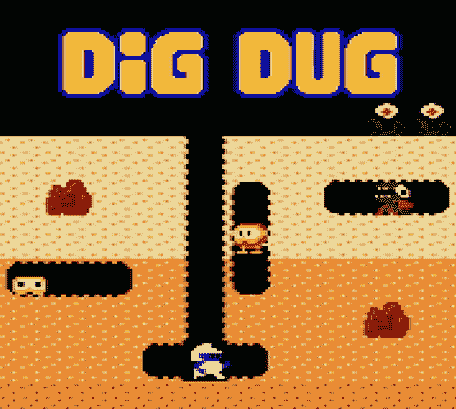
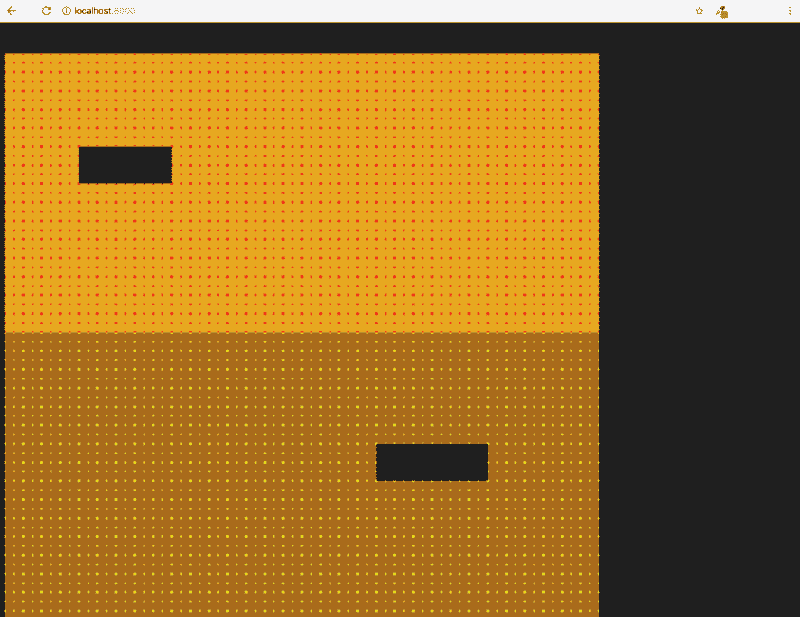
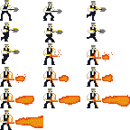
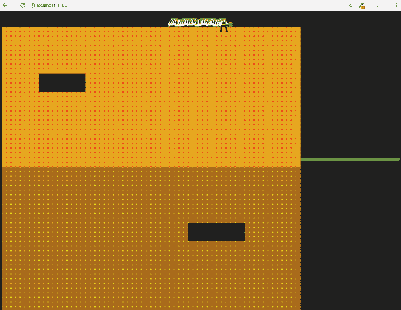
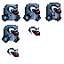
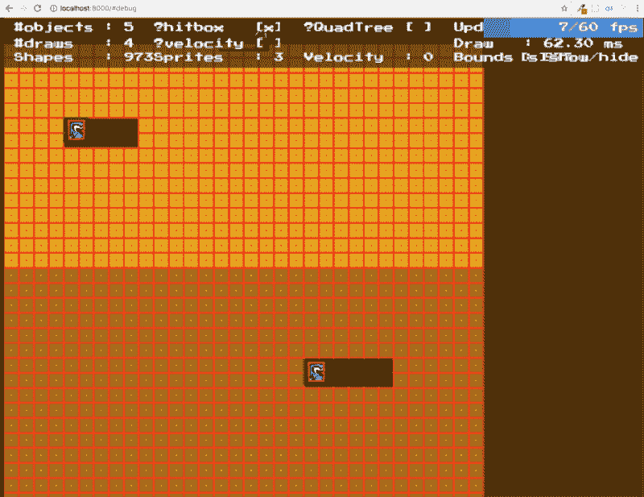
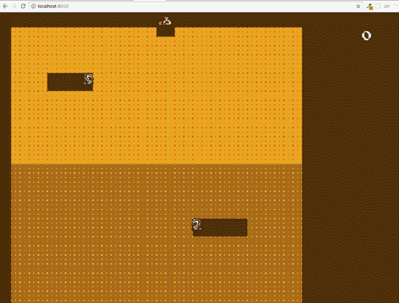

# 让我们使用 MelonJS 构建挖挖游戏

> 原文：<https://www.freecodecamp.org/news/lets-build-the-dig-dug-game-using-melonjs-5fc0c9fd7132/>

作者:亚兹德·贾马尔

# 让我们使用 MelonJS 构建挖挖游戏



最近我有机会看了《奇异事物》第二季。看完之后，我非常兴奋地看到我童年时最喜欢的游戏之一，“挖挖”，出现在系列中。与此同时，我还在寻找一款可以用来练习游戏开发技能的游戏。所以今天我决定挖挖就是游戏。

这个挖挖版不是完整版。这只是游戏的基本机制，以后可以扩展为完整的工作挖挖版本。

MelonJS 是被选中的框架，并不是因为什么特别的原因。我只是从众多框架中随机挑选了一个。

以下是我在这个游戏开发过程中要经历的步骤:

1.  建立框架
2.  创造基础
3.  创造挖掘机
4.  创造怪物
5.  创建冲突逻辑
6.  添加主机显示器
7.  添加声音效果和背景音乐
8.  添加介绍屏幕
9.  最终调整
10.  下一步是什么

#### **第一步——建立框架**

MelonJS 推荐使用他们提供的样板文件来开始游戏开发。首先，我需要从 [GitHub](https://github.com/melonjs/boilerplate) 下载样板文件。

我将把样板文件复制到我选择的本地目录中:

```
#terminalgit clone https://github.com/melonjs/boilerplate.git mylocalfolder
```

然后我需要使用这个[指南](https://help.github.com/articles/duplicating-a-repository/)为游戏设置我自己的远程存储库。浏览他们的教程来熟悉框架的用法也是明智的。

接下来，我需要在 MelonJS 的教程页面上下载他们提供的游戏资源。如果您需要一些图像或图块，但没有时间设计和创建它们，这可能会很有用。这些资源可以在 MelonJS 教程页面[这里](http://melonjs.github.io/tutorial-space-invaders/)和[这里](http://melonjs.github.io/tutorial-platformer/)下载。

现在我想讨论一下样板文件中提供的一些重要的框架文件。MelonJS 正在使用 [Jay Extend](https://github.com/parasyte/jay-extend) 继承库。所以我也需要熟悉这些文件。

`**js/game.js**:`

这里是我的游戏的全局名称空间，它恰好被定义为`game`(可以是我喜欢的任何东西)。

从第 1 行到第 8 行，我可以将我需要的任何信息定义为一个对象。

然后从第 12 行到第 25 行，我可以设置游戏的分辨率，屏幕的行为方式，并加载所有的游戏资源，如图像和声音。

我需要改变一些细节，比如 14 行游戏性能的屏幕分辨率和缩放方法。

最后，第 28 到 37 行是游戏运行所有内容的时候。

`**js/screen/play.js**:`

该文件将由处理播放屏幕的`**game.js**`加载。

从第 5 行到第 13 行，所有的执行都发生在游戏开始的时候。这是我稍后将指定渲染所有游戏实体的地方。

但是，第 18 到 21 行是所有实体将被删除的地方。我将会在这个过程中编辑这两个文件。

因此，在创建任何其他对象之前，我需要安装运行以下命令所需的所有 npm 库:

```
#terminalnpm install
```

我需要安装所需的`**grunt-cli**`:

```
npm install -g grunt-cli
```

最后，为了运行游戏，我可以执行下面的命令，并访问本地服务器来查看游戏的运行情况:

```
grunt serve
```

现在，当游戏运行时，我只能看到一个黑色的空白屏幕。

#### **步骤 2——创建地面**

在了解了一些提供的样板文件后，现在是时候创建我的第一个实体了，地面。我可以从这个框架中构建几种类型的对象。

所以因为这个地面会和游戏中的挖掘者和怪物发生碰撞，所以我需要为地面创建一个`Entity`对象。地面是游戏发生的对象，也是挖掘者需要挖掘出来供挖掘者通过的对象。

最初，地面是一个 15 x 15 像素的小正方形，然后可以在屏幕上重复渲染以形成更大的区域。为此，我可以使用一个名为[磁贴地图编辑器](http://www.mapeditor.org/)的软件，但是对于这个游戏，我将手动操作。

所以我是这样做的。首先在`**js**`文件夹中创建一个名为`**ground.js**`的文件。然后我将创建一个新的对象实体，如下所示:

在第 2 行，我将创建一个名为`game.Ground`的新对象，它从 MelonJS 提供的实体对象扩展而来。

在下一行，我将使用所有必需的参数通过父对象初始化对象。该对象将需要`x`和`y`值作为对象的位置。

宽度和高度在第 37 行和第 38 行定义。

为了渲染一些东西，我可以使用一个图像精灵。但是在这种情况下，我将利用 HTML5 画布中的`draw`函数。这是在第 9 到 28 行完成的。这里我将编程绘制一个带有圆点的矩形。正方形和圆点的颜色将分别由第 5 行和第 6 行声明的变量定义。

第 30 到 35 行是对象的`update`函数所在的地方。这里我需要在第 32 行设置实体在每次调用`update`函数时更新自身。最后返回一个真值以确保每次游戏更新时实体都被重画。

在下一步中，我需要在第 40 行的`**index.html**`文件中引用这个文件:

在第 33 行的`**game.js**`中将实体注册到池中。我将不需要先前在`**game.js**`中注册`game.PlayerEntity`的代码，因为我将在以后手动创建玩家实体。

因为地面需要被绘制很多次，所以为所有的地面创建一个容器来处理所有的工作对我来说是很好的。要创建一个容器，我需要创建一个新对象并扩展 MelonJS 提供的容器对象。

我将这个容器命名为`game.LevelManager`。

和以前一样，我需要初始化参数。定义该对象的名称，并定义将用于在屏幕上第 2 行到第 21 行放置所有方块的数据。

然后，我将创建一个自定义函数，根据第 24 到 37 行的数据执行渲染工作。第 30 行是我如何将正方形添加到这个容器中，在所有的正方形被渲染后，我需要更新第 36 行的容器边界区域。

最后，我将需要在播放屏幕上呈现容器，因此该容器下的所有内容也将被呈现。

在此之前，我需要在下面的第 9 到 11 行创建一个`levelManager`对象的实例:

我还需要记住总是引用在`**index.html**`文件中创建的新对象。

现在，如果我运行服务器，我应该会看到这样的视图:



#### **步骤 3——创建挖掘机**

首先，我需要为我的挖掘机图像精灵。起初，我打算使用 MelonJS 提供的游戏资源，但幸运的是，我的儿子为我创建了一个像素图像，用于挖掘机:



然后，我需要将这个图像放在样板文件目录的`**data/img**`文件夹中。当我现在运行服务器时，Grunt 会用上面的图像数据自动构建并附加资源文件到`build/js`文件夹中。

为了创建`Digger`对象，我将再次需要扩展`Entity`对象。

我将在`**js**` 文件夹中创建一个名为`**digger.js**` 的新文件，并在`**index.html.**`中进行引用

在第 3 行中，我从前面创建的资源文件中加载图像，并将其赋给一个变量。在第 5 行，我用所需的参数和设置初始化了对象。对于挖掘者，我将使用前面定义的图像分配图像。

接下来，在第 12 行，我在第一次渲染时翻转了精灵。

我还需要在第 13 行制作`gravity` 到`0`,因为这不是一个需要重力来让角色正常行动的平台游戏。在这种情况下，挖掘机将是浮动的。

在第 14 行中，挖掘机的速度被初始化，以便以后可以移动。我为这个实体定义了冲突类型，以便稍后使用冲突逻辑。

从第 17 行到第 22 行，我定义并管理精灵动画。`addAnimation`函数数组中的数字决定了图像中的哪一帧将用于动画。旁边的数字是定义速度的。最后，我设置了播放屏幕开始时使用的初始动画。

现在我需要定义挖掘机运动。我注意到在最初的挖挖游戏中，每次挖掘者向上或向下转动时，它总是在地面上适当地旋转它的角色。我需要注意这一点，以便在我的挖掘机中正确地实现它。这将是相当长的一段代码。

我发现为了让挖掘者在每次旋转精灵时都能正常工作，我需要调整实体的边界和碰撞盒的形状。

最初，挖掘者精灵的大小是 48 x 24。这是因为挖掘机开火的照片。然而，在正常运动中，我只需要挖掘机的尺寸为 24 x 24。

这是通过将碰撞形状最初更改为 24 x 24 并在挖掘者开火时将其转换为 48 x 24 来处理的，如下面的第 17 行到第 19 行所示:

从第 28 行到第 33 行，我定义了几个将在 movement 函数中使用的布尔标志。

从第 36 行开始是挖掘器`update`功能，它也包含基于从第 40 行到第 134 行的键盘输入的挖掘器移动逻辑。

在这个逻辑中，我需要考虑很多事情，比如当移动键被按下或释放时会发生什么，在一个方向或射击按钮被按下和释放之前挖掘机的最后位置，以及所需的动画的不同状态。它不是一个复杂的函数，但是逻辑有点冗长(虽然基本上很简单)。

从第 143 行到第 283 行是用于上下左右的`movement`函数。

为了将挖掘者渲染到屏幕上并使移动成为可能，我需要在第 12 行将挖掘者对象添加到`game.world`容器中，并在下面的`**play.js**`中注册第 19 行到第 23 行的键盘按键。如果在第 30 到 34 行需要的话，我还需要在游戏离开游戏屏幕用于其他用途时解除绑定。

如果我现在运行服务器，我可以看到挖掘机在行动，并移动他上下左右。

然而，我可以看到挖掘机移动时的拖尾图像，以及 MelonJS 启动图像的线条。



拖尾图像是因为每次游戏循环更新时执行的绘制。这可以通过在每次挖掘机重绘之前添加一层绘图来解决，如下图第 12 行所示:

#### **第四步——创造怪物**

现在完成了挖掘机，我将创建下一个怪物。对于怪物来说，这将是基本相同的过程。我需要为怪物创建一个对象`Entity`，将怪物添加到`levelManager`容器中，最后将其渲染到屏幕上。

下面是怪物的对象`Entity`:

我将首先初始化第 5 到 9 行的对象。这一次，我将只使用 MelonJS 提供的精灵，来自它的平台游戏教程，我修改了它，在下面添加了更多的帧。

这个精灵需要和挖掘精灵在同一个文件夹中:



然后我在第 11 行命名物体，在第 12 行定义碰撞类型，在第 14 到 15 行重置碰撞方块并使其变小，在第 17 到 18 行设置怪物的速度和重力。在设置第 20 到 22 行使用的初始动画之前，我还定义了要使用的动画组。

接下来，我为怪物的运动定义一个函数。这是一个非常基本的移动算法，在第 26 到 43 行上操纵对象的速度值 `X` 进行水平移动，操纵对象的速度值`Y`进行垂直移动。最后，我创建了对象的`update`函数，现在在第 45 到 52 行只包含主体更新。

在继续之前，我需要再次提醒自己在`**index.html**` 中引用并在`**game.js**`中注册任何新创建的实体对象。

创建对象后，我需要更新`LevelManager`容器来包含怪物的数据和`creation`函数。

以下是更新后的代码:

从第 21 行到第 28 行是怪物的位置数据。在第 48 到 56 行添加了创建怪物或添加到这个容器的函数。最后，为了让它出现在屏幕上，需要在`**play.js**`中添加一些行。

下面是第 11 行添加的代码，它调用函数来创建所有的怪物:

现在如果我运行服务器，我可以看到两个可爱的小怪物出现在屏幕上的特定位置。目前他们不会移动。



#### **第 5 部分—创建冲突逻辑**

我先说挖掘机与地面和怪物的碰撞逻辑。为了让框架检查实体对象上的任何碰撞，我需要在`update`函数中包含**碰撞检查**方法。在那之后，现在我可以包含`onCollision`函数，它提供关于碰撞在一起的特定物体的信息。

以下是更新后的挖掘机目标代码:

在第 138 行，对这个对象进行任何冲突的代码检查。

在第 144 到 166 行，一个函数在对象碰撞时提供响应。当挖掘机在第 147 到 150 行与地面发生碰撞时，特定的地面实体将从`levelManager`容器中移除。

然而，我不希望在挖掘机开火时地面消失，所以我在第 148 行放了一个异常。

接下来是与怪物碰撞的逻辑。如果挖掘者在发射武器时与怪物相撞，怪物会闪烁并被移除。除此之外，挖掘者将闪烁，被移走，游戏将从 151 行到 163 行重置。在`collision`函数中返回 true，会让其他与挖掘机碰撞的物体变固体。换句话说，挖掘机在碰撞过程中不会穿过另一个物体。对于这种情况，我希望它返回 false。

最后，我将创建边界的逻辑。目前，挖掘者被允许离开屏幕。为此，我将在下面第 16 到 17 行的对象初始化函数中定义挖掘机在`x`和`y`轴上允许移动的最大距离。

然后在`update`函数中，我将在第 105–106 行使用内置的`clamp`方法设置边界。

现在轮到怪物了。在对怪物进行碰撞检查后，我需要定义与地面的碰撞逻辑以及边界。这种逻辑还必须包括某种人工智能(AI)，以便怪物追逐挖掘者。

怪物将不能挖掘地面，所以当它碰到地面或边界时，它会反弹到挖掘者所在的方向。为了让边界碰撞生效，我需要定义怪物的最大移动距离并设置它。我不必定义与挖掘者的冲突逻辑，因为它已经被`Digger`对象处理了。我还让怪物在游戏开始时向右移动。

下面是最新的`Monster`对象:

从第 138 行到第 159 行是我定义的一个函数，当怪物在`onCollision`函数中与地面碰撞时将执行这个函数。逻辑是让怪物落地时向挖掘机移动。

从第 76 行到第 136 行，我定义了一个表示怪物与边界冲突逻辑的函数，这个函数在第 57 行的`update`函数中被调用。

每当怪物没有撞到边界时，它总是会检查挖掘者的位置并向它移动。然后如果怪物撞到了边界，它会转向挖掘者，继续追逐它。我没有自己想出人工智能算法——它是我在互联网上找到的脚本与我自己的脚本的结合。同样在这个函数中，我需要访问挖掘机的对象属性，如`X`和`Y`位置。为了获得这个访问权限，我需要对挖掘者在游戏屏幕上的呈现方式进行一些修改。

在第 13 行，我声明了一个`game`属性，它表示在将池中注册的挖掘者添加到播放屏幕之前。该属性将用于访问 monster 对象内部的 digger 属性。

最后，我将包括代码，将重置游戏，如果所有的怪物在射击模式下与挖掘机相撞。换句话说，如果挖掘者设法杀死了所有的怪物。该检查将在`levelManager`容器中完成。

我会检查包含 60 到 62 行所有怪物的数组。如果数组是空的，我会重置游戏。

但在此之前，我还必须在第 56 行创建一个布尔标志，它将确认当我开始游戏时怪物已经被创建了。如果没有，游戏会在怪物被创造出来之前不断重置。

#### **步骤 6 —添加主机显示器**

首先，我需要在数据目录中创建一个字体文件夹:

```
data/fnt
```

然后使用之前下载的游戏资产中 MelonJS 提供的字体:

```
PressStart2P.pngPressStart2P.fnt
```

并将它们放入新文件夹。

然后，我需要在`**gruntfile**`中添加一些脚本，以便为下面第 22 到 28 行的字体生成资源数据:

当我运行服务器时，字体将出现在资源数据中:

默认情况下，Head Unit Display (HUD)对象已经在样板文件中创建。我可以访问`**js/entities/HUD.js**`中的文件。我只需要定义前面添加的字体，并为它创建一个`draw`函数。

以下是更新后的代码:

我在第 42 行到第 48 行定义并初始化了字体，然后我创建了`draw`函数，它将在第 71 行定义的特定位置显示游戏分数。



最后，我将添加一个高分显示及其逻辑。每次游戏重置时，逻辑只是保存当前分数并将其添加到`highScore`属性中。要么挖掘者杀死所有的怪物，要么挖掘者被杀死。

首先，我在第 9 行创建了`highScore`属性:

然后，在`**digger**`的`onCollision`函数中，我会在第 14 行每杀死一个怪物增加一个点数，如果第 26 行的挖掘者被杀死，则将当前点数加到高分中。

我还会对怪物击中火焰时会发生什么做一点调整。我会让怪物停止移动，就在它碰到火之后，以避免在第 11 行发生任何不必要的碰撞。

#### **步骤 7——添加音效和背景音乐**

设置这是轻而易举的。所有需要的代码都已经在样板文件中了。我需要做的是将所需的音乐或声音文件放到相关的文件夹中，并对音乐做一些处理。

基于挖掘者移动时的原始游戏，将播放背景音乐。需要实现一个简单的逻辑，这样当方向键被按下时，背景音乐就不会试图重复开始。

下面是 digger 更新的对象:

在第 37 行，我创建了一个布尔标志用于运动和背景音乐逻辑。

第 45 到 47 行的逻辑是，如果连续按下方向键，背景音乐不会重复播放。

分别在线 114、200、224、249 和 288 上，设置标志以便逻辑正常工作。

当挖掘机停在第 115 行时，背景音乐停止。

至于其他的声音，我也是在射击模式下给挖掘者加了一个声音，在怪物死亡的时候加了一个 pop 的声音。在第 69 行中，我在按下 fire 键时激活声音，在第 140 行中，当 fire 键被释放时停止声音。在射击模式下，当怪物在第 174 行从屏幕上被移除后与挖掘者发生碰撞时，会发出爆裂声。

#### **步骤 8 —添加介绍屏幕**

首先我会打开`**game.js**`，修改一段代码。我将在第 40 行把游戏状态改为 MENU，而不是把游戏状态改为 PLAY。

这将在游戏加载时加载`**title.js**`文件:

接下来，我将编辑`**js/screens**`文件夹中的文件`**title.js**`:

这里，在`onResetEvent`中，当屏幕出现在第 8 行时，我播放背景音乐。

接下来，我在第 10 行用棕色图层覆盖视口。

然后，我创建了一个`Renderable`对象，它包含了标题和一些从第 13 行到第 43 行的文字。

在第 22 到 23 行使用`Tween`将这个`Renderable` 对象从屏幕外部向上滚动到中间。

最后，我需要绑定回车键来触发一个事件，该事件将在第 47 到 57 行开始游戏。

#### **步骤 9 —最终调整**

我不会为最后的调整做太多。我会给怪物添加另一个背景声音，我会把挖掘机放在和原游戏相似的位置。首先我会添加另一个`Tween`让挖掘者在游戏开始时移动到屏幕中央。

我会将新的声音文件放在右边的文件夹中，然后更新`**digger**`文件。

我将在第 38 到 40 行声明几个布尔标志，在第 30 行播放游戏开始时的背景音乐，并通过调用第 29 行定义的函数执行最初的挖掘者运动。

下面是新功能:

从第 4 行开始，我将使用回调函数定义`Tween`动画，该函数停止背景音乐，为逻辑设置一些标志，并将绑定键注册从`**play.js**`移动到这里，以避免补间期间任何按键的任何额外移动。

最后，下面是每 5 秒创造怪物声音的功能。这个函数将在`**digger**`对象的`update`函数中被调用。

#### **第 10 步——下一步是什么**

以下是我可以继续为这个游戏开发的项目:

1.  创建穿过地面的怪物的幽灵版本。
2.  为游戏创建第二个和下一个关卡。
3.  创建额外的项目，挖掘者可以获得更多的点。
4.  用 cookies 创建一个本地数据库，游戏会记住玩家的高分。
5.  重构，重构，再重构。
6.  提高游戏性能。

感谢您阅读到此结束。如果你对上面的列表有任何更多的建议，欢迎在下面评论这篇文章。

完整的代码可以从 [GitHub](https://github.com/muyaszed/dig-dug-clone) 中获取。

可以随意尝试游戏的[试玩](http://yazedjamal.com/myDigDug/)。

**注释**:可能有很多方法来实现这个功能，但这对我来说是最简单的。任何人都可以自由评论我可以应用的任何错误或改进。这个指南最初是为了让我学习和记住我所做的事情。尽管如此，如果你觉得有帮助的话，任何人都欢迎遵循这个指南。