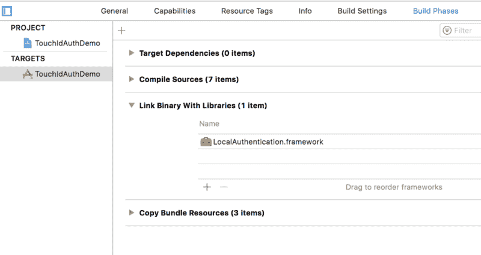
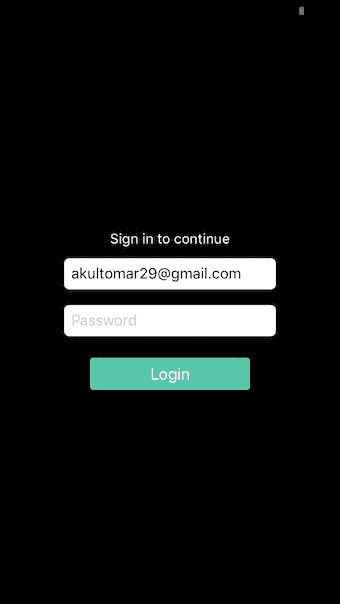
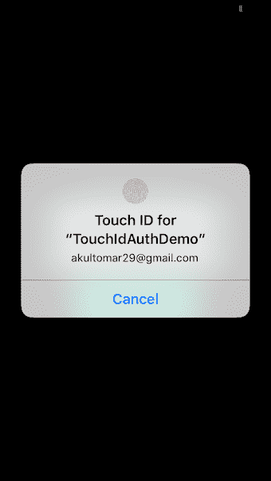

# 如何使用触控 ID 更快速、更轻松地登录您的应用

> 原文：<https://www.freecodecamp.org/news/how-to-use-touch-id-for-a-quicker-easier-login-to-your-app-e22356c9ef9/>

作者阿库尔·托马尔


# 如何使用**触控 ID** 更快、更方便地登录你的应用

这是一个常见的观察，用户在你的登录屏幕上下降了一点。这就是我如何解决我的 facebook 瘾？。本教程教你如何利用 T **ouch ID** 更快更容易地登录。我将很快带您完成这些步骤，让我简单介绍一下。

大多数应用程序使用触控 ID 作为二级认证。本教程不是关于提供第二级认证(尽管如果您阅读本文，您也可以这样做)。这是关于使用触控 ID 进行服务器调用登录用户。

现在，如何从用户的指纹中获取用户的凭证来进行服务器调用呢？？这就是供应链服务的切入点。当用户注册或首次登录您的应用程序时，将凭据存储到您的应用程序的钥匙串中。下一次，当用户注销，然后再次访问登录屏幕，闪烁一个弹出窗口，要求他们使用触控 ID 登录。当用户提供一个有效的触控 id 时，获取您之前保存到钥匙串中的那些用户凭证，进行 API 调用，然后嘣！？。

所以这里涉及到两个步骤:

*   首先，您需要将用户的凭证存储到钥匙串中。您可以在用户注册或首次登录您的应用程序时执行此操作。
*   其次，使用触控 ID 来验证用户，然后从钥匙串服务取回他们的凭证。

我使用的是 **KeychainPasswordItem** ，这是 developer.apple.com[网站](https://developer.apple.com/library/content/samplecode/GenericKeychain/Listings/GenericKeychain_KeychainPasswordItem_swift.html#//apple_ref/doc/uid/DTS40007797-GenericKeychain_KeychainPasswordItem_swift-DontLinkElementID_7)上提供的一个不错的钥匙链包装。他们有一个很好的、详细的例子来说明如何使用这个普通的钥匙链。去看看。

作为第一步的一部分，当用户注册并登录时，使用下面的调用方法，将用户的电子邮件作为帐户和密码。

我们正在将用户的电子邮件存储到 **UserDefaults** 以备后用。如果你闪现一个弹出窗口来询问用户是否允许使用这个特性，那就更好了。在本教程中，我将跳过这一部分。。

#### 使用“触控 ID”来访问钥匙串

要使用触控 ID，首先需要将 LocalAuthentication 框架添加到项目二进制文件中。您可以通过进入项目>构建阶段>链接二进制文件和库:



接下来，在您的登录视图控制器中导入 LocalAuthentication 框架。

```
import LocalAuthentication
```



我们已经用之前保存到 **UserDefaults 的用户帐户电子邮件填充了用户名文本字段。**

接下来，我们需要检查在当前设备上是否可以进行身份验证。查看以下代码:

我们调用**视图中的**authenticateUserUsingTouchId**()**()。LAContext 是 NSObject 的子类，代表我们当前的身份验证上下文。现在，如果身份验证是可能的，通过调用 evaluatePolicy()来验证触控 ID 的真实性



**context.evaluatePolicy()** 给出了一个触控 ID 弹出窗口，其中显示了我们最后访问的用户名，这是我们在 **evaluatePolicy()方法**中给出的本地化原因。

这就完成了第 2 步的第 1 部分:让用户使用触控 ID 进行身份验证。下一步是使用触控 ID 访问 Keychain，在这里我们保存或检索用户登录凭证。

当用户提供一个有效的触控 id 时，我们需要从 Keychain 加载密码，并进行 POST 调用来登录用户。

```
if authSuccessful {             self.loadPasswordFromKeychainAndAuthenticateUser(lastAccessedUserName)}
```

就是这样！您可以升级您的身份验证框架以支持多个帐户。在验证了触控 ID 的真实性后，弹出一个窗口，让用户选择他们想要登录的账户。然后从钥匙串中取回与该帐户对应的用户凭证。感谢阅读！