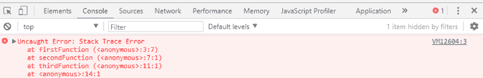
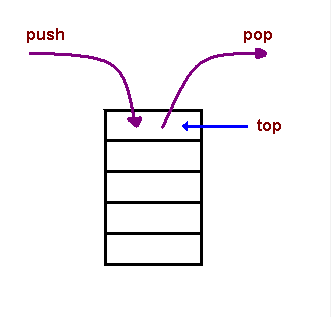
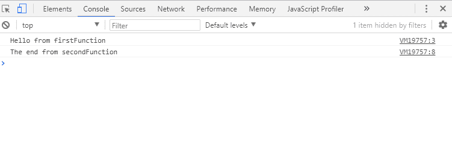
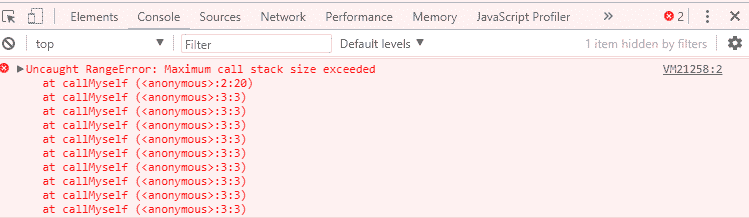

# JavaScript 调用栈——它是什么以及为什么它是必要的

> 原文：<https://www.freecodecamp.org/news/understanding-the-javascript-call-stack-861e41ae61d4/>

JavaScript 引擎(可以在类似浏览器的托管环境中找到)是一个单线程解释器，由一个堆和一个调用栈组成。浏览器提供了 web APIs，如 DOM、AJAX 和定时器。

本文旨在解释什么是调用栈以及为什么需要调用栈。对调用栈的理解将使“函数层次和执行顺序”在 JavaScript 引擎中如何工作变得清晰。

调用堆栈主要用于函数调用(call)。由于调用堆栈是单一的，所以从上到下一次执行一个函数。这意味着调用堆栈是同步的。

理解调用栈对异步编程至关重要(我们将在后面的文章中讨论)。

在异步 JavaScript 中，我们有一个回调函数、一个事件循环和一个任务队列。在回调函数被事件循环压入堆栈后，回调函数在执行期间由调用堆栈执行。

但是在我们草率行事之前，让我们首先尝试回答这个问题——什么是调用堆栈？

在最基本的层面上，调用堆栈是一种数据结构，它使用后进先出(LIFO)原则来临时存储和管理函数调用(call)。

让我们来分解一下我们的定义:

**LIFO:** 当我们说调用堆栈按照后进先出的数据结构原则运行时，这意味着当函数返回时，最后被推入堆栈的函数是第一个被弹出的。

让我们来看一个代码示例，通过将堆栈跟踪错误打印到控制台来演示 LIFO。

```
function firstFunction(){
  throw new Error('Stack Trace Error');
}

function secondFunction(){
  firstFunction();
}

function thirdFunction(){
  secondFunction();
}

thirdFunction();
```

当代码运行时，我们得到一个错误。打印出一个堆栈，显示这些函数是如何相互堆叠的。看一下图表。



Stack trace error

您会注意到，函数作为堆栈的排列以`firstFunction()`(最后一个进入堆栈的函数，弹出以抛出错误)开始，接着是`secondFunction()`，然后是`thirdFunction()`(代码执行时第一个推入堆栈的函数)。

**暂存**:调用(call)一个函数时，将该函数及其参数、变量推入调用堆栈，形成堆栈框架。这个堆栈帧是堆栈中的一个内存位置。当函数从堆栈中弹出并返回时，内存被清空。



Image Credit: [CMU](https://www.cs.cmu.edu/~adamchik/15-121/lectures/Stacks%20and%20Queues/Stacks%20and%20Queues.html)

**管理函数调用(call)** :调用栈维护每个栈帧位置的记录。它知道下一个要执行的函数(并在执行后删除它)。这就是 JavaScript 中代码执行同步的原因。

想象你站在一个杂货店的收银台前排队。只有在你前面的人被照顾之后，你才能被照顾。那是同步的。

这就是我们所说的“管理函数调用”。

### **调用栈如何处理函数调用？**

我们将通过查看一个调用另一个函数的函数示例代码来回答这个问题。以下是示例代码:

```
function firstFunction(){
  console.log("Hello from firstFunction");
}

function secondFunction(){
  firstFunction();
  console.log("The end from secondFunction");
}

secondFunction();
```



Here is the output

代码运行时会发生以下情况:

1.当`secondFunction()`被执行时，一个空的堆栈帧被创建。它是程序的主要(匿名)入口点。
2。`secondFunction()`然后调用被推入堆栈的`firstFunction()`。
3。`firstFunction()`返回并打印“Hello from firstFunction”到控制台。
4。`firstFunction()`被弹出堆栈。
5。执行命令然后移动到`secondFunction()`。
6。`secondFunction()`返回并打印“secondFunction 结束”到控制台。
7。`secondFunction()`弹出堆栈，清空内存。

### 什么导致堆栈溢出？

当存在没有出口点的递归函数(调用自身的函数)时，就会发生堆栈溢出。浏览器(宿主环境)有一个在抛出堆栈错误之前可以容纳的最大堆栈调用。

这里有一个例子:

```
function callMyself(){
  callMyself();
}

callMyself();
```

`callMyself()`将一直运行，直到浏览器抛出“超过最大调用大小”为止。这就是堆栈溢出。



Maximum call stack error

### 概括起来

从调用堆栈中得到的关键信息是:
1。它是单线程的。这意味着它一次只能做一件事。
2。代码执行是同步的。
3。函数调用会创建一个占用临时内存的堆栈帧。
4。它作为后进先出的数据结构工作。

我们已经使用调用堆栈文章为我们将要看到的关于异步 JavaScript 的系列文章奠定了基础(我们将在另一篇文章中看到)。

所有代码示例都可以在这个 GitHub [repo](https://github.com/charlesfreeborn/JS-CallStack-CodeSamples/blob/master/codesamples.md) 中找到。

*感谢您的阅读。如果这篇文章有帮助，请给它一些掌声？这样别人就能找到了。我也想看看你的评论。*