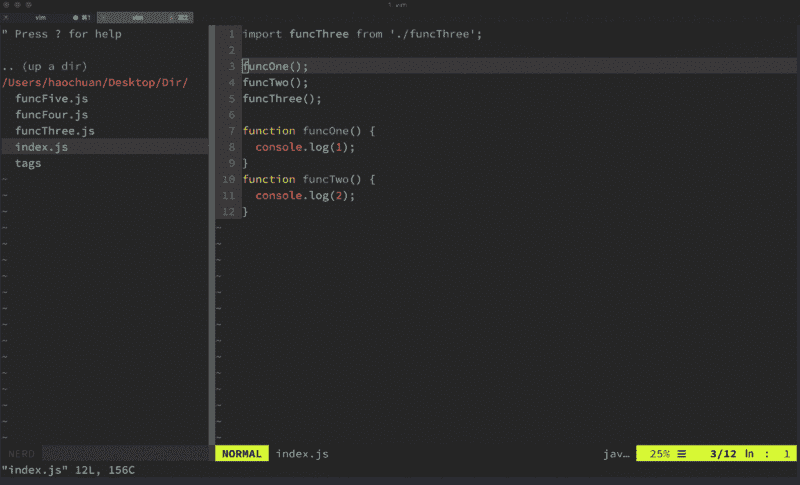
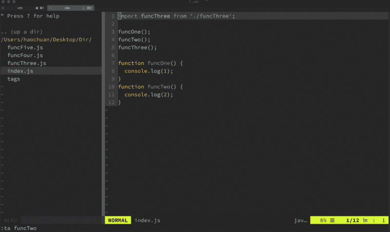

# 使用 Ctrlp 和 Ctags 让您的 Vim 更加智能

> 原文：<https://www.freecodecamp.org/news/make-your-vim-smarter-using-ctrlp-and-ctags-846fc12178a4/>

by _ 浩川

# 使用 Ctrlp 和 Ctags 让您的 Vim 更加智能

我非常喜欢 Vim，年复一年，我在所有的编码和写作中都使用 Vim。尽管越来越多的人，尤其是那些使用 JavaScript 的人，更喜欢现代的代码编辑器，如 Sublime Text 或 VSCode，但我宁愿花一点时间让我的玩具更智能。

### [CtrlP](https://github.com/ctrlpvim/ctrlp.vim)

如果你是一个精通文本、Atom 或 VSCode 的家伙，你必须使用`ctrl + p`成千上万次来提高生产率。好吧，如果你是一个 Vim 的家伙，不要嫉妒，因为这个花哨的 Vim 插件 CtrlP 会给你所有你需要的。
查看此[官方文件](http://ctrlpvim.github.io/ctrlp.vim/)进行安装和设置。



### [Ctags](http://ctags.sourceforge.net/)

Ctags 是一个工具，它可以筛选您的代码、索引方法、类、变量和其他标识符，并将索引存储在标签文件中。标记文件每行包含一个标记。根据命令行参数和运行 ctags 的语言，可以从这个索引中获得很多信息。

Ctags 目前支持 [41 种编程语言](http://ctags.sourceforge.net/languages.html)，添加更多的定义相对容易。

Ctags 使导航一个更大的项目变得更加容易，特别是当您正在使用的代码不熟悉的时候。如果你不确定一个方法是做什么的，或者应该如何调用它，你可以直接跳到它的定义。如果您正处在一个 500 多行 Perl 脚本的下行螺旋中，并且想知道一个变量在三个小时前是在哪里定义的，那么您可以直接跳回它。然后，你可以直接跳到你工作的地方。

您可以在 OSX 使用自制软件安装 Ctags:

```
brew install ctags
```

请注意，OS X 附带了一个 Ctags 可执行文件，但它并不丰富，并且缺少大多数有用的功能。如果你在运行`ctags`时看到类似`Invalid Parameter`的错误，说明系统没有使用你用家酿安装的那个。要解决这个问题:

```
$ alias ctags="`brew --prefix`/bin/ctags"
```

当您位于想要索引的目录中时，只需运行:

```
ctags -R.
```

Ctags 将递归地遍历目录，标记它遇到的所有源文件。对于非常大的项目，这可能需要一段时间，但通常是非常快的。

你可能还需要一些额外的 Ctags 配置，下面是我正在使用的`~/.ctags`:

```
--langmap=javascript:.js.es6.es.jsx--javascript-kinds=-c-f-m-p-v
```

```
--regex-javascript=/^[ \t]*(var|let|const)[ \t]+([A-Za-z0-9_$]+)[ \t]*=[ \t]*\[/\2/A,Array,Arrays/
```

```
--regex-javascript=/^[ \t]*(var|let|const)[ \t]+([A-Z][A-Za-z0-9_$]+)[ \t]*=[ \t]*function/\2/C,Class,Classes/--regex-javascript=/^[ \t]*class[ \t]+([A-Za-z0-9_$]+)/\1/C,Class,Classes/
```

```
--regex-javascript=/^[ \t]*export[ \t]?({[ \t]*)*([A-Za-z0-9_\*]*[ \t]as[ \t])([A-Za-z0-9_]+)/\3/E,Export,Exports/--regex-javascript=/^[ \t]*export[ \t]?({[ \t]*)*([A-Za-z0-9_\*]*[ \t]as[ \t])*([A-Za-z0-9_]+),[ \t]*([A-Za-z0-9_\*]*[ \t]as[ \t])([A-Za-z0-9_]+)/\5/E,export,Exports/--regex-javascript=/^[ \t]*export[ \t]?({[ \t]*)*([A-Za-z0-9_\*]*[ \t]as[ \t])*([A-Za-z0-9_]+),[ \t]*([A-Za-z0-9_\*]*[ \t]as[ \t])*([A-Za-z0-9_]+),[ \t]*([A-Za-z0-9_\*]*[ \t]as[ \t])([A-Za-z0-9_]+)/\7/E,Export,Exports/--regex-javascript=/^[ \t]*export[ \t]?(var|let|const)[ \t]+([A_Za-z0-9_$]+)/\2/E,Export,Exports/--regex-javascript=/^[ \t]*export[ \t]?(var|let|const)[ \t]+([A_Za-z0-9_$]+)[ \t]*[^,]+,[ \t]*([A_Za-z0-9_$]+)/\3/E,Export,Exports/--regex-javascript=/^[ \t]*export[ \t]?(var|let|const)[ \t]+([A_Za-z0-9_$]+)[ \t]*[^,]+,[ \t]*([A_Za-z0-9_$]+)[ \t]*[^,]+,[ \t]*([A_Za-z0-9_$]+)/\4/E,Export,Exports/
```

```
--regex-javascript=/^[ \t]*function[ \t]*([A-Za-z0-9_$]+)[ \t\(]/\1/F,Function,Functions/--regex-javascript=/^[ \t]*[\(]function[ \t]*([A-Za-z0-9_$]+)[ \t\(]/\1/F,Function,Functions/--regex-javascript=/^[ \t]*(var|let|const)[ \t]+([a-z][A-Za-z0-9_$]+)[ \t]*=[ \t]*function[^\*][^\*]/\2/F,Function,Functions/--regex-javascript=/^[ \t]*(var|let|const)[ \t]+([a-z][A-Za-z0-9_$]+)[ \t]*=[ \t]*\([^\*]/\2/F,Function,Functions/
```

```
--regex-javascript=/^[ \t]*function[ \t]*\*[ \t]*([A-Za-z0-9_$]+)/\1/G,Generator,Generators/--regex-javascript=/^[ \t]*(var|let|const)[ \t]+([a-z][A-Za-z0-9_$]+)[ \t]*=[ \t]*function([ \t]*\*)/\2/G,Generator,Genrators/--regex-javascript=/^[ \t]*(\*[ \t])([A-Za-z0-9_$]+)[ \t]*\(.*\)[ \t]*{/\2/G,Generator,Generators/
```

```
--regex-javascript=/^[ \t]*import[ \t]?({[ \t]*)*([A-Za-z0-9_\*]*[ \t]as[ \t])([A-Za-z0-9_]+)/\3/I,Import,Imports/--regex-javascript=/^[ \t]*import[ \t]?({[ \t]*)*([A-Za-z0-9_\*]*[ \t]as[ \t])*([A-Za-z0-9_]+),[ \t]*([A-Za-z0-9_\*]*[ \t]as[ \t])([A-Za-z0-9_]+)/\5/I,Import,Imports/--regex-javascript=/^[ \t]*import[ \t]?({[ \t]*)*([A-Za-z0-9_\*]*[ \t]as[ \t])*([A-Za-z0-9_]+),[ \t]*([A-Za-z0-9_\*]*[ \t]as[ \t])*([A-Za-z0-9_]+),[ \t]*([A-Za-z0-9_\*]*[ \t]as[ \t])([A-Za-z0-9_]+)/\7/I,Import,Imports/
```

```
--regex-javascript=/^[ \t]*this\.([A-Za-z0-9_$]+)[ \t]*=.*{$/\1/M,Method,Methods/--regex-javascript=/^[ \t]*([A-Za-z0-9_$]+)[ \t]*[:=][ \t]*[\(]*function[ \t]*\(/\1/M,Method,Methods/--regex-javascript=/^[ \t]*static[ \t]+([A-Za-z0-9_$]+)[ \t]*\(/\1/M,Method,Methods/--regex-javascript=/^[ \t]*([A-Za-z0-9_$]+)\(.*\)[ \t]*{/\1/M,Method,Methods/
```

```
--regex-javascript=/^[ \t]*(this\.)*([A-Za-z0-9_$]+)[ \t]*[:=].*[,;]*[^{]$/\2/P,Property,Properties/
```

```
--regex-javascript=/^[ \t]*(var|let|const)[ \t]+([A-Za-z0-9_$]+)[ \t]*=[ \t]*{/\2/O,Object,Objects/
```

```
--regex-javascript=/\/\/[ \t]*(FIXME|TODO|BUG|NOBUG|\?\?\?|\!\!\!|HACK|XXX)[ \t]*\:*(.*)/\1/T,Tag,Tags/
```

```
--regex-javascript=/^[ \t]*(var|let|const)[ \t]+([A-Za-z0-9_$]+)[ \t]*=[ \t]*[^\[{]*;$/\2/V,Variable,Variables/
```

```
--exclude=min--exclude=vendor--exclude=\*.min.\*--exclude=\*.map--exclude=\*.swp--exclude=\*.bak--exclude=tags--exclude=node_modules--exclude=bower_components--exclude=test--exclude=__test__--exclude=build--exclude=dist--exclude=*.bundle.*
```

下面是函数定义的样子:


你也可以使用 Ctrlp 来搜索标签而不是文件。为此，首先您需要在您的`.vimrc`中映射一个快捷方式:

```
nnoremap <leader>. :CtrlPTag<cr>
```

它是这样工作的:



希望有帮助:)

我写音频和网络代码，在 YouTube 上弹吉他。如果你想看更多我的东西或者了解我更多，你可以在以下网址找到我:

网址:
[https://haochuan.io/](https://haochuan.io/)

GitHub:
[https://github.com/haochuan](https://github.com/haochuan)

中:
[https://medium.com/@haochuan](https://medium.com/@haochuan)

YouTube:[https://www.youtube.com/channel/UCNESazgvF_NtDAOJrJMNw0g](https://www.youtube.com/channel/UCNESazgvF_NtDAOJrJMNw0g)