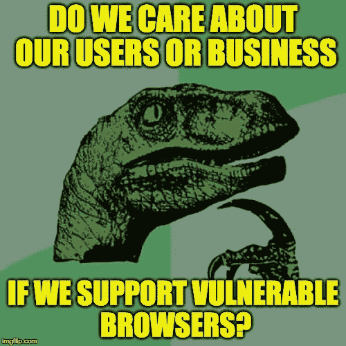
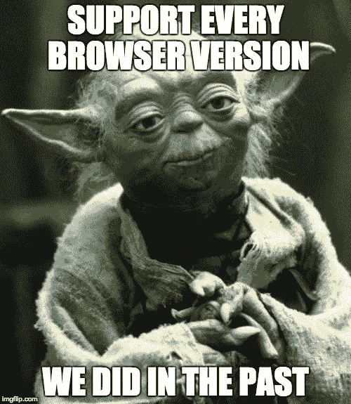

# 为什么我们应该说服用户更新他们的浏览器——这是一个双赢的局面。

> 原文：<https://www.freecodecamp.org/news/should-we-demand-the-latest-browser-version-d5c72f8c9ffb/>

除非你最近一直生活在岩石下，否则你会知道 [Meltdown](https://en.wikipedia.org/wiki/Meltdown_(security_vulnerability)) 和[Spectre](https://en.wikipedia.org/wiki/Spectre_(security_vulnerability))——这是计算机历史上部署最广泛的两个安全漏洞。您可能还知道，这不仅仅局限于操作系统级别的应用程序，在 web 上也是如此:

> 一个网站可以为另一个网站读取存储在浏览器中的数据，或者读取浏览器本身的内存。—微软漏洞研究

*   **Firefox 57 . 0 . 4**([1 月 4 日发布](https://www.mozilla.org/en-US/firefox/57.0.4/releasenotes/) ) [修复](https://www.mozilla.org/en-US/security/advisories/mfsa2018-01/)这个。
*   **微软**[1 月 5 日针对 IE 和 Edge 发布并更新](https://support.microsoft.com/en-us/help/4056890/windows-10-update-kb4056890)。
*   Safari [于 1 月 8 日发布了 11.0.2](https://support.apple.com/en-us/HT208403) ，据称这可以保护用户免受这些问题的影响。
*   Chrome 用户必须等到 v 64(1 月 23 日左右发布)；但是[这里](https://www.chromium.org/Home/chromium-security/ssca)列出了**你现在可以做的事情**来限制对你用户的损害程度。

更新:2018–01–31:到目前为止，安全研究人员根据这些问题确定了至少 130 个恶意软件:http://www . security week . com/malware-exploining-spectre-meltdown-flaws-emerges

#### *快速笔记*

1.  并非所有这些更新都修复了所有的安全漏洞，但它们是第一个行动点。
2.  更新浏览器只是第一步。你需要更新你的移动/桌面操作系统，以保护自己免受一种不同但更广泛的攻击:自动更新应用程序。请在此阅读更多[。](https://spectreattack.com/)
3.  随着我们对这些漏洞的了解越来越多，更多的补丁将会出现。这个故事远没有结束。

现在对我们网络开发者来说，最大的问题是:我们是继续支持用户使用易受攻击的旧浏览器，还是要求用户使用最新的浏览器？

我在一家拥有数百万用户的国际公司的身份团队工作。无论我为保护我们的服务做了多少工作，都无法阻止用户与另一个标签中打开的恶意或受感染的站点共享我们站点上的数据。

这可能是这些安全漏洞的一个最重要的副作用:我们实际上可能有一个完全正当的理由为使用旧浏览器的人断网。

前端开发的历史可能会记得这一点，当我们从“嬉皮士开发时代”(我支持所有浏览器版本)转向“潮人开发时代”(我只支持最新的浏览器版本)。？

这是思维上的一个巨大转变，特别是对我们这些 web 开发者来说，因为我们传统上尽最大努力让每个人都参与进来:响应式设计、渐进增强和优雅退化。

这次不一样了。在后斯诺登时代，我们需要认真对待安全问题。支持易受攻击的浏览器版本等于促进危险的网络生活。作为专家，我们的工作是教育用户，保护他们免受坏人的攻击。如果网站不支持旧浏览器，用户**必须**升级。

这是一个双赢的局面:

*   开发人员永远摆脱了传统浏览器的支持
*   用户被迫做出一个重要的安全决策(希望是好的)。

如果我们不迅速做出反应，这些问题的漏洞将被大量利用，其影响将超出我们的控制。妖怪从瓶子里出来了。

#### 这是处理器的大众丑闻

2015 年，[大众被发现在柴油发动机的排放上作弊](https://en.wikipedia.org/wiki/Volkswagen_emissions_scandal)。他们作弊以使他们的汽车对购买者更有吸引力。在这个案例中，处理器制造商“忽略”了他们处理器中的一些安全问题，这样他们就可以获得更高的性能指标。

我在一家国际公司工作，负责制作*登录页面*。数百万用户使用我们的登录来访问各种公司的服务。自然，我的团队非常关注安全性。我们尽最大努力保持系统尽可能的安全，但是再多的努力也无法缓解浏览器中的这种漏洞。例如:

*   JavaScript 不再无法访问`httpOnly`cookie。
*   会话 cookie 非常容易被其他站点窃取(会话欺骗)。
*   保存密码的 Chrome 扩展现在可能会泄露。
*   包含`<scri` pt >标签的 HTML 很容易受到攻击，所以 XSS 是轻而易举的事。

这里有一个练习:看看在任何主流浏览器 2018 年之前的版本中，OWASP 十大漏洞中有多少**无法修复**。

我们真的想冒着用户数据或我们业务受损的风险为没有最新浏览器的用户提供服务吗？或者，我们(作为专业人员和专家)应该表明立场，教育用户有关危险的知识，并指导他们降低风险？

我们需要放弃对易受攻击的浏览器的支持。在一个传统上对用户非常灵活和宽容的市场中，这可能会面临很多阻力(只要他们使用我们的服务，我们就很好)。但是必须有人开始改变。

### 一线希望

每一次危机中都有机会。我认为这是自 ES2015 年以来 web 开发社区发生的最酷的事情。我们都知道支持老浏览器的痛苦和代价(特别是那些不是[常青树](https://www.techopedia.com/definition/31094/evergreen-browser)的浏览器):

*   我们必须增加代码来填补现代浏览器已经具备的功能
*   使用老派的调试工具调试旧浏览器，就像开了一辆现代汽车后从废车场开车一样
*   我们不能依靠浏览器的完整性( [IE，我正看着你](https://www.microsoft.com/en-us/windowsforbusiness/end-of-ie-support))，所以我们根本不能向某些浏览器提供一些敏感信息。
*   我们必须处理各种 CSS/SVG 渲染问题
*   我们必须测试不同浏览器的边缘情况，因为我们支持它们！围绕着以各种不同的成功/努力比率自动化这一单调乏味的任务的想法，整个[企业](https://www.browserstack.com/) [发展起来了](https://saucelabs.com/)。
*   现在所有主流浏览器都支持该模块系统。放弃对易受攻击的浏览器的支持还有一个好处，那就是简化和现代化我们的部署渠道。你可能根本不需要传输你的代码！

### 这到底意味着什么？

这意味着你可以完全相信在你的客户端浏览器上 [async/await 是可用的](https://caniuse.com/#feat=async-functions),并且你不需要传输文件。这意味着你可以假设`class`被[支持](https://caniuse.com/#feat=es6-class)并且发电机[可以使用](https://caniuse.com/#feat=es6-generators) **免税**！这意味着[模板字面量](https://caniuse.com/#feat=template-literals)，[剩余参数](https://caniuse.com/#feat=rest-parameters)，…没有转换、聚合填充或任何类型的复杂工具链！Web 开发突然变得简单了。

地狱意味着[你有 ES6 模块**现在**](https://developer.mozilla.org/en-US/docs/Web/JavaScript/Reference/Statements/import) 没有汇总，网络包，浏览器确认…

这意味着一个全新的时代。我知道这为时过早，你生命中的每一个细胞都在尖叫这是谎言，但不是！这正在发生。如果你想支持老浏览器的用户，那就自担风险吧。如果你关心你的用户的安全和你的业务的完整性，你得到了所有这些？作为奖励！

**还有一件事:HTTP/2 现在[正式可用](https://caniuse.com/#feat=http2)！**

好吧，这听起来好像我现在是某种英雄，但这些东西中的大部分已经可以在大多数浏览器中找到了。只是出于一些奇怪的原因，许多开发人员和产品经理认为 [2.7%的用户](http://gs.statcounter.com/browser-version-partially-combined-market-share#monthly-201712-201801-bar)(他们使用 IE)实际上创造了他们大部分的业务收入，他们应该不遗余力地支持他们。不再流汗。即使你想，现在有一个巨大的理由不要！

### 怎么会？

这篇文章更多的是关于为什么而不是如何，但是这里有一些快速的想法:

*   [浏览器嗅探](https://en.wikipedia.org/wiki/Browser_sniffing)可用于检测用户是否正在运行易受攻击的浏览器。然后，您可以拒绝将关键数据提供给浏览器不能保证其安全的用户。浏览器嗅探传统上不太可靠。
*   显示通知栏，巧妙地警告用户；但是谁会去阅读或者对它做出反应呢？在欧盟，我们习惯于忽略 cookie 通知！
*   编写一个实际尝试攻击的测试代码。如果成功了，它会显示一个警告(我确信 NPM 模块很快就会出现，如果它还没有出现的话？).

### 结论

还记得当 React.js 在 JSX“混合模板和代码”时我们所有人的反应吗？有时我们不得不放弃“最佳实践”，因为其他选择更有意义。我说的不是破网！我要求在一切失控之前保护我们的用户。请考虑一下。

更新 1(2018–01–16):[Security Now # 645](https://twit.tv/shows/security-now/episodes/645?autostart=false)深入到 Spectre 和 Meltdown 的细节，并介绍[一个小小的方便实用程序(speccheck)](https://github.com/ionescu007/SpecuCheck) 来测试系统漏洞。

阅读[你可能不需要转换你的 JavaScript](https://medium.freecodecamp.org/you-might-not-need-to-transpile-your-javascript-4d5e0a438ca) ，[我什么时候应该使用 TypeScript？](https://medium.freecodecamp.org/when-should-i-use-typescript-311cb5fe801b)或[编程是有史以来最好的工作](https://medium.com/@alexewerlof/what-s-cool-about-being-a-programmer-5a1e58efeee6)。