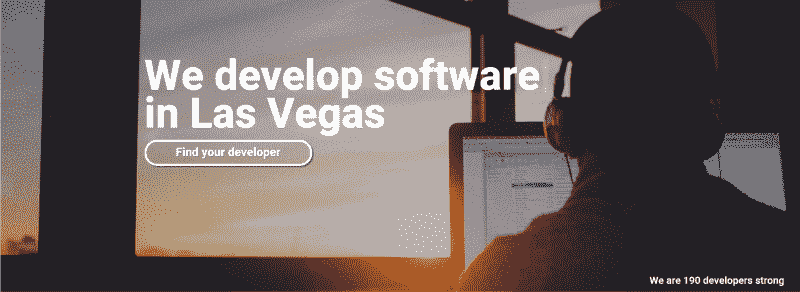
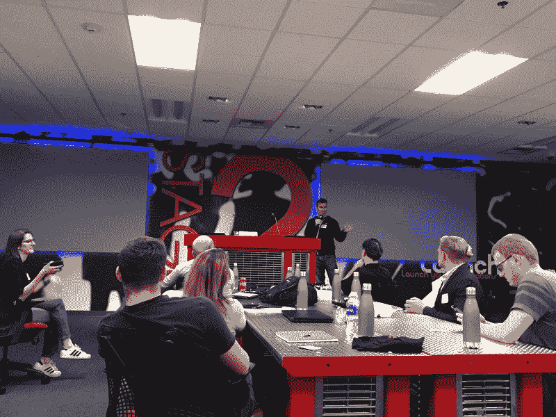
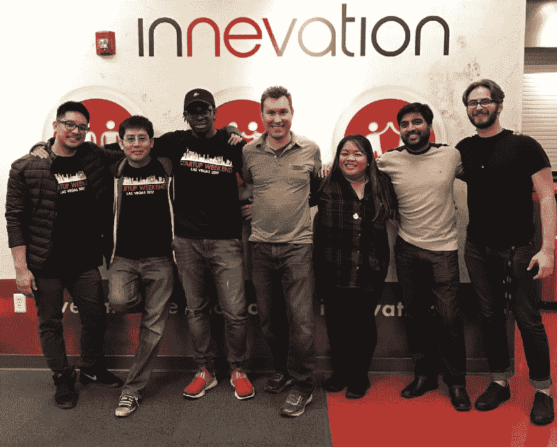

# 我参加了一个只有 13 天编码经验的黑客马拉松。以下是我学到的东西。

> 原文：<https://www.freecodecamp.org/news/i-entered-a-hackathon-with-13-days-of-coding-experience-here-is-what-i-learnt-5538d73ee7ce/>

作者:马尔洛·桑德·阿西斯

# 我参加了一个只有 13 天编码经验的黑客马拉松。以下是我学到的东西。

Our team’s project and website / Source: Developers.Vegas

我不知道我参加了黑客马拉松。我在一个 CodeNewbie 播客上听说过这个术语，当时有人分享了他们的故事。我从播客中记得的是成为社区一员的建议。

因此，当我在脸书自由代码营上看到一个关于创业周末的帖子时，它引起了我的注意。

顾名思义，该活动旨在通过将企业家、设计师和开发人员聚集在一起来开创新的业务。但是，根据我的 freeCodeCamp 帐户，我只有 13 天的编码经验。我评论了帖子。询问我是否会从这样的活动中受益，尽管我缺乏知识和经验。最初的张贴者迈克·齐特洛回复说我会受益，但我必须为此努力。

所以我注册了一个我认为合格的聚会。

当我到达时，我满怀信心地走出电梯，朝着错误的方向走去。当我找到正确的房间时，怀疑开始了。遇到友好的人会暂时抛开这些疑虑。当我遇到 Mike 时，我们讨论了我如何能参加这个活动。

我解释了我在 freeCodeCamp 课程中的位置。我刚刚完成了[“致敬页”项目](https://www.youtube.com/watch?time_continue=4&v=qqrnzmqCGDw)。

Mike 说，团队可能需要有人为他们的商业想法制作一个登录页面。这让我放心了——至少我还能做点什么。

Mike pitching his idea

### 选择团队

活动正式开始，参与者提出了他们的商业想法。有很多好主意。到了选择团队的时候，我想加入一个能挑战我真正做些事情的团队。

但是，我不想成为团队中唯一的开发人员。

所以，我找了一个团队，他们也招募了更多有经验的开发人员。碰巧的是，迈克的推销涉及建立一个网站，将企业家与拉斯维加斯的当地开发商联系起来。自然地，开发人员加入了这个团队，因为他们对产品有既得利益。因此，有 5 名开发人员和 2 名业务分析师，即[开发人员。维加斯](http://developers.vegas/)战队诞生。

几件事坚定了我加入这个团队的决定。

一次是我们第一次见面，讨论我们的计划和如何准备。迈克曾提到，在某个时候，他会需要照片。希望有用，又有摄影经验，就自告奋勇了。Mike 最初很高兴接受我的帮助，但后来他拒绝了。他告诉我，这个周末，我将成为一名开发人员，我有工作要做。我很欣赏这一点——我来这里是因为我想学习如何编码，迈克认识到并尊重这一点。

另一件让我下定决心加入这个团队的事情是我们第一天早上是如何开始的。迈克从一艘破冰船开始。我们分享了一份简短的简历，我们周末的目标，并回答了其他一些问题，从愚蠢到深刻。这花了 2 个小时，但这是一个值得的投资。我认为这真的将我们作为一个团队聚集在一起，并使我们团结起来创造一个工作产品。

The Developers.Vegas team

### 从事一个项目

终于到了工作(或者不工作)的时候了。在此之前，我所有的编码都是通过 freeCodeCamp 和 CodePen 的浏览器内编辑器完成的。和团队谈过之后，我下载了 VS 代码。

然后我意识到，我不知道这是怎么回事。我必须用 git 进行设置，我想我现在已经理解了这个概念，但是我确信我还有很多东西要学。我记得不知怎么搞的，我是在主盘上工作，而不是在分支上。压力很大。我一直在想我是如何让团队失望的。知道自己没有毁了一切，我就放心了。

在我最终能够去工作之前，这些只是我的一些苦恼。我有一些任务。他们都涉及到创建和设计横幅图像上的文本和按钮。我很高兴接受这份工作，因为这是我知道该怎么做的事情，或者至少我能知道该怎么做。

有人提醒我卡住了就去问谷歌。听起来很简单，但我认为这是有技巧的。我必须确保我问了正确的问题，并且我找到的答案就是我需要的答案。后来，我知道没有人愿意做我必须做的工作。我知道的还不够多，不明白为什么大家都讨厌 CSS。

随着活动的进行，我能够向其他开发人员学习。

我了解了一些关于 React 和这些组件如何工作的知识。我们通过代码讨论了如何从数据库中提取数据，以便在我们的网站上显示这些数据。事实上，当我想推动自己尝试新事物时，我帮助解决了我们的一个问题。在这个过程中，我们发现了为什么另一个队友被困了一整天。当它实际上是一个对象时，我们把它作为一个数组来处理。这时候我终于感觉到我在队里尽了力。

Developer tasks and assignments for the weekend

### 最后的想法

在技术知识和经验之外，我从这次活动中学到了很多。它强调了一个好团队的重要性。其他人评论说，尽管只有两名成员在活动前相互认识，但我们看起来都很亲密。看到每个人都在学习也很酷。这正是问题所在。我们创造了一个对学习开放的环境，同时专注于生产力。我们会互相检查，看看他们的进展，看看他们是否需要帮助。我们会在适当的时候交换角色。

我认为这个团队的成功很大程度上也来自于它的领导力。

从一开始，迈克就对他的项目充满热情。在他陈述想法的 1 分钟里，他花了 30 秒谈论这个想法，又花了 30 秒谈论他想让谁加入他的团队。"冷血杀手"这就是我们成为的——“SCK 开发者”

我认为他将时间投入到有意义的破冰船上的远见卓识在很大程度上得到了回报。他还扮演了促进者的角色。有一个了解最终目标和达到最终目标的方法的人来监督项目有助于我们的成功。

2nd place! The Developers.Vegas team (AKA Stone Cold Killers) + Judges.

我很高兴我参加了这个活动。尽管它结束了我在 freeCodeCamp 上连续 13 天的编码生涯，我还是会再做一次。

我建议其他人也尝试这样做，但要确保你找到一个好的团队。我个人计划参加更多这样的活动——你可以计划在下一个[拉斯维加斯展示日](http://demoday.vegas/)看到我。在那之前，我会努力完成 f [reeCodeCamp 的课程](https://www.freecodecamp.org/)。也许到那时，我终于明白为什么大家都讨厌 CSS 了。