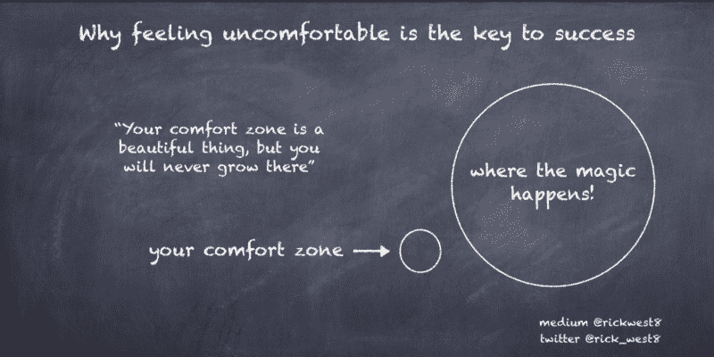
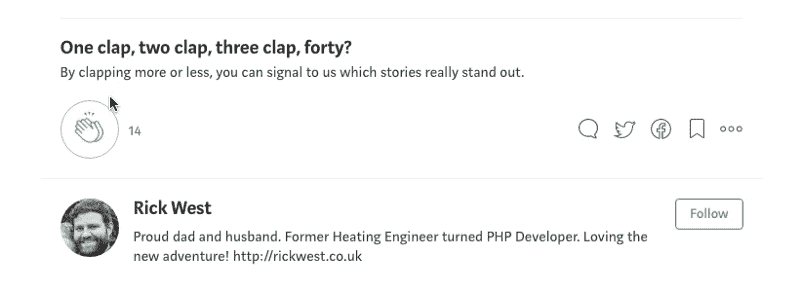

# 为什么感觉不舒服是成功的关键

> 原文：<https://www.freecodecamp.org/news/why-feeling-uncomfortable-is-the-key-to-success-1f308a2ba7b5/>

作者里克·韦斯特

# 为什么感觉不舒服是成功的关键

Your comfort zone is a beautiful thing, but you will never grow there!

当我开始学习 web 开发时，尤其是在我找到第一份工作后，感觉不舒服已经成了一个反复出现的主题。

老实说，一开始，这是一场真正的斗争。每次我发现自己处于不舒服的境地，我都会开始怀疑自己 web 开发真的适合我吗？也许我只是不够聪明？我会变好吗？我能学到足够的东西去找一份工作并获得报酬吗？

我相信你们很多人都有同感。

### 如果你想在生活中得到从未有过的东西，你就必须做从未做过的事情

也许你已经学习编码有一段时间了，但仍然没有足够的信心去申请任何开发人员的工作。你可能觉得自己还没准备好。你可能害怕被拒绝。不管是什么原因，缺乏自信会让你感到不舒服。你并不孤单。在那种情况下，我们都会有同感。

然而，是那些忍气吞声，申请他们能申请的每一份工作，联系公司要求工作，并面对一次又一次拒绝的潜在拒绝的人将赢得胜利。

见鬼，你可能还没有准备好，你可能不会马上找到你梦想的工作。但是，通过把自己放在那里——通过走出你的舒适区——你就赢了。你赢了！你得到了面试的机会和经验，并得到了关于你需要改进的地方的重要反馈。

说到底，你是不是更愿意成为一个已经学习了 18 个月代码，但甚至还没有开始申请工作的人，因为你还没有感到舒服或准备好？

或者你更愿意成为那个已经学习了 6 个月编程，然后开始申请工作的人？你可能会感到不舒服，也许你又花了 6 个月才找到工作，但是在第一次打开文本编辑器 12 个月后，你就在你梦想的职业中工作了？相信我，[这是可能发生的](https://medium.freecodecamp.org/getting-your-first-developer-job-whats-the-best-way-1737d0bcba7a)。

### 一旦你找到工作，这种不舒服的感觉不会停止或变得更容易

我讨厌 JavaScript。(好吧，也许仇恨是一个强烈的词，但我不是它的最大粉丝)。为什么？—因为很难。我觉得很难。

我是一个相当自信的开发人员，但有时我发现自己面临一个任务或项目，诱惑是去接触一种我感觉舒适的技术，而不是用一些新的和具有挑战性的东西来构建。

我可能知道 React 会产生一个更好的最终产品，但是我最初的反应是，我不想处于那种不知道自己在做什么并且每 30 秒钟就要去查阅文档的不舒服的情况。

然而，通过采取这种方法，我给自己造成了伤害。我在阻碍自己的学习、发展和进步。我最终抑制了自己的成功。

#### 舒适区是一个美丽的地方，但那里什么都不会生长。

在这种情况下，我必须告诉自己，虽然我可能会不舒服。这其实是一个机会。一个尝试新事物、学习新技能或拓展职业生涯的机会。

#### 那么…持续成功的关键是什么？

### 感觉不舒服的时候变得舒服——拥抱它

当机会出现时，你必须抓住它。你必须走出你的舒适区。

归根结底，这就是 web 开发。这是一个复杂的、不断发展的行业，你永远不可能知道所有的事情，你会反复面临这样的情况，你会对做一些你以前没有做过的事情感到不舒服。这就是进步的代价。

作为一名 Web 开发人员，在日常生活中，感觉不舒服只是你必须习惯的事情。

你不能让不舒服的“恐惧”支配你的生活。如果你这样做，它将会限制你能做什么和你能取得多少成就。

处于舒适区就是重复的代名词。虽然重复很容易，但也很无聊，没有动力。然而，如果你正在为更多的东西而奋斗，想要摆脱常规，如果你正在寻找成功，那么你需要走出你的舒适区。这样做是快乐、热情、成功的人与舒适、无聊的人的区别。

一旦你学会拥抱恐惧，你将会被你所取得的进步所震惊，无论是在你的网络开发生涯中还是个人方面。

### 成功不仅仅在于你做了什么，还在于你激励了别人去做什么。

最近我看了一个 Ted 演讲，由 [@luvvie](http://twitter.com/luvvie) 主持，题目是“在不舒服中变得舒服”。我强烈推荐！

现在这个演讲不是关于技术或者网络开发，但是昨晚，当我读这篇文章的时候，这个演讲和网络开发之间的相似之处打动了我。

对于生活和网络开发的成功来说，最重要的事情之一就是拓展你的边界和极限。同样重要的是，当你走出舒适区，做让你感到不舒服的事情时，这反过来会激发类似的变化，并激励其他人也这样做。

这体现了整个 freeCodeCamp 社区的意义。通过成为社区的一员，分享你的故事和成功，你激励其他人也这样做。

您可能很难完成前端证书。你可能有过感到不舒服并想放弃的时期。但是通过坚持，通过对不舒服变得舒服，并达到那个里程碑，你不仅实现了你自己的成功，你也激励了其他正在挣扎或想要放弃的人。

这就是为什么回馈社区很重要。在论坛或社交媒体上分享你的项目，分享你的成功，鼓励其他营员。您的成功就是 freeCodeCamp 的成功。

#### 走出你的舒适区，让不舒服变得舒服，这是你欠你自己和我们其他人的！

#### 正如 Luvvie 所描述的——成为多米诺骨牌。

如果你想创建自己的“跟我来”gif，看看[萨姆·威廉姆斯](https://www.freecodecamp.org/news/why-feeling-uncomfortable-is-the-key-to-success-1f308a2ba7b5/undefined)的这篇文章！:-)

此外，我总是很高兴收到志同道合者的来信，所以请随意在 [Twitter](http://twitter.com/rick_west8) 上打招呼。