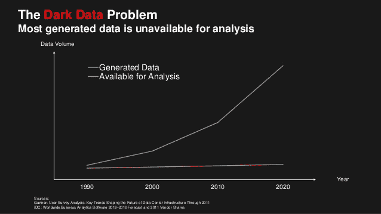
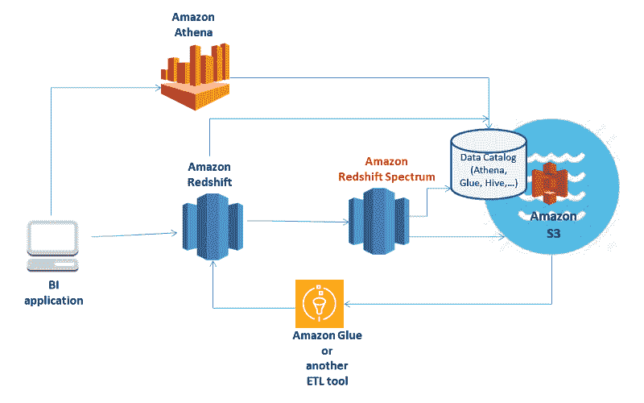
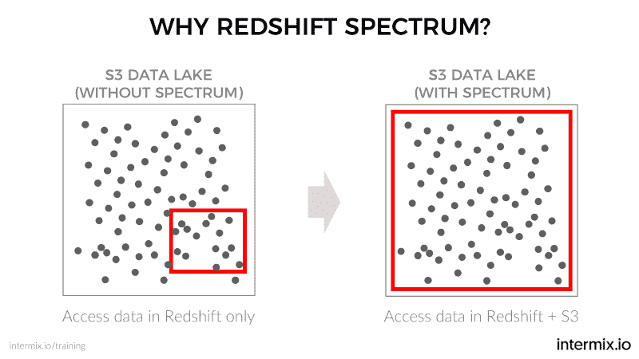

# 如何利用亚马逊红移光谱获取“黑暗数据”

> 原文：<https://www.freecodecamp.org/news/amazon-redshift-spectrum-diving-into-the-data-lake-7532e7e11716/>

by Lars Kamp

# 如何利用亚马逊红移光谱获取“黑暗数据”

亚马逊的简单存储服务( [S3](https://aws.amazon.com/s3/) )从 2006 年就已经出现了。企业一直在以惊人的速度向这个数据湖中注入数据。在其诞生的 10 年内，S3 在[存储了超过 2 万亿个对象](https://www.statista.com/statistics/222309/total-number-of-objects-stored-in-amazons-s3/)，每个对象的大小高达 5tb。这些公司知道他们的数据是有价值的，值得保存。但是这些数据中的大部分都处于“冷”数据湖中，不可用于分析，即所谓的“暗数据”

The Dark Data Problem. Source: Amazon AWS.

### 分析“黑暗数据”

那么，数据湖的表面之下是什么呢？组织要做的第一件事就是找出自己积累了哪些黑暗数据。然后需要分析它以寻找有价值的见解。这意味着分析师需要允许他们访问数 Pb 的黑暗数据的解决方案。

有了[亚马逊红移光谱](https://aws.amazon.com/redshift/spectrum/)，你可以在亚马逊 S3 查询数据，而无需先将其加载到亚马逊红移。出于命名目的，我将使用“红移”表示“亚马逊红移”，使用“光谱”表示“亚马逊红移光谱”

在 S3，有三种主要的访问和分析数据的方法。

*   [亚马逊弹性 MapReduce](https://aws.amazon.com/emr/) (EMR)。EMR 使用 [Hadoop](about:blank) 风格的查询来访问和处理 S3 的大型数据集。
*   [亚马逊雅典娜。](https://aws.amazon.com/athena/) Athena 提供了一个使用标准 SQL 查询 S3 数据的控制台，无需管理基础设施。雅典娜也有一个 [API](https://docs.aws.amazon.com/athena/latest/APIReference/Welcome.html) 。
*   [亚马逊红移](https://aws.amazon.com/redshift/)。您可以将 S3 的数据加载到亚马逊红移集群中进行分析。

那么，为什么不使用这些现有的选项呢？例如，公司已经使用亚马逊红移来分析他们的“热门”数据。那么，为什么不把来自 S3 的冷数据加载到红移中，然后收工呢？

**主要有两个原因:**

*   **努力**。将数据加载到 Amazon Redshift 包括提取、转换和加载(ETL)步骤。这些步骤对于转换和结构化数据以进行分析是必要的。亚马逊估计，找出正确的 ETL 消耗了一个分析项目的 70%。
*   **成本**。您可能甚至不知道要提取什么数据，直到您对它进行了一点分析。上传大量冷 S3 数据进行分析需要扩大集群。这意味着要支付更多的费用，因为红移价格是基于集群的大小。同时，您继续为保留冷数据向 S3 支付存储费用。

红移光谱提供了最好的两个世界。借助 Spectrum，您可以:

*   继续使用您的分析应用程序，使用您为 Redshift 编写的相同查询。
*   将冷数据留在 S3，通过 Amazon Redshift 查询，不进行 ETL 处理。这包括使用单个查询将数据湖中的数据与 Redshift 中的数据连接起来。
*   将处理与存储分离。因为不需要增加集群大小，所以可以节省红移存储。
*   仅在对 S3 数据运行查询时支付。频谱查询的成本相当于每处理 1tb 数据 5 美元。

Data Stack with Amazon Redshift, Amazon Redshift Spectrum, Amazon Athena, AWS Glue and S3.

光谱是“胶水”或“桥梁”层，提供红移接口 S3 数据。红移成为您的业务应用程序的访问层。Spectrum 是从 S3 访问的数据的查询处理层。上图说明了这些服务之间的关系。

#### **仔细观察红移光谱**

从部署的角度来看，Spectrum 是“在引擎盖下”它是您的 [VPC](https://aws.amazon.com/vpc/) 中的一组受管节点，可用于您的任何支持频谱的红移集群。它将计算密集型任务下推到红移光谱层。该层独立于您的亚马逊红移星团。

要理解如何使用红移光谱运行查询，有三个关键概念:

1.  外部数据目录
2.  外部模式
3.  外部表格

**外部数据目录**包含您希望在 S3 访问的数据的模式定义。它是数据资产的中央元数据库。

**外部模式**包含您的表。外部表允许您使用与其他 Amazon Redshift 表相同的 SELECT 语法来查询 S3 的数据。外部表是只读的，也就是说，不能写入外部表。

您可以继续编写通常的红移查询。Spectrum 的主要变化是查询现在还包含对存储在 S3 的数据的引用。

### 连接内部和外部表

红移查询引擎以相同的方式处理内部表和外部表。您可以在任一类型的表上或两者的组合上执行典型的操作，如查询和连接。查询外部表，并将其数据与内部表中的数据连接起来。

例如，假设您正在使用 Redshift 来分析电子商务网站访问者的数据。他们访问什么页面，停留多长时间，购买什么(或不购买)，等等。你在红移星团中保存了一年的数据。你把旧数据转移到 S3。

然后你会注意到一个奇怪的季节变化。你想知道过去几年是否也是如此，或者今年是否有异常。幸运的是，您在 S3 保存了多年前的历史点击流数据。现在，您可以通过带有 Spectrum 的外部表访问历史数据，并运行与 Amazon Redshift 中相同的查询。或者你可以通过将其他过去的数据与今年的数据相结合来创造新的见解。

Redshift 以正常方式解析、编译和分发 SQL 查询到集群中的节点。查询中引用外部数据源的部分被发送到 Spectrum。Spectrum 在 S3 处理相关数据，并将结果发回给 Redshift。Redshift 从它的节点和光谱中收集部分结果，连接并联接它们(等等)，并返回完整的结果。

### 摘要

使用 Spectrum 时，请记住以下几点:

*   您的业务应用程序保持不变，并且不知道查询是如何运行的或者在哪里运行的。对业务分析师来说，唯一的变化是定义对外部表的访问。
*   外部数据保留在 S3——没有 ETL 将它加载到您的红移集群中。这将 S3 的存储层与红移和光谱的处理层分离开来。
*   你不需要增加红移星团的大小来处理 S3 的数据。您只需为您的查询实际访问的 S3 数据付费。
*   红移做了所有艰苦的工作，最大限度地减少访问 S3 数据所需的光谱节点数量。这也使得红移和光谱之间的处理变得有效。

你也应该做功课，以确保在 S3 处理数据是经济和有效的。如果对数据进行分区、压缩或转换成列格式(如 Apache Parquet ),可以节省成本并获得更好的性能。

总之，Spectrum 为您基于红移的数据仓库投资增加了一个工具。现在，您可以使用它的强大功能，以非常低的每次查询价格，根据需要探测和分析您的数据湖。

我是 intermix.io 的联合创始人，如果你想了解一下，可以在这里了解一下。

最初发表于 [www.intermix.io](https://www.intermix.io/amazon-redshift-spectrum-diving-data-lake/?utm_source=medium&utm_campaign=Redshift_spectrum_medium) 。