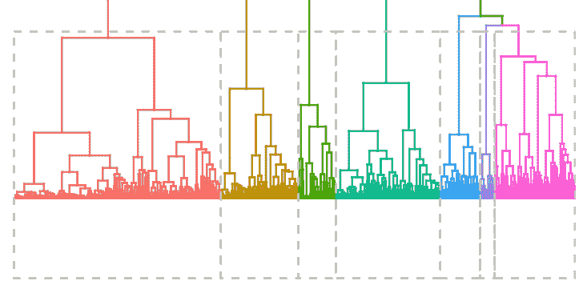
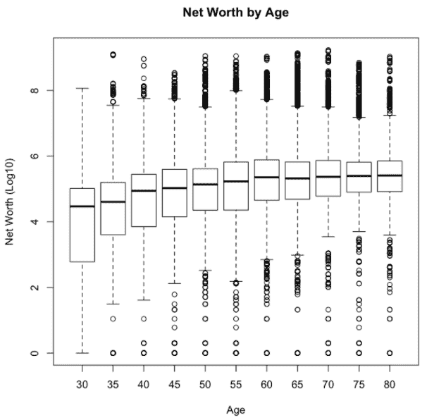
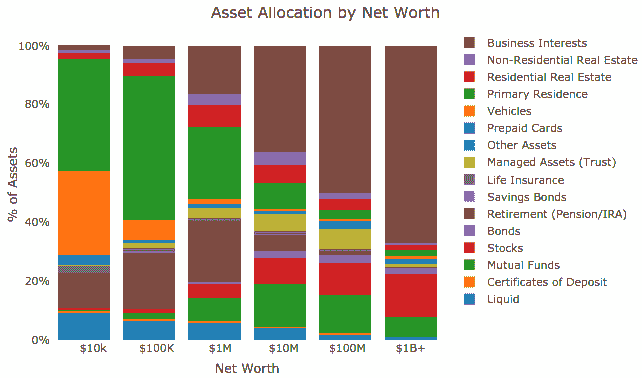
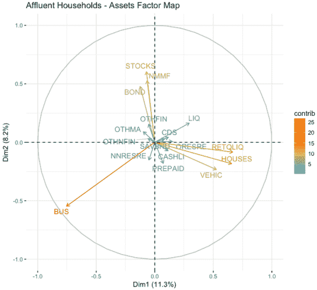
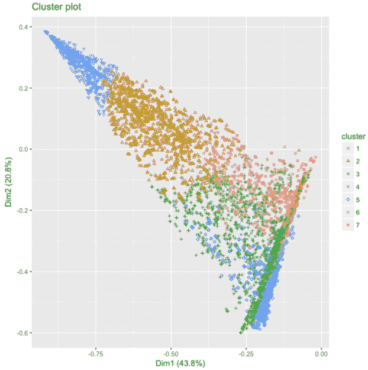
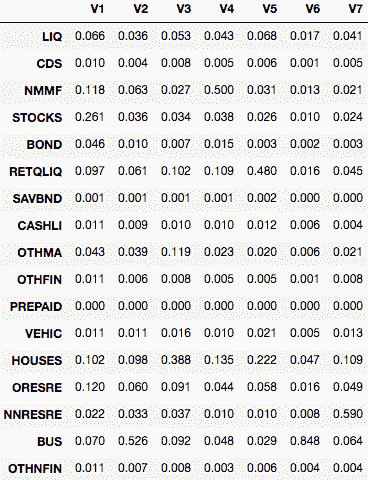
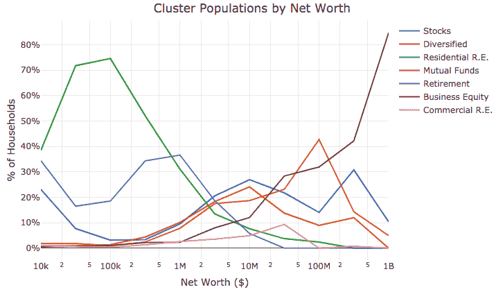

# 聚类前 1%:R 中的资产分析

> 原文：<https://www.freecodecamp.org/news/clustering-the-top-1-asset-analysis-in-r-6c529b382b42/>

作者:本·韦伯



Cluster Dendrogram of Affluent US Households

# 聚类前 1%:R 中的资产分析

美国最近通过的税改法案引发了许多关于该国财富分配的问题。虽然很多人关注税收计划将如何影响收入，但很少有人关注该计划将如何影响富裕家庭的资产。

这篇文章的目的是展示如何使用 R 编程语言对公开来源进行数据挖掘，以更好地了解美国富裕家庭的净资产。利用 2016 年美联储[消费者金融调查](https://www.federalreserve.gov/econres/scfindex.htm)的数据，我们调查了以下问题:

*   收入最高的 1%和收入最高的 0.1%的家庭有多富有？
*   美国有不同类型的百万富翁吗？
*   不同净值部分的资产配置有何不同？

为了回答这些问题，我们对调查数据进行了描述性统计，并对富裕家庭进行了聚类分析，我们将富裕家庭定义为净资产超过 100 万美元的家庭。

根据调查数据，我们的分析显示，美国最富有的 1%家庭的净资产为 1040 万美元，最富有的 0.1%家庭的净资产为 4320 万美元。这篇文章分析了百万富翁的不同资产构成，并展示了美国最富有的 10%、1%和 0.1%家庭之间的资产配置差异。用于产生本文中所有结果和数字的 R 源代码可以从 [Jupyter 笔记本](https://github.com/bgweber/WindfallData/blob/master/FED_Reserve_Survey.ipynb)中获得。

**设置环境**
为了对美国的富裕家庭进行聚类分析，我们使用了从 [CRAN library](https://cran.r-project.org/web/packages/available_packages_by_name.html) 获得的几个 R 软件包。对于探索性数据分析，我们喜欢使用 Jupyter 笔记本的 R 内核，因为它使数据科学家能够轻松地将笔记本存储在 GitHub 上，并与其他团队共享研究结果。

设置这个环境超出了本文的范围，但是我之前已经在[这篇文章](https://medium.com/windfalldata/the-data-science-stack-at-windfall-data-e1e6bc3c4c8f)中详细描述了我们设置这个环境的动机，关于设置支持 R 的 Jupyter 的更多细节可以在[这里](https://github.com/IRkernel/IRkernel)找到。

我们现在准备开始挖掘调查数据，以更好地了解美国富裕家庭的资产。首先，我们将加载几个库，它们将帮助我们分析调查数据并执行聚类。

下面的代码块显示了执行这个笔记本需要加载的库。需要使用 *readxl* 库来读取源数据并将其转换为数据帧， *reldist* 和 *ENmisc* 库用于计算加权数据集的分布，其余库用于聚类分析。

```
library(readxl)     # for reading xlsx files library(reldist)    # for computing weighted statisticslibrary(ENmisc)     # for weighted box plotslibrary(plotly)     # for interactive plotslibrary(factoextra) # for factor mapslibrary(FactoMineR) # Principal Component Analysis (PCA)library(cluster)    # Clustering algorithms (CLARA)library(class)      # for KNN
```

**获取数据**
下一步是从美联储网站下载数据。调查数据以压缩 xlsx 文件的形式提供。为了下载数据并将其作为数据帧加载到 R 中进行分析，我们使用下面的代码块。由于这是一个大文件，我们确保不会多次下载。我们解压缩后得到的文件大约为 40MB，需要一些时间才能加载到数据帧中。

```
if (!file.exists("SCFP2016.xlsx")) {          download.file(   "https://www.federalreserve.gov/econres/files/scfp2016excel.zip",   "SCFP2016.zip")  unzip("scfp2016.zip")} 
```

```
df <- read_excel("SCFP2016.xlsx")
```

**汇总统计数据**
现在我们已经将调查数据加载到 R 中，我们可以开始分析美国最富有家庭的资产配置了。我们将从一些统计数据开始:有多少调查参与者和多少家庭被这个调查所代表？计算数据框中的行数回答第一个问题(31.2k)，将所有调查受访者的权重相加回答第二个问题(126M)。

```
# How many survey participants?nrow(df)
```

```
# How many households does the survey represent?floor(sum(df$WGT)))
```

```
# What is the weighted mean of household net worth?floor(sum(df$NETWORTH*df$WGT)/sum(df$WGT)))
```

```
# what is the median NW in US?  reldist::wtd.quantile(df$NETWORTH, q=0.5, weight = df$WGT)
```

```
# who is the 1%? reldist::wtd.quantile(df$NETWORTH, q=0.99, weight = df$WGT)
```

```
# top 0.1% Ultra-high net worth households  reldist::wtd.quantile(df$NETWORTH, q=0.999, weight = df$WGT)
```

要回答关于平均值的问题，比如什么是平均家庭净资产，我们需要使用加权统计(因为一个调查受访者的权重可能比其他人大得多)。为了计算平均净值，我们可以使用内置的 R 函数，该函数返回值 69 万美元。然而，由于净值比正态分布更接近对数正态分布，我们应该使用其他方法。

为了计算加权回答的中值，我们使用了 *reldist* 库，该库为权重较大的受访者分配更多支持，为权重较低的受访者分配较少支持。当使用这种方法计算加权中位数时，我们发现美国家庭净资产的第 50 百分位是 97k 美元。

前 1%的净资产为 1040 万美元，前 0.1%的净资产为 4320 万美元。我们使用 *wtd.quantile* 函数来计算这些描述性统计数据，由于与 *ENmisc* 包冲突，上面的代码示例使用了完全量化的函数名。

**人口统计数据**
调查数据提供了许多不同的人口统计变量，可用于通过不同因素分析净资产。这些变量包括种族、婚姻状况、教育水平、就业状况等。这篇文章的目的是展示资产配置如何因净值部分而异，而对这些人口统计因素如何影响净值的分析留给读者作为练习。

```
# filter on ages 30 - 84, and group into 5-year bucketsdata <- df[df$AGE >= 30 & df$AGE < 85, ]ages <- floor(data$AGE/5.0)*5
```

```
# plot the weighted box plotwtd.boxplot(log10(1 + data$NETWORTH) ~ ages, data = data,   weights = data$WGT, main = 'Net Worth by Age',  xlab="Age", ylab="Net Worth (Log10)")
```

我们探索的一个人口统计学变量是年龄对家庭净资产的影响。正如预期的那样，随着户主年龄的增长，净值的中位数确实增加了，净值在 60 岁左右达到稳定。

上面的代码显示了如何使用 *ENmisc* 包计算加权分布，显示按年龄划分的调查数据的箱线图。该图的结果显示，40 岁的美国家庭平均净资产为 11.4 万美元，50 岁为 16.3 万美元，60 岁为 24.3 万美元。



**资产配置**
笔记本的下一步是评估不同净值段的资产配置。在这个分析中，我们根据家庭净值的 log10 值定义了一个细分市场。这意味着所有五位数的家庭被聚集在一起，所有六位数的家庭被聚集在一起，以此类推。

```
# normalize assets by total financial and non-financial amountshouseholds <- data.frame(  LIQ = df$LIQ/assets,  ...  BUS = df$BUS/assets,    OTHNFIN = df$OTHNFIN/assets
```

```
# split into net worth segments, and compute mean distributions nw <- floor(log10(households$netWorth))segment <- ifelse(nw == 4, "     $10k",       ifelse(nw == 5, "    $100K",       ifelse(nw == 6, "   $1M",                     ifelse(nw == 7, "  $10M",                     ifelse(nw == 8, " $100M", "$1B+")))))
```

```
results <- as.data.frame((aggregate(households,list(segment),mean)))
```

```
# plot the resultsplot <- plot_ly(results, x = ~Group.1, y = ~100*LIQ, type = 'bar', name = 'Liquid') %>%  add_trace(y = ~100*CDS, name = 'Certificates of Deposit') %>%  add_trace(y = ~100*NMMF, name = 'Mutual Funds') %>%  ...  add_trace(y = ~100*BUS, name = 'Business Interests') %>%  layout(yaxis = list(title = '% of Assets',     ticksuffix = "%"), xaxis = list(title = "Net Worth"),    title = "Asset Allocation by Net Worth", barmode = 'stack')
```

上面的代码通过将一个家庭的资产数量(如商业权益( *BUS* )除以金融和非金融资产(不包括债务)的总数来计算家庭的资产分配。“*…”*模式用于指示多行已经从完整笔记本中列出的代码片段中排除。第二个代码块将家庭分成不同的净值段，第三个代码块将结果绘制如下。

结果显示，富人、超级富人和亿万富翁拥有大量企业股权资产(股票和期权)。富人在退休基金中只有很小比例的资产，相反，他们有股票、共同基金、住宅和商业房地产。



到目前为止，我们已经看到了富裕家庭的总体统计数据，但这并没有告诉我们不同类型的富裕家庭。为了理解不同富裕家庭的资产差异，我们可以使用聚类分析。可视化样本总体中实例之间差异的最有用方法之一是使用因子图来可视化总体中的方差。

```
# filter on affluent households, and print the total numberaffluent <- households[households$netWorth >= 1000000, ]cat(paste("Affluent Households: ", floor(sum(affluent$weight))))
```

```
# plot a Factor Map of assets fviz_pca_var(PCA(affluent,  graph = FALSE), col.var="contrib",      gradient.cols = c("#00AFBB", "#E7B800", "#FC4E07"), repel = TRUE)+  labs(title ="Affluent Households - Assets Factor Map")
```

上面的代码首先过滤调查对象为净资产超过 100 万美元的富裕家庭，然后使用主成分分析(PCA)绘制因子图。下图显示了不同的资产如何影响通过主成分分析发现的两个主要组成部分绘制的家庭轨迹。

下图显示的结果表明，不同富裕阶层的资产净值有所不同。最重要的因素是企业权益。其他一些因素包括投资资产(股票、债券)和房地产资产/退休基金。



要使用多少个集群？
我们现在已经有迹象表明，百万富翁有不同的类型，资产也因净资产的不同而不同。为了理解资产配置如何因净值部分而不同，我们可以使用聚类分析。我们首先识别富裕调查受访者中的聚类，然后将这些标签应用于调查受访者的总体人口。

```
k <- 7res.hc <- eclust(households[sample(nrow(households), 1000), ],  "hclust", k = k, graph = FALSE) fviz_dend(res.hc, rect = TRUE, show_labels = FALSE)
```

为了确定使用多少个聚类，我们使用上面的代码片段创建了一个聚类树图，如本文的标题图像所示。我们还改变了聚类的数量， *k* ，直到我们有了最大数量的可清楚识别的聚类。

如果您更喜欢采用定量方法，您可以使用 *fviz_nbclust* 函数，该函数使用轮廓度量计算最佳聚类数。对于我们的分析，我们决定使用 7 个集群。

```
clarax <- clara(affluent, k)fviz_cluster(clarax, stand = FALSE, geom = "point", ellipse = F)
```

为了将富裕家庭分成独特的群体，我们使用了克拉拉算法。不同集群的可视化如下所示。结果类似于上面讨论的 PCA 和因子图方法。



**聚类描述**
既然我们已经确定了要使用多少个聚类，那么检查这些聚类并根据特征集分配定性标签是很有用的。下面的代码片段显示了如何计算 7 个不同分类的平均特征值。

```
groups <- clarax$clusteringresults <- as.data.frame(t(aggregate(affluent,list(groups),mean)))  results[2:18,]
```

该代码块的结果如下所示。基于这些结果，我们提出了以下集群描述:

*   V1:股票/债券——占资产的 31%,其次是家庭基金和共同基金
*   V2:多元化——53%的商业股权，10%的房产和 9%的其他房地产
*   V3:住宅房地产——占资产的 48%
*   V4:共同基金——资产的 50%
*   V5:退休— 48%的资产
*   V6:企业权益— 85%的资产
*   V7:商业房地产——59%的资产

除了仅包含 3%人口的星团 V7 之外，大多数星团的大小相对均匀。第二小的聚类代表人口的 12%,而最大的聚类代表 20%。您可以使用 *table(groups)* 来显示未加权的集群人口规模。



**按净值段对人群进行聚类**
该分析的最后一步是对总体人群应用不同的聚类分配，并按净值段对人群进行分组。因为我们只对富裕家庭进行聚类训练，所以我们需要使用分类算法来标记人口中的非富裕家庭。下面的代码片段使用 *knn* 来完成这项任务。

剩余的代码块计算每个净值段被分类为每个聚类的家庭数量。

```
# assign all of the households to a cluster groups <- knn(train = affluent, test = households,   cl = clarax$clustering, k = k, prob = T, use.all = T)
```

```
# figure out how many households are in each cluster clusters <- data.frame(  c1 = ifelse(groups == 1, weights, 0),   ...   c7 = ifelse(groups == 7, weights, 0) )
```

```
# assign each household to a net worth cluster nw <- floor(2*log10(nwHouseholds))/2results <- as.data.frame(t(aggregate(clusters,list(nw),sum)))
```

```
# compute the number of households that belong to each segmentresults$V1 <- results$V1/sum(ifelse(nw == 4, weights, 0))...results$V11 <- results$V11/sum(ifelse(nw == 9, weights, 0))
```

```
# plot the results plot <- plot_ly(results, x = ~10^Group.1, y = ~100*c1, type = 'scatter', mode = 'lines', name = "Stocks") %>%  add_trace(y = ~100*c2, name = "Diversified") %>%  ...  add_trace(y = ~100*c7, name = "Commercial R.E.") %>%  layout(yaxis = list(title = '% of Households', ticksuffix = "%"),     xaxis = list(title = "Net Worth ($)", type = "log"),      title  = "Cluster Populations by Net Worth")
```

这一过程的结果如下图所示。图表显示了一些明显和新颖的结果:房屋所有权和退休基金构成了非富裕家庭的大部分资产，2M 美元(不包括商业房地产和商业股权)附近的资产组合相对均匀，商业股权主导了超富裕家庭的净资产，其次是其他投资资产。



**摘要**
在本帖中，我们使用 R 下载并分析了 2016 年美联储消费者金融调查的数据，以了解美国顶级家庭的富裕程度，并通过资产配置对富裕家庭进行聚类。我们确定了 7 个不同的百万富翁群体，并展示了这些群体的分布是如何根据净资产部分而变化的。请记住，给出的结果来自加权调查数据，可能并不代表整个美国人口。

本·韦伯是 Zynga 的首席数据科学家。我们正在[招聘](https://www.zynga.com/careers/positions/categories)！