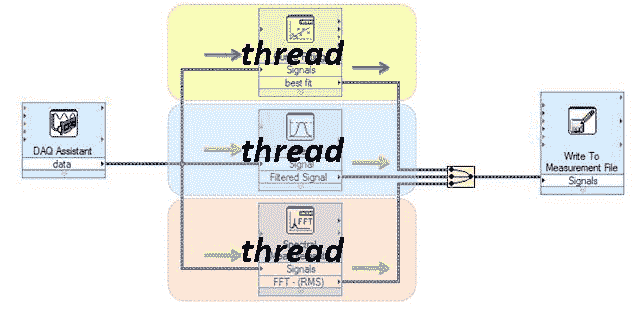

# 如何使用 Web Workers 在 JavaScript 中调度一致的异步任务

> 原文：<https://www.freecodecamp.org/news/how-web-workers-can-help-with-consistent-asynchronous-tasks-in-javascript-cd6d728fa4ee/>

作者:丹尼·麦克沃斯

# 如何使用 Web Workers 在 JavaScript 中调度一致的异步任务

随着 Javascript 引擎的不断改进，以及 ECMASCRIPT 规范中废弃和新增 API 的不断增加，对超高速 web 应用程序的追求从未像现在这样高涨。

#### Javascript 引擎是什么？

Javascript 引擎是一个虚拟机。指的是给定计算机系统的软件驱动仿真。Javascript 引擎的基本工作是获取开发人员编写的 Javascript 代码，并将其转换为浏览器可以解释的快速、优化的代码。


To read more javascript engines, check out the [v8 javascript engine.](https://developers.google.com/v8/)

通常，这个过程在一个单独的**线程**上运行(稍后会有更多关于线程的内容)，开发者代码的每条语句一次执行一条。单线程应用程序/架构的问题在于，如果任何语句或语句块需要很长时间才能完成，所有后续语句都会挂起，直到该语句/语句块完成。这就是所谓的`BLOCKING`。为了避免阻塞，程序必须是多线程的。

#### 穿线

线程是一个执行上下文，它是 CPU 执行指令流所需的所有信息。

假设你正在读一本书，你想马上休息一下，但是你想能够回来，从你停下来的确切位置继续阅读。一种方法是记下页码、行号和字数。所以你看书的执行上下文就是这三个数字。

如果你有一个室友，她也在用同样的方法，她可以在你不用的时候把书拿走，从她停下来的地方继续读。然后你可以把它拿回来，从你原来的地方继续。

线程以同样的方式工作。CPU 给你一种错觉，好像它在同时进行多种计算。它通过在每个计算上花费一点时间来实现。它能做到这一点是因为它对每个计算都有一个执行上下文。

就像你可以和你的朋友分享一本书一样，许多任务可以共享一个 CPU。这个过程被称为多线程，它解决了`BLOCKING`。为了在前端支持多线程，创建了 web workers。



for more on threading, visit [here](https://en.wikipedia.org/wiki/Thread_(computing)).

#### 网络工作者


image credit to [html5schools](http://www.html5schools.com/html5-api-tutorials/webworkers-introduction//).

> workers 最简单的用途是在不中断用户界面的情况下执行计算量很大的任务。([来源](https://en.wikipedia.org/wiki/Web_worker))

Web workers 通过生成新的后台线程和独立运行脚本，在前端实现多线程。因此，工作人员执行的脚本需要包含在单独的文件中。因为 web workers 在独立的线程中执行脚本，所以脚本不会干扰主线程，因此不会中断 UI。

#### **创建网络工作者**

出于教学目的，下面摘录的脚本将在一个单独的线程中运行。

```
### fetch.js

self.addEventListener(‘message’,  e => {
    let url = e.data;

    fetch(url).then(res => {
        if (res.ok) {
            self.postMessage(res);
        } else {
            throw new Error(’error with server’);
        }
    }).catch(err => {
        self.postMessage(err.message);
    });
})
```

> `[Worker()](https://www.w3.org/TR/workers/#dom-worker)`构造函数调用创建一个工人，并返回一个代表该工人的`[Worker](https://www.w3.org/TR/workers/#worker)`对象，用于与工人通信。

```
let worker = new Worker('fetch.js');
```

构造函数将脚本的名称作为参数。如果指定的文件存在，工作线程将生成一个新线程，然后完全下载并执行脚本。如果该文件不可用，工作线程会自动失败。

#### **使用网络工作者**

Web workers 使用一个[事件](https://developer.mozilla.org/en-US/docs/Web/Events)模型和消息与父线程(worker 的创建者)通信。它在幕后使用`[MessagePort](http://www.w3.org/TR/webmessaging/#message-ports)`对象，因此支持所有相同的特性，比如发送结构化数据和传输二进制数据。

要接收来自工人的消息，使用`Worker`对象上的`[onmessage](https://www.w3.org/TR/workers/#handler-worker-onmessage)`事件处理程序。

```
worker.onmessage = (e) => { // block statements }
```

也可以用`addEventListener`的方法。

```
worker.addEventListener('message', (e) => { // block statements })
```

为了在 worker 内部接收消息，使用了`onmessage`事件处理程序方法。

```
onmessage = (e) => { // blocks of statements }
```

您也可以使用`fetch.js`中举例说明的`addEventListener`方法。

要向工作线程发送数据或从工作线程接收数据，请使用`[postMessage()](https://www.w3.org/TR/workers/#dom-worker-postmessage)`方法。文本和 JSON 等结构化数据可以通过这个通信通道发送。在这里阅读更多关于`messagePort`比[支持的数据类型。](https://www.html5rocks.com/en/tutorials/workers/basics/#toc-transferrables)

```
worker.postMessage('some-lousy-data');
// in the parent thread

self.postMessage('some-resulting-data');
// in the worker thread.
```

这种特殊的消息传递限制有很多原因:它保持子工作进程安全运行(因为它不能公然影响父脚本)，并且它保持父页面线程安全(让 DOM 成为线程安全对于浏览器开发人员来说是一个逻辑噩梦)。

#### **终止工人并处理错误**

如果需要立即终止主线程中正在运行的工作线程，可以通过调用工作线程的 terminate 方法来实现:

```
worker.terminate();
```

在工作线程中，工作线程可以通过调用自己的 close 方法来关闭自己:

```
close();
```

工作线程被立即终止，没有机会完成其操作或清理自身。

运行时错误可以通过显式监听可能由`Worker`对象触发的错误事件来处理。

```
worker.addEventListener('error', (e) => { // block of statements })
```

#### **网络工作者的局限性**

1.  所有 web worker 脚本必须由同一个域提供服务。
2.  您不能直接访问 DOM 和全局文档。
3.  窗口对象公开有限的 API。例如，`location`和`navigator`和`XMLHttpRequest`对象。
4.  受限的本地访问。网络工作者不处理静态文件。例如`file://my/file/on/my/computer`。

如果您使用 worker 来处理最终需要更新主用户界面的任务，您将需要使用消息传递系统在 worker 和主应用程序之间传递数据。然后，主应用程序负责更新 UI。

类似地，如果您的 worker 需要访问来自文档、窗口或父对象的数据，您将需要在用于启动 worker 的`postMessage()`调用中发送它。

#### 结论

创建 web workers 将产生消耗系统资源的真正的操作系统级线程。请注意，这将影响用户整个计算机的性能，而不仅仅是网络浏览器。因此，应该负责任地使用 web workers，并在不再使用时将其关闭，以便为其他应用程序释放资源。

使用 web workers 会对 web 应用程序的性能产生重大影响；而响应性更强的应用对用户体验有很好的作用。

有关 web workers 的更深入的信息，如在 workers 中导入脚本和 web workers 的范围，请访问 [MDN](https://developer.mozilla.org/en-US/docs/Web/API/Web_Workers_API/Using_web_workers) 或 [WHATWG](https://www.w3.org/TR/workers/) 。

关于网络工作者的完整功能示例，请访问[此处](https://github.com/DannyMcwaves/web-workers)。