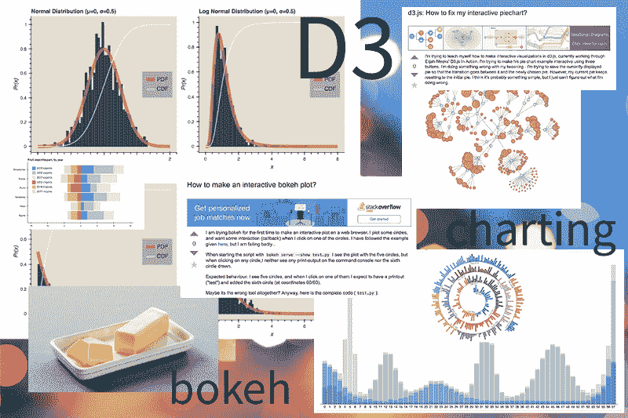
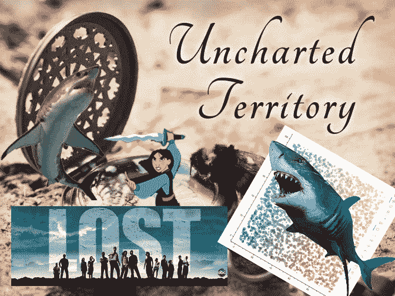
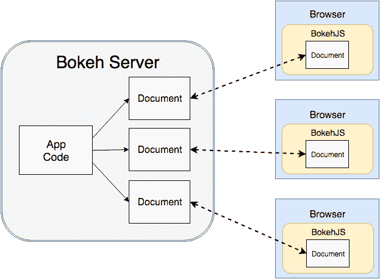
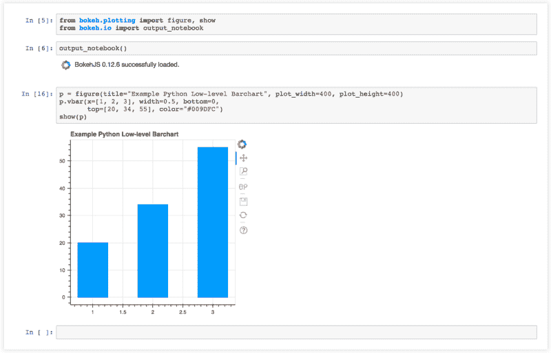
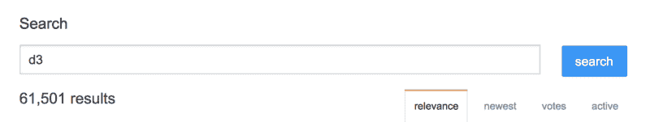
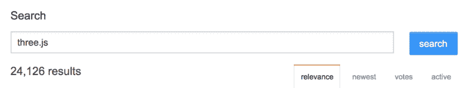
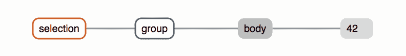
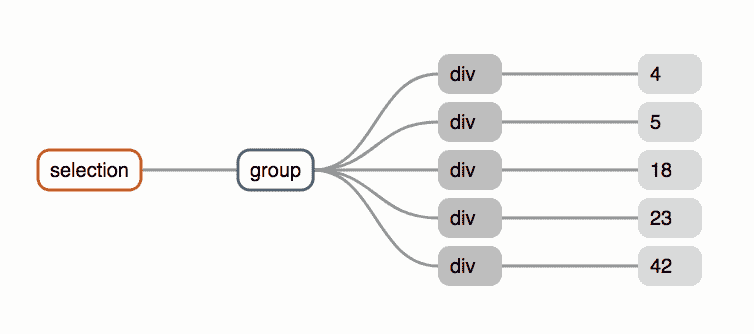
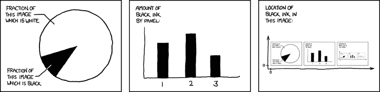

# 绘制水域图:在散景和 D3 之间

> 原文：<https://www.freecodecamp.org/news/charting-the-waters-between-bokeh-and-d3-73b3ee517478/>

作者:蔡曼迪

# 绘制水域图:在散景和 D3 之间

### **简介**

当他们必须进入图表库的世界时，在一个崭露头角的“低调但也高调地试图成为前端设计师和开发人员”的生命中会有这样一个时刻。

Navigating *uncharted* waters

图表库产生数据驱动的可视化。正因为如此，你可以在五月三十八日(T1)迅速掌握预期寿命的趋势，或者在 T2(New York)的纽约时报(T3)上衡量国民对即将到来的总统选举的情绪。

想想您可以在 [Google Sheets](https://www.google.com/sheets/about/) 中创建的图表，除了现在您对驱动这些[图表的库有直接查看和编辑权限](https://developers.google.com/chart/)。你是这些构成“图表”的低级构件的主人。

有几个图表库是用 JavaScript 编写的，这是一种 web 开发人员比大多数人更熟悉的语言，这使得学习它们变得不那么困难。当正确执行时，图表库有能力传递一个强有力的信息*和*给你一个观看严肃的视觉糖果的机会。

最近，我们团队的任务是创建一个需要集成图表库的界面，以实现目标。因此，我们必须决定一个满足我们特定用例的库。如果你正确地权衡了自己的需求，选择了一个能满足所有需求的图书馆，生活就是黄金。

然而，图书馆从来都不是万能的。通常情况下，您最初认为库是完美匹配的假设是不正确的，因为会出现不可预见的障碍。

When nothing was working

也许你在想:“这些选项是什么？”“你是如何选择一个选项的？”或者“你为什么觉得自己很蠢？”(参考上面的 Slack 消息)。

本文将描述我们在当前可用的无数 JavaScript 图表库中选择图表库的过程，在两个图表库( [Bokeh](https://bokeh.pydata.org/en/latest/docs/dev_guide/bokehjs.html) 和 [D3.js](https://d3js.org/) )之间切换的关键决定，以及每一个的优缺点。对我来说，这是一个“未知”的领域，如果你对图表库或数据可视化有同样的感觉，读完这篇文章你会感觉更好。

我们开始吧！

### 为什么我们首先尝试散景

我们的需求分为两大阵营:**速度**和**交互性**。因为我们正在处理大量的数据，我们的可视化必须能够以闪电般的速度更新(或者至少以没有明显滞后的速度)。

我们的应用程序还需要具有我们为用户设想的交互性。在一个理想的场景中，这个库应该已经包含了一些我们可以轻松加入的交互函数，而不是从头开始写。

输入[散景](https://bokeh.pydata.org/en/latest/)。

#### **关于散景**

Bokeh 是一个库，主要用于在浏览器中从大型或流式数据集创建可视化效果。您可以使用 Python 创建这些可视化效果。然后 Bokeh 的 [JavaScript API](https://bokeh.pydata.org/en/latest/docs/dev_guide/bokehjs.html) 接收你的 Python 脚本，除了处理浏览器中的 UI 交互之外，还会呈现图形或图表。

您也可以选择使用散景服务器来处理数据流。在 Bokeh 0.12.13 [文档](https://bokeh.pydata.org/en/latest/docs/user_guide/server.html)中，它声明:“这种在 python 和浏览器之间同步的能力是 Bokeh 服务器的主要目的。”

[Source image](https://bokeh.pydata.org/en/latest/_images/bokeh_serve.svg)

#### **优势**

散景有很多神奇的原因。它首先使用 WebGL 和 HTML5 Canvas fallback 进行渲染，提供几个内置工具来与图表进行交互，处理非常大的数据集，并最终创建可以立即在 web 上发布的内容。

在 Python 和 JavaScript 之间导航的能力对于图表来说也是非常强大的，因为 Python 允许您利用有用的数据结构和数据分析工具，而 JavaScript 将处理后的数据转化为浏览器友好的可视化。

#### **缺点**

然而，散景的一个缺点是，它限制了可视化的交互性。散景使您能够以更传统的方式“绘制图表”,它提供了一个以轴为基线的二维网格状画布。这没关系，因为这通常是用户需要和想要的。有经验的散景用户可以做出非常漂亮的东西(见这里的例子)。

但是，如果我想制作一个超越图表传统特征的可视化效果，比如模拟原子之间的作用力并拖动原子，我不知道如何在散景中完成。

Bokeh 也适用于 Python 开发，而不是 JavaScript。下面是使用 Python 在散景中制作条形图的例子。超级简单干净。

*使用 Python 的散景柱状图(通过 Jupyter 笔记本)*

在开始使用 Bokeh 之前，我们有意识地决定用 JavaScript 而不是 Python 编写脚本，因为我们的整个 web 应用程序过去和现在都是基于 JavaScript 框架构建的。没有一个散景文档是用 JavaScript 编写的(如你所料，它是用 Python 编写的)，尝试使用 JavaScript 被证明是困难的。

如果你使用的是低级的字形，那么在 Python 中任何可能的事情在使用 Bokeh 的 JavaScript 中都是可能的。然而，如果你像我一样刚开始学习这两种语言，在两者之间翻译语法是不直观的。

此外，高级 JavaScript `Bokeh.Charts`和`Bokeh.Plotting`API 也有局限性——有些已经过时，有些则让你很难改变剧情的特性。下面的例子是我用 JavaScript 创建散景图的尝试。

*使用 Javascript 的散景低级条形图*

*散景使用散景的高级条形图。图表 Javascript API*

更多关于使用散景进行 JavaScript 开发的信息，请点击这里。如你所见，使用 Bokeh 库的 JavaScript 失去了我们在使用 Python 开发时观察到的更简单的代码行。我想我花了大约一个小时在控制台上摆弄，在我的高级图表中添加一个白色轮廓和一个标题，这重申了当你想改变图表的视觉细节时，我在`Bokeh.Charts` JavaScript API 的边界之外导航的斗争。

最后，与散景相比，有更多的文档和其他图表库的积极使用，如 T2 的 D3.js 或 T4 的 three.js。随着库的积极贡献者和用户越来越多，找到修复特定 bug 的解决方案的可能性也越来越高。

**61,501** results for D3 on Stack Overflow

**24,126** results for three.js on Stack Overflow

**3,405** results for Bokeh on Stack Overflow

— — — — — — — — — — — — — — — — — — — — — — — — — — — — — — —

### 为什么我们改用 D3

所以我们被困住了。我们已经达到了“这个库在某种程度上满足了我们的需求，但继续用 JavaScript 做东西是一件痛苦的事情，也许有一天当我们意识到我们需要一些 Bokeh 现在没有的东西时，我们会碰到天花板。”酷毙了。

输入 [D3](https://d3js.org/) 。

我们最初对 D3 的担心是，考虑到过去在浏览器中用大量数据渲染 SVG 的经验，它会使我们的可视化渲染太慢。我们还知道 D3 的学习曲线明显高于散景的学习曲线。

但是考虑到 D3 的受欢迎程度、大量有精美文档记录的 D3 应用程序，以及我们“搞定”的态度，我们仍然很乐观……所以我们还是决定试一试。

Get Shit Done by [Tyler Somers](https://dribbble.com/shots/1685729-Get-Shit-Done)

#### **关于 D3**

D3.js 是一个强调数据绑定的 JavaScript 库。它为您提供了在 DOM 中生成元素并同时将数据绑定到元素的独特能力。使用完全数据驱动的库，您可以在添加或删除数据点以及数据集之间的转换时动态添加元素。D3 还对最终结果的美感和交互性提供了更多的控制，这意味着您可以创建最[奇异/奇妙的可视化效果](https://mviz.omid.al/)。

#### **优势**

令我们惊讶的是，我们用数据集创建的 D3 可视化效果非常好。我们很快意识到 D3 是专门为快速渲染而构建的，尽管我们向库中传递了大量数组。

D3 允许您在 SVG 存在之前将整个数据集绑定到 SVG，而不是逐个传递数据点并生成各自的 SVG，这可能非常繁琐。然后快速生成 SVG，并一次将其与各自的数据点关联起来。

这就像厨房里的厨师一下子收到一系列订单，可以按照省略不必要等待时间的顺序准备食物，而不是总是在准备一个菜后等待接收下一个订单。

Visualization of data binding to DOM elements from Mike Bostock’s [explanation on D3 selections](https://bost.ocks.org/mike/selection/)

D3 最棒的地方在于它为数据集之间的平滑交互和转换提供了充足的机会。因为我们的最终目标是赋予用户权力，所以我们希望创建一个可视化的东西，邀请个人参与其中。

D3 也是用于 JavaScript 开发的。我们不会再像使用 Bokeh 那样“在幕后挖掘”JavaScript API 了。我在本文前面使用 BokehJS 创建的条形图示例在下面使用 D3 库显示。

*D3 Barchart*

是的，与散景图所需的代码相比，有更多复杂的代码行。花了更多的时间和精力去捡。但是你可以完全控制图表的每一个小细节(T0)，这些都在网上的某个地方记录下来(可能是通过创建者[迈克·博斯托克](https://bl.ocks.org/mbostock))。太棒了。

最后，近年来 D3 被广泛用于可视化 [2017 年美国大选](http://fivethirtyeight.com/features/election-update-women-are-defeating-donald-trump/)、[难民人口流动](http://www.therefugeeproject.org/)、[世卫组织婴儿疫苗接种率](https://hi.stamen.com/visualizing-infant-vaccination-rates-for-the-world-health-organization-d484789505b1)，以及无数其他趋势和故事。结果，D3 获得了大量的曝光和关注，这导致了更多的活跃用户和每天使用图书馆的新方式。

当选择一个长期的库并记住你的队友最终也需要学习它时，考虑库的当前和未来贡献者社区是绝对重要的。一个拥有持续繁荣的社区的图书馆是理想的，D3 似乎在培养这种类型的社区。

#### **缺点**

与散景相比，D3 的初始学习曲线更高，假设你正在用 Python 开发散景。JavaScript 比 Python 更冗长。然而，如果你像我们一样计划用 JavaScript 开发，那就值得一试 D3 教程。

很难理解选择是如何工作的。输入()和。exit()甚至意味着，*的魔力*就发生在一行简单的代码中。过渡()有人吗？).但是——一旦你理解了 D3 的独特结构，即假设事物在存在之前就存在，那么可能性是无穷无尽的。

最终，D3 的好处超过了学习它的努力和时间，我们有预感转换到 D3 将是一个很好的长期投资。

### 结论

所以你有它！当我们将这个库集成到我们的应用程序和团队中时，我们仍然在积极地使用和学习 D3。虽然仅仅因为我们正在用 D3 前进，并不意味着我们将来不会在不同的应用中使用散景。每个图表库都有优点和缺点，重要的是要不断反思，以确定是否应该继续使用当前的库或开始探索其他选项。

在选择图表库之前，了解您的具体需求，不要害怕带着这些需求一头扎进图表库未知的水域。如果有些东西第一次不奏效，尝试一些看起来有希望的新东西。

这是关于探索，记录，并与你自己和你的队友一起检查，继续以富有成效的方式发展项目。

前进！

Source [here](https://www.xkcd.com/688/)

如果你有任何意见，纠正，建议，或者只是想谈谈，随时给我发电子邮件到 mandicai@gmail.com。你可以在 http://mandilicai.com/找到我的一些作品。