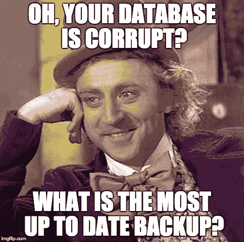
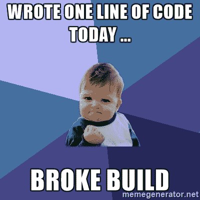

# 如何让你的创业公司的云更稳定:4 个实用的 DevOps 技巧

> 原文：<https://www.freecodecamp.org/news/how-to-make-your-startups-cloud-more-stable-4-practical-devops-tips-823e4202518c/>

在创业的世界里，当你把时间投入到什么地方时，需要一个平衡。我遇到过很多情况，由于需要发布 MVP，DevOps 实践被搁置。

我认为这是正常的，并不是一件真正的坏事，因为“MVP”应该是“最小的”，并且由好的开发人员解决的大多数问题都不是这么小规模的问题。

但是这里有几件事情是绝对应该做的(或者至少是应该考虑的)。因为在创业世界中，没有什么比云基础设施瘫痪更糟糕的了。

It’s hard to find time for DevOps in a startup when there’s so much else to do

### 提示 1:计划数据备份？

对于任何关心持久数据的初创公司来说，这都是必须的。您需要自动备份您的关键数据，否则您面临的风险不仅仅是丢失文件，还会失去客户的信任，这将影响您未来的发展。

在开始项目时，我通常会自动执行两种类型的备份方法

#### 数据库备份

这通常采用预定脚本的形式，比如每天晚上运行的 cron 作业，它将数据库转储推送到云上的某个地方，就像一个私有的 S3 存储桶。您可以使用一些备份解决方案来获得更奇特的解决方案，但这些解决方案往往更侧重于企业，会耗费您大量的时间和金钱(不利于启动)。

#### 磁盘快照

当所有其他的都失败了，如果你有一个你的磁盘备份，你通常会是安全的。大多数主要的云提供商都有适当的解决方案，允许您根据自己选择的计划拍摄磁盘快照，所以尽量避免编写直接连接到云 api 的脚本，因为您将负责维护它们。

#### ？？请务必测试您的备份恢复方法，否则 GitLab w 会有什么风险？他们的 5 种备份方法都失败了，因为他们从未测试过恢复？？

### 技巧#2:设置监控并在出现问题时得到提醒？️

你知道当一个服务器关闭或一个应用程序由于磁盘空间耗尽而崩溃吗？如果没有，您应该考虑修复该问题(这不会花费太多时间)。

设置监控的最简单方式通常是云提供商解决方案，如亚马逊云观察或 T2 GCP stack driver。您可以设置指标来进行监控，并设置不同类型的警报来响应云基础架构中发生的事件，例如在磁盘空间不足时收到电子邮件。

如果你不想使用供应商的解决方案，也有不可知云的选项可以监控你的云。简单的解决方案是存在的，比如调度发送电子邮件的 shell 脚本定期运行，但是一个更全面的解决方案，给你一个系统的仪表板视图，通常是更好的和更可伸缩的。像[蓝色梅多拉](https://bluemedora.com/)和[太阳风](https://www.solarwinds.com/)这样的选项存在于企业私有云，但大多数初创公司需要省钱，这意味着转向开源解决方案，如[county](https://count.ly/)。

总而言之，我会推荐使用基于云提供商的解决方案，因为这些解决方案将保证稳定、易于设置，并且以初创公司的规模来看，不会花费你太多额外的成本。

### 技巧 3:转向 CI/CD 渠道？

我看到创业公司的一个常见问题是发布代码的过程。许多人还没有花时间在 DevOps 上来开发一个稳定的发布管道，这意味着要进行版本控制的代码要么是手动测试、构建和发布的，这对于您的开发团队来说既容易出错又耗时。

#### 持续集成—确保变化不会中断

持续集成的要点是拥有一条管道，每当代码准备好提交时，管道就会被启动。

Continuous integration protects the stability of your codebase

1.  代码被提交到版本控制中
2.  像 Jenkins 这样的自动化系统创建了应用程序的构建
3.  执行自动化测试以验证系统仍然正常工作
4.  一旦所有测试都通过，代码就可以被添加到稳定的代码库中
5.  新代码现在可以部署了(这就是持续部署发挥作用的地方)

#### 持续部署—自动化您的产品发布

持续部署在您的持续集成管道完成了验证新代码不会破坏您的构建的工作之后开始。这通常包括创建一个新的生产构建，就像在持续集成阶段所做的那样，并替换旧的构建(不可变的基础设施)。

从技术上讲，您可以在没有持续集成的情况下进行持续部署，但是这样做的风险很大。您基本上是将未测试的代码直接推给客户(？公元**年？**)

#### **走向 CI/CD 应该从哪里开始？—自动化测试！**

众所周知，大多数开发人员不喜欢编写测试。随着应用程序的发展，它们往往需要不断更新，并且是一个很大的时间接收器，所以自然地，许多初创公司会因为“MVP”而忽略编写测试。

如果你没有一个全面的测试套件，我不会考虑 CI/CD，直到这个问题得到解决。随着测试覆盖率的提高，您将开始看到效率的显著提高，因为您在生产中看到的错误越来越少。此时，您应该转移到 CI/CD 渠道的其他部分。

### 技巧 4:容器化你的应用程序？

Containers make it easy to create automated builds of applications

不要害怕容器，虽然技术本身很复杂，没有内核的基础知识很难理解，但利用它们并将应用程序转换成容器真的很简单。

整理一个 docker 文件通常不到一个小时(取决于你的应用程序的复杂性)，在你知道之前，你可以立即部署你的应用程序，并利用 Kubernetes 等伟大的系统。

以下是通过容器化应用程序可以立即获得的一些好处。

#### **一致的构建**

不再有“它在我的机器上工作”的问题——如果容器构建好了，它将在任何机器上以同样的方式运行。

#### **无痛部署**

你知道当你想建立一个开源项目时，你必须经历各种各样的手动步骤，建立数据库和安装所需的软件包？有了容器，就不再是这样了，所有这些步骤都融入到构建过程中，您只需要运行一个命令来启动您的服务器。

#### **充满活力的集装箱生态系统**

像 Docker 和 Kubernetes 这样的容器平台拥有一个非常庞大且不断增长的产品和服务生态系统，可以帮助您更轻松地管理您的应用程序。存储、网络和资源分配等许多令人头疼的问题基本上迎刃而解，为您节省了时间和金钱。

### 结论

许多初创公司没有在云基础设施上投入太多的心思或时间。这通常是由于 MVP 理念，即先发货，后清理技术债务。

当希望纵向扩展您的 DevOps 基础架构时，请考虑计划备份、监控、CI/CD 和容器化。这些通常都是轻而易举的胜利，并且会带来更加稳定的云。

### 想要扩展您的云基础架构吗？ [ServiceBot 可以帮忙](https://servicebot.io?ref=medium3)。