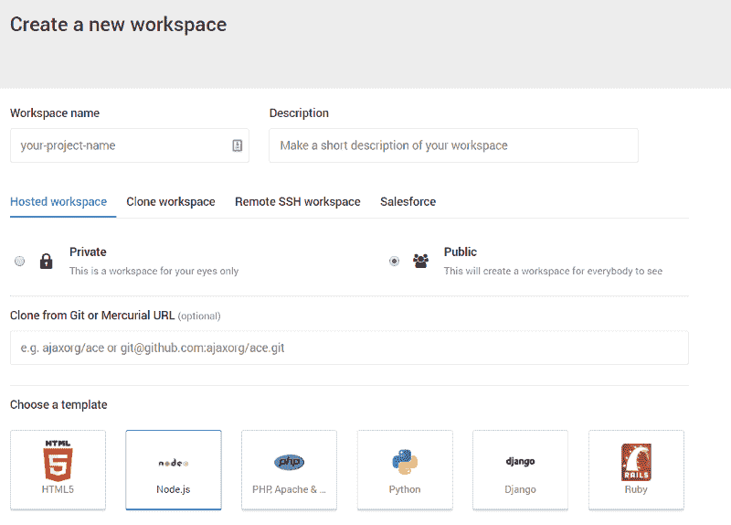
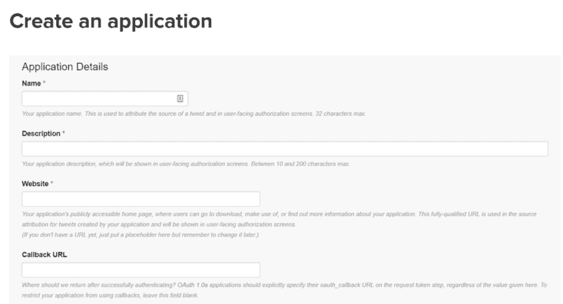
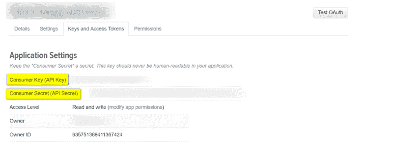
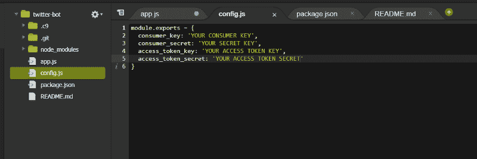
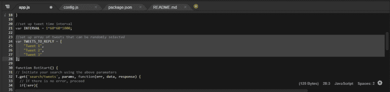

# 我如何运用我的编码技能让一家航空公司替换掉我丢失的婴儿车

> 原文：<https://www.freecodecamp.org/news/how-i-used-my-programming-skills-to-buy-a-stroller-2778cb85e8b2/>

依利塔维兹

# 我如何运用我的编码技能让一家航空公司替换掉我丢失的婴儿车


去年夏天，我的妻子和我们的两个孩子从匈牙利飞到加利福尼亚看望朋友。除了其他复杂情况，我们的航空公司在途中丢失了我们小家伙的婴儿车。

在无数次试图通过电子邮件、推特、友好的电话——然后是愤怒的电话——联系航空公司以支付我们的费用失败后，我受够了。我决定更进一步。

所以我做了一个推特机器人，回复航空公司账户上的每一条推文，提醒他们我们的案子，当时已经悬而未决三个多月了。

我这样做决不是为了报复或勒索金钱。我希望他们能公平对待我们，并赔偿一个孩子丢失的婴儿车的费用。

到目前为止，我已经学习编程一年了，并且充分利用了 [freeCodeCamp 社区](https://medium.freecodecamp.org/)来获得支持和灵感。

所以，我是这样做的:

1.  我创建了一个新的 **Cloud9 开发**环境
2.  我创建了一个推特账户
3.  我用 Node.js 创建了一个简单的 Twitter 机器人
4.  我将它配置为,这样它每小时会随机发送十条提醒信息中的一条
5.  然后我启动了机器人

一个半星期后，钱到了我的账户上，我买了一辆新的婴儿车。

我把我所有的代码都放在了这个 GitHub 库上，以防你遇到类似的情况。我是这样做的。

### 步骤 1:创建一个新的 Cloud9 IDE 环境:

前往 [Cloud9](http://c9.io) 并创建一个新的工作区。



Create a new workspace using and select the Node.js template

如果您想复制我的机器人，只需在您的终端中输入以下行来克隆我的存储库:

`git clone [https://github.com/krizsoo/twitterbot](https://github.com/krizsoo/twitterbot)`

### 第二步:创建一个 Twitter 账户和一个 Twitter 应用

如果你还没有 Twitter 账户，[继续创建一个](https://twitter.com/signup)。注册后，您可以创建一个新的应用程序，它将允许您访问 Twitter 的 API 并以编程方式生成 tweets。



我的应用程序一设置好，我就取回了访问 API 所必需的四个安全密钥:



*   消费者密钥(API 密钥)
*   消费者秘密(API 秘密)
*   访问令牌
*   访问令牌秘密

以上所有键都应该通过以下方式添加到 config.js 文件中:



### 步骤 3:配置 Twitter 机器人

我必须做一些初始配置，以确保机器人会做它应该做的事情。

#### **1。安装 Node.js 依赖关系**

```
npm install --save twitter
```

#### **2。设置搜索查询**

这是定义搜索查询的重要一步，机器人会将 tweeted 返回到这个搜索查询。我去了“app.js”文件，更新了搜索参数。

*   `q`代表关键字。
*   `count`表示查询应该返回的 tweets 的数量。
*   `result_type`代表排序逻辑，在我们的例子中，它首先显示最近的一个。
*   `lang`代表语言(例如英语)。

下面的配置会自动回复包含“@freecodecamp”的最新推文

```
// Set up your search parametersvar params = {  q: '@freecodecamp',  count: 1,  result_type: 'recent',  lang: 'en'}
```

### **步骤#4:配置推文**

由于机器人每小时运行一次，我不希望它一遍又一遍地发同样的消息。因此，我创建了一个大约十条推文的数组，机器人每次都会随机选择一条。

```
//set up array of tweets that can be randomly selectedvar TWEETS_TO_REPLY = [    "This is the first version of my tweets",    "This is the second",    "Tweet 3 where is my stroller?"];
```

> **编辑:**正如[乔尼·阿斯马尔](https://www.freecodecamp.org/news/how-i-used-my-programming-skills-to-buy-a-stroller-2778cb85e8b2/undefined)在下面指出的，确保你不要在你的回复中提到任何人，因为这违反了 Twitter 的服务条款。



### **步骤#5:配置推文频率**

最后，我设置机器人每小时运行一次。

首先，我创建了一个以毫秒表示一小时的变量:

```
//set up tweet time intervalvar INTERVAL = 1*60*60*1000;
```

然后，我确保启动了相应的机器人:

```
// Start bot and timerBotStart();setInterval(BotStart, INTERVAL);
```

### 步骤 6:启动机器人

一切配置完成后，我启动了机器人，耐心等待。

```
npm run serve
```

### 我从这一切中学到的是

令我惊讶的是，大约 24 小时后，一位客服代表终于回复了我。他们告诉我，他们已经开始转账。

一年前，我不会做这些事情。即使这是一件小事，但这次胜利对我来说意义重大。

这个故事是关于我如何在 2017 年学习编码，以及我如何在这个兼职项目中找到一些额外的灵感。我还没有以开发人员的身份开始新的职业生涯，但是在日常生活中有很多其他的方法可以利用你的编码技能。有些人甚至认为[编码已经成为第四种文化](http://code.org)。

希望对于所有开始学习如何编码的人来说，你也会在我的故事中找到一点灵感。在所有那些熬夜苦思编码挑战的夜晚，请记住，不管你是否会开始新的开发职业，理解计算机语言总有一天会有回报。

### 承认

没有 freeCodeCamp 社区，也没有 CS50 团队，这篇文章是不可能发表的。我感谢他们的支持。

此外，我很感谢[布兰登·莫雷利](https://www.freecodecamp.org/news/how-i-used-my-programming-skills-to-buy-a-stroller-2778cb85e8b2/undefined)和[斯科特·斯彭斯](https://www.freecodecamp.org/news/how-i-used-my-programming-skills-to-buy-a-stroller-2778cb85e8b2/undefined)编写了这些详细的 Twitter 机器人指南:

[**只用 38 行代码用 Node.js 搭建一个简单的 Twitter Bot**](https://codeburst.io/build-a-simple-twitter-bot-with-node-js-in-just-38-lines-of-code-ed92db9eb078)
[*教程不必复杂。我们将一起用 Node.js 在短短 38……*codeburst . io](https://codeburst.io/build-a-simple-twitter-bot-with-node-js-in-just-38-lines-of-code-ed92db9eb078)[**为什么你应该拥有自己的 Twitter 机器人，以及如何在不到 30 分钟的时间内构建一个机器人**](https://medium.freecodecamp.org/easily-set-up-your-own-twitter-bot-4aeed5e61f7f)
[*更新 20171102:自从这个故事最初在 2017 年 1 月发布以来，有一些事情已经……*medium.freecodecamp.org](https://medium.freecodecamp.org/easily-set-up-your-own-twitter-bot-4aeed5e61f7f)