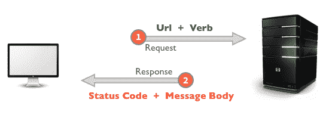
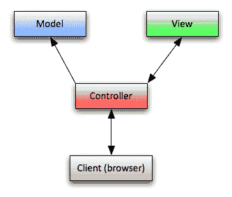
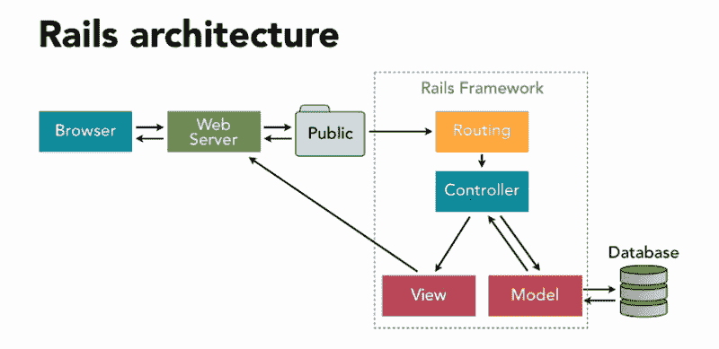

# 理解 Ruby on Rails 的基础:HTTP、MVC 和 Routes

> 原文：<https://www.freecodecamp.org/news/understanding-the-basics-of-ruby-on-rails-http-mvc-and-routes-359b8d809c7a/>

在学习了你的 [**第一种编程语言**](https://medium.freecodecamp.org/learning-ruby-from-zero-to-hero-90ad4eecc82d) 之后，你可能会问，编程可以做什么:AI/机器学习？硬件开发？移动应用？或者您可能想开始开发 web 应用程序！:)

在这里，我们将使用 Ruby on Rails web 框架来理解 web、路由和 MVC 架构是如何工作的。让我们深入网络世界。

在学习用 Rails 进行 web 开发之前，我真心推荐先学习一下[**Ruby**](https://medium.freecodecamp.org/learning-ruby-from-zero-to-hero-90ad4eecc82d)。

### 网络是如何工作的？

网络有很多层([应用层、TCP 层、互联网层、硬件层](https://web.stanford.edu/class/msande91si/www-spr04/readings/week1/InternetWhitepaper.htm))都是相互连接的。但基本上，它是通过 **HTTP** ( *超文本传输协议*)来工作的。

> **超文本传输协议** ( **HTTP** )是分布式、协作式、超媒体信息系统的应用协议。— [维基百科](http://en.wikipedia.org/wiki/Hypertext_Transfer_Protocol)

在*客户机-服务器*模型中， **HTTP** 的工作方式类似于*请求-响应*循环。

我们有一个网络浏览器(例如谷歌浏览器)。于是我们键入`www.google.com` URL，*客户端*向*服务器*提交 *HTTP* *请求*(请求消息)。*服务器*返回 *HTTP 响应*(响应消息——在这种情况下，响应是来自 Google 网站的 HTML)。

*客户端*发出*请求*，并接收来自*服务器*的*响应*。客户端处理 UI 和用户交互。在服务器上，我们可以存储和检索数据(在数据库上)，在后台处理逻辑(工人/作业)，以及许多其他事情。

如果你想深入了解，我给你推荐一些资源。我是 Preethi 的超级粉丝。这里有一系列的 **3 部分**:

*   [网络开发新手入门](https://medium.freecodecamp.org/how-the-web-works-a-primer-for-newcomers-to-web-development-or-anyone-really-b4584e63585c)
*   [客户-服务器模式&网络应用的结构](https://medium.freecodecamp.org/how-the-web-works-part-ii-client-server-model-the-structure-of-a-web-application-735b4b6d76e3)
*   [HTTP &休息](https://medium.freecodecamp.org/how-the-web-works-part-iii-http-rest-e61bc50fa0a)

### MVC 架构和 Rails 路线

现在我们已经了解了 Web 是如何工作的，我们将学习 MVC 架构和 Rails 路线。

MVC 代表模型、视图和控制器。

在这个架构上，我们在*模型、*视图和*控制器之间有*关注点*的分离。*每个部分都有自己的职责。让我们深入了解每一部分。

#### 模型

> 维护对象和数据库之间的关系，并处理验证、关联和事务

这意味着模型将保持与数据库的极端关系。每个模型(可以)代表一个数据库表(在 SQL 数据库的情况下)。这个模型对象获得了从数据库表中检索、保存、编辑和删除数据的能力(继承自 *ActiveRecord —* Rails 类)。我们使用模型对象作为应用程序和数据库之间的一层。

除了与数据库的关系之外，*模型*可以创建模型之间的*和 ***关联*** 。*

#### *视角*

> *"以特定格式显示数据，由管制员决定显示数据而触发."*

*这是请求响应的表示*。*这个演示可以是一堆格式类型: *PDF，HTML，JSON* 等。视图的最终结果可能是用户界面(UI)，它是“客户端”的一部分*

*对于 web 上的大多数页面，视图将是一个用 CSS 和 JS 样式的 HTML。但是我们可以在[旅游数字产品](https://www.worldpackers.com/)上实现用户行为的 pdf，向所有员工展示人们如何使用他们的网站。*

#### *控制器*

> *应用程序中的工具，用于引导流量，一方面查询模型以获取特定数据，另一方面将数据组织(搜索、排序)成适合给定视图需求的形式*

*控制器是*“大师”*它负责流程:使用模型进行查询、解析数据，并决定以何种格式呈现数据。*

**

### *Rails 应用程序上的 MVC 和 Routes 循环*

*想象一下，我们在一家旅游初创公司工作。该产品的一部分是向旅行者展示一份关于旅游故事和提示的[列表。](https://www.worldpackers.com/articles)*

*站在旅行者的角度想想。你进入`[www.worldpackers.com/articles](http://www.worldpackers.com/articles)`，你会看到一个漂亮的页面，上面列出了一堆很棒的文章。*

*当您在浏览器中键入此 URL 时，它会向服务器发出请求。在服务器中，我们有 Rails web 应用程序。Rails 路由器验证是否有条目匹配所请求的 URL。*

*我们只需要为这条线路配置路由:*

*这将为文章创建 RESTful 路径。如果我们运行`bundle exec rake routes`，它将显示创建的路径列表。*

*HTTP 动词可以是`GET`、`POST`、`PATCH`、`PUT`或`DELETE`。我们知道 Rails 如何将每个`PATH`映射到右边的`controller`和`action`。点击阅读更多[。](http://guides.rubyonrails.org/routing.html)*

*在我们的例子中，服务器将接收到作为 HTTP 动词的`/articles`路径和`GET`。它会映射到`ArticlesController`和`index`的动作。*

*在 ***控制器*** `ArticlesController`中我们使用 ***模型*** `Article`来获取数据库中的所有文章，并将 ***视图*** `index.html.erb`渲染为*服务器响应*(UI)。*

*按照惯例，这个控制器将在`views/articles/index.html.erb`中呈现视图。基本上，它是一个由 Ruby 支持的普通 HTML 文件。*

*Rails 请求-响应周期是您开始学习 web 开发时需要理解的第一个概念。*

*用户进行填充(向服务器请求)，Rails 应用程序让路由器将 URL 路径映射到正确的控制器。在控制器中，我们可以对一个模型(或多个模型)做所有的事情——意味着获取、保存、编辑、删除数据——并向用户呈现一个视图。*

### *仅此而已！*

*我们在这里学到了很多。我希望你们喜欢这些内容，并更多地了解 MVC 架构和路由在 Rails 上是如何工作的。*

*在我学习和掌握 Rails 和 web 开发的旅程中，这又向前迈进了一步。你可以在我的 [**文艺复兴开发者出版物**](https://medium.com/the-renaissance-developer) 上看到我完整旅程的文档。*

*如果你想要一个完整的 [Ruby](https://onemonth.com/courses/ruby?mbsy=lG6tt&mbsy_source=97541b09-e3ab-45d7-a9b1-dbc77028e008&campaignid=33446&discount_code=TKRuby1) 和 [Rails](https://onemonth.com/courses/rails?mbsy=lG6tz&mbsy_source=d2442db6-e764-401a-a394-a9c081468830&discount_code=TKRuby1&campaignid=33448) 课程，学习真实世界的编码技能和构建项目，试试 [***一个月 Ruby boot camp***](https://onemonth.com/courses/ruby?mbsy=lG6tt&mbsy_source=97541b09-e3ab-45d7-a9b1-dbc77028e008&campaignid=33446&discount_code=TKRuby1)*和[***Rails boot camp***](https://onemonth.com/courses/rails?mbsy=lG6tz&mbsy_source=d2442db6-e764-401a-a394-a9c081468830&discount_code=TKRuby1&campaignid=33448)。那里见，☺**

**玩得开心，继续学习，继续编码。**

**我的[Twitter](https://twitter.com/LeandroTk_)&[Github](https://github.com/LeandroTk)。☺**