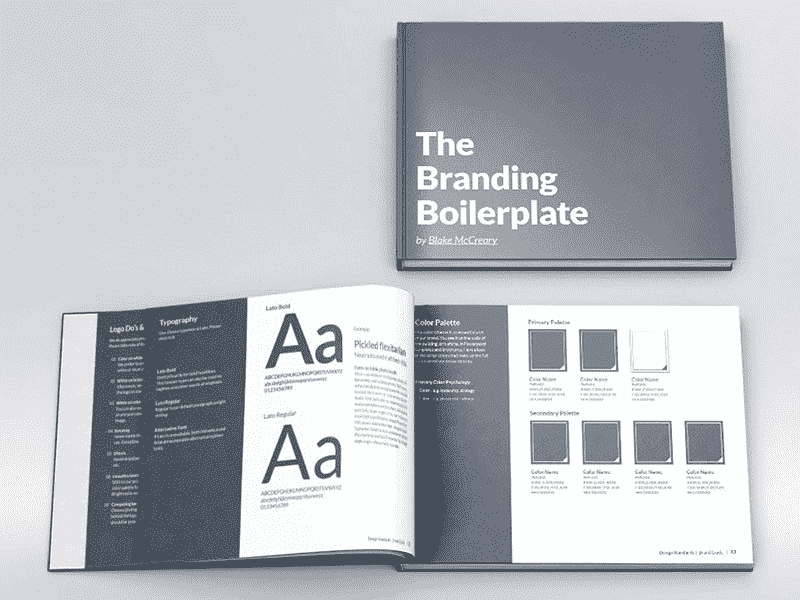
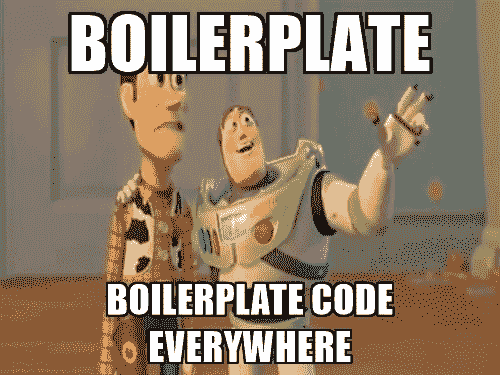
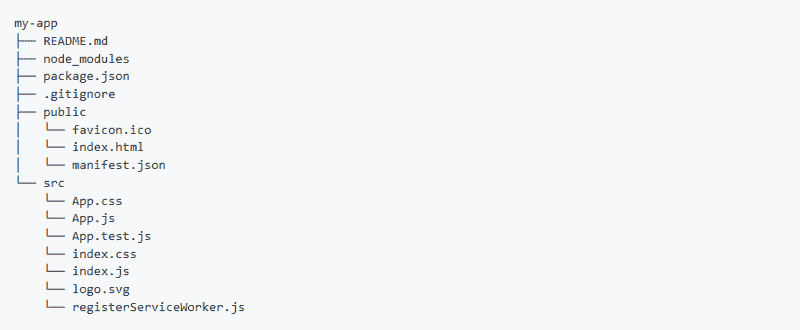
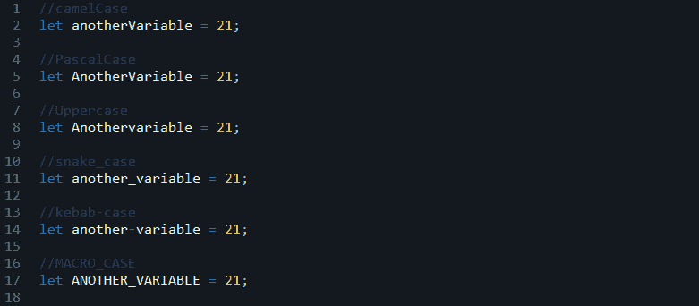
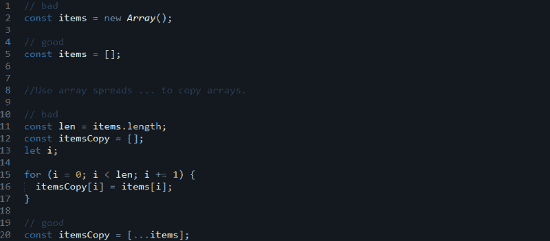
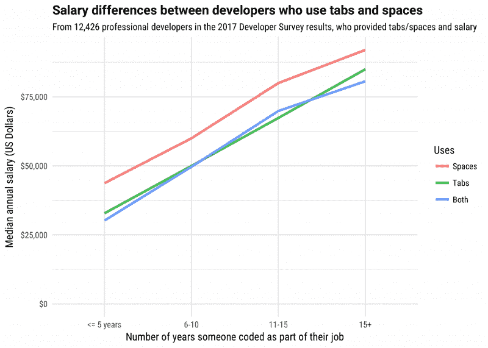

# 什么是样板文件，我们为什么要使用它？编码风格指南的必要性

> 原文：<https://www.freecodecamp.org/news/whats-boilerplate-and-why-do-we-use-it-let-s-check-out-the-coding-style-guide-ac2b6c814ee7/>

通过会见扎维里

# 什么是样板文件，我们为什么要使用它？编码风格指南的必要性



在信息技术中，样板文件是一种可以重复使用而不需要修改的写作单位。通过扩展，这种思想有时被应用到可重用的编程中，如“样板代码”

法律协议，包括软件和硬件条款和条件，大量使用样板文件。

例如，一名律师可能会给你一份五页的合同供你签署，但合同的大部分内容都是样板文件——这意味着对每个拿到合同的人来说都是一样的，只有几行在这里和那里有所变化。

在计算机编程中，**样板代码**或**样板代码**指的是必须包含在许多地方的代码段，这些代码段几乎没有或根本没有改动。当提到被认为*冗长的*语言时，经常会用到它，也就是说程序员必须写很多代码来做最少的工作。

例如，在 web 开发中，HTML 的简单样板文件如下所示:

```
<!DOCTYPE html>                       <html class="no-js" lang="">                           <head>                                 <meta charset="utf-8">                                 <meta http-equiv="x-ua-compatible" content="ie=edge">         <title></title>                                 <meta name="description" content="">                           <meta name="viewport" content="width=device-width, initial- scale=1, shrink-to-fit=no"> <link rel="stylesheet" href="css/main.css"></head>                           <body>                                 <p>Hello world! This is HTML5 Boilerplate.</p>               <script src="js/vendor/modernizr-{{MODERNIZR_VERSION}}.min.js>     </script>
```

```
 </body></html>
```

您可以在此处查看整个存储库:

[**h5bp/html 5-样板**](https://github.com/h5bp/html5-boilerplate)
[*html 5-样板-用于构建快速、健壮、适应性强的 web 应用或网站的专业前端模板。*github.com](https://github.com/h5bp/html5-boilerplate)

在 19 世纪 90 年代，样板文件实际上是用金属铸造或压印的，准备印刷，并分发给美国各地的报社和公司。直到 20 世纪 50 年代，成千上万的报纸收到并使用这种来自美国最大的供应商西方报业联盟的样板文件。一些公司还把新闻稿作为样板文件发出，这样它们就必须照写不误。



大多数专业的 web 开发人员已经创建了一个资产和代码片段的集合，他们在项目中重用这些资产和代码片段来加速开发。所有网站都有一些通用或接近通用的模式。大多数开发人员从复制他们用于类似项目的代码开始，然后开始修改它，而不是不断地重新构建它们。

一些开发人员认识到这些样板初学者模板的价值，并花时间使样板更加通用，并在线共享给其他人使用。

这不仅仅局限于 web 开发。随着越来越多的框架和库的出现，它被用在 AI/ML 之外。

#### 大型项目样板文件的必要特征(生产就绪)

*   好的、可读的文档？
*   具有更深抽象层次的代码结构
*   遵循适当的编码标准
*   具有 CLI 工具(用于快速原型制作和设置)
*   可扩展？
*   简单的测试工具
*   必要的 API 模块
*   支持国际化和本地化？
*   代码分割
*   用于安装的服务器和客户端代码
*   正确的导航和路由结构？

在所有这些最低规格之后，您应该开始编辑和修改代码，以便构建您的项目。

有些大型科技公司甚至建立了自己的样板文件。他们一直将它用于各自的或类似的项目。

react.js 的样板文件就是一个很好的例子:

[**react-boilerplate/react-boilerplate**](https://github.com/react-boilerplate/react-boilerplate)
[*react-boilerplate-:fire:一个高度可扩展的、离线优先的基础，具有最好的开发者体验和重点…*github.com](https://github.com/react-boilerplate/react-boilerplate)

#### 小型项目的样板文件(脚手架)

这些类型的样板文件通常是一种“初学者工具包”，或者用专业的方式称之为“脚手架”。他们的主要目标用户是开发新手或新的早期用户。

它通过创建只对新项目必要的元素来关注快速原型。这些需要较少的功能，并且不能随着时间和项目而扩展。

他们的代码结构没有太多扩展，并且不涉及更深的抽象层，因为用户只需要构建核心功能。这消除了对额外工具的需要。



Code structure

最简单的例子是脸书的 create-react-app 样板文件:

[**facebookincubator/Create-react-app**](https://github.com/facebookincubator/create-react-app)
[*Create-React-app-创建无构建配置的 React 应用。*github.com](https://github.com/facebookincubator/create-react-app)

### 样板文件和模板有什么区别？

正如约阿希姆·彭斯(Joachim Pense)明确指出的那样，**样板文件(boilerplate)**是你复制粘贴并添加到文档中的东西。它最常出现在使用和重复使用语言的合同中，阐明诸如条件和警告之类的事情。

编剧用**模板当模特**，有时会有负面效果。从广义上讲，模板是用于创建新对象的模型或模式。在写作中，它是一种类似于简历的**标准化形式，作家可以用它来充实自己的版本。**

与样板文件不同，模板适用于特定的用途。当学生们在简历中使用 Word 模板时，问题就出现了，他们最终看起来都一样。

如果使用不当，模板和样板文件都会使商务写作变得生硬和做作。

### 编写代码的风格指南

不管你是否在使用样板文件，公司在编写代码时都会遵循一些标准。其中之一就是**风格指南。**它试图解释各种公司或组织中使用的基本风格和模式。一般来说，员工必须采用他们公司的编码风格指南。



风格指南描述了大量编写代码的规则，如制表符和空格的缩进、变量和函数的命名、编写必要的注释、格式、源文件结构、使用正确的数据结构方法、避免提升、作用域、控制语句等等。



编程风格通常以可读性为目标来处理源代码的视觉外观。自动格式化源代码的软件早就有了，让编码人员专注于命名、逻辑和更高级的技术。

实际上，使用计算机格式化源代码可以节省时间，而且有可能在没有[争论](https://en.wikipedia.org/wiki/Flaming_(Internet)#Holy_Wars)的情况下执行全公司的标准。(来源——维基)。

这些是一些常见的争论，比如: **Tabs v Spaces 圣战**，**选择完美的代码 IDE** 等等。有趣的是，你可以参与这些大多发生在 [**Reddit**](https://www.reddit.com/r/programming/comments/2ban9r/the_great_white_space_debate/) **的辩论。**你也可以参加一些[**stack overflow**](https://stackoverflow.com/)Q&A 的。



source — [https://stackoverflow.blog/2017/06/15/developers-use-spaces-make-money-use-tabs/](https://stackoverflow.blog/2017/06/15/developers-use-spaces-make-money-use-tabs/)

对于 web 开发者来说，JS 最常见的风格指南是 **Airbnb 的 javascript 风格指南。**它是开源的，每个人都可以贡献。

[**Airbnb/JavaScript**](https://github.com/airbnb/javascript)
[*JavaScript-JavaScript 风格指南*github.com](https://github.com/airbnb/javascript)

如果有人对 Javascript 为什么需要一个风格指南有疑问，那么请阅读由 **Airbnb** 的程序员 [Harrison Shoff](https://twitter.com/hshoff) 给出的第二个答案。

[**JavaScript 为什么需要样式指南？第 102 期 Airbnb/javascript**](https://github.com/airbnb/javascript/issues/102)
[*关于 JavaScript 社区，我最喜欢的一点是，人们选择用如此多不同的方式来编写它……*github.com](https://github.com/airbnb/javascript/issues/102)

以下是一些当今较为流行的语言的风格指南:

[**. net 代码格式化程序**](https://github.com/dotnet/codeformatter)

[**Java:Google-Java-Format**](https://github.com/google/google-java-format)

[**Javascript 标准样式**](https://standardjs.com) **(不同于 airbnb 的 javascript)**

[**PHP 编码标准 Fixe** r](http://cs.sensiolabs.org)

[**Python:谷歌的 YAPF**](https://github.com/google/yapf/)

[**Ruby: Rubocop**](http://rubocop.readthedocs.io/en/latest/)

#### 更多来自样板文件:面向对象的概念

在[面向对象的程序](https://en.wikipedia.org/wiki/Object-oriented_programming)中，类经常被提供有[获取和设置](https://en.wikipedia.org/wiki/Mutator_method)实例变量的方法。这些方法的定义经常被认为是样板文件。

虽然代码会因类而异，但它在结构上足够典型，自动生成比手工编写更好。

例如，在下面代表宠物的 [Java](https://en.wikipedia.org/wiki/Java_(programming_language)) 类中，除了*宠物*、*名字*和*主人*的[声明](https://en.wikipedia.org/wiki/Declaration_(computer_science))之外，几乎所有代码都是样板文件:

```
public class Pet {    private String name;    private Person owner;
```

```
public Pet(String name, Person owner) {        this.name = name;        this.owner = owner;    }
```

```
public String getName() {        return name;    }
```

```
public void setName(String name) {        this.name = name;    }
```

```
public Person getOwner() {        return owner;    }
```

```
public void setOwner(Person owner) {        this.owner = owner;    }}
```

如今，样板定义在许多其他编程语言中变得越来越全球化。它来自于 OOP 和曾经是过程化的但已经成为 OOP 的混合语言。他们现在有相同的目标，即重复你用模型/模板/类/对象构建的代码，所以他们采用了这个术语。您创建了一个模板，您为模板的每个实例所做的唯一的事情就是单独的参数。

这部分就是我们所说的样板文件。您只需重用您创建了模板的代码，但是使用不同的参数。

#### 作为 API 的样板

因为你只是用不同的参数重用模板代码，这意味着我们可以构建可重用的 API，只需要改变输入和输出。

### 结论

“样板代码”是任何看似重复的代码，它们一次又一次地出现，以获得看起来应该更简单的结果。

我写这篇文章是因为最近一个团队领导指示我学习可能适合我们项目的各种样板文件。所以我不得不继续寻找完美的样板。

任何类型的反馈都将不胜感激！快点！