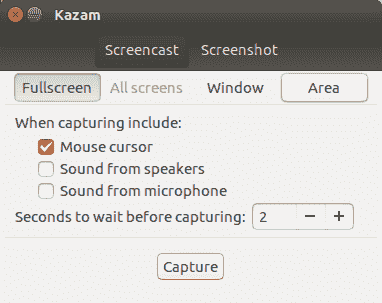
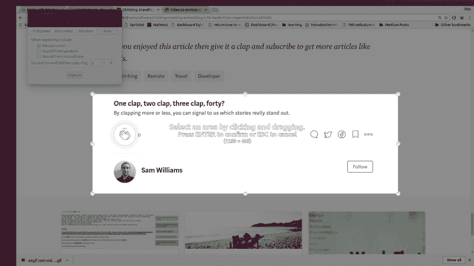
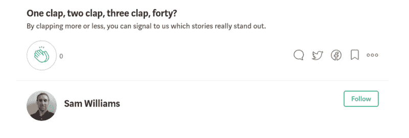

# 想在媒体上获得更多掌声和关注者吗？以下是如何在 5 分钟内设计你自己的“跟我来”GIF

> 原文：<https://www.freecodecamp.org/news/want-more-claps-and-followers-how-to-make-a-clap-me-gif-in-5-minutes-db85a24950f6/>

我读过一篇文章，讲的是添加一张展示如何点赞和订阅的 GIF 图如何极大地增加了读者的行动。当我第一次读它的时候，我认为它太难了，所以我从来没有尝试过。

嗯，我最近开始使用屏幕记录器制作视频教程，不知道我是否也可以制作 GIF。

结果证明这是一个非常简单的任务。

首先要做的是记录拍手和跟随动作。我在 Ubuntu 上工作，用 Kazam 进行屏幕录制。如果你在 Linux 上工作，我建议你也这样做。它有一个非常有用的“记录区域”功能。

```
sudo apt install kazam
```

安装完成后，打开它。它有一个非常简单的用户界面，甚至更容易使用。要测试它，选择“区域”，然后它会提示您选择一个区域。突出显示一个随机区域，并按回车键确认。现在你可以开始录音了。



点击“捕捉”按钮，然后倒计时将开始。在该区域内移动鼠标或点击某个东西，这样该区域就会改变。完成后，点击屏幕右上角的录制图标，然后“停止录制”。点击返回到 Kazam，你会被询问是否要编辑或保存。我们会保存我们的剪辑。然后，您可以查看它以检查一切是否正常。

### 记录媒体拍手跟从

如果你进入你自己的一个帖子，你不能为自己鼓掌或订阅，所以我们需要创建第二个帐户。一旦登录到第二个帐户，搜索你的一篇文章，并滚动到“鼓掌和订阅”部分。

回到 Kazam，选择 clap 周围的区域并订阅。如果它给你一个小于 1000x300 的捕获大小，然后缩放浏览器。拥有更高分辨率的视频意味着你可以获得更大的 gif，这很重要，因为你不能增加中等图像(或 gif)的大小。



现在，您需要再次遵循记录流程。

*   开始录音。
*   等待倒计时。
*   单击鼓掌按钮，然后单击订阅按钮。
*   保存录音。

如果你想重新录制视频，你可以取消订阅，调用掌声(使用右边的三个点)，然后再试一次。

### 视频转 GIF

网上有很多将视频转换成 GIF 的服务，但我用的是 EZ GIF。你可以很容易地上传、剪辑和转换视频为 GIF 格式。

转换为 GIF 时，请确保选择高分辨率。我喜欢“自动 x 480”或者“1200 x 300”。

### 给你玩 GIF

现在你有了自己的 GIF 来添加到所有帖子的末尾。



如果你为任何出版物写作，那么你也可以为这些文章写作。


接下来-> [这些是你在求职面试中想问的问题](https://medium.freecodecamp.org/vital-questions-to-ask-an-interviewer-bonus-question-at-the-end-264bc2caff8d)。

如果你觉得这个教程有用，你知道现在该做什么。点击“鼓掌”按钮，关注我，在你的 feed 上获得更多的文章和教程。

