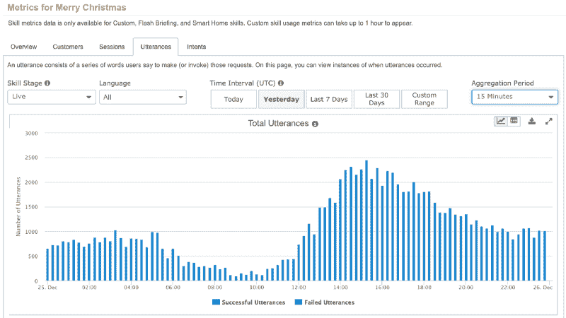
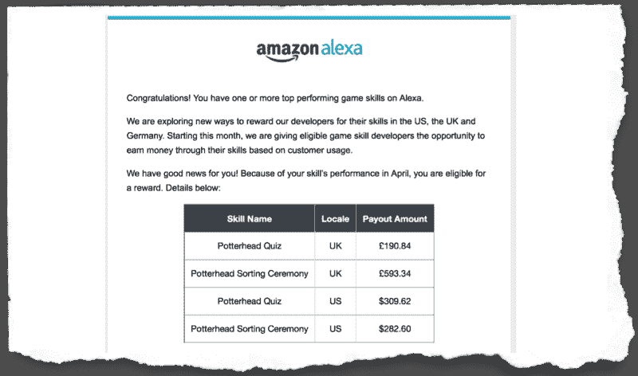
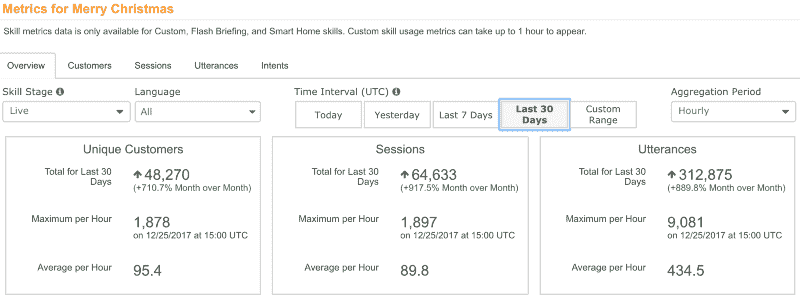
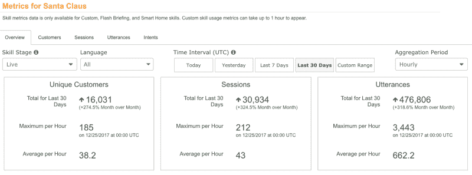
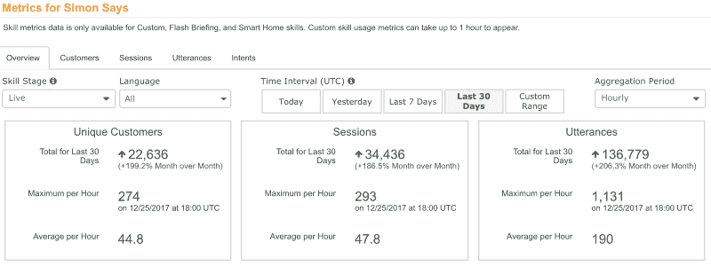
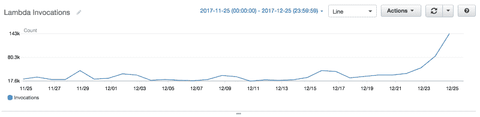
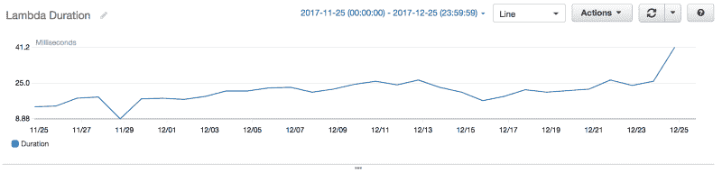
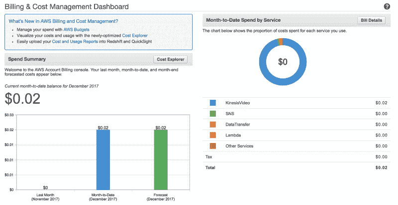
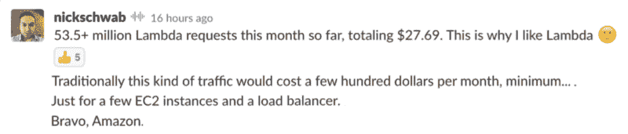

# 无服务器如何将一个想法扩展到每月 10 万用户——零成本

> 原文：<https://www.freecodecamp.org/news/how-serverless-scales-an-idea-to-100k-monthly-users-at-zero-cost-160b41557b94/>

#### 消除摩擦，向客户体验靠拢，向技术的功能价值靠拢

在 AWS Lambda 函数中开发 Amazon Alexa 技能是展示“无服务器”能力的一种简单方式。

在一个小时内，你可以设计、开发并在 Amazon.com 市场上部署 Alexa 技能——与数百万消费者即时接触。

在过去的几年里，我开发了一些简单的 Alexa 技能来试验 AWS Lambda 和探索 Alexa 技能包。一路走来，一些技能甚至产生了足够多的客户，有资格从亚马逊的激励计划中获得每月支付。

大部分工作涉及到编写表达业务逻辑的 AWS Lambda 函数——使用您选择的流行语言，如 Node.js 或 Python。首先，Amazon Alexa 团队在他们的 GitHub 库中提供了各种各样的[样本模板，让事情变得非常简单。](https://github.com/alexa/)

随着 AWS 完成大部分无差别基础设施的繁重工作，您可以将注意力集中在实际的产品、营销和客户获取上。对于一项 Alexa 技能，你的结果很容易通过独特客户的数量和他们的互动次数来衡量。

#### 亚马逊 Alexa 指标

在 12 月份，我的几个定制 Alexa 技能——都是基于在一个帐户中运行的 AWS Lambda 功能——在短短 30 天内总共达到了 10 万以上的用户。

以下是其中一些技能的 30 天衡量标准，包括圣诞快乐和圣诞老人——以及云计算狂热分子的最爱[西蒙说](https://www.amazon.com/Drew-Firment-Simon-Says/dp/B01NBLMM84/)。每个技能的数据都可以在 Alexa 开发者控制台中直接访问。

#### AWS Lambda 指标

那么，大量的客户、会话和交互如何转化为 AWS Lambda 函数的底层利用呢？

在同样的 30 天时间里，Alexa 技能调用相关的 AWS Lambda 函数超过 100 万次。

所有的 Lambda 函数都共享同一个 AWS 帐户——每个函数都分配了 512MB 的内存，并配置了 7 秒的超时。如果需要，AWS 提供了更多的杠杆来准备你的 Alexa 技能。

在 30 天的时间里，没有一个函数因为调用率超过并发限制而被节流。这些函数的平均调用持续时间为 25 毫秒。

#### 无服务器的成本

托管 12 个 Alexa 技能，在 30 天内通过 100 万次函数调用连接超过 10 万个独立用户，需要多少成本？*零。一无所获。没有。*

AWS 每月为开发人员提供 100 万个请求和 400，000 GB 秒的计算时间，而且是免费的。我的函数的内存大小设置为 512MB，这相当于每月 800K 空闲层秒。

这是我个人 AWS 账户 12 月份的发票:

同一时期发生的唯一成本是 0.02 美元的巨额成本——试验新的 AWS Kinesis 视频流服务的高昂成本[。](https://twitter.com/drewfirment/status/939567539734175744)

那么，如果你的 Alexa 技能像病毒一样传播，对 AWS Lambda 服务的请求超过 100 万，会发生什么？此后，每 100 万次请求，你将获得 0.20 美元的费用——很容易被提供给 Alexa 开发者的[100 美元促销积分](https://developer.amazon.com/alexa-skills-kit/alexa-aws-credits)所吸收。

无服务器技术的经济性也适用于最常用的 Alexa 技能。例如，即使每天有超过 5000 万个 Lambda 请求服务于 17.5 万个用户*，*由[尼克·施瓦布](https://twitter.com/nickschwab)开发的[睡眠声音](http://invokedapps.com/)应用程序每月产生不到 30 美元的节俭账单。

#### 无摩擦创新的价值

领先的初创公司和企业的软件工程师正在部署无服务器架构，以最小的摩擦和可忽略的成本将创新的产品理念转化为可消耗的价值。

AWS Lambda functions 等无服务器技术是无摩擦创新的关键推动因素，让您能够更轻松地将产品和服务部署和扩展到全球客户群手中。

尽管有明显的商业优势，但关于采用无服务器技术的价值，似乎仍有许多争论和恐慌。不要相信 FUD——恐惧、不确定和怀疑。

> 采用[#无服务器](https://twitter.com/hashtag/serverless?src=hash&ref_src=twsrc%5Etfw)技术时的恐惧、不确定、怀疑阶段[#无服务器](https://twitter.com/hashtag/serverlessconf?src=hash&ref_src=twsrc%5Etfw)[# FUD](https://twitter.com/hashtag/FUD?src=hash&ref_src=twsrc%5Etfw)[pic.twitter.com/x1Pl7oSKrK](https://t.co/x1Pl7oSKrK)
> 
> — Drew at #AWSPSSummit (@drewfirment) [October 28, 2016](https://twitter.com/drewfirment/status/791913696918286336?ref_src=twsrc%5Etfw)