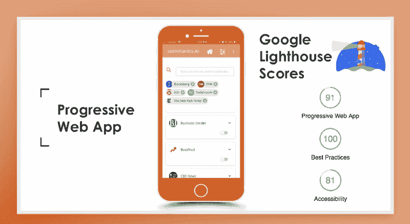
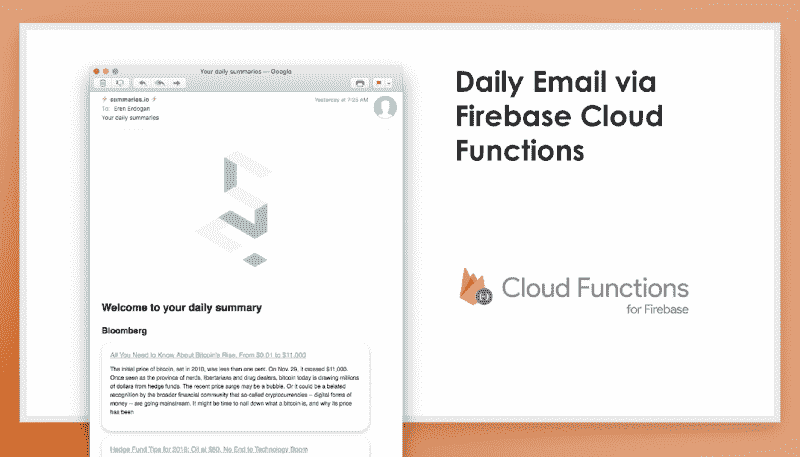
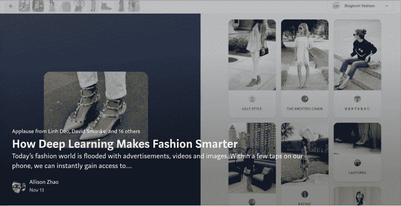
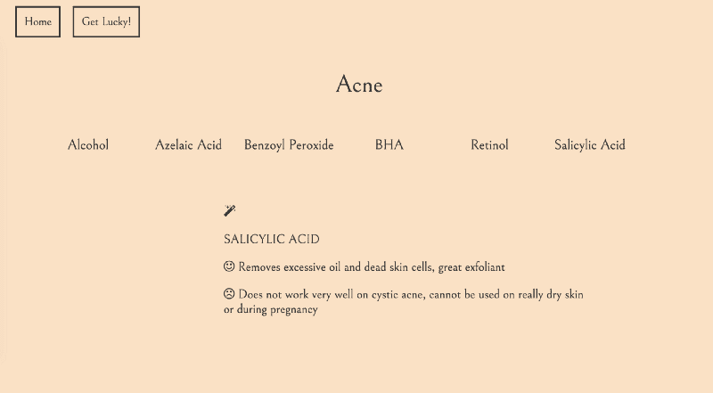
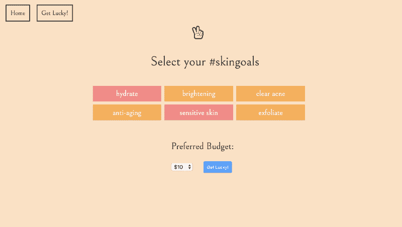

# 精英训练营毕业意味着什么？

> 原文：<https://www.freecodecamp.org/news/what-does-it-mean-to-graduate-from-an-elite-bootcamp-397effebd62e/>

作者:艾莉森·赵

# 精英训练营毕业意味着什么？

在纽约的编码训练营呆了 17 周后，我终于可以称自己为全栈软件开发者了。

这是我一年多前大学毕业以来一直梦想的一个头衔。但是在 4 个多月的时间里，我真正学到了什么？拥有非传统技术背景的我能给工作场所带来什么？课程是否与雇主寻找的技能相吻合？

我将分享我作为一名没有编程经验的学生从全日制训练营中学到的东西。

希望这篇文章将有助于正在进行的关于软件工程训练营的讨论，并帮助潜在的申请者和雇主了解更多关于训练营的毕业生。

我 2016 年大学毕业，音乐商科，辅修网页编程与应用。在训练营之前，我只为公司时事通讯写过简单的 HTML 和 CSS。我在网络广告服务技术方面也有一些经验(使用 Google DFP 进行广告交易，解决广告标签问题，以及与工程团队合作进行网站迁移)。

我花了两个月的时间学习编程基础，准备申请。该应用程序包括在线和现场编码练习。我是 8 月下旬录取的，12 月初毕业。

每个人的学习方式不同。我是根据自己的经历说的，不代表其他学生。我们有很大的自主权，下面提到的一些技术不是强制性的。

### 我每天都接受算法和数据结构的培训

算法和[大 O](https://en.wikipedia.org/wiki/Big_O_notation) 被看得很重。第一堂课是关于抽象数据类型、数据结构(链表、二分搜索法树、堆、散列表、图等)。)，以及排序算法(冒泡排序、归并排序、快速排序)。

后来，我们每天早上以面试官和被面试者的身份和其他学生一起练习技术面试。在每次面试中，我都被要求编写代码，并确定我的解决方案的时间和空间复杂性。我回答了这样的问题:

*   天真解的大 O 符号是什么？
*   O(n*m)是最优解吗？
*   在这里使用递归更有效吗？

除了关于运行时分析的培训，我们还学习了一些关于硬件的知识，比如数组如何在内存中表示以及 RAM 和 ROM 之间的区别。

### 我构建了许多流行应用程序的克隆版本

维基百科、Slack、Spotify、Twitter、游戏人生，应有尽有。每个应用程序都展示了令人兴奋的新技术(单页应用程序、套接字、flex-box 模型、API 等)。).尝试复制他们的核心功能非常有趣。

我们通过构建 Spotify 的前端克隆学习了 Intro to React 和 Redux。我们通过构建一个类似 Slack 的消息应用了解了 WebSockets 和 Socket.io。维基百科是它自己的野兽，在那里我们学会了使用 ORM (Sequelize)和编写验证后端功能的单元测试。

### 我从零开始构建 JavaScript 的过程中学到了重要的机制

例如，我们从头开始实现了我们自己的 A+风格的 Promise 库。这有助于我们更深入地理解用例行为和底层机制。

在介绍 Node.js 的过程中，我们构建了自己的功能 shell 提示符，它接受类似 Unix 的命令，通过 Node.js 进程运行这些命令，并生成可以通过管道传递给其他命令的输出。

### 我知道如何建立一个渐进式网络应用程序

对于我们的最终项目，我们有两周的时间在四人小组中构建一个我们感兴趣的应用程序。该项目可以分为以下几类:游戏、数据可视化、开发工具、教育工具和实时交互。

我和我的团队想走出我们的舒适区。我们想尝试项目中没有教授的最新技术。经过一些研究，我们决定建立一个渐进式的 web 应用程序，使用谷歌的云 Firestore 作为我们的数据库和人工智能服务，如谷歌的 TensorFlow，亚马逊 Polly 和 IBM Watson(我们最终使用的)。

(screenshot from our capstone project presentation)

### 我尝试了无服务器架构和云功能

我们的最终项目围绕无服务器架构展开。我们使用云数据库，并通过云函数实现我们的主要功能。由于我们之前没有经验，由于我们接触的 API 数量太多，一开始设置云函数是一件痛苦的事情。我们最终完成了功能的构建，并加深了对异步功能的理解。

(screenshot from our capstone project presentation)

### 我玩了深度学习和人工智能

我们的期末项目以自动生成的播客为特色。它让我们能够探索 IBM Watson、亚马逊 Polly 和谷歌 Tacotron (TensorFlow)。虽然我们没有足够的时间按照计划用摩根·弗里曼的声音训练我们自己的模型，但我们还是学到了很多。

(我还写了一篇关于[深度学习如何让时尚变得更聪明](https://hackernoon.com/how-deep-learning-is-making-fashion-smarter-b1d66eb664ad)的文章——如果你有兴趣，可以读一读！)

### 我非常支持探索副业和黑客马拉松

在为期 4 天的个人黑客马拉松中，我开发了一个类似 Tinder 的刷卡 web 应用，根据用户的食物偏好匹配用户，并获得了最佳用户界面/UX 设计奖。

All illustration of food by artist & illustrator, Kendyll Hillegas — check out her awesome [Etsy shop](https://www.etsy.com/shop/KendyllHillegas). Background image by Justin Wong. — check out her work on [Dribbble](https://dribbble.com/patternsandportraits)

我的另一个激情项目(仍在进行中)是一个护肤应用程序，帮助消费者了解护肤品中常用的活性成分的利弊。它还根据用户的护肤问题提供产品建议。

### 我喜欢自己构建一个完整的应用程序

全栈训练营最重要的目标是帮助你熟悉前端和后端技术。也就是说，还有很多东西要学，我永远不会对我已经掌握的技能感到满意。保持饥饿:)

### 我学到了软件之外的东西

成为一名有价值的软件工程师需要的不仅仅是编程技能。在这个项目中，我们有关于敏捷方法、精益创业以及如何应对无意识偏见的客座演讲。定期为学生举办女性午餐，分享作为女性或科技行业 LGBTQ 群体成员的经验。

### 我希望我能了解更多

17 周是很短的时间来学习成为一名优秀的软件工程师所需要知道的一切。我喜欢探索更多真实世界的 web 开发问题，比如 web 安全性、可伸缩性、系统设计、JavaScript 设计模式和整体架构。

> “这可能是你参加过的最难的项目。但它会改变你的生活。”

每天连续 10-12 个小时不停地编码并不容易，但我喜欢其中的每一分钟。训练营做得很好，把我扔进了深水区，同时确保我没有真的溺水。

凭借我所学到的一切和我结交的了不起的朋友，我强烈建议探索参加精英训练营的选择。

当然，精英训练营的入学要求和评估更加严格。这意味着更多的时间和精力花在准备入学面试上。但我向你保证，结果是有益的，改变了生活。你会觉得毕业后准备充分，以高超的技能探索工作机会。

总之，我希望你喜欢阅读这篇文章，并发现它是有帮助的。

如果你想了解更多或与我联系，请随时发表评论，给我发电子邮件到 allison@allisonzhao.com，或在 LinkedIn 上给我发消息。我目前也在寻找工作机会，并寻找令人兴奋的产品——打电话给我！

最后但同样重要的是，我要感谢我亲爱的朋友大卫和尼古拉斯的校对和编辑建议。