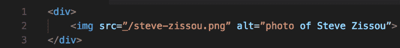
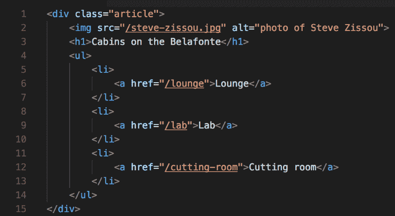
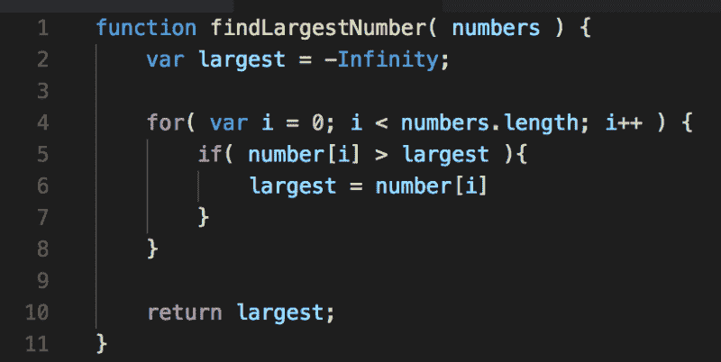
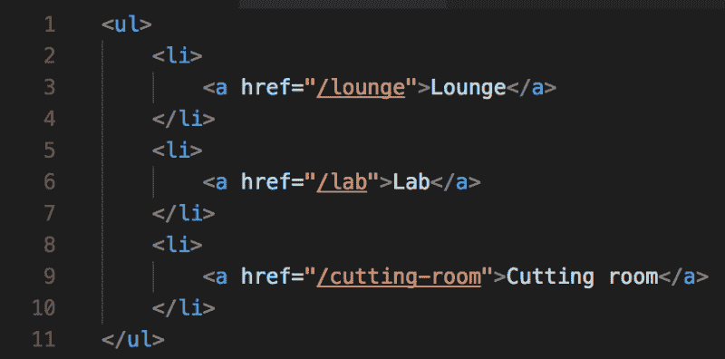
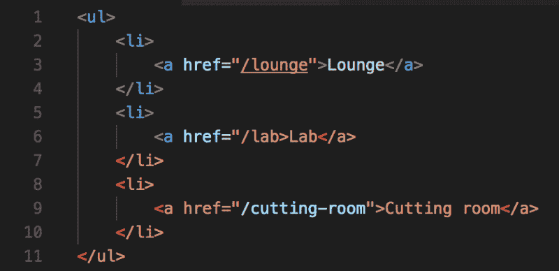

# 如何避免常见的初学者陷阱，像专业人士一样开始编码

> 原文：<https://www.freecodecamp.org/news/how-to-avoid-common-beginner-pitfalls-and-start-coding-like-a-pro-3de81c6affbe/>

作者:德米特里·格拉博夫

Photo by [rawpixel.com](https://unsplash.com/photos/PG3NsaGpY3s?utm_source=unsplash&utm_medium=referral&utm_content=creditCopyText) on [Unsplash](https://unsplash.com/?utm_source=unsplash&utm_medium=referral&utm_content=creditCopyText)

# 如何避免常见的初学者陷阱，像专业人士一样开始编码

学习编码是艰难的。我们都遇到过莫名其妙的错误和代码破解。可悲的是，这种经历是学习编码的一部分。您可以采取一些步骤来提高代码质量并防止常见错误。

### 避免复制粘贴代码

作为初学者，你将从重复中获得很多知识。这并不十分吸引人，但是当你第 100 次编写 for 循环时，你几乎可以不假思索地完成它。

你经常会试图复制和粘贴代码来省去打字的麻烦。你应该不惜一切代价避免它。您想要编写的代码和您正在复制的代码之间可能会有细微的差别。这可能会引入一个难以追踪的微妙错误。

> 当你复制代码时，你完全绕过了认知过程。

确保你尽可能多的理解你写的代码。当你复制代码时，你完全绕过了认知过程。即使您复制的代码确实如预期的那样工作，您也没有从粘贴它中学到什么。每次你完整地输入你的代码，你就会变得更加熟悉和舒服。

### 明智的名字

> 计算机科学只有两个硬东西:缓存失效和事物命名。

> —菲尔·卡尔顿

使用名词作为变量和属性名。尽可能使它们具有描述性。

始终使用完整的单词，避免缩写。不同的人可以用不同的方式解释缩写。这可能会使理解代码做什么变得更加困难。例如，`intlSize`可能意味着`internationalSize`或者`internalSize`。名字中的重要线索因为缩写而丢失。

当在代码库中引用相同的东西时，使用相同的名称。例如，避免在其他地方将`doorColour`称为`colourOfDoor`或`doorColor`。这将为您避免因使用错误的变量名而导致的错误。此外，一致性将节省您每次查找确切变量名的时间。

避免通用的、非描述性的名字，如`data`或`process`。它们可能意味着任何事情，并且不提供关于它们的目的的太多信息。

### 一致缩进

一致的代码缩进更容易发现潜在的错误。这是专业开发人员不假思索的做法。他们中很少有人谈论它，因为这对他们来说太明显了。然而，很少有教程强调使用一致缩进的重要性。

在下面的例子中，我们使用制表符缩进，但是空格也是可以接受的。关键是选择你想用的那一个，并坚持应用。不要在代码中混合使用制表符和空格。

那么正确的缩进是什么样的呢？每次在另一个标签中插入 HMTL 标签时，在新标签前添加一个新行和制表符以便缩进。当您关闭 HTML 标签时，添加一个新行并从缩进中删除一个制表符。

这里的内部标签是`img`标签。看到它是如何缩进一个制表符的吗？另外，请注意结束标签的左边缘如何与其开始标签的左边缘对齐。

当一个页面上有数百个标签时，这种方法变得非常重要。如果你已经正确地遵循了这个过程，你最后的结束标签应该与你的页面的左侧齐平。这可以方便地检查代码的正确性。

让我们看看如何使用缩进来找出丢失的标签。

看看上面的例子中，第 14 行的结束标记`div`和第 1 行的开始标记`div`是如何不对齐的？这是一个线索，表明有什么东西不见了。在这种情况下，我们错过了结束的`ul`标记。一旦我们添加了它，结束的`div`就和它的开始伙伴一致了

在编写 JavaScript 时，应该应用类似的方法。JavaScript 中没有标签，但我们有“大括号”或“花括号”。他们看起来像这样。每个左大括号必须有一个匹配的右大括号。它们用来表示代码块。每个大括号后面都应该有一个新行和一个制表符来缩进内容。右大括号应该在左侧与其对应的左大括号行的左侧对齐。

看看第 11 行的大括号是如何与第 1 行的左括号对齐的。类似地，线 4 与线 8 对齐，线 5 与线 7 对齐。

当应用正确时，缩进应该给你的代码一个干净的金字塔式的结构。这将更容易发现每个代码块的结束和开始位置。此外，丢失的大括号现在比分散在页面各处更容易被发现。

### 注意语法突出显示

现代的文本编辑器，比如 Sublime 或者 Visual Studio Code，会突出显示你的代码。

看到大括号、标记名、属性名和属性值都用相同的颜色突出显示了吗？

现在看看下面的代码。

看到持续的高亮显示是如何突然改变的了吗？用于表示属性值的橙色文本溢出了接下来的几行。这是一个巨大的线索，表明我们的代码出了问题。在本例中，这是因为我们错过了`href`属性值上的右引号。在没有代码高亮显示的情况下发现这样的错误是非常困难和耗时的。

开发人员很容易浪费几天的时间去寻找这样一个细微的错误。注意代码突出显示，以帮助您发现类似这样的错误。

### 成功会自己照顾自己

成为一名优秀的开发人员是对细节的关注和许多习惯的总和。

通过注意像缩进这样的小事，你会培养对结构和范围的欣赏。仔细思考函数和变量名将有助于您理解它们的用途以及如何最好地完成它。语法突出显示将帮助您发现并修复输入错误，以免它变成 bug。完整地输入所有代码是熟悉语法的第一步，这反过来会导致对代码行为的理解。

所有这些起初看起来无关紧要的小细节，经过练习，会成为你专业知识的基础。注意把那些细节做好，成功自然会到来。

Dmitri Grabov 是 [Constructor Labs](http://constructorlabs.com) 的创始人，他在伦敦开办了为期 12 周的 JavaScript [网络开发训练营。下一节课从 5 月 29 日开始，学费是 3000 英镑。](http://constructorlabs.com/course)[现在开始接受申请](http://constructorlabs.com/admission)，名额将以先到先得的方式分配。