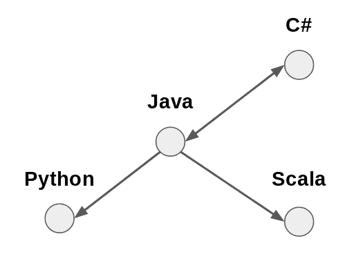
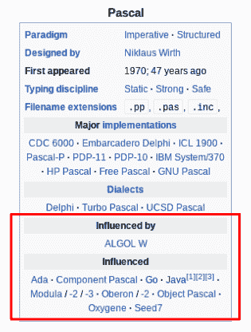

# 可视化编程语言影响图

> 原文：<https://www.freecodecamp.org/news/how-to-visualize-the-programming-language-influence-graph-7f1b765b44d1/>

#### 使用 Gephi 和 Sigma.js 的网络可视化教程

下面是我们今天将制作的预览:[编程语言影响图](http://programming-languages.herokuapp.com/)。查看链接，探索过去和现在超过 250 种编程语言之间的“设计影响”关系！

### 轮到你了！

在当今高度互联的世界中，网络是现代生活中无处不在的一个方面。

以目前为止我一天的开始为例——我利用伦敦的**交通网络**进城。然后我走进我最喜欢的咖啡店的一家**分店**，用我的 Chromebook 连接到他们的 **Wi-Fi 网络**。接下来，我登录了我经常去的各种社交网站。

众所周知，过去几十年中一些最有影响力的公司将他们的成功归功于网络的力量。

脸书、Twitter、Instagram、LinkedIn 和其他社交媒体平台依赖于社交网络的小世界属性。这让他们能够有效地将用户(和广告商)联系起来。

谷歌目前的成功在很大程度上归功于其早期在搜索引擎市场的主导地位——部分是由于他们能够借助其[页面排名网络算法](https://en.wikipedia.org/wiki/PageRank)返回相关结果。

亚马逊高效的配送网络允许他们在一些主要城市提供当天送达服务。

网络在人工智能和机器学习等领域也非常重要。神经网络是一个非常活跃的研究领域。许多在计算机视觉中必不可少的特征检测算法严重依赖于[使用网络来模拟图像的不同部分](http://www.sci.utah.edu/~gerig/CS7960-S2010/handouts/Shi-Malik-CVPR-1997.pdf)。

大量的科学现象也可以用网络模型来理解。这包括[量子力学](https://en.wikipedia.org/wiki/Quantum_graph)、[生化途径](https://en.wikipedia.org/wiki/Metabolic_pathway)，以及[生态](https://en.wikipedia.org/wiki/Ecological_network)和[社会经济系统](https://web.stanford.edu/~jacksonm/socialnetecon-chapter.pdf)。

既然它们的重要性不可否认，那么，我们如何才能更好地理解网络及其属性呢？

网络的数学研究被称为“[图论](http://mathworld.wolfram.com/Graph.html)”，是数学中更容易理解的分支之一。本文旨在提供一个介绍，假设很少的先验知识或经验。

我们将使用 Python 3.x 和一些名为 [Gephi](https://gephi.org/) 的令人敬畏的开源软件，将过去和现在的一系列编程语言如何通过影响联系在一起的网络可视化放在一起。

### 但是首先…

网络到底是什么？

上面描述的例子给了我们一些线索。交通网络由**个目的地**和**条路线**连接而成。社交网络由**个人**组成，通过他们的**关系**相互连接。谷歌的搜索引擎算法通过查看哪些页面**链接**到其他页面，来评估不同**网页**的“排名”。

更一般地说，网络是任何可以用**节点** 和**边**来描述的系统，或者用通俗的话来说，“点和线”。



An example of nodes (languages) connected by edges (design influence)

一些系统很容易用这种方式抽象出来。社交网络可能是最明显的例子。计算机文件系统是另一种——文件夹和文件通过它们的“父”和“子”关系链接在一起。

但是网络的真正力量来自于这样一个事实，即许多许多系统可以用网络术语来抽象和建模，即使一开始并不清楚如何抽象和建模。

### 代表网络

我们需要超越纸笔草图，用数学方法来分析和描述网络。我们如何将点和线的图片转化成我们可以处理的数字？

一个解决方案是绘制一个**邻接矩阵**来表示我们的网络。

矩阵是那些听起来有点吓人的概念之一，如果你不熟悉的话，但是不要害怕。可以把它们想象成数字网格，可以用来同时进行许多计算。下面是一个例子:

```
 Python Java Scala C#
Python     0    1     0  0
Java       0    0     0  1
Scala      0    1     0  0
C#         0    1     0  0
```

在这个矩阵中，每一行和每一列的交集是 0 或 1，这取决于各自的语言是否链接。你可以对照上图检查一下！

在大多数情况下，邻接矩阵是用数学方法表示网络的好方法。然而，从计算的角度来看，有时会有点麻烦。

例如，即使节点数量相对适中(比如 1000)，矩阵中的元素数量也会大得多(例如，1000 = 1，000，000)。

许多现实世界的系统产生**稀疏网络**。在这些网络中，大多数节点只连接到所有其他节点的一小部分。

如果我们在计算机内存中将一个 1000 节点的稀疏网络表示为邻接矩阵，我们将有 1，000，000 字节的数据存储在 RAM 中。大多数将为零。一定有更有效的方法来处理这件事。

另一种方法是用**边缘列表** *和*来代替。这些正是他们所说的。它们只是列出了相互链接的节点对。

例如，上述编程语言网络可以表示如下:

```
Java, Python
Java, Scala
Java, C#
C#, Java
```

对于较大的网络，这是一种计算效率更高的表示方法。当然，从边列表生成邻接矩阵是可能的(反之亦然)。我们又不是非要选一个。

另一种表示网络的方式是[邻接表](https://en.wikipedia.org/wiki/Adjacency_list)。这将列出每个节点及其链接到的节点。例如:

```
Java: Python, Scala, C#
C#: Java
```

### 收集数据，建立联系

任何网络模型和可视化都只能和用来构建它的数据一样好。这意味着，除了确保数据既准确又完整，我们还需要证明推断节点间边的方法是正确的。

在许多方面，这是关键的一步。任何随后的关于网络的分析和推论都依赖于能够证明“链接标准”的合理性。

例如，在[社交网络分析](https://en.wikipedia.org/wiki/Social_network_analysis)中，你可以根据人们是否在社交媒体上相互关注来联系他们。在分子生物学中，你可以根据基因的[共表达](https://en.wikipedia.org/wiki/Gene_co-expression_network)来联系基因。

通常，用于链接节点的方法将允许将**权重**分配给边，从而给出“强度”的度量。

例如，在在线零售的环境中，您可以根据一起购买的频率来链接产品。经常一起购买的产品将通过比偶尔一起购买的产品更高的**加权边**来链接。那些不经常一起购买的产品根本不会被联系在一起。

正如您所想象的，将节点相互链接的方法可以非常复杂。

然而，在本教程中，我们将使用一种更简单的方法来连接编程语言。我们要依靠维基百科的准确性。

就我们的目的而言，这应该没问题。维基百科的成功证明了它一定在做正确的事情。撰写文章的开源、协作方法应该确保一定程度的客观性。

此外，其相对一致的页面结构使其成为试验网络抓取技术的便利场所。

另一个好处是广泛的、[记录良好的维基百科 API](https://www.mediawiki.org/wiki/API:Main_page) ，这使得信息检索更加容易。让我们开始吧。

### 步骤 1 —安装 Gephi

Gephi 可以在 Linux、Mac 和 Windows 上使用。你可以在这里下载[。](https://gephi.org/users/download/)

对于这个项目，我用的是 Lubuntu。如果你使用的是 Ubuntu/Debian，那么你可以按照下面的步骤让 Gephi 运行起来。否则，安装过程很可能与您熟悉的任何东西都大同小异。

为您的系统下载 Gephi 的最新版本(在撰写本文时是 v.0.9.1)。当它准备好了，你需要解压文件。

```
cd Downloads
tar -xvzf gephi-0.9.1-linux.tar.gz
cd gephi-0.9.1/bin./gephi
```

您可能需要检查您的 Java JRE 版本。Gephi 需要最新版本。在我相对较新安装的 Lubuntu 上，我简单地安装了默认的-jre，所有的东西都在那里工作。

```
apt install default-jre
./gephi
```

在你准备开始之前还有一个步骤。为了将图表导出到 Web，您可以使用 Gephi 的 [Sigma.js](http://sigmajs.org/) 插件。

从 Gephi 的菜单栏中，选择“工具”选项，然后选择“插件”。

点击“可用插件”标签，选择“SigmaExporter”(我还安装了 JSON Exporter，因为它是另一个有用的插件)。

点击“安装”按钮，你将被引导完成这个过程。完成后，您需要重新启动 Gephi。

### 步骤 2-编写 Python 脚本

本教程将使用 Python 3.x，加上一些模块，使生活变得更简单。使用 pip 模块安装程序，运行以下命令:

```
pip3 install wikipedia
```

现在，在一个新目录中，创建一个类似于`script.py`的文件，并在您最喜欢的代码编辑器/IDE 中打开它。下面是主要逻辑的概要:

1.  首先，你需要一个包含编程语言的列表。
2.  接下来，浏览列表并检索相关维基百科文章的 HTML。
3.  由此，提取每种语言影响过的编程语言列表。这将是一个粗略的关联标准。
4.  当你这么做的时候，最好能获得一些关于每种语言的元数据。
5.  最后，您需要将收集到的所有数据写入一个. csv 文件

完整的脚本可以在[这个要点](https://gist.github.com/anonymous/2a6c841fe04ebc6d55acc259b4ac4f72)中找到。

#### 导入一些模块

在`script.py`中，从导入几个模块开始，这会使事情变得更简单:

```
import csv
import wikipedia
import urllib.request
from bs4 import BeautifulSoup as BS
import re
```

好—首先列出要包含的节点列表。这就是[维基百科](https://github.com/goldsmith/Wikipedia)模块派上用场的地方。这使得访问[维基百科 API](https://www.mediawiki.org/wiki/API:Main_page) 变得超级简单。

添加以下代码:

```
pageTitle = "List of programming languages"
nodes = list(wikipedia.page(pageTitle).links)
print(nodes)
```

如果您保存并运行这个脚本，您会看到它打印出了来自维基百科文章[“编程语言列表”](https://en.wikipedia.org/wiki/List_of_programming_languages)的所有链接。不错！

然而，手动检查任何自动收集的数据总是明智的。快速浏览一下就会发现，和许多实际的编程语言一样，这个脚本也增加了一些额外的链接。

例如，你可能会在那里看到“[标记语言列表](https://en.wikipedia.org/wiki/List_of_markup_languages)”、“[编程语言比较](https://en.wikipedia.org/wiki/Comparison_of_programming_languages)”等等。

尽管 Gephi 允许您删除不希望包含的节点，但在继续之前“清理”数据并无大碍。如果有的话，这会节省以后的时间。

```
removeList = [
    "List of",
    "Lists of",
    "Timeline",
    "Comparison of",
    "History of",
    "Esoteric programming language"
    ]

nodes = [i for i in nodes if not any(r in i for r in removeList)]
```

这些行定义了要从数据中删除的子字符串列表。然后，脚本遍历数据，删除包含任何不需要的子字符串的任何元素。

在 Python 中，这只需要一行代码！

#### 一些助手功能

现在你可以开始搜集维基百科来建立一个边缘列表(并收集任何元数据)。为了使这更容易，首先定义几个函数。

#### 抓取 HTML

第一个函数使用 [BeautifulSoup](https://www.crummy.com/software/BeautifulSoup/bs4/doc/) 模块获取每种语言的维基百科页面的 HTML。

```
base = "https://en.wikipedia.org/wiki/"

def getSoup(n):
    try:
        with urllib.request.urlopen(base+n) as response:
            soup = BS(response.read(),'html.parser')
            table = soup.find_all("table",class_="infobox vevent")[0]                return table
     except:
         pass
```

这个函数使用 urllib.request 模块获取页面在`“https://en.wikipedia.org/wiki/” + “programming language”`的 HTML。

然后将它传递给 BeautifulSoup，后者读取 HTML 并将其解析为一个对象，我们可以用它来搜索信息。

接下来，使用`find_all()`方法提取您感兴趣的 HTML 元素。

这里，这将是每篇编程语言文章顶部的汇总表。如何识别这些？

最简单的方法是访问其中一个编程语言页面。在这里，您可以简单地使用浏览器的开发工具来检查感兴趣的元素。

汇总表有 HTML 标签`<tab` le >和 CSS cl `asses "in` fobox `" and "v` event”，所以你可以用它们来标识 HTML 中的表格。

使用参数指定此选项:

*   `"table"`和
*   `class_="infobox vevent"`

`find_all()`返回符合条件的所有元素的列表。为了实际指定您感兴趣的元素，添加索引`[0]`。如果函数成功，它返回`table`对象。否则返回`None`。



The data we’re after is in this HTML element!

对于任何自动化数据收集过程，彻底处理异常总是很重要的。否则，在最好的情况下，脚本会崩溃，您需要重新开始。

在最坏的情况下，你会得到一个充满不一致和错误的数据集。这将是一场噩梦。

#### 检索元数据

下一个函数使用`table`对象来寻找一些元数据。这里，它在表中搜索该语言首次出现的年份。

```
def getYear(t):
    try:
        t = t.get_text()
        year = t[t.find("appear"):t.find("appear")+30]
        year = re.match(r'.*([1-3][0-9]{3})',year).group(1)
        return int(year)
    except:
        return "Could not determine"
```

这个短函数以`table`对象作为其参数，并使用 BeautifulSoup 的`get_text()`函数产生一个字符串。

下一步是创建一个名为`year`的子串。这需要单词`"appear"`第一次出现后的 30 个字符。该字符串应该包含该语言首次出现的年份。

为了只提取年份，使用一个**正则表达式**(由`re`模块提供)来匹配任何以 1 到 3 之间的一个数字开头，后面是三个数字的字符。

```
re.match(r'.*([1-3][0-9]{3})',year)
```

如果成功，该函数将返回整数形式的`year`。否则，它会返回一个令人沮丧的“无法确定”。你可能希望收集更多的元数据——比如范型、设计者或者类型规则。

#### 收集链接

还有一个函数——这一次，您将为一种给定的语言输入`table`对象，并希望得到一个其他编程语言的列表。

```
def getLinks(t):
    try:
        table_rows = t.find_all("tr")
        for i in range(0,len(table_rows)-1):
            try:
                if table_rows[i].get_text() == "\nInfluenced\n":
                    out = []
                    for j in table_rows[i+1].find_all("a"):
                        try:
                            out.append(j['title'])
                        except:
                            continue
                    return out
            except:
                continue
        return
    except:
        return
```

哇，看看这些巢…这里到底发生了什么？

该函数利用了`table`对象具有一致结构的事实。表中的信息按行存储(相关的 HTML 标签是`<` tr >)。其中一行将包含文本`"\nInfluenced\n"`。函数的第一部分查找这是哪一行。

一旦找到这一行，你就可以非常确定下一个行包含了受当前语言影响的每一种编程语言的链接。使用`find_all("a")`找到这些链接，其中参数`"a"`对应于 HTML 标签`<a>`。

对于每个链接`j`，将其`["title"]`属性附加到一个名为`out`的列表中。对`["title"]`属性感兴趣的原因是，这将与存储在`nodes`中的*语言名称*完全匹配。

例如，Java 在`nodes`中存储为`"Java (programming language)"`，因此您需要在整个数据集中使用这个确切的名称。

如果成功，`getLinks()`返回编程语言列表。该函数的其余部分处理异常处理，以防在任何阶段出现问题。

#### 收集数据

最后，您差不多可以坐下来让脚本完成它的任务了。它将收集数据并将其存储在两个列表对象中。

```
edgeList = [["Source,Target"]]
meta = [["Id","Year"]]
```

现在编写一个循环，将前面定义的函数应用于`nodes`中的每一项，并将输出存储在`edgeList`和`meta`中。

```
for n in nodes:
    try:
        temp = getSoup(n)
    except:
        continue
    try:
        influenced = getLinks(temp)
        for link in influenced:
            if link in nodes:
                edgeList.append([n+","+link])
                print([n+","+link])
    except:
        continue
    year = getYear(temp)
    meta.append([n,year])
```

该函数获取`nodes`中的每种语言，并尝试从其维基百科页面中检索汇总表。

然后，它检索表中列出的所有受相关语言影响的语言。

对于同时出现在`nodes`列表中的每种语言，以`["source,target"]`的形式向`edgeList`追加一个元素。通过这种方式，您将构建一个边缘列表，并输入到 Gephi 中。

出于调试的目的，打印添加到`edgeList`中的每个元素—只是为了确保一切正常工作。如果您做得更彻底，您还可以在`except`子句中添加打印语句。

接下来，获取语言的名称和年份，并将它们添加到`meta`列表中。

#### 写入 CSV

循环运行后，最后一步是将`edgeList`和`meta`的内容写入逗号分隔值(CSV)文件。这是很容易做到的`csv`模块进口较早。

```
with open("edge_list.csv","w") as f: 
    wr = csv.writer(f)
    for e in edgeList:
        wr.writerow(e)

with open("metadata.csv","w") as f2:
    wr = csv.writer(f2)
    for m in meta:
        wr.writerow(m)
```

搞定了。保存脚本，并从终端运行:

`$ python3 script.py`

在构建边列表时，您应该看到脚本打印出了每个源-目标对。确保您的互联网连接是稳定的，并在脚本发挥其魔力时高枕无忧。

### 步骤 3 —使用 Gephi 构建图形

希望您早点安装并运行 Gephi。现在，您可以创建一个新项目，并使用您收集的数据来构建一个有向图。这将展示不同的编程语言是如何相互影响的！

首先在 Gephi 中创建一个新项目，然后切换到“数据实验室”视图。这为在 Gephi 中处理数据提供了一个类似电子表格的界面。首先要做的是导入边缘列表。

*   点击“导入电子表格”。
*   选择 Python 脚本生成的`edge_list.csv`文件。确保 Gephi 知道使用逗号作为分隔符。
*   从列表类型中选择“边缘列表”。
*   单击“下一步”,检查是否将源列和目标列都作为字符串导入。

这应该会用节点列表更新数据实验室。现在，导入`metadata.csv`文件。这一次，确保从列表类型中选择“节点列表”。

切换到“预览”标签，看看网络看起来如何。

啊…就是有点…单色。又脏。就像一盘意大利面条。让我们解决这个问题。

#### 让它变漂亮

你可以用各种方式来做演示，这就是一点点创造性自由的来源。对于网络可视化，基本上有三件事需要考虑:

1.  **定位**有几种算法可以生成网络的布局模式。一个流行的选择是 [Fruchterman-Reingold 算法](https://schneide.wordpress.com/tag/fruchterman-reingold/)，它在 Gephi 中可用。
2.  图中节点的大小可以用来表示一些有趣的属性。通常，这是一个**中心性度量**。测量中心性的[方法有很多](https://en.wikipedia.org/wiki/Centrality)，但它们都反映了一个给定节点的“重要性”，即它与网络其他部分的联系有多紧密。
3.  也可以使用颜色来显示节点的一些属性。通常，颜色被用来表示**群落结构**。这被广义地定义为“一组节点，它们彼此之间的联系比与图中其他部分的联系更紧密”。在社交网络中，这可以揭示友谊、家庭或专业团体。有几种[算法可以检测社区结构](https://en.wikipedia.org/wiki/Community_structure#Algorithms_for_finding_communities)。Gephi 自带 [Louvain 方法](https://en.wikipedia.org/wiki/Louvain_Modularity)内置。

要进行这些更改，您需要计算一些统计数据。切换到“概览”窗口。这里你会看到右边有一个面板。它应该包含一个“统计”标签。打开这个，你会看到一系列的选项。

Gephi 具有许多内置的统计功能。对于其中的每一个，点击“运行”将生成一个报告，该报告将揭示关于网络的见解。

一些需要了解的有用信息包括:

*   平均程度平均语言与大约四种其他语言相连。报告还显示了一个[度分布](https://en.wikipedia.org/wiki/Degree_distribution)图。这揭示了大多数语言只有很少的连接，而一小部分有很多。这表明这是一个**无标度** **网络**。人们已经对无标度网络及其产生过程进行了大量研究。
*   这个网络的直径是 12，这意味着这是任何两种语言之间“最广泛”的联系。平均路径长度不到 4。这意味着，平均来说，任何两种语言都被四条边分开。这些数字给出了网络“规模”的量度。
*   **模块化**这是一个显示网络“划分”程度的分数。这里，模块化得分大约是 0.53。这相对较高，表明该网络中有不同的模块。同样，这表明了底层系统的一些有趣之处。语言往往会被划分为不同的“影响群体”。

总之，要修改网络的外观，请前往左侧面板。

在“布局”选项卡中，您可以选择要使用的布局算法。点击“运行”,观察图表的实时变化！看你觉得哪个布局算法效果最好。

布局选项卡上方是“外观”选项卡。在这里，您可以对节点和边的颜色、大小和标签进行不同的设置。这些可以基于属性进行配置(包括让 Gephi 计算的统计数据)。

作为建议，您可以:

*   根据节点的模块化属性给节点着色。这根据他们的社区成员来给他们上色。
*   根据节点的度数来确定节点的大小。连接较好的节点将比连接较差的节点显得更大。

但是，你应该尝试，想出一个你最喜欢的布局。

一旦你对图表的外观感到满意，就该进入最后一步了——导出到 Web！

### 步骤 4 — Sigma.js

你已经建立了一个可以在 Gephi 中探索的网络可视化。你可以选择截图，或者以 SVG、PDF 或 PNG 格式保存图表。

然而，如果你早些时候安装了 Sigma.js 插件，那么为什么不将图表导出为 HTML 呢？这将创建一个交互式可视化，您可以在线主持，或上传到 GitHub 并与其他人分享。

为此，从 Gephi 的菜单栏中选择“导出> Sigma.js 模板…”。

根据需要填写详细信息。请确保选择要将项目导出到的目录。您可以更改标题、图例、描述、悬停行为和许多其他细节。准备好后，点击“确定”。

现在，如果您导航到您将项目导出到的目录，您将看到一个包含由 Sigma.js 生成的所有文件的文件夹。

在您最喜欢的浏览器中打开`index.html`。哒哒！这是你的关系网！如果您了解一点 CSS 和 JavaScript，您可以深入到各种生成的文件中，按照您的意愿调整输出。

本教程到此结束！

### 摘要

*   许多系统可以作为网络来建模和可视化。图论是数学的一个分支，它提供了帮助理解网络结构和属性的工具。
*   您使用 Python 从维基百科中抓取数据来构建编程语言影响图。关联标准是一种给定的语言是否被列为对另一种语言设计的影响。
*   Gephi 和 Sigma.js 是开源工具，允许您分析和可视化网络。它们允许您以图像、PDF 或 Web 格式导出网络。

感谢您的阅读——我期待您的任何评论或问题！想要了解更多关于图论的奇妙资源，请看[阿尔伯特-拉斯洛·巴拉巴希](https://en.wikipedia.org/wiki/Albert-L%C3%A1szl%C3%B3_Barab%C3%A1si)的交互式[在线书籍](http://barabasi.com/networksciencebook/)。

本教程的完整代码可以在[这里](https://gist.github.com/anonymous/2a6c841fe04ebc6d55acc259b4ac4f72)找到。