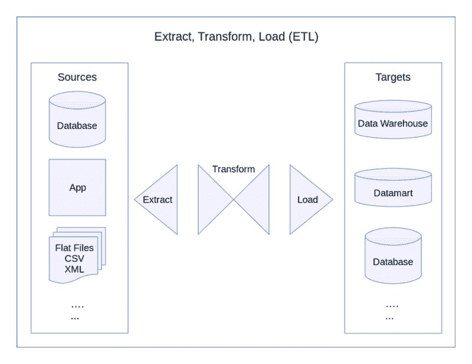

# SQLAlchemy 让 ETL 变得神奇简单

> 原文：<https://www.freecodecamp.org/news/sqlalchemy-makes-etl-magically-easy-ab2bd0df928/>

任何数据科学工作流的一个关键方面是以可用于上游的形式获取、清理和存储原始数据。这个过程通常被称为“提取-转换-加载”，简称 ETL。

设计高效、健壮和可靠的 ETL 过程或“数据管道”是很重要的低效的管道会使处理数据变得缓慢而低效。不坚固的管道很容易破裂，留下缺口。

更糟糕的是，一个不可靠的数据管道会悄悄地用错误的数据污染你的数据库，这些错误的数据在造成损害之前可能不会变得明显。

尽管非常重要，ETL 开发有时可能是一个缓慢而繁琐的过程。幸运的是，开源解决方案让生活变得更加容易。



#### SQLAlchemy 是什么？

一个这样的解决方案是名为 SQLAlchemy 的 Python 模块。它允许数据工程师和开发人员完全通过 Python 来定义模式、编写查询和操作 SQL 数据库。

SQLAlchemy 的对象关系映射器(ORM)和表达式语言功能通过允许您将 Python 类和结构与数据表和表达式相关联，消除了 SQL 的不同实现之间的一些明显的特性。

在这里，我们将浏览 SQLAlchemy 的一些亮点，以发现它能做什么，以及它如何使 ETL 开发成为一个更平滑的过程。

#### 安装

您可以使用 pip 包安装程序安装 SQLAlchemy。

```
$ sudo pip install sqlalchemy
```

至于 SQL 本身，有许多不同的版本可用，包括 MySQL、Postgres、Oracle 和 Microsoft SQL Server。对于本文，我们将使用 SQLite。

SQLite 是 SQL 的开源实现，通常预装在 Linux 和 Mac OS X 中，也可用于 Windows。如果你的系统上还没有，你可以按照这些指令启动并运行。

在新目录中，使用终端创建新数据库:

```
$ mkdir sqlalchemy-demo && cd sqlalchemy-demo
$ touch demo.db
```

#### 定义模式

数据库模式定义了数据库系统的结构，包括表、列、字段以及它们之间的关系。模式可以在原始 SQL 中定义，或者通过使用 SQLAlchemy 的 ORM 特性来定义。

下面是一个例子，展示了如何为一个虚拟的博客平台定义两个表的模式。一个是用户表，另一个是上传的帖子表。

```
from sqlalchemy import *
from sqlalchemy.ext.declarative import declarative_base
from sqlalchemy.orm import sessionmaker
from sqlalchemy.sql import *

engine = create_engine('sqlite:///demo.db')
Base = declarative_base()

class Users(Base):
    __tablename__ = "users"
    UserId = Column(Integer, primary_key=True)
    Title = Column(String)
    FirstName = Column(String)
    LastName = Column(String)
    Email = Column(String)
    Username = Column(String)
    DOB = Column(DateTime)

class Uploads(Base):
    __tablename__ = "uploads"
    UploadId = Column(Integer, primary_key=True)
    UserId = Column(Integer)
    Title = Column(String)
    Body = Column(String)
    Timestamp = Column(DateTime)

Users.__table__.create(bind=engine, checkfirst=True)
Uploads.__table__.create(bind=engine, checkfirst=True)
```

首先，从 SQLAlchemy 导入您需要的所有内容。然后，使用`create_engine(connection_string)`连接到您的数据库。确切的连接字符串将取决于您正在使用的 SQL 版本。这个例子使用了前面创建的 SQLite 数据库的相对路径。

接下来，开始定义您的表类。例子中的第一个是`Users`。该表中的每一列都使用 SQLAlchemy 的`Column(type)`定义为一个类变量，其中`type`是一个数据类型(如`Integer`、`String`、`DateTime`等)。使用`primary_key=True`表示将被用作主键的列。

这里定义的下一个表是`Uploads`。这是非常相同的想法——每一列都像以前一样定义。

最后两行实际上创建了表。`checkfirst=True`参数确保新表仅在当前数据库中不存在时才被创建。

#### 提取

一旦定义了模式，下一个任务就是从数据源中提取原始数据。根据原始数据的提供方式，每个案例的具体细节可能大相径庭。也许您的应用程序调用内部或第三方 API，或者您需要读取 CSV 文件中记录的数据。

下面的例子使用两个 API 来模拟上述虚构博客平台的数据。`Users`表将填充在 [randomuser.me](https://randomuser.me/) 上随机生成的配置文件，而`Uploads`表将包含由 [JSONPlaceholder](http://jsonplaceholder.typicode.com/) 提供的 lorem ipsum 启发的数据。

Python 的`Requests`模块可以用来调用这些 API，如下所示:

```
import requests

url = 'https://randomuser.me/api/?results=10'
users_json = requests.get(url).json()
url2 = 'https://jsonplaceholder.typicode.com/posts/'
uploads_json = requests.get(url2).json()
```

数据目前以 JSON 格式保存在两个对象(`users_json`和`uploads_json`)中。下一步是将这些数据转换并加载到前面定义的表中。

#### 改变

在将数据加载到数据库之前，确保数据的格式正确是很重要的。上面代码中创建的 JSON 对象是嵌套的，包含的数据比定义的表所需的数据多。

一个重要的中间步骤是**将数据从当前的嵌套 JSON 格式转换为平面格式，这样可以安全无误地写入数据库。**

对于贯穿本文的示例，数据相对简单，不需要太多的转换。下面的代码创建了两个列表，`users`和`uploads`，它们将在最后一步中使用:

```
from datetime import datetime, timedelta
from random import randint

users, uploads = [], []

for i, result in enumerate(users_json['results']):
    row = {}
    row['UserId'] = i
    row['Title'] = result['name']['title']
    row['FirstName'] = result['name']['first']
    row['LastName'] = result['name']['last']
    row['Email'] = result['email']
    row['Username'] = result['login']['username']
    dob = datetime.strptime(result['dob'],'%Y-%m-%d %H:%M:%S')    
    row['DOB'] = dob.date()

    users.append(row)

for result in uploads_json:
    row = {}
    row['UploadId'] = result['id']
    row['UserId'] = result['userId']
    row['Title'] = result['title']
    row['Body'] = result['body']
    delta = timedelta(seconds=randint(1,86400))
    row['Timestamp'] = datetime.now() - delta

    uploads.append(row)
```

这里的主要步骤是遍历之前创建的 JSON 对象。对于每个结果，创建一个新的 Python dictionary 对象，其键对应于为模式中的相关表定义的每个列。这确保了数据不再是嵌套的，并且只保留表需要的数据。

另一步是使用 Python 的`datetime`模块来操作日期，并将它们转换成可以写入数据库的`DateTime`类型的对象。对于这个例子，随机的`DateTime`对象是使用 Python 的 DateTime 模块中的`timedelta()`方法生成的。

每个创建的字典都被附加到一个列表中，该列表将在管道的最后一步中使用。

#### 负荷

最后，数据以一种可以**加载**到数据库的形式存在。SQLAlchemy 通过其会话 API 使这一步变得简单明了。

对于从数据库加载或与数据库关联的 Python 对象，会话 API 的作用有点像中间人，或“保留区”。在提交到数据库之前，可以在会话中操作这些对象。

下面的代码创建一个新的会话对象，向其中添加行，然后将它们合并并提交到数据库:

```
Session = sessionmaker(bind=engine)
session = Session()

for user in users:
    row = Users(**user)
    session.add(row)

for upload in uploads:
    row = Uploads(**upload)
    session.add(row)

session.commit()
```

`sessionmaker`工厂用于生成新配置的`Session`类。`Session`是一个日常的 Python 类，在第二行被实例化为`session`。

接下来是两个循环，它们遍历前面创建的`users`和`uploads`列表。这些列表的元素是字典对象，它们的键对应于前面定义的`Users`和`Uploads`类中给出的列。

每个对象用于实例化相关类的一个新实例(使用 Python 的便利的`some_function(**some_dict)`技巧)。该对象被添加到带有`session.add()`的当前会话中。

最后，当会话包含要添加的行时，`session.commit()`用于将事务提交给数据库。

#### 聚集

SQLAlchemy 的另一个很酷的特性是能够使用它的表达式语言系统来编写和执行与后端无关的 SQL 查询。

编写与后端无关的查询有什么好处？首先，它们使任何未来的迁移项目变得更加容易。不同版本的 SQL 有一些不兼容的语法，但是 SQLAlchemy 的表达式语言充当了它们之间的通用语言。

此外，能够以无缝的 Pythonic 方式查询数据库并与之交互，对于喜欢完全使用他们最熟悉的语言的开发人员来说是一个真正的优势。但是，SQLAlchemy 也允许您在普通 SQL 中工作，因为使用预先编写的查询更简单。

在这里，我们将扩展这个虚构的博客平台示例来说明这是如何工作的。一旦创建并填充了基本的用户和上传表，下一步可能是创建一个**聚合**表——例如，显示每个用户发布了多少篇文章，以及他们最后一次活动的时间。

首先，为聚合表定义一个类:

```
class UploadCounts(Base):
    __tablename__ = "upload_counts"
    UserId = Column(Integer, primary_key=True)
    LastActive = Column(DateTime)
    PostCount = Column(Integer)

UploadCounts.__table__.create(bind=engine, checkfirst=True)
```

该表将有三列。对于每个`UserId`，它将存储他们最后一次活动的时间戳，以及他们已经上传了多少帖子的计数。

在普通 SQL 中，该表将使用如下查询来填充:

```
INSERT INTO upload_counts
SELECT
  UserId,
  MAX(Timestamp) AS LastActive,
  COUNT(UploadId) AS PostCount
FROM
  uploads
GROUP BY 1;
```

在 SQLAlchemy 中，这将被写成:

```
connection = engine.connect()

query = select([Uploads.UserId,
    func.max(Uploads.Timestamp).label('LastActive'),
    func.count(Uploads.UploadId).label('PostCount')]).\ 
    group_by('UserId')

results = connection.execute(query)

for result in results:
    row = UploadCounts(**result)
    session.add(row)

session.commit()
```

第一行使用`engine`对象的`connect()`方法创建一个`Connection`对象。接下来，使用`select()`函数定义一个查询。

这个查询与上面给出的普通 SQL 版本相同。它从`uploads`表中选择`UserId`列。它还将`func.max()`应用于`Timestamp`列，该列标识最近的时间戳。使用`label()`方法将其标记为`LastActive`。

同样，该查询应用`func.count()`来计算出现在`Title`列中的记录数。这被称为`PostCount`。

最后，查询使用`group_by()`按照`UserId`对结果进行分组。

为了使用查询结果，for 循环迭代由`connection.execute(query)`返回的行对象。每一行都用来实例化`UploadCounts`表类的一个实例。像以前一样，每一行都被添加到`session`对象中，最后会话被提交到数据库中。

#### 退房

一旦您运行了这个脚本，您可能想要说服自己数据已经被正确地写入之前创建的`demo.db`数据库。

退出 Python 后，在 SQLite 中打开数据库:

```
$ sqlite3 demo.db
```

现在，您应该能够运行以下查询:

```
SELECT * FROM users;

SELECT * FROM uploads;

SELECT * FROM upload_counts;
```

并且每个表的内容都会打印到控制台上！通过安排 Python 脚本定期运行，可以确保数据库保持最新。

您现在可以使用这些表来编写查询以进行进一步的分析，或者构建用于可视化目的的仪表板。

#### 进一步阅读

如果您已经做到了这一步，那么希望您已经对 SQLAlchemy 如何使 Python 中的 ETL 开发更加简单明了有所了解！

不可能用一篇文章来全面介绍 SQLAlchemy 的所有特性。然而，该项目的主要优势之一是其文档的深度和细节。你可以在这里深入了解它[。](http://docs.sqlalchemy.org/en/latest/)

否则，如果您想快速入门，请查看此备忘单。

这篇文章的完整代码可以在[这个要点](https://gist.github.com/anonymous/a2fc91fdb87dbfaee365f6707e94c442)中找到。

感谢阅读！如果您有任何问题或意见，请在下面留下您的回复。