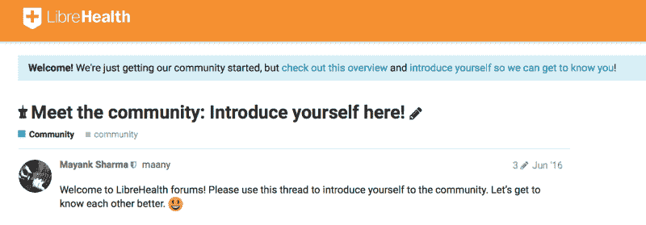
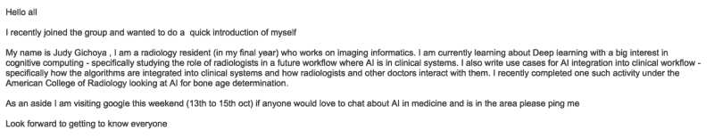
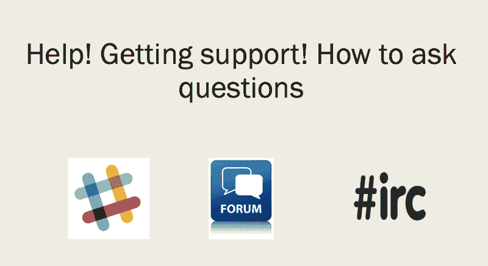
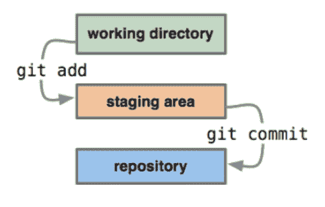

# 导师和网络——我基于开源参与的策略

> 原文：<https://www.freecodecamp.org/news/mentorship-and-networking-my-strategy-based-on-open-source-involvement-626e63096059/>

医学博士朱迪·吉乔亚

# **导师和网络——我基于开源参与的策略**

我在医学院的第一年是在 2003 年，当时由于缺乏抗逆转录病毒药物，护理艾滋病毒/艾滋病患者很困难。现在，每个医学生都知道，参加临床实习的兴奋是无与伦比的……脖子上挂着听诊器走在住院大厅里，照顾自己的病人是年轻医学生的快乐之一。

然而，我的梦想很快破灭了——我花了更多的时间寻找丢失的实验室结果。但是以典型的 Judy 风格，在正确的时间出现在正确的地点，我联系上了 Ben Wolfe(OpenMRS 的第一个开发者，OpenMRS 是世界上最大的开源医疗记录系统，在 40 多个国家使用)，剩下的就是历史了。

我可以说，本在想他班上唯一的女孩什么时候会离开，但是下午 4 点的会议证明是我时间中最有价值的投资之一……

快进一下——现在我作为一名开发人员、实施人员和评估人员在健康开源软件领域工作了很多年——我周游世界，结交朋友，他们的目的是在资源有限的地方改善病人护理。尽管如此，当我走进房间时，我不是一个命令别人的人——我说话温和，正如大多数美国人会很快提醒我“你的口音是哪里的？”和一个有色人种的女人。

然而，我仍然能够与做着惊人工作的人们联系，他们中的大多数人让我坐在他们的肩膀上，为这个乡村女孩打开了无数的机会。在总结我如何建立关系网时，我意识到我的策略是开源方式——我志愿在 [librehealth.io](http://librehealth.io/) 维护一个开源放射学成像系统，并在下面分享我的经验。我希望这篇文章能够帮助那些希望在 STEM 和医学的多样性方面有所作为的导师和学员。

#### **1。欢迎来到社区**

在 LibreHealth，我们鼓励新会员写的第一篇文章是一小段关于他们自己的文章。我每隔一天检查一次，并对新成员竖起大拇指，或者对新帖子发出有人看到他们消息的消息。

Librehealth meet the community post

你如何向少数民族介绍 STEM？分享你的社交资本——即使是简单的事情，比如转发和标记那些做了惊人工作的人，如果你有一个大的社交媒体存在。请记住，大多数少数族裔会羞于提名奖项，所以请为他们大声疾呼，如 [RedHat](https://www.redhat.com/en/about/women-in-open-source) 开源奖或 [Anita Borg](https://anitab.org/awards-grants/) 奖……不要忘记向陌生人介绍自己，跳出你的社交圈——尤其是在会议上。

#### **2。构建社区——我是如何做到的**

构建一个不是由患者而是由医生直接使用的放射信息系统(RIS)的挑战在于您的消费者/客户群很小。带着“人先于代码”的个人座右铭，我在专注于开发人员之前致力于建立一个社区。

对于作为学员的你来说…
**在你需要之前建立你的关系网**

在我的开源之旅中，这意味着使用谷歌跟踪人们——我将从搜索“放射学”+“刚果”开始，并继续阅读在这些国家工作的人和组织——在 Linkedln 和 Twitter 上与他们联系，最终向他们介绍我们的项目。我每年都志愿担任指导者，为从事谷歌代码工作的高中生和在我们社区内从事谷歌代码项目的大学生提供指导。

3 个月前，我注意到一条推文，介绍了将在 NIPS 2017 举行的 [black in AI](https://blackinai.github.io/) 研讨会(结果令人惊讶)。我加入了这个团体，下面是我的介绍:

self introduction to black in AI group

我不知道谁会回复——但这封邮件让我与湾区的 ML 科学家建立了良好的联系——作为一个意外收获，我获得了一个未来项目的反馈，而这个项目可能需要几年才能了解。记住，有些联系会起作用，有些不会——别担心。

#### 3.**救命**！

有很多渠道可以获得开源项目的帮助，包括 Slack channels 或 IRC:

Help options for developers

你如何/从哪里开始社交？网上交流简单且成本较低，但面对面的交流才是王道。例如，在 Linux 基金会组织的[开源峰会](https://events.linuxfoundation.org/)上，有一个非正式的女性午餐活动，允许人们介绍自己和他们所做的工作。Linux 基金会非常慷慨地为参加者提供全面的奖学金。

总的来说，对于所有会议来说，价值最高的是
**走廊轨道**
换句话说，你在走廊和楼梯上遇到的人，彼此交流和启发。

#### **4。去委员会**

将代码公之于众的想法可能非常可怕，导师制度也是如此。认识并拥抱你周围人的脆弱

Git commit

#### 5.**开发 1 - >开发 2 - >** 开发 3

类似于开源开发的发展阶段，让你的导师关系成长。例如，当少数族裔演讲者的第一个演讲可能是关于多样性时，下一个自然的步骤应该是进行技术演讲。请记住，这种演变也意味着你们的师徒关系将在某一点上走到尽头，没关系。

#### **6。行为准则**

行为准则定义了社区中可接受的行为。在你的师徒之旅中寻找一个安全的环境，在那里你可以得到关于你工作的真实反馈，还有成长的空间。也要意识到是时候继续前进了。

#### **7。社会资本**

我再次谈到这一点，因为我们极客喜欢获得免费赠品或成为本月志愿者。对你的导师使用同样的原则——当你做了令人惊奇的事情时，大声喊他们。在日常工作中奖励导师。

#### **8。1.0 版本发布->2.0 版本发布** ase

记住你和导师的关系总是在变化的。寻求向导师和学员提供最新信息——你最近参加了什么会议？你读过新的学术论文或书籍吗？还是你的个人生活中有什么新鲜事？…

有一个路线图，敏捷地处理你的里程碑，评估什么可行，什么不可行。使用版本控制来管理混乱(和冲突),并被激发出惊人的灵感！

我最近读了巴布森的一篇文章,谈论如何作为学员建设你的村庄。

我喜欢这个由以下成员组成的个人董事会的想法(摘自巴布森的文章):

*   *主席:*你首先求助的人；也许是配偶或家庭成员
*   禅师:一个能让你保持理智和冷静的人
*   商业大师:一个对你的手艺了如指掌的专业同行
*   共鸣板:一个和你有相似感受的人，有着和你一样的感受力
*   唱反调的人:有敏锐能力揭露对立观点的人
*   一生的朋友:了解你的历史并帮助你坚持自己价值观的人

在导师项目中(作为导师或学员)，你有哪些成功的诀窍？