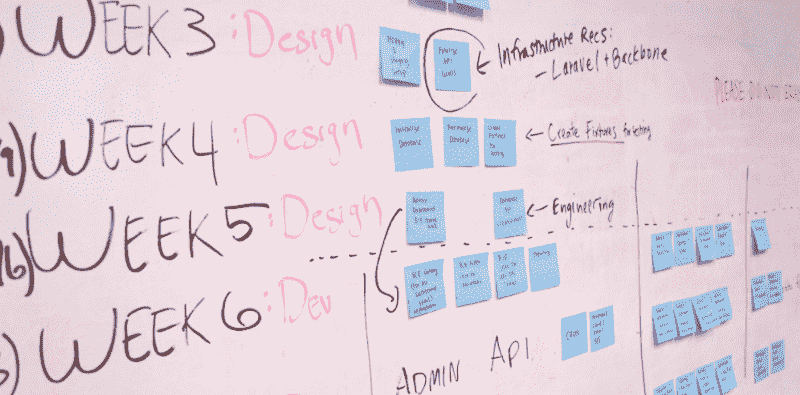
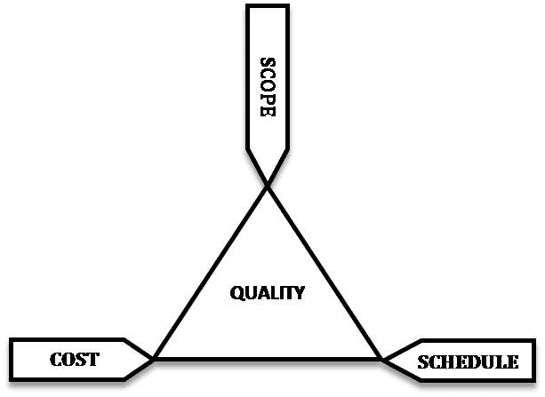
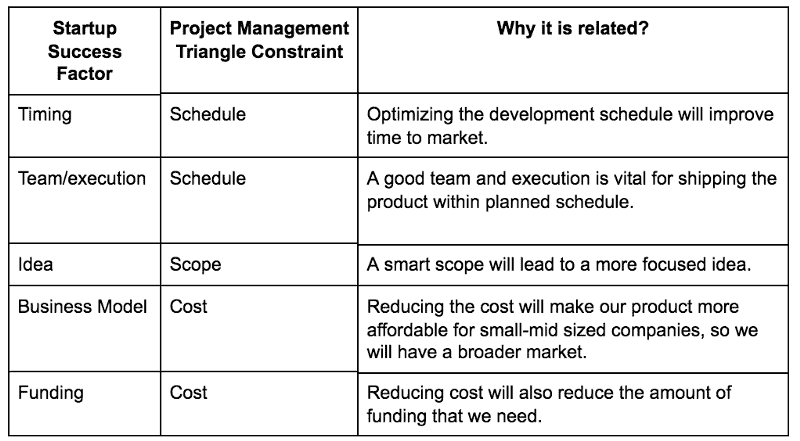
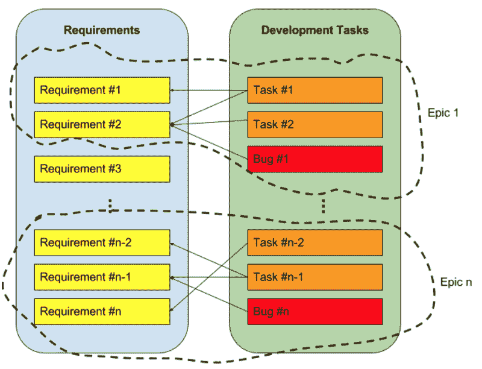

# 需求分析:如何使用这种启动友好的方法+案例研究

> 原文：<https://www.freecodecamp.org/news/how-to-analyze-the-requirements-of-a-new-product-a-startup-friendly-approach-and-a-case-study-833970e5c36c/>

比图尔加钢铁公司

# 需求分析:如何使用这种启动友好的方法+案例研究

在我们之前的博客文章中，我们解释了为什么我们决定开发[徽章应用](https://engineering.opsgenie.com/badges-app-opsgenies-response-to-skill-tracking-and-management-challenges-c539feb1db9d)以及我们[如何在](https://engineering.opsgenie.com/how-did-we-decide-that-our-new-product-idea-is-feasible-d43e0fc6fde9) [OpsGenie](https://www.opsgenie.com) 评估我们想法的可行性:

既然我们发现我们的想法值得发展，下一步就是分析需求。

需求分析——软件工程的一个非常好的研究领域——是确定用户对产品的期望，或者简单定义产品范围的过程。关于需求分析方法、良好需求的特征和跟踪需求，有大量的可用资源。我们不重复文献，而是以创业思维的方式总结关键点。

我们知道，初创公司的人通常不喜欢“过程”、“概念验证”、“需求”、“范围”、“进度”、“设计”、“文档”或“可维护性”这样的术语。一般来说，他们没有耐心，他们只想编码和发布。我们承认敏捷性在我们的世界中至关重要，我们必须尝试、失败并快速恢复。但是从软件世界的遗产中获益将帮助我们走向成功。关键是保持它的灵活性。

遵循过程不是目的，而是帮助我们实现目标的工具。因此，让我们看看如何在需求管理的环境中采用经典的方法。

项目管理三角形是软件管理的约束模型。尽管这是一个 1950 年代的老概念，我认为它仍然是相关的。

总之，项目管理三角说工作质量受到项目的**预算**、**期限**和**特征**的制约。为了达到必要的项目质量，在这三个约束之间有一个折衷。所以我们可以说软件开发是一个[多目标优化问题](https://en.wikipedia.org/wiki/Multi-objective_optimization)。

The Project Management Triangle (Image from [Wikipedia](https://en.wikipedia.org/wiki/Project_management_triangle))

我们不喜欢用传统的方法来约束自己，所以让我们用旧的项目管理三角来适应新的创业世界。回想一下我们在[可行性分析文章](https://engineering.opsgenie.com/how-did-we-decide-that-our-new-product-idea-is-feasible-d43e0fc6fde9)中提到的启动成功因素。

下面是我们如何将这些成功因素映射到经典的项目管理三角形:

如上表所示，所有的创业成功因素都与各种项目管理三角约束相关。由于这三个限制是相互权衡的，我们可以说保持范围整洁对于创业公司的成功至关重要。

为了定义一个整洁的范围，我们必须在开始开发之前执行一个好的需求分析。请注意，这并不意味着我们要执行一个完全详细的需求分析，就像瀑布过程中定义的那样。我们将以敏捷的方式来做。

### 需求分析提示

在本节中，我们将提供您应该牢记的重要提示:

#### 深入检查替代/类似产品

一如既往，不要多此一举。检查别人做了什么来实现你的目标。甚至你可能最终会意识到，你的产品似乎没有你之前认为的商业影响。

这是改变你想法的好迹象。这看起来像是失败，但是请记住，**我们必须尽快失败**。

#### 记录您的需求

你不必使用需求管理工具，比如 IBM Rational DOORS。但是一个简短的、带项目符号的需求文档将有助于与涉众进行协商。

#### 让你的(潜在)客户了解情况

我认为这是需求开发最重要的事情之一。您认为是致命的功能对客户来说可能没有意义。

为了让你的潜在客户参与进来，你必须遵循一个迭代的方法。你可以通过发布你的产品的初始版本——最小可行产品(MVP)——并根据客户反馈改进它来做到这一点。

例如，Amazon Web Services 团队经常使用这种方法。他们提供功能最少的服务，并根据客户反馈进行改进。

另一种方法是开发模拟应用程序，它只提供一个虚拟用户界面(UI)来帮助潜在客户理解产品特性并给出反馈。你可以使用像 [InvisionApp](https://www.invisionapp.com/) 这样的产品来制作这些模拟。

#### 需求管理是一个持续的过程

你不必在项目开始时花几个月的时间进行需求分析，也请不要这样做——这不是敏捷的方式。

在开始时，你的目标是定义系统的边界，与团队和其他涉众协商，并准备最小可行产品的定义。需求应该是详细的，或者甚至可以在开发的迭代中发展。

#### 将您的需求分组

在您创建了所有需求的列表之后，将它们分组(分而治之)以形成相关特性的集合。将需求分组到特性组将在开发阶段减轻您的负担，甚至可以帮助您定义[有界上下文](https://martinfowler.com/bliki/BoundedContext.html)，微服务架构等等。

#### 想想我们

用户体验(UX)是产品成功的一个非常重要的因素，这一点已经不用多说了；今天这是如此明显。但是我们仍然要提醒用户体验不仅仅是漂亮的用户界面。

顾名思义，这完全是关于“体验”的，在开发系统之后，很难改进系统的 UX。

想想从需求分析开始的 UX，如果市场上可用的替代品缺乏良好的 UX，它甚至可以成为可行性分析阶段开发新产品的动力。

用户体验影响业务需求。例如，如果您正在开发一个电子商务应用程序，设计一个快速响应的客户支持系统就是为了改善用户体验。

#### 尽可能不知道实现技术

当然，如果您正在开发特定技术的基础设施或库，这是不适用的:)

不要陷入“如果你只有一把锤子，一切看起来都像钉子”的陷阱。寻找新的工具和实用程序，而不是将产品功能局限于您熟悉或喜欢使用的技术。

在企业公司中，需求分析通常由非软件工程师执行，他们通常被称为业务分析师或系统工程师。这种分离有一些缺点，特别是在将需求转移到开发团队方面，但是我认为它也有一些优点。

在我看来，独立分析团队的最大优势是他们不知道开发过程中将要使用的技术。

但在创业世界里，很可能作为团队成员(甚至是创始人)，你必须身兼数职:分析师、开发人员、招聘经理，甚至是你走上这条路时没有想到的更有趣的角色。所以，如果你现在戴着分析师的帽子，试着不知道你计划在实现过程中使用的技术。

在需求分析过程中，我们经常听到类似“但是 Spring Framework 不支持…”和“这导致了前端的大量工作”这样的表述。

一开始就考虑这些限制会降低最终产品的质量。让我们定义最终的能力，并在必要时在开发过程中发展它。

终极能力是要达到的最终目标，当你开始并在未来版本中发展它时，你可以实现一个更简单的形式。但是知道我们想要达到的点将帮助我们为产品的增长定义我们的远景。

例如，想想手机的“缩放”功能。这看起来是一个微不足道的能力，但当史蒂夫·乔布斯第一次展示它时，这是一场革命。如果 iPhone 的设计者没有跳出框框思考，坚持现有的技术和方法，我们今天就不会有这个伟大的功能。我们知道这是一个夸张的例子，但主要的一点是，不要让你想使用的技术限制你，你可以转移到其他技术，如果这将有助于你创造一个利基产品。

### 徽章应用程序的需求分析

我们根据上面总结的实践进行了需求分析:

*   我们定义了一组初始需求
*   我们与最初的客户 OpsGenie 团队——分享了需求，并根据团队的意见更新了需求。
*   在 OpsGenie，我们使用 Atlassian 的 JIRA 进行问题跟踪。为了跟踪需求，我们为 JIRA 的每个需求创建了一个“新特性”类型的问题。
*   我们将相关需求与 [JIRA 史诗](https://confluence.atlassian.com/agile/jira-agile-user-s-guide/working-with-epics)进行分组。我们的一些史诗是用户运营、群组运营、徽章运营、背书和第三方工具集成。
*   在进一步的开发中，我们按照敏捷实践的建议，为日常任务创建了详细的问题。我们将每个任务与一个或多个需求联系起来，以保持开发活动与需求的可追溯性。
*   每个 epic 包含一组需求(比如一个新特性)、开发任务和 bug。

Tracing Requirements with Development Tasks

想要关注我们的徽章应用程序，或者更好地推荐新功能并帮助我们完善它？[加入](https://community.opsgenie.com/c/badges)徽章应用社区！

延伸阅读:

[**徽章 App: OpsGenie 应对技能跟踪和管理挑战**](https://engineering.opsgenie.com/badges-app-opsgenies-response-to-skill-tracking-and-management-challenges-c539feb1db9d)
[*当我们将技能跟踪和管理视为公司健康成长的一项至关重要的任务时，我们投资了…*engineering.opsgenie.com](https://engineering.opsgenie.com/badges-app-opsgenies-response-to-skill-tracking-and-management-challenges-c539feb1db9d)[**我们如何确定我们的新产品创意是可行的？**](https://engineering.opsgenie.com/how-did-we-decide-that-our-new-product-idea-is-feasible-d43e0fc6fde9)