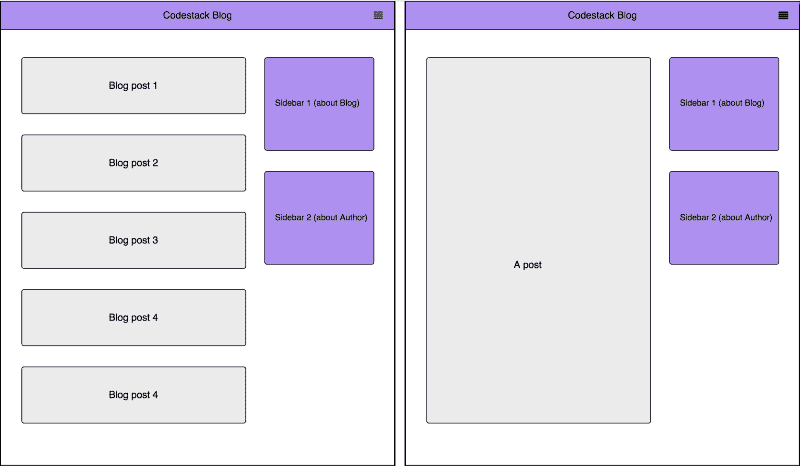
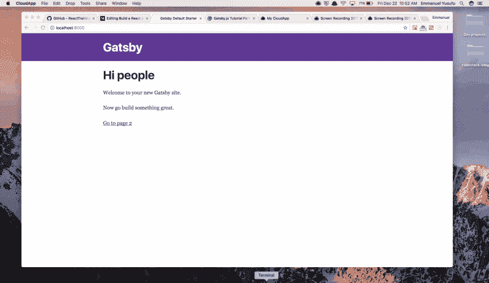
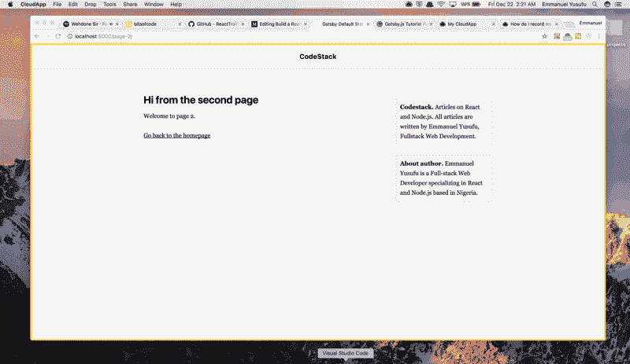
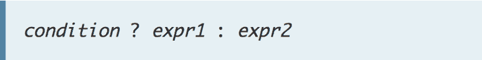
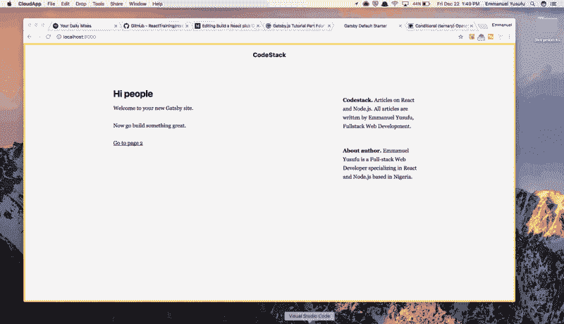
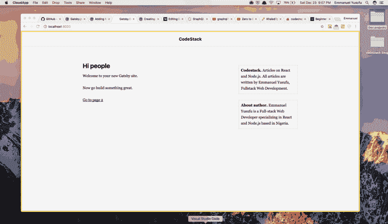
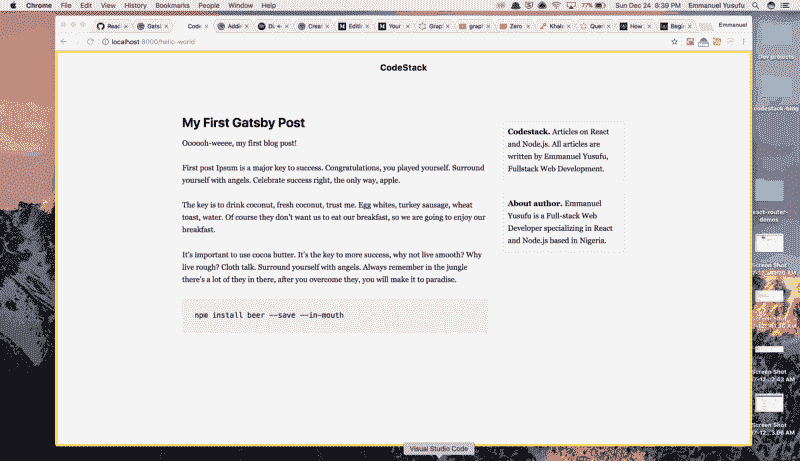
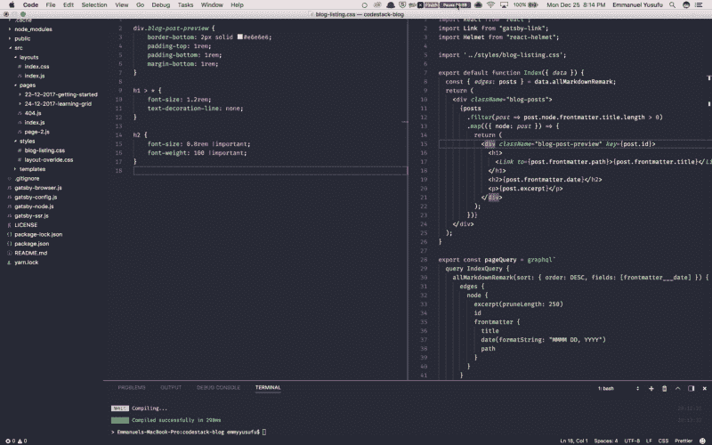

# 如何在 10 分钟内建立一个 React 和盖茨比风格的博客

> 原文：<https://www.freecodecamp.org/news/how-to-build-a-react-and-gatsby-powered-blog-in-about-10-minutes-625c35c06481/>

伊曼纽尔·优素福

# 如何在 10 分钟内建立一个 React 和盖茨比风格的博客


Buddies / Photo by [Genevieve Perron-Migneron](https://unsplash.com/photos/vXZ_lC0XN4c?utm_source=unsplash&utm_medium=referral&utm_content=creditCopyText) on [Unsplash](https://unsplash.com/?utm_source=unsplash&utm_medium=referral&utm_content=creditCopyText)

> 免责声明:这是为盖茨比版本 1 写的，版本 2 刚刚发布，做了一些更改。我会为此写另一个教程。

Gatsby 是一个基于 ReactJS 的高速静态站点生成器。

一个**静态站点生成器** (SSG)是一个硬编码的 HTML **静态站点**和一个成熟的 CMS(内容管理系统)的折衷，比如 Wordpress。

SSG 可用于为内容驱动的网站(如博客)生成 HTML 页面。它只需要页面内容的数据和填充内容的模板。

这篇文章将分为五个部分:

1.  ***入门。***
2.  ***创建布局组件。***
3.  ***创建博客文章。***
4.  ***从博文数据生成新页面。***
5.  ***在登陆页面创建我们网站的降价文件列表。***

我们将通过创建一个名为 ***CodeStack 的虚拟静态博客来深入研究盖茨比及其一些特性。*的**样机如下图所示。我们走吧！✌️



An blog listing page / A single blog post

### 1.入门指南

#### 先决条件

首先，确保您的系统上安装了 Node.js。如果没有，去[](https://nodejs.org/)**为你的操作系统安装一个最新版本。**

**此外，本文假设您对 ReactJS 有所了解。**

#### **安装 CLI**

**Gatsby 有一个命令行工具，它提供了有用的命令，例如:**

*   **搭建一个新的盖茨比项目。**
*   **`gatsby develop`:用于启动支持热重装的 web 开发服务器。**
*   **`gatsby build`:用于构建项目的生产就绪版本。**

**要安装，请在终端上键入以下内容，然后按 enter 键:**

```
`npm install --global gatsby-cli`
```

**让我们创建一个项目文件夹`codestack-blog`并导航终端到它。**

```
`gatsby new codestack-blog && cd $_`
```

**如果您在项目文件夹上执行`gatsby develop`,搭建的站点应该如下所示:**

****

### **添加插件**

**盖茨比有一个庞大且不断增长的插件集。它们本质上是与 Gatsby 的 API 接口的 Node.js 包。**

**它们可以通过 NPM(节点包管理器)安装在终端上，一般有三类: ***功能性******源*** 和 ***变压器*** 插件。**

#### ****功能插件****

**这些插件在 Gatsby 站点或其开发环境中提供了额外的功能。对于我们的应用程序，我们需要:**

*   **`gatsby-plugin-react-helmet`:允许修改`head`标签。请注意，它已经安装在我们的脚手架项目中。**
*   **`gatsby-plugin-catch-links` **:** 拦截来自 markdown 和其他非 react 页面的本地链接，并做一个客户端 pushState，避免浏览器必须刷新页面。**

**安装插件，或者只安装第二个插件。**

```
`npm install gatsby-plugin-react-helmet gatsby-plugin-catch-links`
```

**每当我们添加一个新插件时，我们需要用新插件更新`gatsby-config.js`文件，这样 Gatsby 就能识别和使用它。我们用 ***反斜杠*** 。**

```
`module.exports = {  siteMetadata: {    title: `Gatsby Default Starter`,  },  plugins: [    `gatsby-plugin-react-helmet`,    `gatsby-plugin-catch-links`,  ],}`
```

#### **源插件**

**这些插件将远程或本地位置的数据“来源”到 Gatsby 所谓的 [**节点**](https://www.gatsbyjs.org/docs/node-interface/) 中。要在本地磁盘上以 Markdown 格式写文章，我们需要:**

*   **`gatsby-source-filesystem`:从您计算机的文件系统中获取有关文件的数据。**

```
`npm install gatsby-source-filesystem`
```

**更新`gatsby-config.js`文件:**

```
`module.exports = {  siteMetadata: {    title: `Gatsby Default Starter`,  },  plugins: [    `gatsby-plugin-react-helmet`,    `gatsby-plugin-catch-links`,    {      resolve: `gatsby-source-filesystem`,      options: {        path: `${__dirname}/src/pages`,        name: 'pages',      },    }  ],}`
```

**这是怎么回事？一个`options`对象可以被传递给一个插件进行更多的配置。我们传递文件系统`path`(即我们的 Markdown 文件所在的位置)，然后传递源文件的`name`，这样 Gatsby 就知道我们的源文件以及在哪里应用 transformer 插件。**

#### **变压器插件**

**这些插件将来自 [**节点**](https://www.gatsbyjs.org/docs/node-interface/) 的原始数据转换成可用的数据格式。例如，我们需要:**

*   **`gatsby-transformer-remark`:这将把写在本地磁盘上 markdown `.md`文件中的博客文章转换成 HTML 来呈现。**

```
`npm install gatsby-transformer-remark`
```

**再次更新`gatsby-config.js`文件。**

```
`module.exports = {  siteMetadata: {    title: `Gatsby Default Starter`,  },  plugins: [    `gatsby-plugin-react-helmet`,    `gatsby-plugin-catch-links`,    {      resolve: `gatsby-source-filesystem`,      options: {        path: `${__dirname}/src/pages`,        name: 'pages',      },    },    `gatsby-transformer-remark`,  ],}`
```

**

Well done! / Credit: [Nigel Payne](https://dribbble.com/nigelpayne)** 

### **2.创建布局组件**

**Gatsby 让您轻松创建“布局组件”布局组件是您希望在多个页面之间共享的站点部分。对于我们正在构建的博客，这些是标题和侧边栏**。****

**从根文件夹中，看一看`src/layouts`。您将发现一个`index.js`文件，我们在其中定义布局组件。`index.css`已经有了款式。**

**浏览完`index.js`文件后，您会看到已经创建了两个组件:`Header`和`TemplateWrapper`。在`TemplateWrapper`中，我们用希望呈现在多个页面上的布局组件包装我们网站的内容。**

**这是由`children()`道具实现的。它将呈现我们的网站的所有非布局组件放置在那里。注意，与 React 子道具不同，传递给布局组件的子道具是一个函数，需要被执行。**

**首先在`src/styles/layout-overide.css`新建一个文件夹和 CSS 文件。添加到`index.js`文件中的导入列表。我们需要将 ***导入到`index.css`*** 之后，以覆盖一些现有的样式规则。**

```
`import React from 'react'import PropTypes from 'prop-types'import Link from 'gatsby-link'import Helmet from 'react-helmet'`
```

```
`import './index.css'import "../styles/layout-overide.css";`
```

**打开`layout-overide.css`并粘贴以下样式规则。没必要搞清楚这些。**

```
`* {    background: #f5f5f5;    color: black;}html {    height: 100%;}`
```

```
`body {    height: 100%;    border: 5px solid #ffdb3a;}`
```

```
`h1 {    font-size: 1.5rem;    line-height: 0.5rem;}`
```

```
`p, div {    font-size: 16px;}`
```

**更新标题组件。**

```
`const Header = () => (  <div    style={{      background: '#f5f5f5',      marginBottom: '3rem',      borderBottom: '2px solid #e6e6e6',    }}  >    <div      style={{        margin: '0 auto',        maxWidth: 980,        padding: '1.45rem 1.0875rem',      }}   >     <h1 style={{margin: 0, textAlign: 'center',fontSize: '18px'}}>        <Link to="/"          style={{            color: 'black',            textDecoration: 'none',          }}        >          CodeStack        </Link>      </h1>    </div>  </div>);`
```

**另外，创建一个`Sidebar`组件。**

```
`const Sidebar = (props) => (`
```

```
`<div    style={{      border: '2px solid #e6e6e6',      maxWidth: 960,      padding: '0.5rem',      marginBottom: '25px'    }}    >    <strong>{props.title}.</strong> {props.description}</div>`
```

```
`);`
```

**我们希望`Sidebar`和呈现的`{children()}`组件以如下方式响应:**

****

**由于 React 中没有定义媒体查询的简单方法，我找到了一个名为`[react-media](https://github.com/ReactTraining/react-media)`、 ***的库，这是 React 的 CSS 媒体查询组件。*** 安装它。**

```
`npm install --save react-media`
```

**它提供了一个`<Med` ia >组件**，该组件监听 CSS 媒体查询的匹配，并根据查询是否匹配**来呈现内容。**

**将它添加到我们文件的导入列表中。**

```
`import Media from 'react-media'`
```

**让我们在`TemplateWrapper`中以我们希望的方式在(`Header`、`Sidebar`和`children()`组件)中布局一切。做如下改动(原谅我名字的无耻塞):**

```
`const TemplateWrapper = ({ children }) => (  <div>    <Helmet      title="Gatsby Default Starter"      meta={[        { name: "description", content: "Sample" },        { name: "keywords", content: "sample, something" }      ]}    />    <Header />    <div      style={{        margin: "0 auto",        maxWidth: 980,        display: "flex",        flexDirection: "row",        justifyContent: "space-between",        height: "100%"      }}    >      <Media query={{ maxWidth: 848 }}>        {matches =>          matches ? (            <div              style={{                margin: "0 auto",                maxWidth: 980,                display: "flex",                flexDirection: "row",                justifyContent: "space-between",                height: "100%",                padding: "25px"              }}            >              <div style={{ flex: 1 }}>{children()}</div>            </div>          ) : (            <div              style={{                margin: "0 auto",                maxWidth: 980,                display: "flex",                flexDirection: "row",                justifyContent: "space-between",                height: "100%",                padding: "25px"              }}            >              <div style={{ flex: 2.5, paddingRight: "30px" }}>                {children()}              </div>`
```

```
`<div style={{ flex: 1 }}>                <Sidebar                  title="Codestack"                  description="Articles on React and Node.js. All articles are written by Me. Fullstack Web Development."                />                <Sidebar                  title="About author"                  description="I am a Full-stack Web Developer specializing in React and Node.js based in Nigeria."                />              </div>            </div>          )        }      </Media>    </div>  </div>);`
```

**

You got this! ? / Credit: L[evon](https://dribbble.com/Uzunyan)** 

**在这一大块代码中发生了什么？React media 正在使用一个**三元运算**来决定基于 848px 的 *maxWidth 渲染什么。当屏幕匹配宽度时，只渲染`Header`和`children()`组件。***

```
`<Media query={{ maxWidth: 848 }}>        {matches =>          matches ? (            ...stuff to render...          ) : (            ...stuff to render...          )        }      </Media>`
```

**

A Ternary refresher. If `condition` is `**true**`, the operator returns the value of `**expr1**`; otherwise, it returns the value of `**expr2**`.** 

**如果你注意到了，我们还使用 Flexbox 来布局`children()`和`Sidebar`组件的位置。**

**在终端上运行`gatsby develop`,我们的静态博客现在应该是这样的:**

**

Taking shape ?** 

### **3.**创建博客文章****

**现在让我们开始创建真正的博客文章。Gatsby 利用 GraphQL 从一个或多个来源获取数据，比如本地磁盘、Wordpress API 等等。**

**就我个人而言，我喜欢我可以创建一个静态博客并从 WordPress API 获取内容。我的客户可以在 Wordpress 编辑器中创建文章，我避免了开发 Wordpress 站点的所有麻烦。**

**在本帖中，我们将从我们将在本地磁盘上创建的 Markdown 文件中加载数据。我们之前配置的`gatsby-source-filesystem`插件希望我们的内容在`src/pages`中，所以那就是我们要放它的地方！**

**博客文章的典型做法是将文件夹命名为类似于 MM-DD-YYYY-title 的名称。你可以给它起任何你喜欢的名字，或者在`/pages`文件夹中放一个 markdown 文件。**

**让我们创建一个文件夹`src/pages/12–22–2017-first-post`，并在里面放置一个`index.md`。写:**

```
`---path: "/hello-world"date: "2017-07-12T17:12:33.962Z"title: "My First Gatsby Post"---`
```

```
`Oooooh-weeee, my first blog post!`
```

```
`First post Ipsum is a major key to success. Congratulations, you played yourself. Surround yourself with angels. Celebrate success right, the only way, apple.  The key is to drink coconut, fresh coconut, trust me. Egg whites, turkey sausage, wheat toast, water. Of course they don’t want us to eat our breakfast, so we are going to enjoy our breakfast.` 
```

**虚线包围的块被称为`frontmatter`。我们在这里指定的数据，以及其他降价文件，将被`[**gatsby-transformer-remark**](https://www.gatsbyjs.org/packages/gatsby-transformer-remark/)`插件识别。**

**该插件将把你的 markdown 文件的 frontmatter 元数据部分转换成`frontmatter`和内容部分(Yippeeee，我的第一篇博文！)到 HTML。**

**当我们在 ***第 4 节*** (下一节)中开始直接从 markdown 文件生成博客页面时，`path`将用于指定呈现文件的 URL 路径。例如，上面的降价文件将在`localhost:8000/hello-world`呈现。**

**在此之前，让我们创建一个模板，将任何 markdown 文件呈现到自己的博客页面。创建文件`src/templates/blog-post.js`(请创建`src/templates`文件夹)。**

```
`import React from "react";import Helmet from "react-helmet";`
```

```
`export default function Template({  data }) {  const post = data.markdownRemark;   return (    <div className="blog-post-container">     <Helmet title={`CodeStack - ${post.frontmatter.title}`} />      <div className="blog-post">        <h1>{post.frontmatter.title}</h1>        <div          className="blog-post-content"          dangerouslySetInnerHTML={{ __html: post.html }}        />      </div>    </div>  );}`
```

**我们已经设置了`Template`组件来接收来自我们将要编写的 GraphQL 查询的`data`对象。**

**同样，需要 GraphQL 查询将数据提取到组件中。Gatsby 将查询结果作为`data`和`markdownRemark`注入到模板组件中。**

**我们会发现,`markdownRemark`属性包含了 Markdown 文件的所有细节。**

**现在让我们实际进行查询。它应该放在`Template`组件的下面:**

```
`export const pageQuery = graphql`  query BlogPostByPath($path: String!) {    markdownRemark(frontmatter: { path: { eq: $path } }) {      html      frontmatter {        date(formatString: "MMMM DD, YYYY")        path        title      }    }  }`;`
```

**如果你不熟悉 GraphQL，我会试着分解一下这里发生了什么。*要了解更多关于 GraphQL 的信息，请考虑这个 [**优秀资源**](https://www.howtographql.com/) **。*****

**GraphQL 只是脸书的某种类型的服务器的想法。他们已经编写了一个规范，规定了可以发送到服务器的请求类型以及服务器应该如何响应。GraphQL 的 API 比 REST 更好，因为您描述了客户端需要的确切数据，所以不会再出现数据提取不足或提取过多的情况。**

**这意味着您必须创建自己的 GraphQL 服务器。对我们来说幸运的是，GatsbyJS 自带了现成的 GraphQL 服务器。**

**在上面的代码中，`BlogPostByPath`是将导致一篇博客文章被返回的底层查询。它将作为`data`返回，注入到`Template`组件中。**

**我们传递`BlogPostByPath`参数`$path`来返回与我们当前查看的路径相关的博客文章。**

**此外，recall `markdownRemark`转变了我们的降价文件。它将被视为其内容可通过`data.markdownRemark`获得的属性。**

**我们可以通过`data.markdownRemark.html`访问 HTML。此外，我们用 dahes 块创建的`frontmatter`内容可以通过`data.markdownRemark.title`等访问。**

**整个`blog-template.js`应该是这样的:**

```
`import React from "react";import Helmet from "react-helmet";`
```

```
`export default function Template({  data }) {  const post = data.markdownRemark;   return (    <div className="blog-post-container">     <Helmet title={`CodeStack - ${post.frontmatter.title}`} />      <div className="blog-post">        <h1>{post.frontmatter.title}</h1>        <div          className="blog-post-content"          dangerouslySetInnerHTML={{ __html: post.html }}        />      </div>    </div>  );}`
```

```
`export const pageQuery = graphql`  query BlogPostByPath($path: String!) {    markdownRemark(frontmatter: { path: { eq: $path } }) {      html      frontmatter {        date(formatString: "MMMM DD, YYYY")        path        title      }    }  }`;`
```

**此时:**

*   **我们安装了一堆插件来执行一些实用程序，以及从磁盘上加载文件和将 Markdown 转换为 HTML。**
*   **我们有一个单一的，孤独的降价文件，将作为一篇博客文章。**
*   **我们有一个 React 模板用于在布局中呈现博客文章，还有一个连接起来的 GraphQL 用于查询博客文章数据并将查询到的数据注入 React 模板。**

**太棒了。**

### **4.从博客文章数据生成新页面。**

**Gatsby 提供了一个节点 API，它提供了从博客文章创建动态页面的功能。这个 API 在项目根目录下的`gatsby-node.js`文件中公开。这个文件可以导出几个节点 API，但是我们对`createPages` API 感兴趣。**

**利用官方文档 ( ***注意 blogPostTemplate 路径被设置为反映我们的*** )中提供的[代码段:](https://www.gatsbyjs.org/docs/creating-and-modifying-pages/#creating-pages-in-gatsby-nodejs)**

```
`const path = require('path');`
```

```
`exports.createPages = ({ boundActionCreators, graphql }) => {  const { createPage } = boundActionCreators;`
```

```
`const blogPostTemplate = path.resolve(`src/templates/blog-post.js`);`
```

```
`return graphql(`{    allMarkdownRemark(      sort: { order: DESC, fields: [frontmatter___date] }      limit: 1000    ) {      edges {        node {          excerpt(pruneLength: 250)          html          id          frontmatter {            date            path            title          }        }      }    }  }`)    .then(result => {      if (result.errors) {        return Promise.reject(result.errors);      }`
```

```
`result.data.allMarkdownRemark.edges        .forEach(({ node }) => {          createPage({            path: node.frontmatter.path,            component: blogPostTemplate,            context: {} // additional data can be passed via context          });        });    });}`
```

**检查它是否工作。我建议关闭你的浏览器窗口，从终端使用`ctrl c`停止`gatsby develop`服务器。现在运行`gatsby develop again`，打开`[http://localhost:8000/hello-world](http://localhost:8000/hello-world)`。**

**

yess ?** 

**创建另一个文件`src/pages/24–12–2017-learning-grid/index.md`**

```
`---path: "/another-one"date: "2017-07-12T17:12:33.962Z"title: "My Second Gatsby Post"---`
```

```
`In life there will be road blocks but we will over come it. Special cloth alert. Don’t ever play yourself. The key to more success is to get a massage once a week, very important, major key, cloth talk.`
```

```
`<pre><code>// some css grid code </code></pre>`
```

**再次关闭你的浏览器窗口，停止`gatsby develop`服务器。运行`gatsby develop again`并打开`[http://localhost:8000/another-](http://localhost:8000/hello-world)one`。这显示为:**

****

**如果你愿意，继续创建你自己的网页。✌**

### ****5。**在登录页面创建我们网站的降价文件列表。**

**搭建的 Gatsby 站点附带的默认登录页面位于`src/pages/index.js`。在这里，我们将定义一个模板，并执行一个查询来为它注入`.md`文件列表的数据。执行以下操作:**

```
`import React from "react";import Link from "gatsby-link";import Helmet from "react-helmet";`
```

```
`import '../styles/blog-listing.css';`
```

```
`export default function Index({ data }) {  const { edges: posts } = data.allMarkdownRemark;  return (    <div className="blog-posts">      {posts        .filter(post => post.node.frontmatter.title.length > 0)        .map(({ node: post }) => {          return (            <div className="blog-post-preview" key={post.id}>              <h1>                <Link to={post.frontmatter.path}>{post.frontmatter.title}</Link>              </h1>              <h2>{post.frontmatter.date}</h2>              <p>{post.excerpt}</p>            </div>          );        })}    </div>  );}`
```

```
`export const pageQuery = graphql`  query IndexQuery {    allMarkdownRemark(sort: { order: DESC, fields: [frontmatter___date] }) {      edges {        node {          excerpt(pruneLength: 250)          id          frontmatter {            title            date(formatString: "MMMM DD, YYYY")            path          }        }      }    }  }`;`
```

****

**我相信你在这一点上很厉害，并且已经熟悉了正在发生的事情。注意，我们在上面写了一个不存在的`import`。现在创建文件`/styles/blog-listing.css`:**

```
`div.blog-post-preview {    border-bottom: 2px solid #e6e6e6;    padding-top: 1rem;    padding-bottom: 1rem;    margin-bottom: 1rem;}`
```

```
`h1 > * {    font-size: 1.2rem;    text-decoration-line: none;}`
```

```
`h2 {    font-size: 0.8rem !important;    font-weight: 100 !important;}`
```

**重启服务器，访问登录页面，您应该会看到清单:**

****

### **结论**

**我们已经到了本教程的结尾。感谢您阅读到目前为止。**

**考虑到你可以和盖茨比一起做的事情，这篇文章只是冰山一角。请随意探索如何实施:**

*   **搜索功能**
*   **使用标签对博客文章进行分类**
*   **[部署](https://www.gatsbyjs.org/docs/deploy-gatsby/)您的 Gatsby 站点**

**你可以在这里抓取最终的源代码[。请随意支持我(【devapparel.co】](https://github.com/emmyyusufu/codestack-gatsby-blog))并且看起来不错。也可以评论或分享这篇文章。感谢阅读！**

**页（page 的缩写）我正在和 Ohans Emmanuel 一起写一本关于 React 的书，这本书会让你通过在 30 天内建立 30 个小项目来掌握 React。如果你想了解最新消息，请加入[邮件列表](http://eepurl.com/dfEESD)。谢谢！**