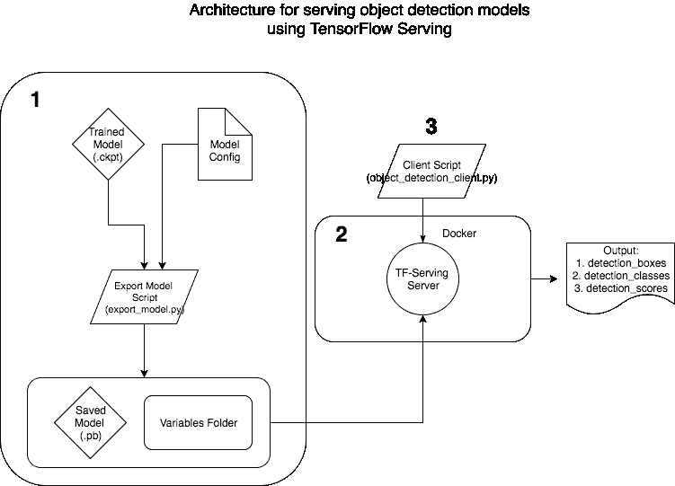
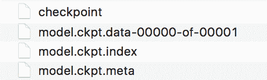
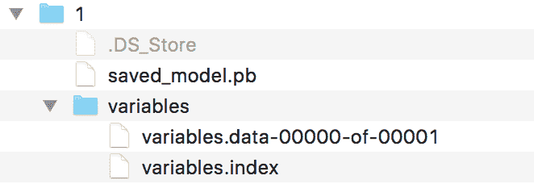
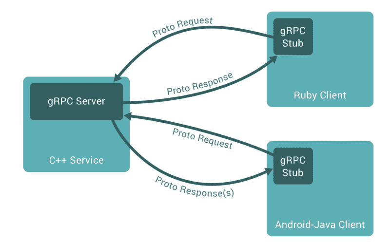

# 如何部署具有 TensorFlow 服务的对象检测模型

> 原文：<https://www.freecodecamp.org/news/how-to-deploy-an-object-detection-model-with-tensorflow-serving-d6436e65d1d9/>

作者高拉夫·凯拉


# 如何部署具有 TensorFlow 服务的对象检测模型

对象检测模型是一些最复杂的深度学习模型。它们能够实时定位和分类图像和视频中的物体。但是一个模型如果不能用于生产又有什么用呢？

感谢 TensorFlow 的优秀员工，我们的 TensorFlow 服务能够为我们的生产模型提供服务。TensorFlow 上有一些非常好的文章可以帮助你入门，比如[这篇](https://www.tensorflow.org/serving/)和[这篇](https://towardsdatascience.com/how-to-deploy-machine-learning-models-with-tensorflow-part-1-make-your-model-ready-for-serving-776a14ec3198)文章。

这篇文章将关注我们如何使用 TF 服务来服务**对象检测模型**。它的动机是缺乏一个好的在线资源来解释如何使用 Docker 创建生产就绪的对象检测模型和 TF 服务环境。我们还将讨论如何服务于该模型并创建一个客户端脚本来访问它。我们的架构看起来会像这样:



本着不重复发明轮子的精神，我已经从本教程的[对象检测 API](https://github.com/tensorflow/models/tree/master/research/object_detection) 中的可用资源中获得了帮助。我假设您已经从 TensorFlow 克隆了对象检测 API，但如果没有，请执行以下操作:

```
# Clone tensorlfow models repohttps://github.com/tensorflow/models.gitcd models/research/object_detection
```

### 1.为 TF 服务创建生产就绪模型

假设您已经使用 TensorFlow 训练了对象检测模型，您将在磁盘中保存以下四个文件:



Trained model files saved on disk

这些文件可以直接用于[推理](https://www.tensorflow.org/programmers_guide/saved_model)。或者我们可以使用*f[reeze _ graph . py](https://github.com/tensorflow/tensorflow/blob/master/tensorflow/python/tools/freeze_graph.py)脚本来[将模型转换成一个由模型架构和权重组成的冻结图](https://blog.metaflow.fr/tensorflow-how-to-freeze-a-model-and-serve-it-with-a-python-api-d4f3596b3adc)在一个文件中。这对于在本地机器上进行测试很有用，但是不适合生产环境。*

为了创建可供使用的模型，我们将调整对象检测 API Github 上的**[*exporter . py*](https://github.com/tensorflow/models/blob/master/research/object_detection/exporter.py)**文件。repo 上可用的原始脚本没有保存服务所需的**变量**。使用下面的 ***exporter.py*** 脚本代替原来的 TensorFlow 脚本。

对上述 ***exporter.py* 做了如下修改:**

1.  更改为***_ write _ saved _ model***方法。这是必需的，因为原始 python 脚本没有保存服务模型所需的 ***变量*** 。现在，我们不使用***frozen _ graph _ def***，而是使用***trained _ check point _ prefix***，它将模型的权重作为变量。(感谢本期[Github](https://github.com/tensorflow/models/issues/1988))

2.将调用函数从 ***冻结 _ 图形 _ 定义*** 更改为 ***训练 _ 检查点 _ 前缀*** 如下:

3.注释掉服务期间不需要将文件保存到磁盘的代码:

现在，您已经准备好创建可以用于服务的模型了。以下代码可以帮助您实现这一点:

下面是代码的解释:

1.  每个对象检测模型都有一个需要传递给 *export_model.py.* 的配置，该配置包含关于模型架构的信息。更多信息，请参考此[链接](https://github.com/tensorflow/models/blob/master/research/object_detection/g3doc/detection_model_zoo.md)。
2.  ***get _ configs _ from _ pipeline _ file***方法从配置文件创建一个字典，***create _ pipeline _ proto _ from _ configs***方法从这个字典创建一个 proto buffer 对象。
3.  ***输入 _ 检查点*** 是被训练模型的 ***model.ckpt*** 的路径。
4.  ***model_version_id*** 是当前型号版本的整数。这是 TF-serving 对模型版本化所要求的。
5.  ***object _ detection . exporter***将以如下格式保存模型:



Model ready to be used by TF-Serving

***1/*** 是模型版本， ***saved_model.pb.*** 它包含模型架构， ***变量*** 目录中有模型的权重。这个模型已经准备好了。

### 2.使用 Docker 创建 TF 服务环境。

#### 关于 Docker

> Docker 是一个软件工具，可以让你将软件打包成标准化的单元，用于开发、运输和部署。Docker 容器映像是一个轻量级的、独立的、可执行的软件包，包括运行它所需的一切:代码、运行时、系统工具、系统库、设置。

简而言之，Docker 让我们将您的应用程序及其依赖项隔离在一个独立的包中，可以随时随地使用，而不必担心安装代码和系统依赖项。

我们使用 docker for TensorFlow 服务的动机是，我们可以将我们的容器运行在云上，并轻松扩展我们的服务，而不必再次安装任何依赖项。

TensorFlow serving 的官方文档描述了如何从源头构建它。这很好，但是我(以及社区中的许多 T2 人)在 docker 容器中编译它时遇到了问题。因此，我们将在这里逐一介绍这些步骤。

1.  **使用官方 docker 映像构建容器**

假设您已经按照上一部分中的描述克隆了正式的 TensorFlow 服务 repo，您可以通过执行以下操作来构建 docker 映像:

```
# Move to the directory of the docker filescd ./serving/tensorflow_serving/tools/docker/
```

```
# Build the image (CPU)docker build --pull -t $USER/tensorflow-serving-devel-cpu -f Dockerfile.devel .
```

```
or
```

```
# Build the image (GPU)docker build --pull -t $USER/tensorflow-serving-devel-gpu -f Dockerfile.devel-gpu .
```

在启动 docker 容器之前，在 docker 应用程序的首选项部分增加容器可用的内存(到 10–12 GBs)和 CPU(到 4–6)。构建 TensorFlow 服务是一个内存密集型过程，默认参数可能不起作用。完成后，您可以像这样启动容器:

```
[FOR CPU]docker run -it -p 9000:9000 $USER/tensorflow-serving-devel-cpu /bin/bash
```

```
or
```

```
[FOR GPU]docker run -it -p 9000:9000 $USER/tensorflow-serving-devel-gpu /bin/bash
```

在容器中，执行以下操作:

```
[FOR CPU]# Clone the TensorFlow serving Github repo in the containergit clone --recurse-submodules https://github.com/tensorflow/servingcd serving/tensorflow
```

```
# Configure TensorFlow./configurecd ..
```

```
# Build TensorFlow servingbazel build -c opt --copt=-msse4.1 --copt=-msse4.2 tensorflow_serving/...
```

```
or
```

```
[FOR GPU]# TensorFlow serving Github repo is already present in the container # so do not need to clone again# Configure TensorFlow with CUDA by accepting (-y) --# with_CUDA_support flagcd serving/tensorflow./configure
```

```
# Build TensorFlow serving with CUDA bazel build -c opt --copt=-msse4.1 --copt=-msse4.2 --copt=-mavx --copt=-mavx2 --copt=-mfma --copt=-O3 --copt=/usr/local/cuda tensorflow_serving/...
```

根据主机系统和 docker 配置，构建过程可能需要一个小时。一旦构建没有任何错误地完成，您就可以测试模型服务器是否正在运行:

```
bazel-bin/tensorflow_serving/model_servers/tensorflow_model_server
```

输出应该如下所示:

```
Flags:
```

```
--port=8500                       int32 port to listen on
```

```
--enable_batching=false           bool enable batching
```

```
--batching_parameters_file=""     string If non-empty, read an ascii BatchingParameters protobuf from the supplied file name and use the contained values instead of the defaults.
```

```
--model_config_file=""            string If non-empty, read an ascii ModelServerConfig protobuf from the supplied file name, and serve the models in that file. This config file can be used to specify multiple models to serve and other advanced parameters including non-default version policy. (If used, --model_name, --model_base_path are ignored.)
```

```
--model_name="default"            string name of model (ignored if --model_config_file flag is set
```

```
--model_base_path=""              string path to export (ignored if --model_config_file flag is set, otherwise required)
```

```
--file_system_poll_wait_seconds=1 int32 interval in seconds between each poll of the file system for new model version
```

```
--tensorflow_session_parallelism=0 int64 Number of threads to use for running a Tensorflow session. Auto-configured by default.Note that this option is ignored if --platform_config_file is non-empty.
```

```
--platform_config_file=""         string If non-empty, read an ascii PlatformConfigMap protobuf from the supplied file name, and use that platform config instead of the Tensorflow platform. (If used, --enable_batching is ignored.)
```

您的服务环境现在可以使用了。退出容器，并将容器中的更改提交给映像。你可以这样做:

*   按[Cltr-p] + [Cltr-q]退出容器
*   查找容器 Id:

```
# Find the container Iddocker ps CONTAINER ID        IMAGE                        COMMAND             CREATED             STATUS              PORTS               NAMES
```

*   提交更改:

```
# Commit the changes[FOR CPU]docker commit ${CONTAINER ID} $USER/tensorflow-serving-devel-cpu
```

```
or
```

```
[FOR GPU]docker commit ${CONTAINER ID} $USER/tensorflow-serving-devel-gpu
```

*   重新进入容器:

```
docker exec -it ${CONTAINER ID} /bin/bash
```

注意:要让 TensorFlow 服务容器访问主机系统上的 GPU，您需要[在您的系统上安装 nvidia-docker](https://github.com/NVIDIA/nvidia-docker) 并像这样运行容器:

```
nvidia-docker docker run -it -p 9000:9000 $USER/tensorflow-serving-devel-gpu /bin/bash
```

然后，您可以通过使用***NVIDIA-SMI****cmd 来检查您在容器内的 GPU 使用情况。*

#### *预建的 Docker 图像*

*正如我在一些 Github 问题上看到的(参见参考资料)，人们无法编译 docker 上的 TensorFlow 服务。因此，我已经为 CPU 和 GPU 支持预建了 docker 映像。*

*你可以在我的 [Docker Hub 页面](https://hub.docker.com/u/gauravkaila/)找到它们，或者你可以像这样把图片拉下来:*

```
*`[FOR CPU]docker pull gauravkaila/tf_serving_cpu`*
```

```
*`or`*
```

```
*`[FOR GPU]docker pull gauravkaila/tf_serving_gpu`*
```

### *3.创建客户端以请求在 Docker 容器中运行的模型服务器对测试图像进行推断*

#### *gRPC (Google 远程过程调用)和协议缓冲区快速介绍*

*gRPC (Google 的远程过程调用)是 Google 的 HTTP2 包装的 RPC 协议。这允许在计算机上运行的客户端通过计算机网络访问远程计算机，并调用远程计算机上的“函数”,就好像该函数是客户端本地的一样。*

*TensorFlow 服务使用此协议为模型提供推理服务。根据[官方文档，](https://grpc.io/docs/guides/)*

> *在 gRPC 中，客户端应用程序可以直接调用不同机器上的服务器应用程序的方法，就像它是一个本地对象一样，这使得您可以更容易地创建分布式应用程序和服务。*

*

gRPC architecture* 

*这里，gRPC 服务器是我们运行 TensorFlow 服务的 docker 容器，我们的客户机在 python 中请求这个服务进行推理。这篇文章描述了 RPC 是如何以一种非常结构化的方式工作的。*

*gRPC 使用 [**协议缓冲区**](https://developers.google.com/protocol-buffers/) 序列化结构化数据，并为可调用的方法定义参数和返回响应。它是语言中立和平台中立的。它有一个结构化语言，然后将运输序列化代码编译成您选择的语言，以包含在您的项目中。它以二进制格式传输数据，与传统的 JSON 和 XML 相比，二进制格式更小、更快。*

#### *创建客户端*

*张量流服务请求可以是三种类型之一:*

1.  *分类:使用分类 RPC API，它接受一个输入张量(例如图像)并输出一个类和一个分数。*
2.  *预测和回归:使用预测 RPC API，它接受一个输入张量(如图像)并输出多个张量，如(用于对象检测)边界框、类、分数等。*

*由于这里的问题是一个预测问题，我们将使用预测 RPC API。为此，我们需要在服务于 github 的 [TensorFlow 上可用的 predict protobuf，并且我们需要将它们转换成我们特定语言的代码(即 Python)。](https://github.com/tensorflow/serving/tree/master/tensorflow_serving/apis)*

*你可以自己做，或者走捷径，从这个 [github repo 下载 python 文件。](https://github.com/Vetal1977/tf_serving_example/tree/master/tensorflow_serving/apis)我们将使用这个 protobuf 对象在客户机中创建一个预测请求。*

***预测 RPC 客户端的模板***

*存根是一段用于在远程过程调用(RPC)期间转换参数的代码。由于客户机和服务器位于不同的地址空间，从客户机发送到服务器的参数(反之亦然)需要进行转换，以便远程服务器计算机将 RPC 视为本地函数调用。这里使用的存根是如上所述从 predict protobuf 生成的代码。*

#### *启动 TensorFlow 服务*

*如前一部分所述，我们的 TensorFlow 服务将在一个 docker 容器中运行，该容器的端口对外开放。假设 docker 映像可用，容器可以像这样启动:*

```
*`$ docker run -it -d -P --name tf_serving_cpu -p 3000:3000 gauravkaila/tf_serving_cpu`*
```

*这里，端口 3000 对世界开放，客户端可以通过该端口访问 TensorFlow 服务。将第一部分中创建的模型目录导出到容器内的一个文件夹中:*

```
*`$ docker cp /path/to/model tf_serving_cpu:/path/to/destination`*
```

*要运行服务，进入容器并启动:*

```
*`# Move to the serving/ directory$ cd serving/`*
```

```
*`# Start the service$ bazel-bin/tensorflow_serving/model_servers/tensorflow_model_server --port=3000 --model_name=obj_det--model_base_path=/path/to/dest &> obj_det &`*
```

*确保**型号名称**标志与客户端中指定的名称相同。输出记录在 **obj_det** 中。如果一切顺利，您将能够在键入时看到以下输出:*

```
*`$ tail -f obj_det`*
```

> *tensor flow _ serving/model _ servers/main . cc:288]运行 0.0.0.0 版本的 ModelServer:3000…*

*该模型正在服务，并准备由我们的客户使用。*

#### *在测试图像上可视化边界框*

*对象检测模型的目的是可视化图像上所定位对象的边界框。为了可视化带有边界框的最终图像，我们将使用 TensorFlow 对象检测 API 中的[**visualization _ utils . py**](https://github.com/tensorflow/models/blob/master/research/object_detection/utils/visualization_utils.py)**文件。***

***我们可以像这样访问结果的各个输出:***

```
***`boxes = result.outputs['detection_boxes'].float_valclasses = result.outputs['detection_classes'].float_valscores = result.outputs['detection_scores'].float_val`***
```

***这将返回 protobuf 对象，这些对象可以输入到 **visualization_utils.py** 文件中:***

```
***`image_vis = vis_util.visualize_boxes_and_labels_on_image_array(    {input_image},    np.reshape(boxes,[100,4]),    np.squeeze(classes).astype(np.int32),    np.squeeze(scores),    category_index,    use_normalized_coordinates=True,    line_thickness=8)`***
```

***最终的客户端脚本将如下所示:***

#### ***最终输出***

***发送一个时钟的测试图像，我们的最终输出应该是这样的。**注意**:这里使用的模型是一个在 COCO 数据集上预训练的更快的 RCNN，其类别号 85 对应于一个时钟。***

```
***`outputs {key: “detection_boxes”value {dtype: DT_FLOATtensor_shape {dim {size: 1}dim {size: 300}dim {size: 4}}float_val: 0.24750074744224548float_val: 0.17159424722194672float_val: 0.9083144068717957float_val: 0.797699511051178`***
```

```
***`outputs {key: "detection_classes"value {dtype: DT_FLOATtensor_shape {dim {size: 1}dim {size: 300}}float_val: 85.0`***
```

```
***`outputs {key: "detection_scores"value {dtype: DT_FLOATtensor_shape {dim {size: 1}dim {size: 300}}float_val: 0.9963208436965942`***
```

******

#### ***我们取得了什么成就***

***我们从一个对象检测用例开始，展示 TensorFlow 服务的强大功能。我们将训练好的模型导出为 TensorFlow serving 所期望的格式，使用 Docker 编译 TF-serving，并创建一个可以请求模型服务器进行推理的客户端脚本。***

#### ***未来会怎样***

1.  ***使用这个用例作为模板，我们可以使用 TensorFlow 服务于其他预测和分类模型。***
2.  ***我们可以利用 TensorFlow 的 GPU 版本来获得更快的推理。***
3.  ***我们可以通过部署多个运行 TF 服务的 docker 容器来扩展我们的服务。***
4.  ***您可以批量输入图像，而不是每次请求发送一个图像。***

#### ***资源***

1.  ***[TensorFlow 对象检测 API](https://github.com/tensorflow/models/tree/master/research/object_detection)***
2.  ***[这个关于 TF-Serving 的超赞博客](https://towardsdatascience.com/how-to-deploy-machine-learning-models-with-tensorflow-part-1-make-your-model-ready-for-serving-776a14ec3198)***

*****Github 问题:*****

*   ***[https://github.com/tensorflow/serving/issues/542](https://github.com/tensorflow/serving/issues/542)***
*   ***[https://github.com/tensorflow/serving/issues/590](https://github.com/tensorflow/serving/issues/590)***
*   ***[https://github.com/tensorflow/serving/issues/410](https://github.com/tensorflow/serving/issues/410)***
*   ***[https://github.com/tensorflow/serving/issues/672](https://github.com/tensorflow/serving/issues/672)***
*   ***[https://github.com/tensorflow/serving/issues/659](https://github.com/tensorflow/serving/issues/659)***

*****关于作者:** Gaurav 是位于爱尔兰都柏林埃森哲首要研究和创新中心 Dock 的机器学习工程师。他的兴趣包括为计算机视觉应用构建可扩展的深度学习系统。在 gauravkaila.com 的[找到更多](http://gauravkaila.com)***