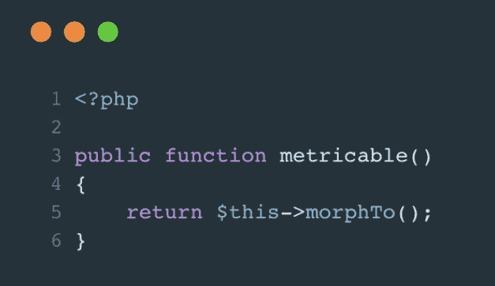
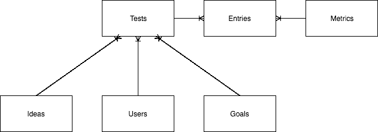

# Laravel 的多态关系:一个实际的用例

> 原文：<https://www.freecodecamp.org/news/a-practical-use-case-for-laravels-polymorphic-relationships-231ab425b95a/>

作者:乔·狄克逊

# Laravel 的多态关系:一个实际的用例

最近，当我从事我的副业 hustle [Zero to Grow](https://zerotogrow.io/) 时，我遇到了一个相当复杂的数据库设计问题。

该解决方案涉及 Laravel 多态关系的一个用例，远远超出了文档中的[注释](https://laravel.com/docs/5.5/eloquent-relationships#polymorphic-relations)示例。

### 有什么问题吗

为了解决这个问题，你需要对我正在开发的应用程序有更多的了解。

[Zero to Grow](https://zerotogrow.io/) 是一款面向希望发展副业的开发者的应用。无论他们的目标是增加流量，保留，转换或其他任何东西；这个应用程序可以提供帮助。

在注册时，用户被要求定义他们希望实现的总体目标以及他们需要跟踪的度量标准。

一旦他们的目标被定义，用户就可以创建并运行测试，目的是满足这些目标。测试的一个例子是“每天至少发一条推文来增加参与度”。

与目标一样，用户需要定义要跟踪的度量标准，以便确定测试是否成功。

在整个测试或目标的过程中，度量标准应该可以根据用户的要求随时更新。

更复杂的是，我们还有观念的概念。它们可以是个人用户私有的，也可以公开给其他人使用。

想法永远是测试的起点。用户会发现一个想法，或者通过自己创建或者通过搜索公共目录，然后开始测试它，看它对整体目标的影响。

### 设计模式

为了理解多态关系有什么帮助，我将一点一点地向您介绍我为解决这个问题而设计的模式。

#### 目标和指标

用户可能希望他们的主要目标是提高登录页面的整体转化率。为了有效地衡量这一点，他们可能希望跟踪登录页面的总访问者以及注册总数。

在开始目标时，用户应该输入基本和目标指标值。在目标的生命周期中，他们应该定期用最新的值更新指标。

数据结构看起来像这样。

这个图表告诉我们，每个目标可以有一个或多个指标，每个指标可以有一个或多个条目。

有了这个数据结构，用户将能够创建一个目标，并为其分配他们希望跟踪的所有指标。然后，他们将能够在目标的生命周期内根据需要用新条目更新目标。

#### 想法和指标

用户应该能够定义一个想法，并关联任何应该跟踪的指标。在这方面，数据结构将类似于上面的目标和指标。然而，在用户开始测试之前，我们不需要担心跟踪指标。

与前面的例子一样，每个想法可以有许多度量标准，这将满足我们的需求。

#### 试验

测试是事情开始变得有趣的地方。

如前所述，创意可以公之于众，因此可以被许多不同的用户测试。事实上，每个测试都需要被分配到一个目标，这使得事情变得更加复杂。

在启动新测试时，用户应该输入其基础和目标指标值。然后，在测试的生命周期中，他们应该定期添加最新的值。

本质上，这是一个三向数据透视表。Laravel 中这个表的默认命名约定是`idea_goal_user`。它并不完全是脱口而出的。

通常，我发现数据透视表倾向于封装某种特性或行为，我更喜欢用反映这一点的方式来命名它。在这种情况下，目标、想法和用户的组合是运行测试所需要的一切。这样，这张桌子就变成了`tests`。它允许多个用户使用一个想法，并为其分配一个目标。

您可能已经注意到，在上图中，`entries`表促进了`tests`和`metrics`表之间的多对多关系。

这里必须做出一个关键的设计决策。想法是公开可用的，并且可以被多个用户测试，这意味着如果这种多对多的关系不存在，就不可能知道哪个用户输入了一个针对该指标的值。

### 多态关系如何提供帮助

在查看这个模式时，有几个地方可以使用多态关系。

首先，提取多态关系最明显的地方是目标表和想法表到度量表之间。尽管关系不同，但两者存储的数据是相同的，因此是完美的用例。

不要定义单独的表来定义度量，比如`goal_metrics`和`idea_metrics`，只需定义一个表，并对两者使用一对多的多态关系。迁移可能看起来像这样。

模型关系定义如下:

这就是这段关系所需要的。利用它与定义标准的一对多关系没有什么不同。

第二个用例有点难以发现，您可能不同意我的方法。然而，在我看来，这是一个真正优雅的解决方案。

目标的度量和测试的度量都与条目表有关系。这是存储与定义的指标相关的值的地方。

对于目标，这种关系应该是一对多的。一个度量可以有许多条目，但是一个条目属于一个度量。

对于测试，这种关系略有不同，因为度量标准是根据可以由多个用户测试的想法来定义的。因此，每个测试可以有许多指标，并且每个指标可以属于许多测试。这是一个多对多的关系。

为了解决这个问题，可以在测试和度量之间定义一个中间(或枢纽)表。调用这个表`entries`并将输入的值直接存储到这个数据透视表中是有意义的。

尽管条目与 bot 测试和目标之间的关系是不同的，但我认为在这种情况下，打破标准数据库规范化并使用单个表来存储度量的所有数据条目是有意义的。

实现可能如下所示:

模型关系定义如下:

与这些关系的互动仍然极其简单。

这就是多对多多态关系。

正如我前面提到的，这不是解决这个问题的唯一方法。您可能希望使用单独的表来处理最后一个多对多关系。尽管它打破了惯例，但是将所有的度量条目数据保存在同一个表中是一个特别好的解决方案，也是 Laravel 的本机多态关系的强大之处的一个很好的例子。

对我来说，以这种方式设计解决方案，可以更容易地“发现”应用程序在六个月内为项目的新成员和我自己做了什么。尽管如此，最终还是要各得其所！你会选择不同的路线吗？如果是这样的话，让我们在下面的评论中聊聊吧——我很想知道你的想法。

最初发表于[joedixon.co.uk](https://joedixon.co.uk/a-practical-use-case-for-laravels-polymorphic-relationships)。