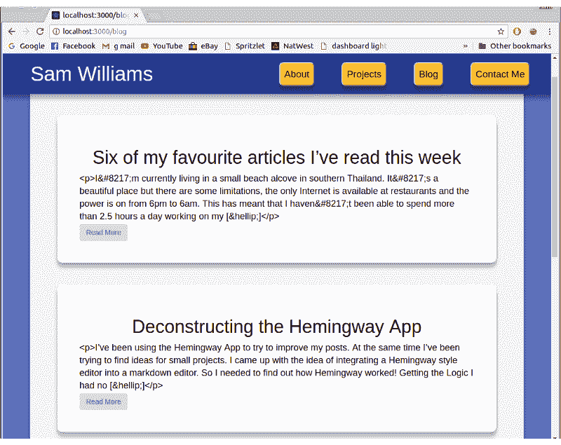
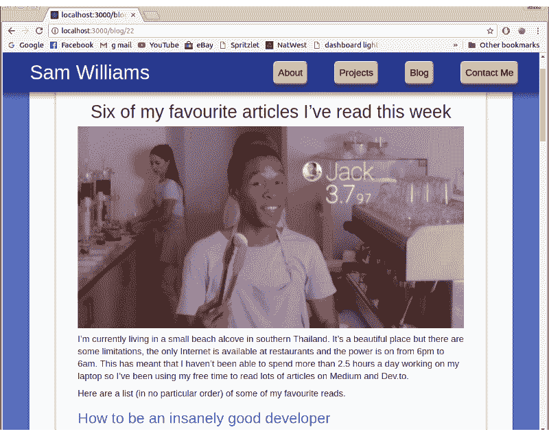

# 用 React 和 WordPress API 在你的网站上创建一个博客

> 原文：<https://www.freecodecamp.org/news/get-a-blog-on-your-website-with-react-and-wordpress-api-c63ff81b388e/>

在过去的几个月里，我读了很多文章，并注意到许多文章都否认这篇文章最初是在个人博客上发表的。我写了一些文章，想增加我的曝光率，所以我决定我也想在我的网站上有一个博客。但是怎么做呢？

### 选择

将博客整合到我的网站有几个选择。主要的两个是定制内容管理系统(CMS)或 WordPress。我想快速设置好，所以我用了 WordPress。

### WordPress API

在过去的几周里，我听说了一些关于 WordPress API 的事情，所以开始搜索。我在 WordPress.com 建立了一个免费博客，并从 Medium 导入了我的文章。这对于 Medium 的导出工具和 WordPress 的“从 Medium 导入”工具来说非常简单。

现在我在 WordPress 上有了我的文章，我必须弄清楚如何访问它们。我在文档中找到了[这个页面](https://developer.wordpress.com/docs/api/),并构建了一个非常基本的网页进行测试。

```
<h1>wordpress checker</h1>

<script src="https://cdnjs.cloudflare.com/ajax/libs/jquery/3.1.0/jquery.min.js"></script>

<script src="getWordpress.js"></script>
```

getWordpress.html

```
console.log("this is a proof of concenpt");

$.get(
  "https://public-api.wordpress.com/rest/v1/sites/YourSite.wordpress.com/posts",
  function(response) {
    console.log(response);
  }
);
```

getWordpress.js

这完成了一个非常简单的任务，即调用 WordPress API 并从“YourSite.wordpress.com”中请求所有的帖子。

### 按指定路线发送

现在我要在我的网站上添加一个博客部分，我必须改变我的单个页面。我安装了 react-router-dom，并将`BrowserRouter`和`Route`导入到我的布局文件中。

```
<BrowserRouter>
    <div id="center-stripe">
        <Nav />
        <Route exact path="/" component={main} />
        <Route exact path="/blog" component={Blog} />
    </div>
</BrowserRouter>
```

### 在 React 中创建博客

我的个人网站是使用 create-react-app 建立的，有一个非常基本的结构。我需要做的下一件事是添加一个新的“博客”页面，显示所有文章的预览。

```
export default class Blog extends Component {
  constructor(props) {
    super(props);
    this.state = {
      posts: []
    };
  }
  componentDidMount() {
    axios
      .get(
        "http://public-api.wordpress.com/rest/v1/sites/samwcoding.wordpress.com/posts"
      )
      .then(res => {
        this.setState({ posts: res.data.posts });
        console.log(this.state.posts);
      })
      .catch(error => console.log(error));
  }

  render() {
    return (
      <div className="blog">
        <h1 className="sectionTitle">Articles</h1>
        {this.state.posts.map(post => <ArticlePreview post={post} />)}
      </div>
    );
  }
}
```

blog.js

我会告诉你这个代码。顶部用一个空的 posts 数组设置组件的状态。然后我使用`componentDidMount`函数用 axios 执行对 WordPress API 的调用。当 API 调用返回时，我将 this.state.postss 设置为 post 数组。这导致第 24 行为每个帖子呈现一个`ArticlePreview`组件。

```
render() {
    if (this.props.post) {
      return (
        <div className="article">
          <a href={"/blog/" + this.props.post.ID} className="blackLink">
            {this.props.post.featured_image ? (
              
            ) : (
              ""
            )}
            <h1 className="text-center">{this.props.post.title}</h1>
            <div className="content">{excerpt}</div>
          </a>
          <Link to={"/blog/" + this.props.post.ID}>
            <button className="btn">Read More</button>
          </Link>
        </div>
      );
    } else {
      return null;
    }
  }
```

articlePreview.js

ArticlePreview 接收每篇文章，并呈现带有标题和摘录的预览，标题和摘录都由 WordPress API 提供。如果帖子也有特色图片，那也包括在内。



Previews from the WordPress API

我重用了网站其他部分的 CSS 来设计文章预览，看起来很不错。一个主要的错误是“

I ’”和类似的比特遍布摘录。为了解决这个问题，我将摘录设置为在呈现到屏幕之前运行一个`removeUnicode()` 函数。它只是用逗号替换了所有的`&#8217` ，并删除了`<p> and [&hellip;]`标签。不优雅，但很管用。

然后，我必须为整篇文章创建一个组件。我为`/blog/:id` 添加了另一条路线，并开始新的组件。它几乎与`ArticlePreview` 组件相同，除了它不是只呈现摘录，而是呈现一篇文章。从 WordPress 获取文章非常简单，只需将文章 ID 添加到前面的 API 调用的末尾。

```
axios.get(
    "http://public-api.wordpress.com/rest/v1/sites/samwcoding.wordpress.com/posts/" +
    this.props.match.params.id
)
```

获得文章回应是我遇到的第一个绊脚石。文章的主体是字符串化的 HTML 格式。我用`dangerouslySetInnerHTML` 函数找到了解决方法。 **(如果有人对如何更好地实现这一点有任何建议，请告诉我。)**



Working article

我还需要做一些改变。顶部的导航按钮刚刚连接到锚定标签。这在单页网站上运行良好，但现在他们把用户送到`/blog#about`，这是行不通的。通过将链接明确定义为`/#about` 和`/#projects`解决了这个问题。

对于我目前写的文章数量，博客运行良好，但当有 50 或 100 篇文章时，它将如何应对？在未来，我可能不得不一次呈现一些文章预览，如果用户滚动到底部，会呈现更多。我可以添加的另一个功能是搜索。

查看位于 [SamWSoftware blog](https://samwsoftware.herokuapp.com/blog) 的博客，并在这里查看我的全部[代码](https://github.com/SamWSoftware/NodePortfolio)。