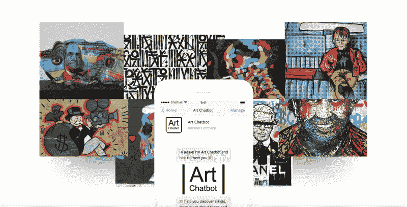
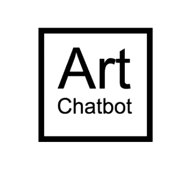
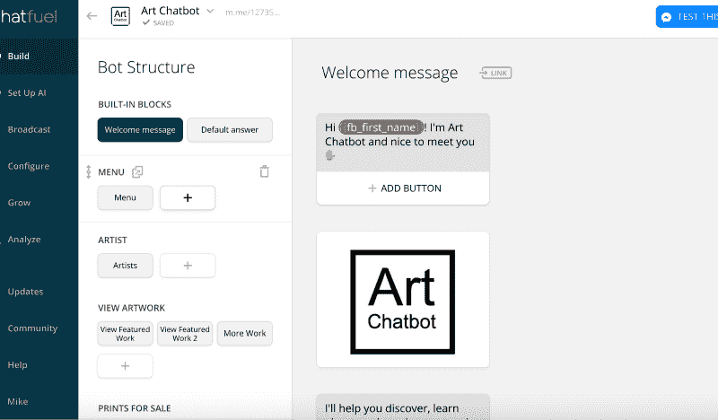
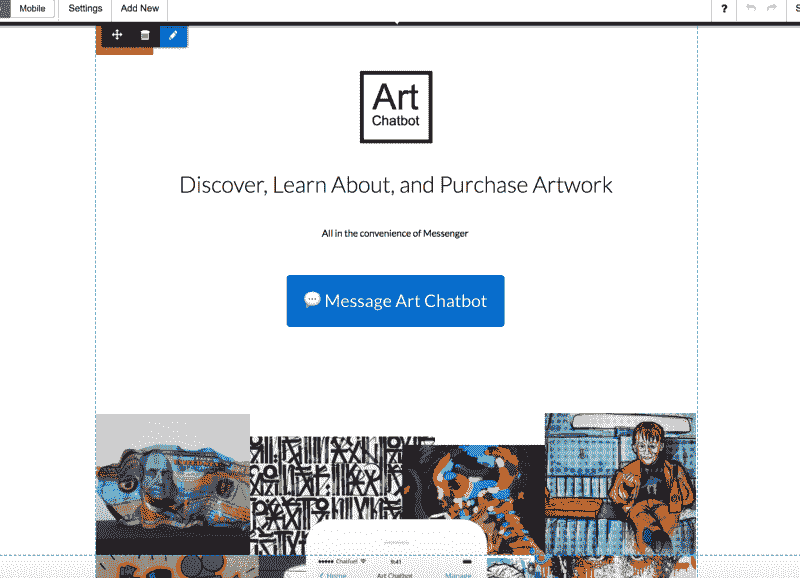
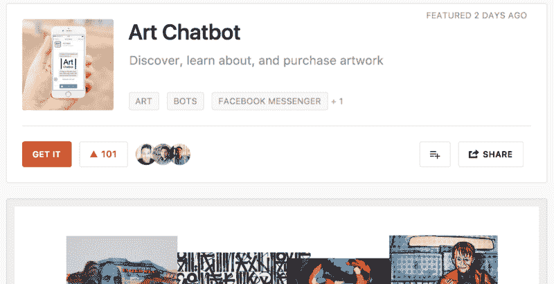
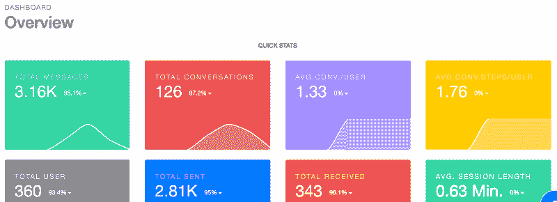

# 我是如何在周末创建并发布聊天机器人的

> 原文：<https://www.freecodecamp.org/news/how-i-built-and-launched-a-chatbot-over-the-weekend-ad8efc522f33/>

作者:迈克·威廉姆斯

# 我是如何在周末创建并发布聊天机器人的

#### 在几个小时内将您的想法转化为功能机器人，获得真实的用户反馈，并在周末结束前发布！？

[Art Chatbot](http://www.artchatbot.com)- Discover, learn about, and purchase artwork through Messenger

聊天机器人并不新鲜。但是他们是一种我们大多数人可能已经读过，可能使用过的技术，然而仅仅因为缺乏日常和长期的接触而没有真正理解。

在上周五之前的几个月里，我收藏了聊天机器人相关的出版物(如[聊天机器人杂志](https://chatbotsmagazine.com))，喜欢脸书关于聊天机器人的帖子，甚至还投票支持了[产品搜索](https://www.producthunt.com/topics/bots)上的一些帖子。

我想改变我对聊天机器人的理解，并挑战自己在周末尽可能多地学习。我决定是时候通过掌握基础知识和构建自己的聊天机器人来真正理解它们了。

#### 像我发起的大多数项目和公司一样，我首先定义了以下内容:

*   时间表:周日是我的最后期限，因为这是一个周末项目。
*   目标:了解聊天机器人开发人员现有的工具，我可以利用这些工具来利用技术，并在此基础上进行构建(我决定使用 [Chatfuel](http://www.chatfuel.com) )。这将让我对聊天机器人有一个基本的了解。
*   成功结果:建立一个功能性的聊天机器人，做好一件事，迭代真实的用户反馈，并启动。

与过去的项目不同，在决定开始之前，我头脑中没有确切的想法。

我的笔记本电脑上开着一个窗口，显示着我正在看的一幅有限的艺术家作品([亚历克·大富翁的“巴勃罗·司法”](https://artlife-gallery.myshopify.com/collections/alec-monopoly/products/alec-monopolys-pablo-judicial-diamonds-and-gold-serigraph-screenprint))。我只是在谷歌上输入“艺术聊天机器人”，看看是否已经有一个聊天机器人购买艺术品。

令我惊讶的是，没有。我知道我对艺术的热情与我周末想掌握聊天机器人的愿望是完美匹配的。

然后，我删除了搜索中的空格，在我的前面出现了“艺术聊天机器人”这个名字。9 美元，几秒钟后，我也有了[域名](http://www.artchatbot.com)。

由于当时还是周六凌晨，而且上述事件发生在大约 30 分钟内，我有一个小时左右的时间来制作这个标志(使用 [Squarespace 标志制作工具](https://logo.squarespace.com/))。

然后，我致力于社交资产的精益品牌化( [Snappa](http://snappa.io) )，还创建了[脸书页面](https://www.facebook.com/Art-Chatbot-127359754533703/)(这是构建和测试机器人所必需的，因为它是一个 Facebook Messenger 机器人)。

Squarespace logo in minutes, and free!

现在我有了 logo，社交封面，也有了脸书页面，我邀请了几个朋友来喜欢这个页面。

我收到了一些回复，询问我对这个页面做了些什么，并评论了它的名字和标志。因此，在我的精益品牌实践的几分钟内，我已经得到了一些积极的反馈！

然后，我告诉他们我正在构建什么，并问他们是否可以在我构建的过程中，在接下来的几个小时内进行测试。

在我开发的时候，这导致了真实的用户反馈，这样我就可以为我的聊天机器人创建一个更真实的对话设计和流程。

在 [Chatfuel](http://www.chatfuel.com) 上设置好之后，我看了一些 YouTube 教程，用了一些 Chatfuel 上提供的模板，通过修改来学习(感谢[角色](http://personabots.com/)！).

我意识到这个过程相当简单，它完全是关于对话流和用户旅程的。

#### 然后，我完成了下面的定义练习，以定义我将要构建的内容:

1.  规划对话流程和用户旅程。在这种情况下，用户可以发现艺术家、查看艺术品和购买艺术品。
2.  定义机器人的结构。在 Chatfuel 中，这是通过“块”来完成的，我为每个主状态、子状态、目的地、查询和回答创建了“块”。
3.  确定并限制我要显示的内容的数量。因为我花了几个小时来构建它，所以更多的是体验和验证，而不是我认为它应该有多健壮。

实际上，在 Chatfuel 中构建机器人是从第二步开始的，用的是积木。现在是周六下午三点左右，我开始着手构建的雄心勃勃的复杂系统让我有点不知所措。

为了克服这一点，我删除了一些艺术家，要展示的艺术品，然后是可用的艺术品，这样我就可以专注于更好的体验，而不是试图说明数量。

Art Chatbot being built from the Chatfuel dashboard.

周六结束前，我已经完成了 Art Chatbot 的初始版本。我让朋友们测试了聊天机器人，并提供了真实的反馈，所有的社交网页和资源都准备在周末之前发布。

随着这个初始版本的完成，我花了一个星期天，感觉时间不那么紧张了。我可以更专注于准备一次发布以及持续的聊天机器人迭代。

我也开始在机器人中实现基本的人工智能功能。我给一些艺术技术公司发信息，询问哪些数据对他们有价值(我知道我可以很容易地收集这些数据)。通过这种方式，我可以在他们的雷达上，并可能通过未来的数据建立一个具有一定货币价值的聊天机器人。

我在周日结束了这一天，用 Instapage 制作了一个快速登陆页面，并为周一的产品发布会进行了优化。

Created a [landing page](http://www.artchatbot.com) in a few minutes using Instapage and the content I used from the chatbot blocks.

为了预发布聊天机器人，我还设置了[机器人分析](http://botanalytics.co)(帮助监控、跟踪和分析消息)，发布在[脸书群组](https://www.facebook.com/groups/aichatbots/)中，以产生初始用户，然后起草我将发布的产品搜索介绍。

我还用谷歌文档创建了我将在社交渠道上分享的所有措辞。然后，我可以简单地复制文本，添加产品搜索 URL，并在周一跨渠道共享。

结果是，Art Chatbot 在[产品搜索](https://www.producthunt.com/posts/art-chatbot)上获得了 100 次投票，并在当天结束时发送了 1800 多条信息。

我不仅了解了聊天机器人，而且通过一个真实的用例，我对自己对该技术的理解更加自信。我还改进了我的能力和我用来快速构建和发布产品的过程。

From idea Saturday to [Product Hunt](https://www.producthunt.com/posts/art-chatbot) Monday!

总的来说，我认为周末项目是成功的——更重要的是，它令人耳目一新，充满乐趣！

我还试图“开源”所有关于 Art Chatbot 构建的东西(我在我的 [social](http://www.instagram.com/yoroomie) 上记录了它)和 Chatbot 路线图。我将继续向所有有兴趣参与或贡献的人公开所有内容(下面的链接)。

Day 2 analytics following Product Hunt launch.

Art Chatbot 开源？it.ly/artchatbotopensource

带着学习和使用上述过程的渴望，任何人都有可能在一个周末构建自己的聊天机器人！？

如果你有任何问题和反馈，一定要发微博给我，如果你推出了自己的聊天机器人，也请告诉我，我会查看/转发的！你也可以在这里查看我在这个周末项目[后制作的个人聊天机器人。](http://m.me/itsyoroomieofficial)

### *特别感谢[艾弗里·安东](https://www.instagram.com/averyandon/?hl=en)和[艺术生活](https://artlife.com/)在艺术聊天机器人创作过程中给予的灵感。艺术生活是艺术家和艺术品的官方在线画廊，在艺术聊天机器人中链接为 URL。

*想看更多细节的视频吗？观看这段 12 分钟的视频，我会分享更多:*