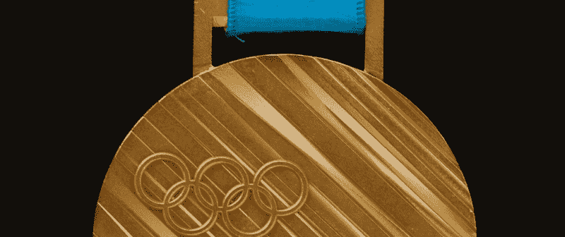
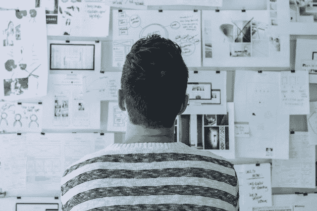
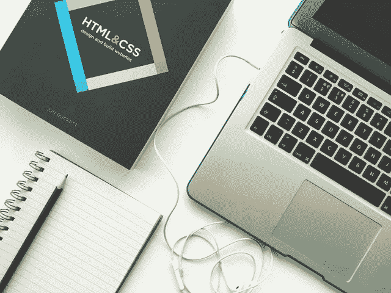
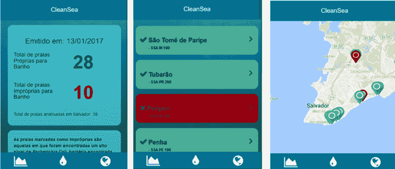
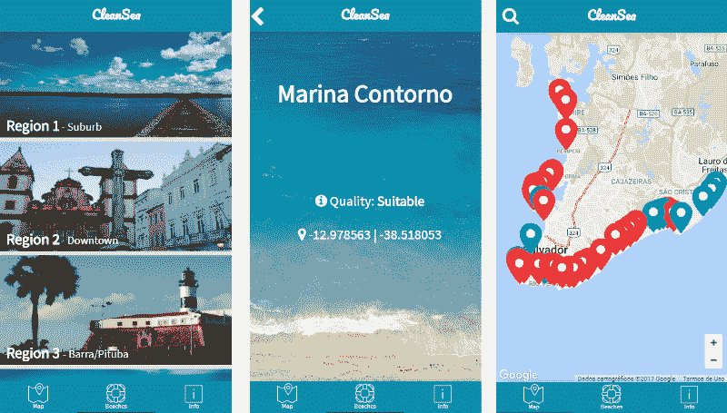

# 我的应用程序如何在国际学生竞赛中获得第三名

> 原文：<https://www.freecodecamp.org/news/how-my-app-won-third-place-in-an-international-student-competition-ed14113881f6/>

拉斐尔·梅洛

# 我的应用程序如何在国际学生竞赛中获得第三名

我开发的一个应用程序在 2017 年 IEEE 移动应用程序开发大赛( [IEEEmadC 2017](http://ieeemadc.org/) )上获得了第三名，这是世界各地学生开发的 40 多个同样出色的应用程序中的第三名。这是一次奇妙的经历，它让我开阔了思维，以新的方式看待事物，并提高了我作为开发人员的技能。

这里有三点，我相信这三点让我的应用程序从来自全球各地的学生的这么多有趣和非常好的应用程序中被选中，我相信这三点也能让你的应用程序做到这一点。

### 1.选择一个对你自己的生活和你周围的人有用的想法。

竞赛的第一阶段是创意阶段。超过 200 个团体提交了惊人的想法，我是其中之一。但是就像大多数人一样，我有很多我认为很棒的想法。我怎么能选择一个并专注于它呢？

在我的城市萨尔瓦多巴伊亚，我们有许多美丽的海滩，是巴西著名的旅游城市。但是一年中的大部分时间，我们的海滩都被污染了，因为我们的大多数河流都接收污水，导致海滩变脏。好的一面是海滩非常适合夏天。但是当下雨时，尤其是在其他季节，它们变得不适合污水。

有些人无视这个事实，继续去海滩，冒着因水中大肠杆菌含量高而感染多种疾病的风险。其他人只是避开海滩，错过了我们城市提供的最令人惊叹的东西之一。我们有非常美丽温暖的海滩，一些人包括许多外国游客只是不知道。

大多数人不知道，政府测量海滩中大肠杆菌的水平，并每周在互联网上公布。

当我发现这一点时，这个想法就冒出来了——一个向公众返回每个海滩上大肠杆菌水平信息的应用程序。这将为游客和公众提供一个知道去哪个海滩的方法。我知道这个想法不仅会帮助我，也会帮助其他人。

当第一阶段结束时，我收到一封电子邮件，告诉我我的想法是 40+中的一个。这是一种令人兴奋的感觉。但是我知道我将要和来自世界各地的 40 多组人竞争，而我只有一个想法。

### 2.明智地选择你的工具，用你已经知道的去做。

第二阶段是开发，我的想法必须在三个月内变成一个应用程序，我没有团队，我必须选择如何构建它。

我想到的第一件事是，既然这是一个移动应用程序竞赛，我也许应该用 Java 开发一个 Android 应用程序，或者用 Swift 开发一个 iOS 应用程序。但问题是，我不知道 Java 或 Swift。我在 Java 的一些课程中学到的知识很少，而且我从未真正使用过 Swift。我很想学其中一个来参加比赛，但是我的时间真的很短。

所以我明智地决定用我已经知道的东西。我是一名网络开发实习生，我使用的主要语言是 JavaScript。所以我决定使用一个基于 Apache Cordova 的混合平台，并且成功了。在最初的两个月里，我只用 JavaScript 从前端和一些后端构建了几乎所有的东西。事实上，我对这门语言很熟悉，这在各个方面都给了我帮助。

我知道对于我们这样的开发人员来说，逃避新事物听起来很可怕。但我相信这是关于知道发现新事物的正确时间和使用你感到舒适的东西的正确时间。

一位老师曾经告诉我，

> 大多数人在某些目标上失败了，因为在最关键的时候，他们决定尝试新的东西，而不是他们已经知道的东西。

比赛结束时，我很高兴我听到了那些话。

### 3.你的应用是为人类而不是机器设计的——不要低估设计。

我的应用程序快完成了，我决定问问我的朋友们对它的看法。大部分都不喜欢，而我离比赛截止日期不到一个月。

用他们的话说，它“很丑”，他们不知道如何使用它。

我很沮丧:我开发了一个我认为很好的应用程序，但是如果人们不理解如何使用它，也不喜欢它，它就几乎一文不值了…

First Version of the APP

所以我决定学习一点关于设计的东西，我认为这是我一生中不必要和多余的东西。我用我学到的东西来改进我的应用程序，这样人们就会有兴趣使用它。因为我在大学里从来没有上过设计课，所以互联网是我最好的朋友，我开始了我从未学习过的旅程。

设计是它自己的世界。有这么多的领域和理论，你不可能在这么短的时间内学会所有的东西。所以我决定专注两件事，**用户体验**和**色彩理论**。经过一些研究和大量的试验和错误，我终于得到了人们开始称赞的东西。

Final Version

它不再难看了，每个人都知道如何使用它。

它让我大吃一惊。

对我来说，这改变了我看待事物的方式。设计真的很重要，应该认真对待。毕竟，这是关于用户如何与我们创造的东西互动，用户是每个系统中最重要的部分。没有用户就没有应用。这个比赛永远地改变了我对设计的想法，这也是我参与的每一个项目中我都会带着的东西。

在评审阶段结束时，我收到了另一封电子邮件，这一次告诉我，我的应用程序获得了第三名，即计算机协会特别奖。我真的很开心，不仅仅是因为我觉得我的努力让我获得了一些伟大的东西，还因为我参加比赛时是一个人，比赛结束时是一个完全不同的人。

这是我认为让我的 App 在 IEEEmadC 2017 大赛上获得季军的三件事。真正让评委喜欢我的应用的只有他们自己知道，但我确实相信这三件事——选择正确的想法、正确的工具和应用设计——会有所不同，我想与人们分享。这次经历改变了我很多东西，我希望我能分享这种感觉。

我要感谢 IEEE 给我这个机会，让这么多学生聚在一起创造伟大的东西，感谢所有评委在这么多优秀的应用中艰难地选择了三个，感谢我的女朋友和朋友在设计部分给了我这么多帮助。

以下是所有[赢家](http://ieeemadc.org/winners/)的回顾。