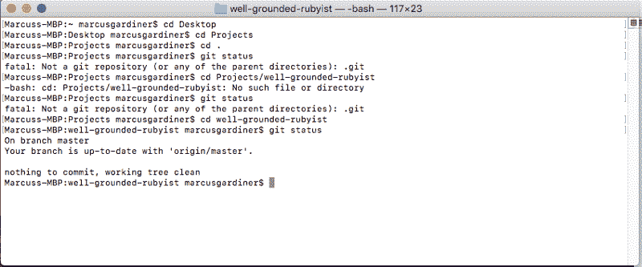
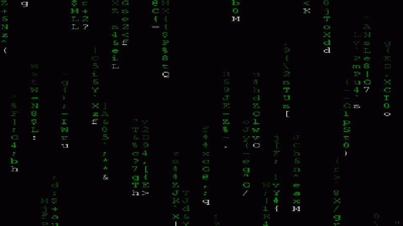
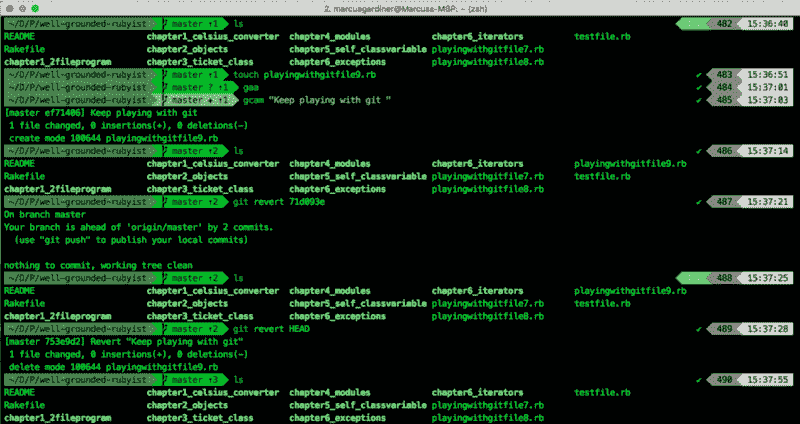
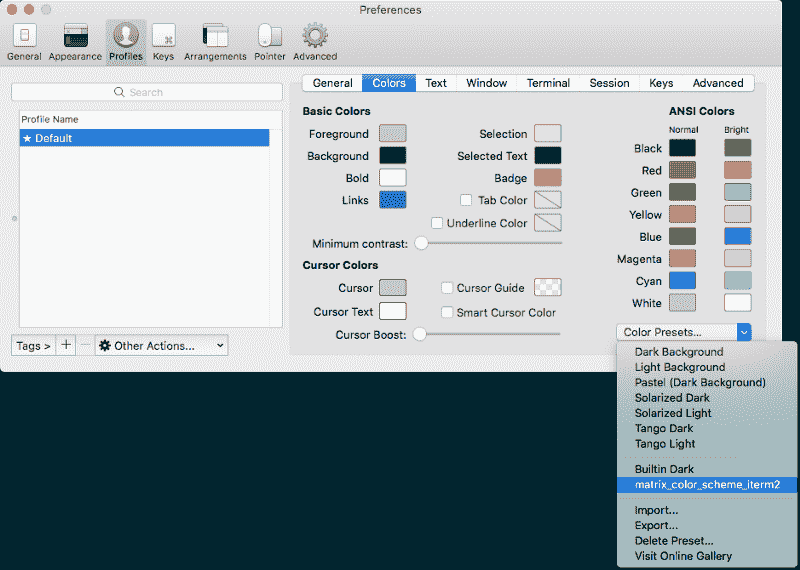
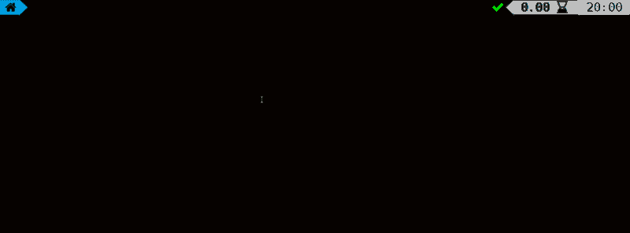
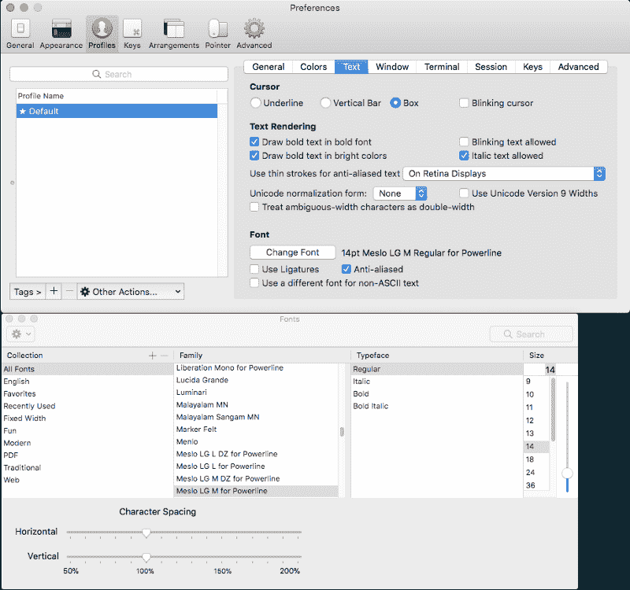

# 如何认真升级你的 Mac 终端(甚至给它一个矩阵主题)

> 原文：<https://www.freecodecamp.org/news/how-to-make-a-badass-matrix-terminal-and-maybe-learn-something-about-code-8abc81c6b7a2/>

马库斯·加德纳

# 如何认真升级你的 Mac 终端(甚至给它一个矩阵主题)

#### 一粒蓝色药丸，一粒红色药丸和通向终极幸福的三个步骤


Photo by [Markus Spiske](https://unsplash.com/photos/FXFz-sW0uwo?utm_source=unsplash&utm_medium=referral&utm_content=creditCopyText) on [Unsplash](https://unsplash.com/search/photos/matrix?utm_source=unsplash&utm_medium=referral&utm_content=creditCopyText)

#### 你的 Mac 终端现在看起来是这样的吗-->(换句话说，有点糟糕)？



Note to self: this does not make you feel like an all-powerful coding prodigy

#### 你希望它看起来像这样->(或者，你知道，坏蛋)？



GIFs courtesy of Giphy images

#### 或者更现实一点-->(其实更牛逼)……像这样？



The colour scheme is only one part of the awesomeness

**看起来仍然很糟糕，**它现在已经可以使用，并且能够运行大量额外的有用功能，这些功能将节省你的时间，让你感觉自己像一个下一级的编码者(无论你是否坚持矩阵配色方案)。

### 现在我引起了你的注意，让我们一起学习吧。

亲爱的读者，我对你的承诺是，我会尽可能用简单的英语带你去完成这个光荣的事实调查任务。我自己正处于我的编码之旅的开始，但这并不意味着我们不能完成伟大而重要的事情(比如通过解决如何使每件该死的事情看起来像矩阵来避免实际学习如何编码，并且可能在这个过程中意外地学习一些关于代码的东西)。

#### 对于门外汉:Mac 上的终端是什么？

通常你用键盘和鼠标在屏幕上点击鼠标来做有趣的事情。使用“终端”( Mac 附带的一个普通应用程序),您可以命令电脑做一些事情，而不是使用键盘上的输入功能。

这些可以是简单的事情，比如通过键入“mkdir <foldername>”创建一个新文件夹，也可以是强大的事情，比如强迫你的计算机给你做一个三明治:</foldername>


Disclaimer: your computer may not make you a sandwich.

现在，这是明确的，我们如何使终端真棒？

### 蓝色药丸或红色药丸…

正如我确信你在一篇关于松散快速矩阵参考的博文中所预期的，有两种选择。蓝色药丸很简单，你不到三分钟就能快速吃完。红色药丸更令人兴奋，更吸引人，而且有更高的上限——为此我们需要利用你更多宝贵的神经元。


That red pill looks absolutely delicious, I bet it has a ton of Omega-3s

#### 蓝色药丸

对于蓝色药丸，这里有一些快速简单的步骤，让您的终端让 Neo 感到自豪:

**【1】打开终端通过聚光灯搜索功能**
-命令⌘ +空格，"终端"

**[2]打开终端首选项:将配置文件更改为“家酿”，包括启动时**
-**-**终端，首选项，常规- >带配置文件的新窗口- >家酿
-终端，首选项，配置文件- >家酿- >点击左下方的“默认”

**[3]重启终端**

您现在应该有一个*niiicceee*Matrix 风格的终端，如下所示:


Pretty sweet for almost no effort

那颗蓝色药丸既美味又简单。现在是红色药丸。

#### 红色药丸

这是给那些超水平的人，疯狂的人，寻求真理的人。在它之后，你的终端代码将不仅仅看起来像矩阵，它将做全能的事情。你可能再也不会是同一个程序员了…

**只需要三个步骤:**
**【1】将你的终端**
**【2】将它做成矩阵**
**【3】对你的终端进行功率分级**


### 第 1 步，共 3 步:对你的终端进行分类

首先，我们需要让您的终端做一些令人惊叹的事情，包括:

*   **安装 [iTerm](https://www.iterm2.com/features.html) :** 一个更好的终端版本(点击[此处](https://www.iterm2.com/documentation-highlights.html)查看从分割窗格到智能搜索终端搜索的强大功能)
*   **把 shell 从“bash”换成更加灵活强大的“zsh”**(shell 就像你的终端应用正在运行的软件。它把你的键盘命令输入终端，然后交给电脑去执行。)
*   **安装“ [oh-my-zsh](https://github.com/robbyrussell/oh-my-zsh) ”，这将为您的 zsh shell** 充电(也就是说，它是一个用于管理您的 zsh 配置的*社区驱动的框架)*
*   **额外功能:语法高亮显示**(在你运行命令之前显示你的命令是否会运行)和 **z 终端导航**(通过使用“频率”估计你想要切换到的文件夹，使终端导航更快)

要让你的终端具备以上所有功能，请遵循 Jilles Soeters 的这份优秀指南: [**Baddassify 你的终端**](http://jilles.me/badassify-your-terminal-and-shell/) ，然后回到步骤 2 和 3。

#### 很高兴你回来了

**现在是时候**拿起你新分类的终端，完全吞下那颗红色药丸了…


### 第 2 步，共 3 步:制作矩阵

谢天谢地，一些善良的灵魂(罗伯特·邓普西)已经为 iTerm 导出了一个完整的矩阵配色方案，所以我们需要做的就是导入它！

当然，如果矩阵颜色主题不符合你的喜好，你可以随意使用默认颜色并跳到第 3 步！

**【1】从[此链接](https://gist.github.com/rdempsey/596193b8ede69767719c#file-matrix_color_scheme_iterm2)下载配色方案代码，并将文件夹移动到容易访问的地方**
**-** 点击:“下载 Zip”
-在桌面上创建一个名为“iTermThemes”的文件夹
-将文件“matrix_color_scheme_iterm2”移动到 iTermThemes 文件夹(不是整个文件夹，只是文件)

**【2】打开终端，切换到你移动文件**的目录
——使用切换目录(cd)命令，切换到你保存文件
的文件夹`**cd Desktop/iTermThemes**`

**[3]现在你已经在终端中的正确目录(文件夹)中，复制粘贴以下代码到终端中运行它:**
**`for`** `f **in** *****; **do**`
`THEME**=$(**basename "$f"**)**`
`defaults write -app iTerm 'Custom Color Presets' -dict-add "$THEME" "**$(**cat "$f"**)**"`
`**done**`

**此代码**遍历文件中的每个颜色代码(使用“for…”)
，并将结果保存为 iTerm
( ***颜色示例:*** *'所选文本颜色' = { '蓝色分量' = ' 1.000000 ')；绿色成分' = ' 1.000000 '；红色分量' = '1.000000')*

**[4]更新 iTerm 首选项以使用新的矩阵配色方案**
- iTerm2，首选项，配置文件，颜色，颜色预设，" matrix_color_scheme_iterm2 "



The spelling ‘Colors’ upsets me deeply as a born and raised Brit

#### **你的终端现在应该是这样的:**


### 第 3 步，共 3 步:提高终端的功率

还有吗？！事实上，还有更多，你希望你的终端是镇上的话题，对不对？

下一步是用 Ben Hilburn 的 [Powerlevel9k 提升你的终端，用开箱即用的配置赋予它花哨的符号和可定制的小发明。这些视觉提示实际上对于节省空间和理解您的实际环境非常有用，比如您在哪个目录，您在哪个 Git 分支，甚至您的代码运行了多长时间。](https://github.com/bhilburn/powerlevel9k)



**在我们开始之前，一些背景知识:**
- " **Powerlevel9k"** 是 Oh-My-Zsh
的一个*主题*-为了让符号正确显示，您还需要安装一个"**电力线** " *字体*(一种包含一组符号的字体，就像 wingdings 有符号，但也有实际的字母)

#### 为“我的 ZSH”安装 Powerlevel9k 主题

**【1】**将这段代码复制到您的终端中，这会将 Powerlevel9k 存储库克隆到您的 Oh-My-Zsh 自定义主题目录中。

```
$ git clone https://github.com/bhilburn/powerlevel9k.git ~/.oh-my-zsh/custom/themes/powerlevel9k
```

**【2】**然后你需要通过编辑配置文件
**【I】**在文本编辑器“nano”中打开配置文件，在你的终端中键入以下内容:
`**nano** ~/.zshrc`

**【ii】**找到文件中带有
`ZSH_THEME="<theme_nam`e>
…的部分，替换为(重要:没有 sp `aces)`
`ZSH_THEME="powerlevel9k/powerle` vel9k "

**注意:**您可以使用箭头键在“nano”文本编辑器中导航，并直接输入(比 VIM 容易得多，如果您曾经使用过它的话！).

**【iii】**保存更改并退出纳米文本编辑器:
- Ctrl-x(即^x)
- Y(这样保存更改)

**现在…最后一步**


#### 安装并选择电力线字体

谢天谢地，安装标准电力线字体非常容易！

[1]通过运行下面的代码，您将把[电力线存储库](https://github.com/powerline/fonts)克隆到您的计算机上，并在一个简单的步骤中安装所有字体(您可以保留注释)。

```
# clonegit clone https://github.com/powerline/fonts.git --depth=1# installcd fonts./install.sh# clean-up a bitcd ..rm -rf fonts
```

[2]在 iTerm 首选项中选择电力线字体
- iTerm，首选项，配置文件，文本，更改字体，*为电力线选择 Meslo LG M



### 剩下的就是感受你的新终端的力量了


### 如果我告诉你…这仅仅是开始

我强烈推荐继续玩 [iTerm](https://www.iterm2.com/index.html) 、 [Oh-My-Zsh](https://github.com/robbyrussell/oh-my-zsh) 和 [Powerlevel9k](https://github.com/bhilburn/powerlevel9k) 的异能。这是一个非常实用的方法，可以在给终端充电的同时学习更多的知识。

有大量的设置，定制选项和插件，所以你可以让你的终端看起来和行为完全符合你的要求，有一堆令人敬畏的功能。

我发现一个简单的方法是将下面的代码添加到 zshrc 文件中。在“ZSH 主题”行之前的终端`**nano** ~/.zshrc)`中输入。这缩短了每行显示的文件路径，并为代码本身节省了一些空间。

```
#Shorten directory shownPOWERLEVEL9K_SHORTEN_DIR_LENGTH=1POWERLEVEL9K_SHORTEN_DELIMITER=””POWERLEVEL9K_SHORTEN_STRATEGY=”truncate_from_right”
```

```
#Set default user to avoid showing 'user' on every lineDEFAULT_USER=”whoami”
```

当然，如果你厌倦了绿色，你也可以为你的终端选择其他颜色。你要知道，你可能会让莫斐斯不高兴。


我希望你喜欢你的新的 Badass Matrix 终端，如果你喜欢这篇博文，(我的第一篇！)，可以随意点击‘关注’，点击下面漂亮的中拍手按钮给我几个拍手？

[***点击这里我的下一篇文章:《如何成为一个学习代码的超级忍者》***](https://codeburst.io/how-to-become-a-code-learning-super-ninja-1-ae293637c337)