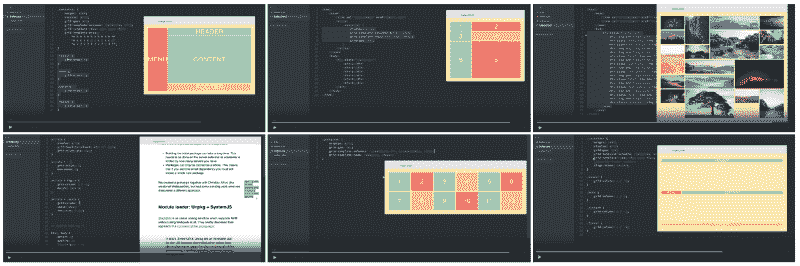
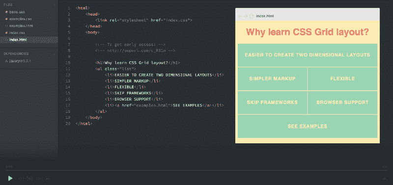
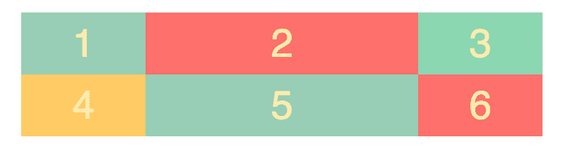
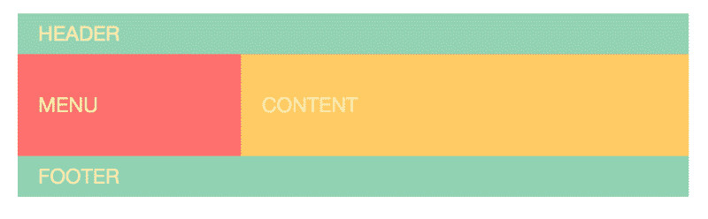
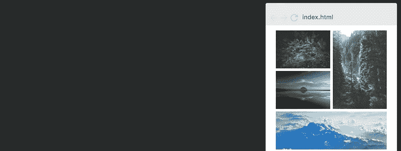
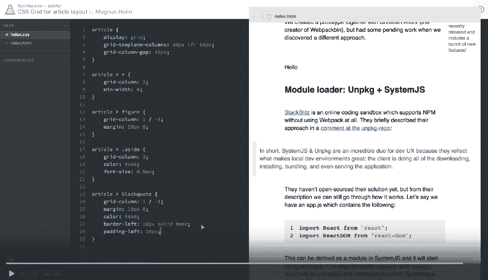

# 在这个交互式的 14 部分教程中免费学习 CSS 网格

> 原文：<https://www.freecodecamp.org/news/heres-my-free-css-grid-course-merry-christmas-3826dd24f098/>

#### 从初级到高级的互动课程。

在过去的几周里，我一直在钻研 CSS 网格，并创建了一个关于这个主题的完整课程。我了解得越多，就越确信 CSS Grid 是创建网站布局的未来。

课程是免费的，你甚至不需要认证就可以观看。但是，如果您想保存笔记并在整个课程中提问，您必须登录。

[Click the image to get to the course.](https://scrimba.com/g/gR8PTE?utm_source=freecodecamp.org&utm_medium=referral&utm_campaign=gR8PTE_launch_article)

现在让我们来看看你将学到什么，以及你将如何学习。

注意:我还推出了免费的 [CSS 变量课程](https://scrimba.com/g/gcssvariables?utm_source=freecodecamp.org&utm_medium=referral&utm_campaign=gR8PTE_launch_article)和 [CSS Flexbox 课程](https://scrimba.com/g/gflexbox?utm_source=freecodecamp.org&utm_medium=referral&utm_campaign=gR8PTE_launch_article)，如果你对这些科目更感兴趣的话。

### 课程结构

本课程围绕三个部分展开。前两个是线性的，要按顺序看。它们包含了我认为最重要的 CSS 网格概念。

第三部分是额外的部分，在这一部分中，您将学习前两部分没有涉及到的概念，并查看几个可以使用 CSS Grid 构建的示例。

#### 第 1 部分—基础知识

我们先从**为什么**要学习 CSS Grid 开始。我将向您展示 CSS Grid 相对于 Bootstrap 等框架的优势，比较两种方法的代码。

然后我们将直接进入 CSS 网格，从一个非常简单的网格开始，它将教你如何定义**行**和**列**，以及你可以用来设置宽度和高度的不同值。这也将教会你基本的反应能力。

下一步是创建一个虚拟的网站布局。在这里，您将学习如何在网格中定位项目。我们将用一个令人兴奋的使用`grid-template-areas`属性的实验来结束第一部分，它允许你快速的原型化布局。

在第一节结束时，你应该知道如何在你的个人项目中使用 CSS Grid。以下是您将要学习的主要概念:

*   `display: grid;`
*   `grid-template-columns`，`grid-template-rows`
*   `grid-template`(速记)
*   `grid-column`，`grid-row`
*   `grid-template-areas`
*   `grid-area`
*   `grid-gap`
*   `fr`

为了获得这一部分的要点，你也可以看看我的两篇文章[在 5 分钟内学会 CSS 网格](https://medium.freecodecamp.org/learn-css-grid-in-5-minutes-f582e87b1228)和[如何用 CSS 网格快速制作网站原型](https://medium.freecodecamp.org/how-to-prototype-websites-quickly-with-css-grid-ffc9cba08583)。他们触及了其中的一些概念，尽管没有这门课那么深入。

#### 第 2 部分—高级的东西

在这里，您将了解高级响应能力。这将能够在该部分的末尾创建一个超级酷的图像网格:

注意网格是如何在物品上移动的，以使其不管宽度如何都能工作。

如您所见，它根据屏幕大小的宽度改变列数，并在项目(具有不同的大小和形状)上来回移动，以便没有开放点。

大多数神奇的事情都发生在 CSS 的一行中[。然而，这一行代码有点复杂，所以我们将详细介绍每一步，以便您能够完全掌握它。](https://medium.freecodecamp.org/how-to-make-your-html-responsive-by-adding-a-single-line-of-css-2a62de81e431)

以下是你将学到的东西:

*   `auto-fit`
*   `repeat`
*   `minmax`
*   `grid-auto-flow`
*   隐式行
*   网格如何布置项目

此时，您应该可以轻松地使用 CSS Grid 创建任何布局。无论你还不知道什么概念，你都完全有能力自己去发现，因为你对 CSS 网格有很强的核心理解。

#### 奖金部分

最后一部分是奖励材料。这不一定要按顺序观看，因为截屏并不相互依赖。这一部分主要由各种 CSS 网格概念组成，我们无法将它们放入前两部分。然而，您还会发现 Flexbox 和 Grid 之间的比较，在这里我会看到这两个模块的不同之处，以及它们如何一起使用。

另外，我的联合创始人 [Magnus](https://medium.com/u/1a7998d688dd) 会给你一个非常酷的例子，告诉你如何用 CSS Grid 重新创建文章布局。这个讲座也启发了我写一篇关于同一主题的[文章。](https://medium.freecodecamp.org/how-to-recreate-mediums-article-layout-with-css-grid-b4608792bad1)

Magnus 将带你使用 CSS 网格构建一个文章布局。

最后，我们会在任何需要的时候用内容来充实这门课程。

如果您觉得课程中缺少一些东西，只需[告诉我们](https://gitter.im/scrimba_community/Lobby)，我们将在奖金部分制作一个关于该主题的新截屏。

以下是您将在奖金部分学到的内容。

*   命名线
*   调整和对齐(项目、自我和内容)
*   创建一个中等风格的文章布局(由 [Magnus](https://medium.com/u/1a7998d688dd)
*   CSS Flexbox 与网格

### 辛巴格式

这个课程是使用 Scrimba 构建的，这是一个交互式编码截屏工具，我是 together 和 [Sindre](https://twitter.com/sindreaars) 的联合创始人。

Scrimba 截屏看起来像普通的视频，但是，它们是完全互动的。您可以编辑类型转换中的代码。

这里有一张解释这个概念的 gif 图:

暂停截屏→编辑代码→运行！→查看您的变化

当您觉得需要试验代码以便正确理解它时，或者当您只想复制一段代码时，这是非常有用的。此外，Scrimba 截屏视频的文件大小只占视频的 1%，这意味着即使你的互联网连接很慢，它也更容易传输。

所以我真的希望你会喜欢这门课。[立即注册](https://scrimba.com/g/gR8PTE?utm_source=freecodecamp.org&utm_medium=referral&utm_campaign=gR8PTE_launch_article)我们在那里见:)

感谢阅读！我叫 Per，我是 Scrimba 的联合创始人，我喜欢帮助人们学习新技能。如果你想获得关于新文章和资源的通知，请在 [Twitter](https://twitter.com/perborgen) 上关注我。

* * *

感谢阅读！我的名字叫 Per Borgen，我是最简单的学习编码方法——Scrimba 的联合创始人。如果你想学习建立专业水平的现代网站，你应该看看我们的[响应式网页设计训练营](https://scrimba.com/g/gresponsive?utm_source=freecodecamp.org&utm_medium=referral&utm_campaign=gR8PTE_launch_article)。

[Click here to get to the advanced bootcamp.](https://scrimba.com/g/gresponsive?utm_source=freecodecamp.org&utm_medium=referral&utm_campaign=gR8PTE_launch_article)