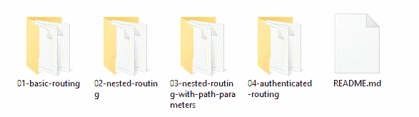
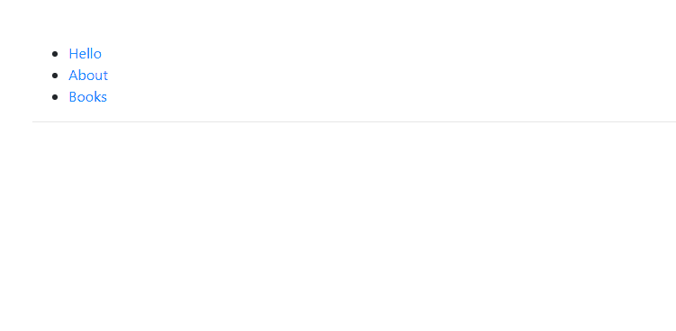
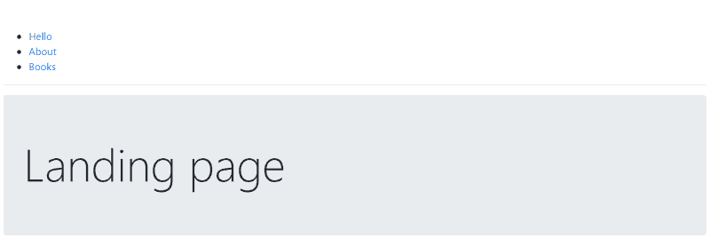
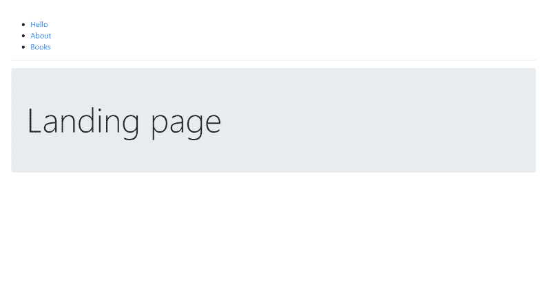
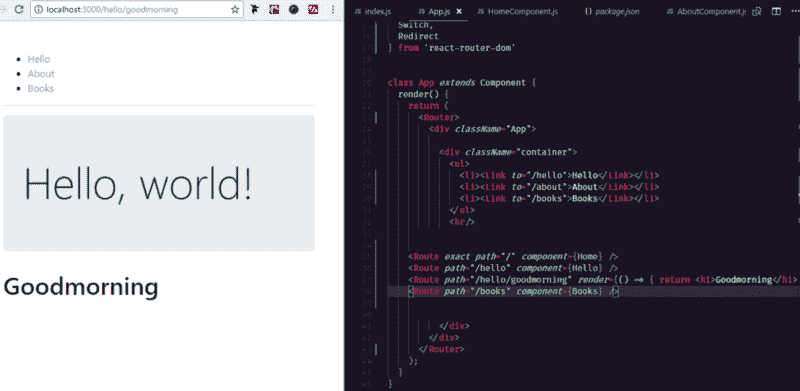
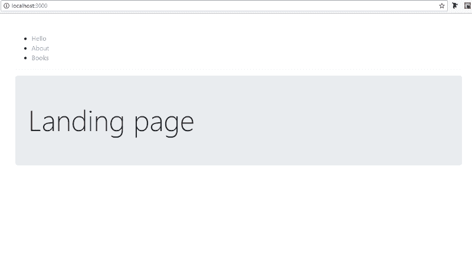
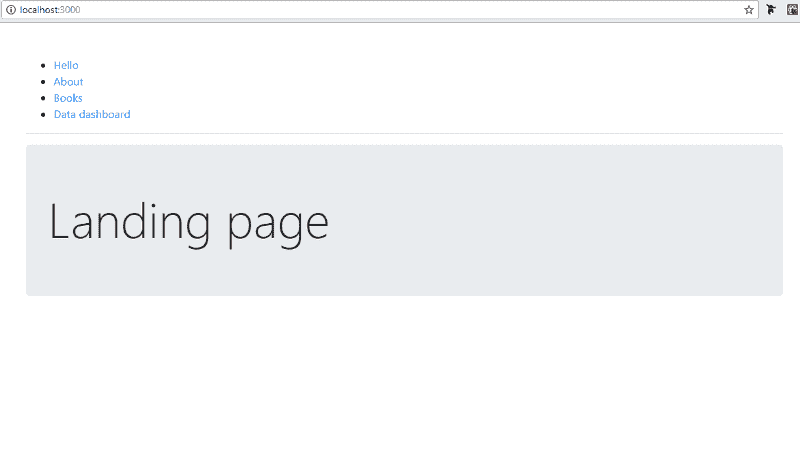

# React 路由器 4 初学者指南

> 原文：<https://www.freecodecamp.org/news/beginners-guide-to-react-router-4-8959ceb3ad58/>

伊曼纽尔·优素福

# React 路由器 4 初学者指南


React 是一个用于构建用户界面的 JavaScript 库。使用 React 范例，UI 的每一部分都是一个组件，它管理自己的自包含状态(数据)和功能。

与其他前端 JavaScript 框架一样，React 对于创建单页面应用程序(spa)非常有用。这些 web 应用程序在改变视图时不需要重新加载整个页面。相反，当用户在应用程序中导航时，他们会在页面的某个部分来回切换视图。

虽然 spa 为用户提供了流畅的导航体验，但传统网站的路由功能仍是人们所期待的。

例如:

*   屏幕上的每个视图都应该有自己特定的 URL，这样我就可以为页面添加书签。
*   前进和后退按钮应该让我在浏览历史中前进或后退。
*   应该支持嵌套视图和带参数的视图，比如`**example.com/products/shoes/101**`。

在 React 社区中，React Router 是最受欢迎的处理路由的库。这个版本的库最引人注目的方面是它“只是反应”。路线只是应用程序运行时呈现在屏幕上的组件。它们不像在其他框架中那样在外部文件中定义。

### 先决条件

你将需要以下:***[反应](https://reactjs.org/)**[**Git**](https://git-scm.com/)**安装在你的电脑**上 [**NPM**](https://www.npmjs.com/) **安装在你的电脑** r*

### *安装*

*如果你已经安装了 Git，找到空的[源文件](https://github.com/emmyyusufu/react-router-demos)(在 ***主*** 分支)并克隆到你的电脑上，使用:*

```
*`git clone https://github.com/emmyyusufu/react-router-demos.git`*
```

*在文本编辑器中打开文件夹，找到其中的子文件夹:*

**

*本文根据文件夹分为四个小节，分别是:`**Basic routing**`、`**Nested routing**`、`**Nested routing with path parameters**`和`**Authenticated routing**`。*

*要启动演示，在终端中打开一个给定的文件夹，然后运行`npm install`，然后运行`npm start`。*

### *#1 基本路线*

*让我们从头开始。请注意基本路由文件夹的文件夹结构。*

*

Modified create-react-app folder structure.* 

*这篇文章中的所有演示都是使用 [create-react-app](https://github.com/facebookincubator/create-react-app) 创建的。这带来了一些好处，比如已经配置好的 Webpack 服务器会将我们应用程序中的所有 JavaScript 文件捆绑到一个`**bundle.js**` 文件中，该文件会在运行时附加到`**index.html**` 文件中。在运行时，Webpack 的开发服务器将监听我们的文件中的任何变化，并在开发期间随着应用程序的运行而更新它。*

*我创建了一个`**components/**`文件夹来保存我们所有的组件。请注意:*

*   *`**index.js**` 是我们 app 中所有`**.js**` 文件的入口文件。这是 Webpack 的捆绑将被执行的地方，因此所有的`**.js**` 文件都将被导入其中。*
*   *文件将包含与我们的 React 应用程序相关的所有内容。*

*默认情况下，create-react-app 不会将`**App.js**`放在这个文件夹中。但是因为我已经修改了文件夹结构，所以我对路径 url 进行了适当的修改，并将其导入到`**index.js**`中。要了解更多关于 create-react-app 的信息，这个[参考资料](https://github.com/facebookincubator/create-react-app)会很有帮助。*

*导航到第一个文件夹`**01-basic-routing**`并运行`npm install`。*

*打开`App.js`文件，您应该看到以下内容:*

```
*`import React, { Component } from 'react';import '../styles/App.css';`*
```

```
*`// import route Components here`*
```

```
*`class App extends Component {  render() {    return (      <div className="App">`*
```

```
*`<div className="container">          <ul>            <li><a href="">Hello</a></li>            <li><a href="">About</a></li>            <li><a href="">Books</a></li>          </ul>          <hr/>`*
```

```
*`{/* Routes will go here */}`*
```

```
*`</div>`*
```

```
*`</div>    );  }}`*
```

```
*`export default App;`*
```

*运行 npm start 并查看应用程序。尚未进行任何更改。*

*

No changes made* 

*让我们通过 NPM 安装 React 路由器。在终端中打开文件夹，运行:*

```
*`npm install react-router-dom`*
```

*为什么是`**react-router-dom**`？这是因为 React 路由器库由三个包组成:`react-router`、`react-router-dom`和`react-router-native`。*

*`react-router`是路由器的核心包，而另外两个是特定于环境的。如果你是为 web 开发，你应该使用`react-router-dom` ,如果你是在使用 React Native 的移动应用开发环境中，你应该使用`react-router-native`。*

*将以下内容导入`**App.js**`*

```
*`// import route Components hereimport {  BrowserRouter as Router,  Route,  Link,  Switch,  Redirect} from 'react-router-dom'`*
```

*稍后我们将了解这些组件的作用。所有路由组件都依赖于`BrowserRouter`向它们提供浏览器的 HTML5 历史 API。*

*注意 **React 组件**的第一个字母大写，以区别于默认的 HTML 标签。*

**历史 API 是一个让我们通过`history.location`管理当前位置以及先前位置的对象。将对象的`location`属性看作一个数组。当前位置是数组中的最后一项，我们通过`history.push()`或`history.replace`等方法来操作数组。无论在数组上进行什么操作，都会触发到当前位置的页面转换。这是使用`Link`和`Redirect`组件时幕后发生的事情，我们很快就会看到。**

*我们已经将`BrowserRouter`的内容导入到了`Router`变量中。我们需要用它来包装我们的整个应用程序，这样它就可以在整个应用程序中提供所需的 API。在`**App.js**`添加:*

```
*`import React, { Component } from 'react';import '../styles/App.css';`*
```

```
*`// import route Components hereimport {  BrowserRouter as Router,  Route,  Link,  Switch,  Redirect} from 'react-router-dom'`*
```

```
*`class App extends Component {  render() {    return (      <Router>        <div className="App">`*
```

```
*`<div className="container">            <ul>              <li><a href="">Hello</a></li>              <li><a href="">About</a></li>              <li><a href="">Books</a></li>            </ul>            <hr/>`*
```

```
*`{/* Routes will go here */}`*
```

```
*`</div>        </div>      </Router>    );  }}`*
```

```
*`export default App;`*
```

#### ***<路线** / >组件*

*让我们开始探索`*Route*`组件。如果**当前 URL 位置**与页面中指定的`*path*`属性匹配，该组件将呈现一个页面。也接受`*component*`、`*render*`、`[children](https://reacttraining.com/react-router/web/api/Route/children-func)`道具。*

*让我们创建我们的路线，在这里书写 **{/*路线*/}:***

```
*`<Route path="/hello" component={Hello} /><Route path="/about" component={About} /><Route path="/books" component={Books} />`*
```

*但是那些组件是不存在的！是的，你是对的。*

*同样，在我们创建它们之前，让我们向`App.js`添加更多的导入。以`Hello`、`About`、`Books`为变量，从`HelloComponent.js`、`AboutComponent.js`和`BooksComponent.js`导入。**`component={}`prop 用花括号来指代变量而不是字符串。***

```
*`import React, { Component } from 'react';import '../styles/App.css';`*
```

```
*`import Hello from './HelloComponent';import About from './AboutComponent';import Books from './BooksComponent';`*
```

```
*`// import route Components hereimport {  BrowserRouter as Router,  Route,  Link,  Switch,  Redirect} from 'react-router-dom'`*
```

*注意，`render`与`component={}`相似，但是它让我们定义一个内嵌的组件:*

```
*`<Route path="/hello" render={() => {           return (              <div className="jumbotron">                <h1 className="display-3">Hello, world!</h1>              </div>             );      }}/>`*
```

*转到空的`HelloComponent.js`文件并粘贴:*

```
*`import React from 'react';`*
```

```
*`const Hello = () => {    return (        <div className="jumbotron">            <h1 className="display-3">Hello, world!</h1>        </div>    );}`*
```

```
*`export default Hello;`*
```

*我们在上面使用了一个无状态的功能组件(因此有了 arrow 函数)。我们将它们用于只向网页呈现静态内容的组件，而不是呈现有状态/变化内容的组件。*

*如果你没有注意到，我们在`App.css`文件中使用了 Bootstrap 4 样式，因此在`div`中使用了`jumbotron`类。*

```
*`// inside App.css. You'll need internet connection to load the Bootstrap 4 styles.`*
```

```
*`.App {  padding-top: 50px;}`*
```

```
*`@import url('https://maxcdn.bootstrapcdn.com/bootstrap/4.0.0-beta.2/css/bootstrap.min.css');`*
```

*转到空的`AboutComponent.js`文件并粘贴:*

```
*`import React from 'react';`*
```

```
*`const About = () => {    return (        <div className="jumbotron">            <h1 className="display-3">About Me</h1>        </div>    );}`*
```

```
*`export default About;`*
```

*最后，打开空的`BooksComponent.js`文件并粘贴:*

```
*`import React from 'react';`*
```

```
*`const Books = () => {    return (        <div className="jumbotron">            <h1 className="display-3">My Books</h1>        </div>    );}`*
```

```
*`export default Books;`*
```

*我们需要总结的另一件事是`Link`组件。*

#### ***<链接></链接&g**t；成分*

*这是取代默认的`<a href=""&g`t；</一个> HTML 标签。我接受一个 to= " "属性，它指向我们要去的 URL 位置。*

*在`App.js`中，用`Link`替换默认锚点标签:*

```
*`<ul>   <li><Link to="/hello">Hello</Link></li>   <li><Link to="/about">About</Link></li>   <li><Link to="/books">Books</Link></li></ul>`*
```

*从您的终端运行`npm start`并查看完整的应用程序:*

*

using Route and Link* 

*如果`/` URL 被访问，你将如何呈现一个组件，比如登陆或主页。你的猜测可能是为它创建一条路线:*

```
*`<Route path="/" component={Home} />`*
```

*这很好，但是记住其他路径中有`/`。因此，如果我们访问其他 URL，如`/hello`、`/about`和`/books`，默认情况下`Home`组件将继续呈现。要解决这个问题，编写另一个属性`exact`将其设置为`true`或者只编写`exact`。*

```
*`<Route path="/" exact={true} component={Home} />`*
```

*这将确保`Home`组件仅在 URL 完全匹配这个:`/`的情况下才被呈现。*

*在`**components/**` 文件夹中新建一个`HomeComponent.js`文件。将此粘贴到:*

```
*`import React from 'react';`*
```

```
*`const Home = () => {    return (        <div className="jumbotron">            <h1 className="display-3">Landing page</h1>        </div>    );}`*
```

```
*`export default Home;`*
```

*导入到`App.js`*

```
*`import Home from './HomeComponent';`*
```

*添加到路线列表*

```
*`<Route exact={true} path="/" component={Home} /><Route path="/hello" component={Hello} /><Route path="/about" component={About} /><Route path="/books" component={Books} />`*
```

*访问`http://localhost:3000`并查看:*

*

Home component rendered on ‘/’ path* 

*做一些实验。将`exact={true}`从原路移除，看看会发生什么。你会明白为什么它很重要。*

*

Always use exact={true} on the ‘/’ path, else every <Route /> will render.* 

#### *分量*

*这将需要在需要实现时包装`*Route*`组件。当一个 URL 路径被访问时，它只允许第一个匹配该路径的`*<Rou*` te >被渲染。*

*早先我们有一个关于`/`渲染`Home`组件和其他路径的问题。如果我们创造一条`/hello/goodmorning`路径，会发生什么？`/hello`和`/hello/goodmorning`路径的组件将被渲染。在这种情况下，Switch 将再次提供帮助，只选择一条路线进行渲染，但必须将最重要的路线安排在最前面。*

*

Just an experiment* 

*使用`Switch`，我们可以避免上图中发生的情况，但是只针对除了`/`以外的 URL。`exact={true}`为`/`办理。记住`Switch`只会选择第一个匹配的`Route`。让我们把它付诸实践，看看结果。*

```
*`<Switch>    <Route exact path="/" component={Home} />    <Route path="/hello" component={Hello} />    <Route path="/hello/goodmorning" render={() => { return      <h1>Goodmorning</h1> }} />    <Route path="/books" component={Books} /></Switch>`*
```

*

Only the first route that matches /hello/goodmorning is rendered.* 

*此外，`Switch`允许我们在 URL 不匹配任何位置的情况下指定要呈现的路径。对于该路线，保留`path`道具为空。*

```
*`// Just an example. Don't implement. This catch-all Route would be at the bottom if implemented.`*
```

```
*`<Route component={NoMatch} />`*
```

*总之`Switch`会做以下事情:*

*   *避免包含性路线渲染。*
*   *在我们的开关容器底部包含一个无所不包的路由。*

### *#2 嵌套路由*

*记住，我们可以通过`Route`内联或者通过指定组件来呈现组件:*

```
*`<Route component={SomeComponent}/>`*
```

*或者*

```
*`<Route render={() => { return <h1>Soemthing</h1> }/>`*
```

*将通过`Route`创建的组件将自动传递给以下`prop`对象:*

*   *比赛*
*   *位置*
*   *历史*

*我们将只探讨`match`的使用，因为它有助于实现嵌套路由。`match`对象包含以下属性:*

*   ***params** — (object)从对应于路径的动态段的 URL 解析的键/值对。*
*   ***isExact** — (boolean)如果匹配了整个 URL(没有尾随字符)，则为 true。*
*   ***路径** —(字符串)用于匹配的路径模式。对建造嵌套的<路线>有用*
*   ***URL**—(string)URL 的匹配部分。对构建嵌套的<链接>有用*

*我们想在`/book`路线下增加新路线。它们将会是书:*

*   *超文本标记语言*
*   *半铸钢ˌ钢性铸铁(Cast Semi-Steel)*
*   *反应*

*导航到终端上的第二个子文件夹`**02-nested-routing**` 并运行`npm install`。*

*在代码编辑器中，打开`BookComponent.js`并修改:*

```
*`const Books = ({ match }) => {    return (<div>   <div className="jumbotron">        <h1 className="display-3">My Books</h1>   </div>`*
```

```
 *`<div className="container">    <div className="row">`*
```

```
 *`<div className="col-md-3">          <ul>            <li><Link to="">HTML</Link></li>            <li><Link to="">CSS</Link></li>            <li><Link to="">React</Link></li>          </ul>      </div>      <div className="col-md-9">`*
```

```
 *`{/* place routes here */}      </div>    </div>`*
```

```
 *`</div>`*
```

```
*`</div>    );}`*
```

*让我们通过 NPM 安装 React 路由器。在终端中打开文件夹，运行:*

```
*`npm install react-router-dom`*
```

*我们已经从语法上证明了`match`对象是作为`props`传递的。请记住，所使用的类是为了让 Bootstrap 的样式生效。导入 React 后，不要忘记导入所有 React 路由器组件:*

```
*`import React from 'react';import {    BrowserRouter as Router,    Route,    Link,    Switch,    Redirect  } from 'react-router-dom';`*
```

*我们不需要全部导入，但我们还是导入了。放置路线:*

```
*`<Route path="" render={() => { return <h1>HTML by Ducket book</h1> }}/><Route path="" render={() => { return <h1>CSS by Racheal Andrews</h1> }}/><Route path="" render={() => { return <h1>React by Fullstack.io book</h1> }}/>`*
```

*我们使用内联组件渲染来节省时间。现在，让我们填充`Link`的`to=""`和`Route`的`path=""`。*

*进行以下更改:*

```
*`<div className="col-md-3">    <ul>      <li><Link to={`${match.url}/html`}>HTML</Link></li>      <li><Link to={`${match.url}/css`}>CSS</Link></li>      <li><Link to={`${match.url}/react`}>React</Link></li>     </ul></div> <div className="col-md-9">`*
```

```
 *`<Route path={`${match.path}/html`} render={() => { return <h1>HTML by Ducket book</h1> }}/>      <Route path={`${match.path}/css`} render={() => { return <h1>CSS by Racheal Andrews</h1> }}/>      <Route path={`${match.path}/react`} render={() => { return <h1>React by Fullstack.io book</h1> }}/>`*
```

```
*`</div>`*
```

*`${match.url}`计算为`/books`并且`${match.path}`计算为`localhost://3000/books.`使用的反勾号是 ES6 连接包含变量的字符串的方式。*

*保存它，运行`npm start`并查看工作应用程序。*

*

Nested routes* 

### *#3 带路径参数的嵌套路由*

*任何以`/:id`、`/:user`或`/:whatever`结尾的 URL 表示该部分是 URL 的动态生成部分，可以是任何值。*

*我们可以通过`match.params.id`访问这些部分，用于路由。*

*再次打开终端中的第三个子文件夹`**03-nested-routing-with-path-parameters**` 并运行`npm install`。*

*另外，让我们通过 NPM 安装 React 路由器。在终端中打开文件夹，运行:*

```
*`npm install react-router-dom`*
```

*为了说明路径参数如何用于布线，将以下内容粘贴到`Book.js`:*

```
*`import React from 'react';import {    BrowserRouter as Router,    Route,    Link,    Switch,    Redirect  } from 'react-router-dom';`*
```

```
*`const Books = ({ match }) => {    return (        <div>            <div className="jumbotron">                <h1 className="display-3">My Books</h1>            </div>`*
```

```
*`<div className="container">          <div className="row">              <div className="col-md-3">          <ul>              <li><Link to={`${match.url}/html`}>HTML</Link></li>              <li><Link to={`${match.url}/css`}>CSS</Link></li>              <li><Link to={`${match.url}/react`}>React</Link></li>          </ul>                </div>                <div className="col-md-9">                    <Route path={`${match.path}/html`} render={() => { return <h1>HTML by Ducket book</h1> }}/>                    <Route path={`${match.path}/css`} render={() => { return <h1>CSS by Racheal Andrews</h1> }}/>                    <Route path={`${match.path}/react`} render={() => { return <h1>React by Fullstack.io book</h1> }}/>                    <Route path={`${match.path}/:id`} component={Child} />                </div>            </div>            </div>        </div>    );}`*
```

```
*`const Child = ({ match }) => (    <div>      <h3>URL ID parameter: {match.params.id}</h3>    </div>);`*
```

```
*`export default Books;`*
```

*运行`npm start`。*

*

accessing /:id parameter value* 

### *#4 受保护路径路由*

*这种路由适用于需要用户登录并通过身份验证才能查看的网站页面。一个例子是一个**管理**页面。*

*为了处理受保护的路径，我们需要使用`<Redirec` t/ >(一个标准组件`t)and <Priva` teRoute/ >(一个定制组件)。*

*`<PrivateRout` e/ >不是 sta`ndard &l`t；路由/ >组件。Rea `ct Route` r 提供的标准路由组件是<Route/>ne<PrivateRoute`/> as`我们自己定制的< Route/ >。*

*当我们需要决定是否渲染感兴趣的`<Rout` e/ >时，定制路线是必要的。正如你将在代码中看到的，我们将一起 `list <Priva`teRoute/>T2<her>s*

### ***<重定向/ > com** 组件*

*渲染一个<redirect>会导航到一个新的位置。新位置将覆盖历史堆栈中的当前位置，就像服务器端重定向(HTTP 3xx)一样。</redirect>*

*`<Redirec` t/ >有几个道具，但是我们将这样使用`g` to object 道具:*

```
*`<Redirect to={{        pathname: '/login',        state: { from: props.location }      }}/>`*
```

*使用时，这将重定向到`/login`路径。关于重定向完成之前的最后位置的信息将由`LoginPage`组件通过`this.props.location.state`访问。*

*导航到最后一个子文件夹`**04-authenticated-routing**`。运行`npm install`。*

*通过 NPM 安装 React 路由器。在终端中打开文件夹，运行:*

```
*`npm install react-router-dom`*
```

*打开`App.js`并在现有的列表中添加一个新的列表`/admin`项。*

```
*`<ul>     <li><Link to="/hello">Hello</Link></li>     <li><Link to="/about">About</Link></li>     <li>         <Link to="/books">Books</Link>     </li>     <li>         <Link to="/admin">Admin</Link>     </li></ul>`*
```

*将`<PrivateRout`e/>`; and` /登录路线添加到 exi `sting &l` t 组；路线/ > s*

```
*`<Switch>            <Route exact path="/" component={Home} />            <Route path="/about" component={About} />            <Route path="/hello" component={Hello} />            <Route path="/books" component={Books} />            <Route path="/login" component={Login}/>            <PrivateRoute authed={fakeAuth.isAuthenticated} path="/admin" component={Admin} />          </Switch>`*
```

*现在在 App 组件的`de` 外创建`<PrivateRout` e/ >组件:*

```
*`const PrivateRoute = ({ component: Component, ...rest }) => (  <Route {...rest} render={props => (    fakeAuth.isAuthenticated ? (      <Component {...props}/>    ) : (      <Redirect to={{        pathname: '/login',        state: { from: props.location }      }}/>    )  )}/>)`*
```

*`<PrivateRout` e/ >最终会渲染下来 `to a &`lt；Route>com`ponent.`<Route>组件使用三元运算来根据用户是否 lo `gged in or` not 确定要呈现的内容:一个< Redirect/ & g `t; to`登录页面或管理页面组件。*

*创建`Admin`组件:*

```
*`const Admin = () => {  return (    <div className="jumbotron">      <h3 className="display-3">Admin Access granted</h3>    </div>  );}`*
```

*同样，创建`Login`组件:*

```
*`class Login extends React.Component {      constructor() {      super();        this.state = {        redirectToReferrer: false      }      // binding 'this'      this.login = this.login.bind(this);    }      login() {        fakeAuth.authenticate(() => {        this.setState({ redirectToReferrer: true })      })    }      render() {      const { from } = this.props.location.state || { from: { pathname: '/' } }      const { redirectToReferrer } = this.state;        if (redirectToReferrer) {        return (          <Redirect to={from} />        )      }        return (        <div className="jumbotron">            <h1 className="display-3">Login required</h1>            <p className="lead">You must log in to view the page at {from.pathname}.</p>            <p className="lead">              <a className="btn btn-primary btn-lg" onClick={this.login} role="button">Login</a>            </p>        </div>      )    }  }    /* A fake authentication function */  export const fakeAuth = {      isAuthenticated: false,    authenticate(cb) {      this.isAuthenticated = true       setTimeout(cb, 100)    },  }`*
```

*这个`Login`组件实现了一个假的认证功能，将用户设置为登录或注销。*

*运行`npm start`看工作 app。*

*

Authentication process* 

*这就把我们带到了文章的结尾。如果你能走到这一步，我向你致敬。如果你想了解更多关于 React 路由器的细节，请查看[文档](https://reacttraining.com/react-router/web/guides/philosophy)。*

*如果您想要代码的完整版本，请访问 [Github](https://github.com/emmyyusufu/react-router-demos/tree/completed) 上的完整分支。*

*请随意支持我([devapparel.co](http://www.devapparel.co))并且看起来不错。也可以评论或分享这篇文章。感谢阅读！*

**最初发表于 [Zeolearn 博客](https://www.zeolearn.com/magazine/beginners-guide-to-react-router-4)。**