# Node.js 中带有 RxJS 的反应式编程和可观察序列

> 原文：<https://www.freecodecamp.org/news/rxjs-and-node-8f4e0acebc7c/>

处理异步非阻塞处理一直是 JavaScript 世界的标准，现在在许多其他上下文中也变得非常流行。好处显而易见:有效利用资源。但是好处是有代价的:复杂性的增加。

随着时间的推移，供应商和开源社区一直试图找到在不牺牲好处的情况下降低这种复杂性的方法。

异步处理从“回调”开始，然后是承诺和未来，异步和等待。最近，另一个孩子来了——react ivex 带来了它的各种语言实现——给开发者带来了一个新的强大工具 Observable。

在本文中，我们想展示由[RxJs](http://reactivex.io/rxjs/)(react vex 的 JavaScript 实现)实现的 Observables 如何简化要用 Node.js 执行的代码，node . js 是流行的服务器端 JavaScript 非阻塞环境。

### 一个简单的使用案例—读取、转换、写入和记录

为了使我们的推理具体化，让我们从一个简单的用例开始。假设我们需要读取`**Source Dir**`、*、*中包含的文件，转换它们的内容，并将新转换的文件写入`**Target Dir**`、中，同时记录我们创建的文件。

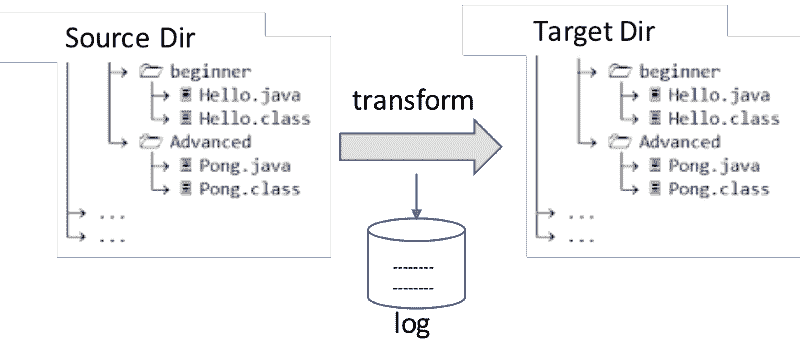

Read — Transform — Write — Log

### 同步实现

这个用例的同步实现非常简单。在一种伪代码表示中，我们可以这样想:

```
read the names of the files of Source Dir
   for each file name
      read the file
      transform the content
      write the new file in Target Dir
      log the name of the new file
   end for
console.log('I am done')
```

这里没有什么特别要评论的。我们可以说，我们确定了每一行的执行顺序，并且我们确定事情会按照下面的事件流所描述的那样发生。每个圆圈对应一个 I/O 操作的完成。

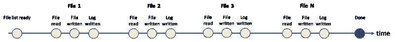

The sequence of events in a synchronous world

### 在 Node.js 这样的异步非阻塞环境中会发生什么

Node.js 是 JavaScript 的异步非阻塞执行环境。非阻塞意味着 Node.js 在执行下一行代码之前不会等待 I/O 或网络操作完成。

#### **处理一个文件**

读写文件是 I/O 操作，Node.js 显示了它的非阻塞特性。如果 Node.js 程序请求读取一个文件，它必须提供一个在文件内容可用时执行的函数(所谓的**回调**)，然后立即继续执行下一个操作。

让我们考虑只有一个文件的情况。读取、转换、写入**一个**文件并更新 Node.js 中的日志看起来像这样:

```
import * as fs from 'fs'; // Node module to access file system
const fileName = 'one-file.txt';
fs.readFile(fileName, callback(err, data) => {
   const newContent = transform(data);
   const newFileName = newFileName(fileName); // calculate new name
   fs.writeFile(newFileName, newContent, err => {
      if(err) {// handle error};
      fs.appendFile('log.txt', newFileName  + ' written', err = {
         if (err) {// handle error}
      });
   });
})
```

两级缩进的语法可能看起来有点复杂，但是如果我们考虑事件发生的情况，我们仍然可以准确地预见顺序:


Sequence of events in Node while transforming 1 file

#### **承诺的天堂**

这是 JavaScript Promise 大放异彩的用例。使用 Promise，我们可以让代码看起来更有序，而不会影响 Node.js 的异步特性。

假设我们可以访问对文件执行读写操作并返回一个承诺的函数，那么我们的代码看起来会像这样:

```
const fileName = 'my-file.txt';
readFilePromise(fileName)
.then(data => {
   const newContent = transform(data);
   const newFileName = newFileName(fileName); // build the new name
   return writeFilePromise(newFileName, newContent)
})
.then(newFileName => appendFile('log.txt', newFileName))
.then(newFileName => console.log(newFileName + ' written'))
.catch(err => // handle error)
```

有几种方法可以在基于`Promise`的函数中转换 Node.js 函数。这是一个例子:

```
function readFilePromise(fileName: string): Promise<Buffer>{
   return new Promise(function(resolve, reject) {
      fs.readFile(fileName, function(err, data: Buffer) {
         if(err !== null) return reject(err);
         resolve(data);
      });
   });
}
```

#### **处理许多文件**

如果我们回到最初的用例，我们必须转换一个目录中包含的所有文件，复杂性增加了，承诺开始显示出一些限制。

让我们看看 Node.js 实现需要管理的事件:

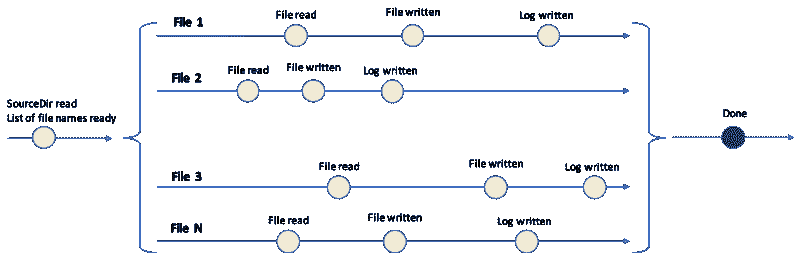

Sequence of events when transforming many files in parallel

每个圆圈代表一个 I/O 操作(读或写)的完成。每一行代表一个特定文件的处理，或者一个承诺链。

鉴于 Node.js 的非阻塞特性，这类事件的时间顺序并不确定。有可能我们还没读完`**File3**`就写完了`**File2**` 。

每个文件的并行处理使得承诺的使用更加复杂(在本文的最后，提供了一个基于承诺的实现)。在这种情况下，react vex——尤其是 RxJs 和 Observable 大放异彩，让您能够构建优雅的解决方案。

### 什么是可观测量，你能用它们做什么？

从[react vex](http://reactivex.io/intro.html)的官方网站开始，很多地方都详细介绍了可观测量的正式定义。

在这里，我只想提醒您我一直关注的几个属性:

*   可观察模型一系列事件
*   可观察的是 Iterable 的**【push】**兄弟，也就是“pull”

作为 Iterable 的“推”兄弟，Observable 为开发人员提供了 Iterable 提供的许多很酷的特性，比如:

*   通过`map`、`filter`和`skip`等运算符转换“事件流”或可观察值
*   应用函数式编程风格

Observable 提供的另一个非常重要的东西是订阅。通过订阅，代码可以将“副作用”应用于事件，并在特定事件发生时执行特定的操作，例如当错误发生或事件流完成时。

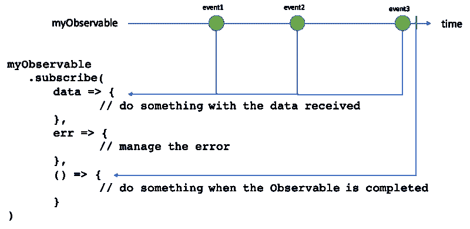

The subscribe interface of Observable

如您所见，Observable 接口为开发人员提供了提供三种不同功能的可能性，这三种功能分别定义了当事件及其数据发出、发生错误或事件流完成时要做的事情。

我想，对于那些还没有玩过 Observable 的人来说，上面所有的内容听起来可能非常理论化，但是希望下一部分的讨论，集中在我们的用例上，将使这些概念更加具体。

### 通过 Observable 实现读取、转换、写入和日志用例

我们的用例从读取包含在`**Source Dir**`中的文件列表开始。所以，让我们从那里开始。

#### **读取一个目录中包含的所有文件名**

假设我们可以访问一个函数，该函数接收一个目录的名称作为输入，并返回一个可观察值，一旦读取了目录树结构，该可观察值就会发出该目录的文件名列表。

```
readDirObservable(dirName: string) : Observable<Array<string>>
```

我们可以订阅这个可观察文件，当所有文件名都被读取后，开始对它们做一些事情:

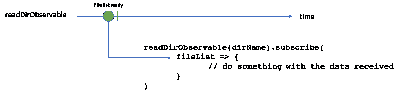

Subscription to an Observable which emits when the directory has been read

#### **读取文件列表**

现在让我们假设我们可以访问一个函数，该函数接收文件名列表作为输入，并在每次读取文件时发出(它发出文件的内容`Buffer`，以及它的名称`string`)。

```
readFilesObservable(fileList: Array<string>) 
   : Observable<{content: Buffer, fileName: string}>
```

我们可以订阅这样的`Observable`，并开始对文件的内容做一些事情。

#### 组合观察值— *切换图*操作符

我们现在有两个观察对象，一个在目录被读取时发出文件名列表，另一个在每次文件被读取时发出。

我们需要将它们结合起来实现我们用例的第一步，即:当`readDirObservable`发射时，我们需要**将**切换到`readFilesObservable`。

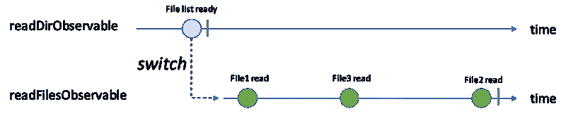

switchMap operator

这里的技巧是由`switchMap`操作符执行的。代码看起来像这样:

```
readDirObservable(dirName)
.switchMap(fileList => readFilesObservable(fileList))
.subscribe(
      data => console.log(data.fileName + ‘ read’), // do stuff with the data received
      err => { // manage error },
      () => console.log(‘All files read’)
)
```

必须提到的是，`switchMap`运算符比这个更强大。虽然在这个简单的用例中无法体会到它的全部威力，但对它的完整描述超出了本文的范围。如果你有兴趣，这是一篇详细描述了`switchMap`的[优秀文章](https://blog.angular-university.io/rxjs-switchmap-operator/)。

#### **可观测的产生一系列可观测的**

我们现在有一系列事件来表示一个`read`操作的完成。在`read`之后，我们需要对内容进行转换，为了简单起见，我们假设它是同步的，然后我们需要将转换后的内容保存到一个新文件中。

但是写一个新文件也是一个 I/O 操作，或者说是一个非阻塞操作。因此，每个“文件读取完成”事件都会启动一个新的细化路径，该路径接收源文件的内容和名称作为输入，并在新文件被写入`Target Dir`时发出(发出的事件带有所写入文件的名称)。

同样，我们假设我们能够访问一个函数，该函数在写操作完成后立即发出，发出的数据是所写文件的名称。

```
writeFileObservable(fileName: string, content: Buffer) :            Observable<string>
```

在这种情况下，我们有不同的“写文件”观察值，由独立发出的`writeFileObservable`函数返回。将**和**合并成一个新的可观测物会很好，这个新的可观测物会在这些“写文件”可观测物发出的任何时间发出。

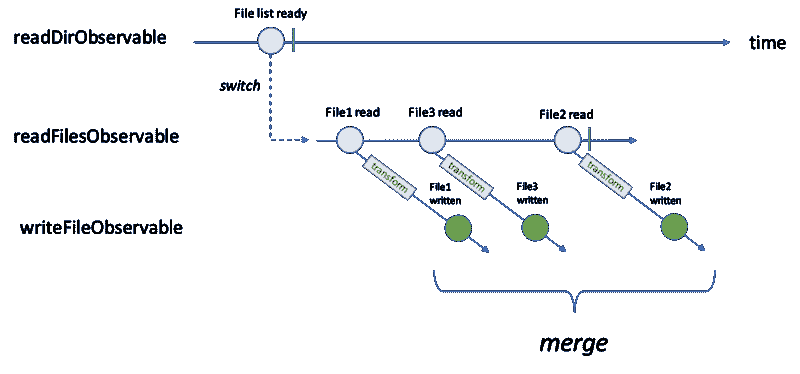

A stream of Observables we would like to merge

使用 ReactiveX(或 JavaScript 中的 RxJs)，我们可以使用`mergeMap`操作符(也称为**平面图**)来达到这个结果。代码如下所示:

```
readDirObservable(dir)
.switchMap(fileList => readFilesObservable(fileList))
.map(data => transform(data.fileName, data.content))
.mergeMap(data => writeFileObservable(data.fileName, data.content))
.subscribe(
      file => console.log(data.fileName + ‘ written’),
      err => { // manage error },
      () => console.log(‘All files written’)
)
```

`mergeMap`操作符创建了一个新的可观察值，如下图所示的`writeFileObservable`:

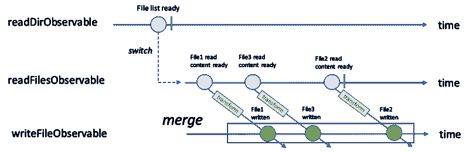

Observable returned by mergeMap operator

#### 那又怎样？

应用同样的方法，如果我们想象我们有一个新的函数`writeLogObservable`，一旦文件被写入就在日志上写一行，并且一旦日志被更新就发出文件名，我们用例的最终代码将看起来像这样:

```
readDirObservable(dir)
.switchMap(fileList => readFilesObservable(fileList))
.map(data => transform(data.fileName, data.content))
.mergeMap(data => writeFileObservable(data.fileName, data.content))
.mergeMap(fileName => writeLogObservable(fileName))
.subscribe(
      file => console.log(fileName + ‘ logged’),
      err => { // manage error },
      () => console.log(‘All files have been transformed’)
)
```

我们没有回调引入的缩进。

时间只沿着纵轴流动，所以我们可以一行一行地阅读代码，一行一行地推理发生了什么。

我们采用了实用的风格。

换句话说，我们已经在行动中看到了可观察的好处。

### 用回调函数创建可观察对象

我希望你现在认为这看起来很酷。但即使在这种情况下，你可能会有一个问题。所有让这段代码变得很酷的函数都不存在。标准 Node.js 库中没有`readFilesObservable`或`writeFileObservable`。我们如何创造它们？

#### **绑定回调和绑定节点回调**

Observable 提供的几个函数，即`bindCallback`(和`bindNodeCallback`)帮助了我们。

它们背后的核心思想是提供一种机制，将接受回调`cB(cBInput)`作为输入参数的函数`f`转换为返回发出`cBInput`的可观察`obsBound`的函数。换句话说，就是将`cBInput`的**发射**中的 `cB` 的**调用**。

`obsBound` 的用户可以定义处理`cBInput` (与`cB(cBInput)`作用相同)的函数。应用的约定是回调函数 `cB(cBInput)`必须是`f`的最后一个参数。

看下图可能更容易理解这种机制:

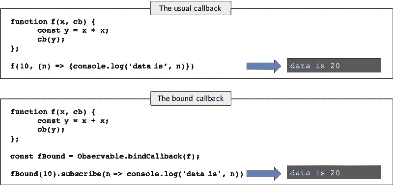

From a function to an Observable

在这两种情况下，函数 `**f(x, cb)**`的起点是相同的。在这两种情况下，结果(控制台上显示的内容)是相同的。

不同的是结果是如何得出的。在第一种情况下，结果由作为输入传递的回调函数决定。在第二种情况下，它由用户定义的功能决定。

考虑`bindCallback` 如何工作的另一种方式是看它执行的转换，如下图所示。

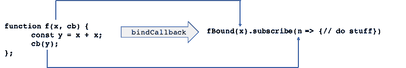

Transformation performed by bindCallback

`f`的第一个参数成为传递给新函数`fBound`的值。用作回调`cb`的参数的自变量成为由`fBound`返回的新可观察对象发出的值。

`bindNodeCallback`是`bindCallback` 的变体，它基于回调函数将**错误**参数作为第一个参数的约定，以及 Node.js 约定`fs.readFile(err, cb)`。

#### **从非回调函数中创建观察值**

被设计用于期望回调作为输入的最后一个参数的函数，但是我们也可以让它用于其他函数。

让我们考虑一下标准的 Node.js 函数`readLine`。这是一个用于逐行读取文件的函数。下面的示例显示了它的工作原理:

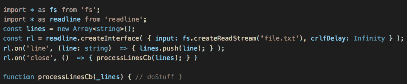

readLine function

每个读取的行都被推入到`lines`数组中。当文件被完全读取时，函数`processLinesCb`被调用。

现在想象一下，我们定义了一个新函数`_readLines`，它包装了上面定义的逻辑，如下面的代码片段所示:

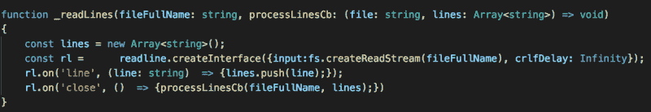

readLine function wrapped by a callback function

一旦所有行都被读取，它们就被函数`processLinesCb`处理，该函数是`_readLines`的最后一个输入参数。因此，`_readLines` 是一个可以由`bindCallback`处理的函数。通过这个技巧，我们可以使用通常的`bindCallback` 函数将 Node.js 函数`fs.readLine`转换为可观察值，如下所示:

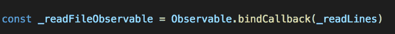

readLine as Observable

### **结论**

异步非阻塞处理本质上是复杂的。我们的大脑习惯于顺序思考——至少对我们这些几年前开始编码的人来说是这样。我们经常发现推理这些环境中到底发生了什么很有挑战性。回调地狱就在眼前。

承诺和未来简化了一些最常见的情况，如“一次性”异步事件，HTTP 请求的典型“现在请求—以后响应”场景。

如果我们从“一次性”事件转移到“事件流”,承诺开始显示出一些局限性。在这种情况下，我们会发现 ReactiveX 和 Observables 是一个非常有力的工具。

#### **如承诺的:我们用例的基于承诺的实现**

这是基于承诺的相同用例的实现:

```
const promises = new Array<Promise>();
readDirPromise(dir)
.then(fileList => {
   for (const file of fileList) {promises.push(
         readFilePromise(file)
         .then(file_content => transform(file_content))
         .then(file => writeLogPromise(file))
      );
   }
   return promises;
}
.then(promises => Promise.all(promises))
.then(() => console.log(‘I am done’))
.catch(err => { // manage error })
```