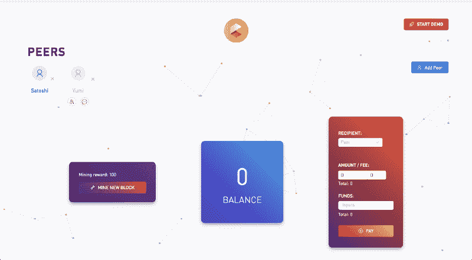
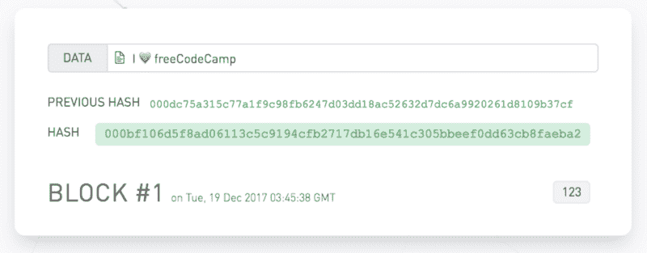
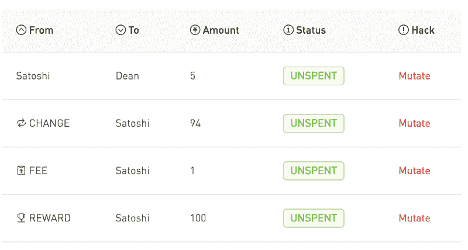
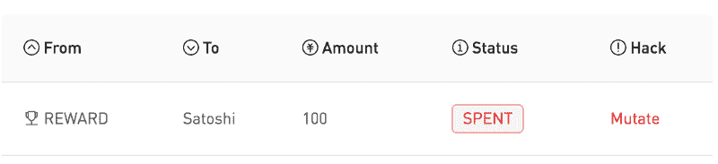
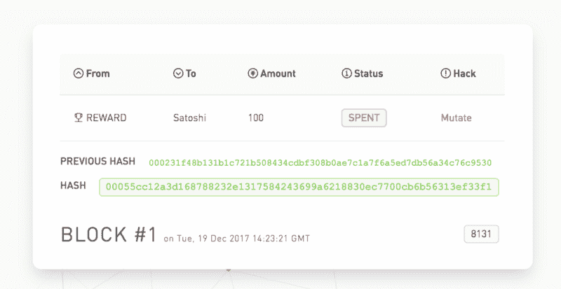
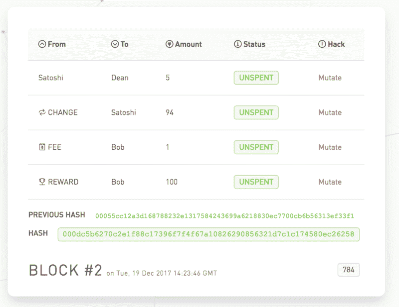
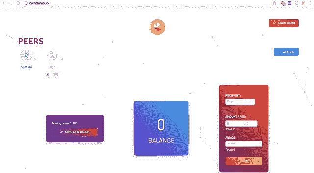

# 比特币是如何运作的？我做了一个应用程序给你看。

> 原文：<https://www.freecodecamp.org/news/how-does-bitcoin-work-i-built-an-app-to-show-you-f9fcd50bdd0d/>

肖恩·韩

# 比特币是如何运作的？我做了一个应用程序给你看。

https://coindemo.io

随着比特币上升到前所未有的水平，它引起了我的注意&好奇心。我想知道，比特币**到底是如何工作的？**

当我走进区块链兔子洞时，我发现许多资源很少超出对话的范围*【革命性】**【分布式】**【不可变】*。很多人谈论*什么*、*、*但没有那么多人谈论*为什么*和*如何*、**。**

我求助于阅读技术论文和源代码来揭开这个黑匣子。我开始分享我通过构建展示区块链内部运作的[应用](https://www.producthunt.com/@seanhan/submitted)所学到的东西。

我意识到比特币只是区块链+交易。本文将讨论等式的事务部分。如果你想重温一下区块链，可以看看区块链演示(T1)或者这篇文章(T3)。

区块链上的一个区块由以下部分组成:

A block on the blockchain — [https://blockchaindemo.io](https://blockchaindemo.io)

*   **索引**(1 号块) **:** 是哪个块？
*   **Hash**(# 00001834 d29f 33…)**:**块有效吗？
*   **上一个哈希** (#000dc75…) **:** 上一个块有效吗？
*   **时间戳**(2017 年 12 月 19 日星期二…) **:** 区块是什么时候添加的？
*   **数据** (I ❤️ freeCodeCamp) **:** 区块上存储了什么信息？
*   **Nonce** (1263) **:** 在找到有效块之前，我们经历了多少次迭代？

加密货币不是以**文本**(❤️自由代码营)作为数据，而是以**交易**作为数据。

### 什么是交易？

交易是双方付款的记录。当有价值交换时，创建一个事务来记录它。

比如说，假设 Satoshi 有 100 个硬币。

他想付给迪安 5 个硬币，1 个硬币的采矿费。他用他所有的 100 个硬币进行交易。他希望能找到 94 枚硬币。

当 Satoshi 用上面的交易挖掘一个新的区块时，他将获得 100 个新硬币的奖励。

上述示例将创建以下事务**输出**(待解释):

Transaction outputs — [http://coindemo.io](http://coindemo.io)

由于 Satoshi 最初的 100 个硬币被用作创建上述交易的**输入**，最初的 100 个硬币现在被**花掉了**。(待解释)

Spent transaction output — [http://coindemo.io](http://coindemo.io)

接下来将解释上述概念。

### 三种类型的交易:

1.  **奖励**——Satoshi 因挖掘新区块获得 100 金币奖励
2.  **常规**——聪用 94 个硬币的零钱付给迪安 5 个硬币
3.  **费** —挖掘交易者的 1 英镑挖掘费(上例中的 Satoshi)

### 交易

交易由四部分组成:

1.  输入— **，其中值来自**
2.  输出— **，其中值将到达**
3.  哈希—唯一标识事务(使用输入和输出)
4.  类型—奖励、常规或收费

### 输出——价值的去向

输出有两部分:

1.  地址——硬币要发送到哪个公共钱包地址？
2.  数量——多少硬币？

### 输入——价值来自哪里

输入**必须来自先前的输出**。然而，一个输出只能作为输入**使用一次**。当一个输出被使用时，它被认为是**耗尽**。未被用作输入的输出是未使用的**。**

**输入有五个部分:**

1.  **事务哈希——输出(未用完)的事务哈希**
2.  **产出指数——交易中(未用)产出的指数**
3.  **金额——产出(未用)的金额**
4.  **地址——输出(未用)的地址**
5.  **签名-由地址的私钥签名**

### **奖励交易**

**奖励交易是在区块链上找到有效区块的结果。因此，奖励交易没有任何投入，因为它创造了新的硬币。**

****比如:** Satoshi 开采了一个新区块，开采奖励 100。块上的事务将如下所示:**

****类型:**奖励**

****输入:**无**

****输出:****

*   ***地址:*聪的公共钱包地址**
*   ***金额:* 100(加密货币指定的奖励)**

****哈希:**？(输入+输出)= 000abcdefg…**

### **常规交易**

**常规交易是一方向另一方付款时产生的交易。**

****继续举例:** Satoshi 使用奖励交易的(未用)**输出**作为**输入**来支付 Dean 5 个硬币。他指定了 1 个硬币的采矿费。**

****类型:**常规**

****输入:****

*   ***交易哈希:* 000abcdefg…(上述奖励交易哈希)**
*   ***输出指标:* 0(输出的第一个指标为 0)**
*   ***金额:* 100(输出金额)**
*   ***地址:* Satoshi 的公共钱包地址(输出地址)**
*   ***签名:* Satoshi 用他的私钥签署这个输入**

****输出:****

***输出 1* :(索引 0)**

*   ***地址*:院长地址**
*   ***金额:* 5 个硬币**

***输出 2* :(索引 1)**

*   ***地址:*聪的地址**
*   ***金额:* 94 个硬币= 100 - 5(支付)- 1(费用)**

1.  **第一个输出是给迪恩的**付款**。**
2.  **第二个输出是返回到 Satoshi 的**变化****

**因为 Satoshi 的奖励交易输出(来自上一个示例)已被用作该支付的输入，所以它现在被**花费，并且不能再次被**使用。如果是再次使用，那么就有[双花费](https://en.bitcoin.it/wiki/Irreversible_Transactions)。**

#### **为什么没有加起来？？？**

**总投入量为 100。
总产出量为 5 + 94 = 99。**

**在示例中，Satoshi 指定了 1 个硬币的采矿费。*一笔常规交易的投入与产出之间的差额就是**采矿费**。***

**投入必须大于或等于产出。*如果投入和产出相等，那么就有**无开采费**。***

### **费用交易**

***以上常规交易谁挖矿，谁就加挖矿费交易。* 因为常规交易中出现了 1 的赤字，手续费金额为 1。**

****续例:** Bob mines Satoshi 和 Dean 的交易。**

**类型:费用**

**输入:无**

**产出:**

*   ***地址:*鲍勃的公共钱包地址**
*   ***金额:* 1(费用，常规交易投入与产出的差额)**

**因为 Bob 将此交易挖掘到新块，所以将有 100 的奖励交易给 Bob。**

### **在区块链:**

******

**1.** Satoshi spends his reward output **2\.** Satoshi pays Dean **3.** Bob mines the transaction — [http://coindemo.io](http://coindemo.io)** 

### **最终余额:**

**聪: **94** = 100(奖励)- 5(报酬)- 1(费用)
院长: **5** (来自聪的报酬)
鲍勃: **101** = 100(开采有交易的新区块的奖励)+ 1(费用)**

****流通货币总数:** **200** = 94(聪)+ 5(迪恩)+ 101(鲍勃)**

**开采了两块，每块奖励 100，所以应该有 200 枚硬币在流通。**

### ****结论****

**在新块上，**常规和费用输入和输出总数必须等于**。这确保了只有奖励交易产生新的硬币。**

**经常产出的赤字由收费交易产出抵消。剩下的唯一产出盈余就是奖励交易。**

### **在 [http://coindemo.io](http://coindemo.io) 亲自尝试一下**

****