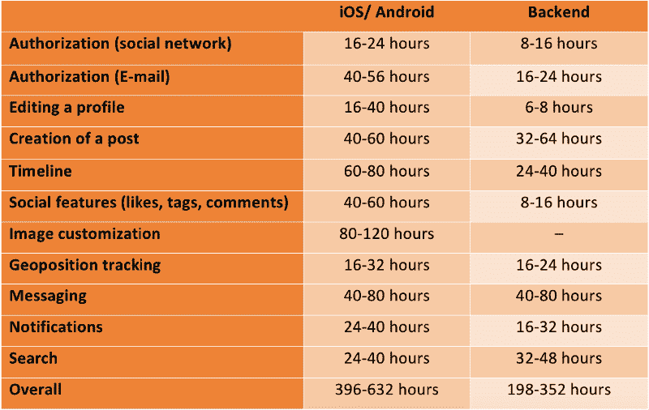
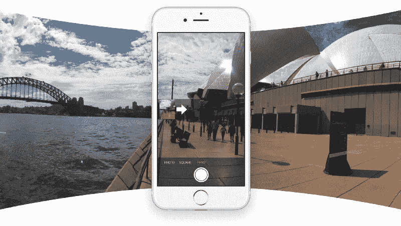
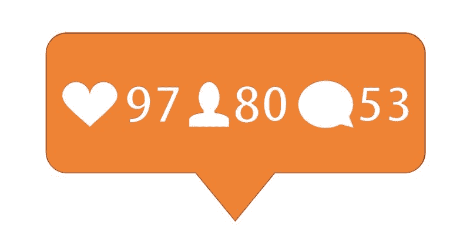
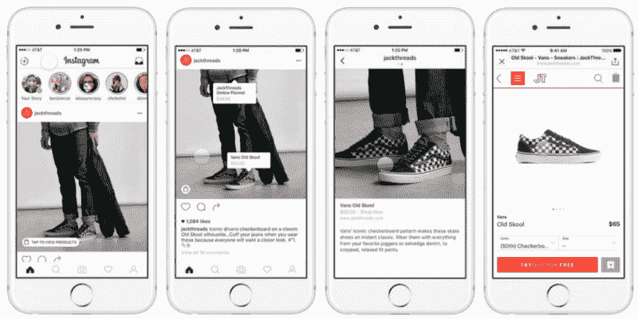

# 如何创建像 Instagram 这样的照片分享应用程序:基础知识？

> 原文：<https://www.freecodecamp.org/news/how-to-create-a-photo-sharing-app-like-instagram-the-basics-8dfdeb5e17f5/>

作者:迪米特罗·布罗夫金

# 如何创建像 Instagram 这样的照片分享应用程序:基础知识？

经过两个世纪的快速发展，摄影已经走过了漫长的道路，从奢侈品变成了我们日常生活的重要组成部分。如今，你的猫可以拥有比几百年前一个皇室家庭所能负担的更多的照片。

摄影文化(或者我们应该说*邪教*？)是现代社会的一大部分。要用高质量和美丽的图片捕捉某个时刻，您不再需要投资购买高端专业相机。2016 年底，智能手机用户拍摄的图片数量已经达到 20.8 亿张。每部智能手机都有摄像头，所以今天几乎每个人都可以拍照，并通过社交应用程序分享。

这正是凯文·斯特罗姆和迈克·克里格在 2010 年利用的优势——那一年 Instagram 首次推出。从那时起，这项服务一直在稳步增长，越来越受欢迎，达到了令人难以置信的高度。在分享图片方面，它是目前无可争议的领导者，在全世界都很有名。该服务提供的官方数据听起来令人难以置信。

Instagram 用户每天发布超过 8000 万张图片，他们每天喜欢照片 35 亿次，每月听觉触达超过 4 亿用户。几乎不可能列出照片分享应用程序可能应用的所有事件:聚会、旅行、自我广告等等。

### 那么，从零开始创建 Instagram 替代品需要什么呢？

虽然市场上有一个领导者，但这并不意味着新的竞争者绝对没有位置。如果你有一个清晰的愿景，你想实现什么，你想与社区分享什么，没有什么是不可能的。

所以，让我们假设你已经决定创建一个类似于 Instagram 的应用程序，并允许你分享照片。首先要关注的是 Instagram 用户的互动图:

*   授权(创建新档案或通过社交网络登录现有档案)
*   编辑个人资料(添加、编辑或删除您的个人数据)
*   张贴图片(上传照片，提及人物，添加标签)
*   时间线(关注、喜欢、评论)
*   社交功能(能够分享帖子或邀请脸书的朋友)
*   照片定制(裁剪、旋转、添加滤镜)
*   位置(让定位服务通过应用程序中拍摄的图片获取您的地理数据)
*   Messenger(文本和照片)
*   通知，推送通知
*   搜索(用户名，只是名字，标签，文章描述)

关注一个 app 的界面也很重要。Instagram 可以成为简单、时尚、易用设计的典范。

在下表中，您可以找到创建一个 Instagram 替代方案所需的预计时间，该方案被分解为多个功能部分。

谈到设计，UX 将需要 64 到 96 个小时。UI 很可能需要 48-64 小时的时间。额外的设计功能需要 16 个多小时，这取决于您的任务的难度。不要忘记，你还需要为你的产品设计一个很棒的标志，这将帮助你把你的品牌进一步推向竞争对手。

以每小时 50 美元的价格计算，为 iOS 创建一个 Instagram 替代品的成本在 12800 美元到 22400 美元之间。一个 Android 应用可能需要 12800 到 19600 美元。后端开发将花费大约 17600 美元——它不依赖于用户设备的规格，因为这些代码运行在服务器上。

鉴于这类应用的主要目标是照片分享，你当然需要考虑应用设计的优化以及所有媒体无处不在的外观。Instagram 通过将所有照片做成方形解决了这个问题。

### 关键效率指标

当你创建 Instagram 等应用程序的替代品时，你肯定需要包含一些独家功能，以将竞争对手远远甩在身后。

创建一个与 insta gram 100%相同的应用程序没有任何意义，因为他们已经拥有了忠实的客户群。最好的策略是在关注最有用的 Instagram 功能的同时，带来全新的想法。

如果你想检查你的应用程序的受欢迎程度和进度，我们将列出一些你需要注意的主要指标:

*   活动用户的数量
*   用户的参与
*   应用程序留住用户的能力

#### **1。活跃用户**

**目标:**

尽可能多的带来新的忠实用户。

您可以通过查看获得和失去用户的统计数据以及用户群增长的速度来检查这一指标。

**方法:**

媒体营销:让人们了解你的产品，让他们尽可能多地谈论它。创建社交网络页面，联系你的目标受众，雇佣擅长营销的人。所有这些事情都需要尽早完成，比如在应用发布前 3-6 个月。

推荐计划:奖励邀请朋友并留下积极反馈的用户，免费赠送新的滤镜、照片效果和其他有用的功能，帮助他们改善体验。

吸引高知名度的用户和使用聪明的公关:每个照片分享应用程序都有自己的重要人物。这样受欢迎的用户可以提升你的产品的地位和知名度。可以是受欢迎的客户，也可以是名人。你可以吸引他们的帮助下，一个免费的公关公司对你的网页或免费早期访问你的产品。此外，你应该发布这些人会感兴趣的内容。

#### 2.用户参与

**目标:**

让人们在你的应用上花更多的时间，更频繁地登录。

参与程度可以通过应用中发生的活动来评估:喜欢数量(新的和整体的)、发送的媒体数量(新的/最近的/整体的)等等。

**方法:**

这可以通过在你的应用程序中加入社交功能来实现，比如评论、赞、群组、朋友、关注者、频道、工具等，让你的个人资料与众不同。

为了吸引潜在的观众，你需要提供高质量和有用的编辑工具来满足专业人士的需求。确保专业摄影师得到最好的条款，他们会通过让你的应用程序独一无二并在你的应用程序中发布他们的优质内容来回报你。

#### 3.留住用户

**目标:**

确保用户再次使用你的应用。

**方法:**

每当有趣的事情发生时发送推送通知。因为你的用户可能大多是年轻人，所以在合适的时间发送通知和信件(早上，当他们准备去学校或大学时，或者稍后鼓励他们在你的应用中度过空闲时间)。

对用户的反馈做出反应，不管是积极的还是消极的。这将向所有人展示你关心使用你的应用程序的人，甚至愿意展示他们的反馈。

发起不同的推广活动，让你的用户参与到你的应用程序中发生的所有事情，并从这些活动中获利。

所有这些因素都非常重要，因为它们显示了你的应用程序对你的目标受众有多满意，你能获得多少利润，以及为了让你的应用程序变得更好，你下一步需要做什么。

### 货币铸造

除了开发应用程序的成本，大多数人感兴趣的另一个因素是如何赚钱。借助你的应用，有多种盈利方式:

*   赞助和广告(公司创建自己的简介并为自己做广告)
*   应用内购买(就像你想象的那样——你可以出售滤镜、特效，甚至让用户闻自己的照片)
*   为活跃用户提供特别优惠。

### 结论

那么，你需要做些什么来创建 Instagram 的替代品呢？仅以下内容:

*   分析市场，发明你的策略
*   让投资者帮助你
*   找到能为你创造 MVP 的开发者
*   设计自己的营销策略，并在正式应用发布前几个月发布
*   为你的应用添加一些独特的功能，让它与众不同
*   测试它以保证您的服务的最高质量
*   享受你(希望)成功的应用程序！

但是，不要忘记你的对手。时刻警惕市场上发生的事情和当前的趋势。记住，最好的没有限制，你总是可以进一步提高。如果你推出的产品不仅能满足人们的需求，而且用起来舒适、好看，成功一定会到来。

如你所见，像 Instagram 这样的应用程序是当今社会营销的重要工具。所以，如果你真的想创建一个 Instagram 替代品，并且有足够的雄心去尝试它，那么我希望这篇文章是有帮助的。[立即联系我们](https://octodev.net)，我们可以为您的业务和发展需求奠定基础！

*这篇文章最初发表在 [Octodev 博客](https://octodev.net/blog/)上。*