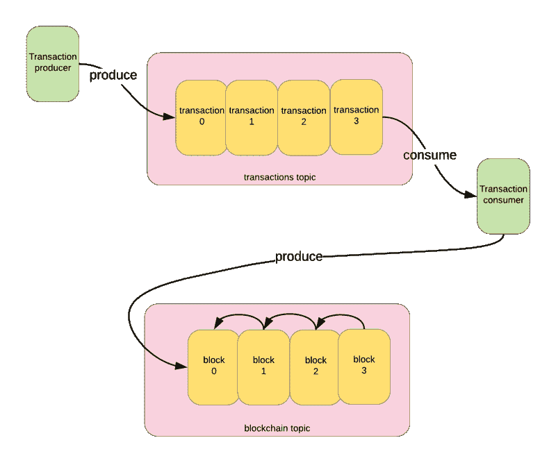
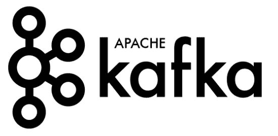
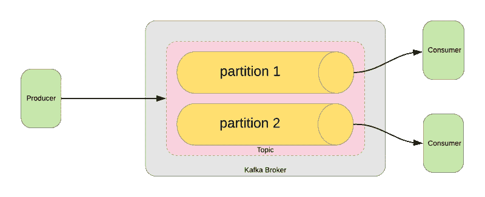

# 阿帕奇·卡夫卡的区块链实验

> 原文：<https://www.freecodecamp.org/news/a-blockchain-experiment-with-apache-kafka-97ee0ab6aefc/>

吕克·拉塞尔

# 阿帕奇·卡夫卡的区块链实验

区块链技术和阿帕奇卡夫卡有着共同的特征，这表明了一种天然的亲和力。例如，两者都有“不可变的只追加日志”的概念。在卡夫卡隔断的情况下:

> 每个分区都是一个有序的、不可变的记录序列，它被不断地追加到结构化提交日志中。分区中的每个记录都被分配了一个称为偏移量的顺序 id 号，该偏移量唯一地标识分区中的每个记录[ [Apache Kafka](https://kafka.apache.org/intro) ]

而区块链可以描述为:

> *一个不断增长的记录列表，称为块，使用加密技术进行链接和保护。每个块通常包含一个散列指针作为到前一个块的链接，一个时间戳和交易数据[ [维基百科](https://en.wikipedia.org/wiki/Blockchain) ]*

显然，这些技术共享不可变序列结构的并行概念，Kafka 特别针对高吞吐量和水平可伸缩性进行了优化，而区块链在保证序列的顺序和结构方面表现出色。

通过整合这些技术，我们可以创建一个实验区块链概念的平台。

Kafka 为分布式对等通信提供了一个方便的框架，具有一些特别适合区块链应用的特性。虽然这种方法在不可信的公共环境中可能不可行，但在私有或联盟网络中可能有实际用途。参见[用 Apache Kafka 扩展区块链](https://blog.gridplus.io/scaling-blockchains-with-apache-kafka-814c85781c6)了解如何实现的更多想法。

此外，通过一些实验，我们可能能够利用 Kafka 中已经实现的概念(例如，分区分片)来探索公共网络中区块链挑战的解决方案(例如，可扩展性问题)。

因此，本实验的目的是获取一个简单的区块链实现，并将其移植到 Kafka 平台；我们将采用 Kafka 的顺序日志概念，通过用散列将条目链接在一起来保证不变性。关于卡夫卡的话题将成为我们的分布式账本。从图形上看，它将是这样的:

Visual of a Kafka blockchain

### 卡夫卡简介

Kafka 是一个为高吞吐量、实时消息传递而设计的流平台，即它支持记录流的发布和订阅。在这方面，它类似于消息队列或传统的企业消息传递系统。一些特征是:

*   高吞吐量:Kafka 经纪人每秒可以吸收数千兆字节的数据，转化为每秒数百万条消息。你可以在[Apache Kafka 性能指标评测:每秒 200 万次写入](https://engineering.linkedin.com/kafka/benchmarking-apache-kafka-2-million-writes-second-three-cheap-machines)中了解更多关于可伸缩性的特性。
*   竞争的消费者:同时向多个消费者传递消息，这在传统的消息传递系统中通常是很昂贵的，并不比单个消费者复杂。这意味着我们可以为[竞争消费者](http://www.enterpriseintegrationpatterns.com/patterns/messaging/CompetingConsumers.html)设计，保证每个消费者将只接收一条消息，并实现高度的水平可伸缩性。
*   容错:通过在集群中的多个节点之间复制数据，单个节点故障的影响被最小化。
*   消息保留和重放:Kafka 经纪人维护消费者补偿的记录——消费者在信息流中的位置。使用这种方法，即使消息已经被传递，消费者也可以回滚到流中的前一个位置，从而允许他们重新创建系统在某个时间点的状态。可以将代理配置为无限期保留消息，这对于区块链应用程序是必要的。

在卡夫卡的作品中，每个主题都被分割成若干部分，每个部分都是一系列不断追加的记录。这类似于文本日志文件，其中新行被追加到末尾。分区中的每个条目都分配有一个顺序 id，称为偏移量，它唯一地标识记录。

Kafka partitioning

Kafka 代理可以通过偏移量进行查询，即消费者可以将其偏移量重置为日志中的某个任意点，以从该点开始检索记录。

### 辅导的

完整的源代码可以在这里找到。

#### **先决条件**

*   对区块链概念的一些理解:下面的教程基于丹尼尔·范·弗莱明和 T2 的实现，他们都是优秀的实践介绍。下面的教程在很大程度上建立在这些概念上，同时使用 Kafka 作为消息传输。实际上，我们将把一个 Python 区块链移植到 Kafka，同时保持当前的大部分实现。
*   Python 基础知识:代码是为 Python 3.6 写的。
*   [Docker](https://www.docker.com) : docker-compose 用于运行 Kafka broker。
*   kafkacat :这是一个与 Kafka 交互的有用工具(例如发布消息到主题)

在启动时，我们的 Kafka 消费者将尝试做三件事:初始化一个新的区块链(如果还没有创建的话);构建区块链主题当前状态的内部表示；然后开始循环读取事务:

初始化步骤如下所示:

首先，我们找到区块链主题的最高可用偏移量。如果没有任何东西发布到这个主题，那么区块链是新的，所以我们从创建和发布 genesis 块开始:

在`read_and_validate_chain()`中，我们将首先创建一个消费者来读取`blockchain`主题:

关于我们用来创建该消费者的参数的一些注释:

*   对于给定的分区和主题，将消费者组设置为`blockchain`组允许代理保存消费者已经达到的偏移量的引用
*   `auto_offset_reset=OffsetType.EARLIEST`表示我们将从主题的开头开始下载消息。
*   定期通知代理我们刚刚消耗的补偿(与手动提交相反)
*   `reset_offset_on_start=True`是为用户激活`auto_offset_reset`的开关
*   如果没有新消息被读取，将触发消费者在五秒钟后从该方法返回(我们已经到达链的末端)

然后我们开始阅读来自`blockchain`主题的块消息:

对于我们收到的每封邮件:

1.  如果它是链中的第一个块，跳过验证并添加到我们的内部副本(这是起源块)
2.  否则，检查该块相对于前一个块是否有效，并将其附加到我们的副本中
3.  记下我们刚刚消耗的块的偏移量

在这个过程的最后，我们将已经下载了整个链，丢弃了任何无效的块，并且我们将拥有对最新块的偏移量的引用。

此时，我们已经准备好在`transactions`主题上创建一个消费者:

我们的示例主题已经创建了两个分区，以演示 Kafka 中的分区是如何工作的。分区是在`docker-compose.yml`文件中设置的，这一行是:

`KAFKA_CREATE_TOPICS=transactions:2:1,blockchain:1:1`

`transactions:2:1`指定分区数量和复制因子(即有多少代理将在该分区上维护数据副本)。

这一次，我们的消费者将从`OffsetType.LATEST`开始，因此我们只获得从当前时间开始发布的交易。

通过将消费者锁定到`transactions`主题的特定分区，我们可以增加该主题上所有消费者的总吞吐量。Kafka broker 将在 transactions 主题的两个分区之间平均分配传入的消息，除非我们在发布到主题时指定了一个分区。这意味着每个消费者将负责处理 50%的消息，使单个消费者的潜在吞吐量翻倍。

现在我们可以开始消费事务了:

收到交易后，我们会将它们添加到内部列表中。每三个事务，我们将创建一个新的块并调用`mine()`:

1.  首先，我们将检查我们的区块链是否是网络中最长的一个；我们保存的偏移是最新的，还是其他节点已经将后面的块发布到区块链？这是我们的共识步骤。
2.  如果已经追加了新的块，我们将利用之前的`read_and_validate_chain`,这一次提供我们最新的已知偏移量来仅检索较新的块。
3.  在这一点上，我们可以基于来自最新块的证明来尝试计算工作证明。
4.  为了奖励我们自己解决了工作证明，我们可以在块中插入一个事务，给我们自己一个小的块奖励。
5.  最后，我们将在区块链主题上发布我们的区块。发布方法如下所示:

### 在活动

1.  首先启动代理:

`docker-compose up -d`

2.在分区 0 上运行使用者:

`python kafka_blockchain.py 0`

3.将 3 个事务直接发布到分区 0:

4.检查交易是否被添加到`blockchain`主题的块中:

`kafkacat -C -b kafka:9092 -t blockchain`

您应该会看到如下输出:

为了平衡两个消费者之间的事务，在分区 1 上启动第二个消费者，并从上面的发布脚本中删除`-p 0`。

### 结论

卡夫卡可以为区块链实验提供一个简单框架的基础。我们可以利用平台内置的特性和 kafkacat 等相关工具来试验分布式对等交易。

虽然在公共环境中扩展交易存在一系列问题，但在已经建立了真实世界信任的私有网络或财团中，可以通过利用 Kafka 概念的实现来实现交易扩展。