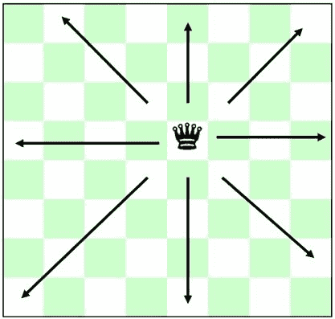
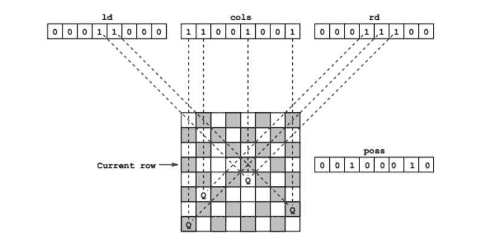
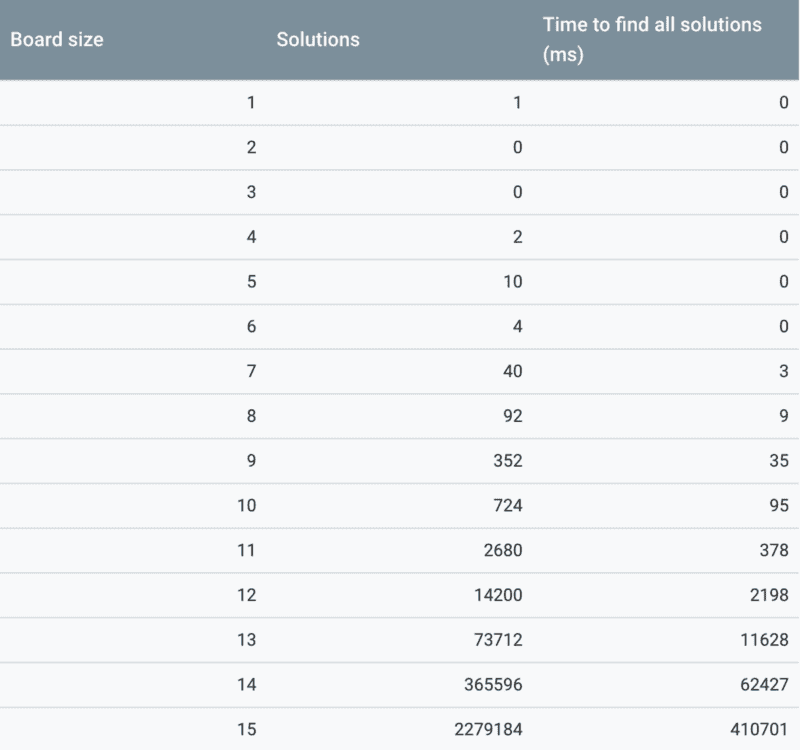
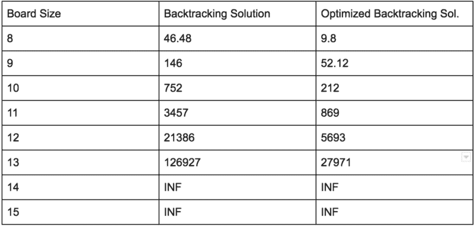
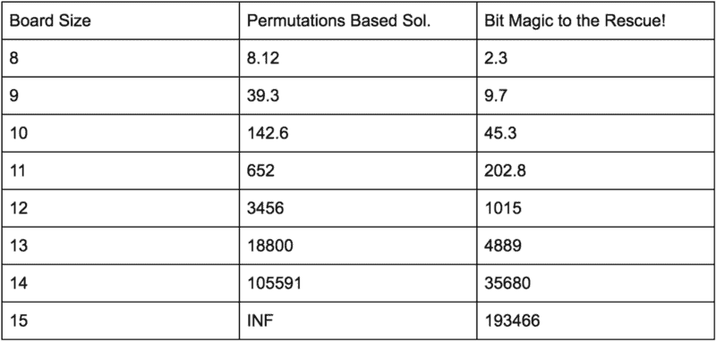

# 让我们原路返回，拯救一些女王

> 原文：<https://www.freecodecamp.org/news/lets-backtrack-and-save-some-queens-1f9ef6af5415/>

作者:Sachin Malhotra

# 让我们原路返回，拯救一些女王


[https://derickbailey.com/wp-content/uploads/2015/01/recursion1.jpg](https://derickbailey.com/wp-content/uploads/2015/01/recursion1.jpg)

这是一个看起来很奇怪的标题，现在可能没有意义。但是相信我，这是一个相当长的帖子，真的很有趣！

#### 什么是回溯？

[回溯](https://en.wikipedia.org/wiki/Backtracking)是基于[递归](https://medium.freecodecamp.org/recursion-recursion-recursion-4db8890a674d)的标准问题解决技术。

回溯算法试图逐步建立一个计算问题的解决方案。每当算法需要在解决方案的下一个组成部分的多个选项之间做出决定时，它只是递归地尝试所有可能的选项。

[深度优先搜索](https://en.wikipedia.org/wiki/Depth-first_search) (DFS)在其核心使用回溯的概念。因此，在 DFS 中，我们基本上尝试递归地探索来自给定节点的所有路径，直到我们到达目标。在我们探索了 DFS 中一棵树的特定分支之后，我们可以到达两种可能的状态。

*   我们找到了目标状态，在这种情况下，我们简单地退出。
*   或者，我们没有找到目标状态，我们走进了死胡同。在这个场景中，我们 ***回溯到最后一个检查点*** ，然后尝试一个不同的分支。

有关深度优先搜索算法的详细介绍，请浏览

[**深潜图:DFS 遍历**](https://medium.com/basecs/deep-dive-through-a-graph-dfs-traversal-8177df5d0f13)
[*无论好坏，做一件事总有不止一种方法。幸运的是，在软件和……*medium.com](https://medium.com/basecs/deep-dive-through-a-graph-dfs-traversal-8177df5d0f13)的世界里

关于回溯和递归的详细介绍，请阅读下面两篇文章。

[**回溯解释**](https://medium.com/@andreaiacono/backtracking-explained-7450d6ef9e1a)
[*回溯是我最喜欢的算法之一，因为它的简单和优雅；它并不总是很棒……*medium.com](https://medium.com/@andreaiacono/backtracking-explained-7450d6ef9e1a)[**递归是如何工作的——用流程图和视频解释**](https://medium.freecodecamp.org/how-recursion-works-explained-with-flowcharts-and-a-video-de61f40cb7f9)
[*“为了理解递归，首先必须理解递归。”*medium.freecodecamp.org](https://medium.freecodecamp.org/how-recursion-works-explained-with-flowcharts-and-a-video-de61f40cb7f9)

现在我们都是回溯和递归的专家，让我们看看“皇后”和这些有什么关系。

### 著名的 N 皇后问题

在棋盘上定位皇后是数学和计算机科学中的经典问题。

《皇后之谜》(又名《八皇后之谜》)最初出版于 1848 年。它包括将八个皇后放在一个 8x8 的棋盘上，这样两个皇后就不能互相攻击。

王后碰巧是棋盘上最有权力的棋子，主要是因为它有行动自由。

女王可以向 8 个不同的方向移动，如下图所示:



8 directions for the Queen’s movement.

这种移动自由使得 N 皇后问题变得极其困难。

下面是本文剩余部分进展的简要概述。我们将讨论 4 种不同的算法来解决这个问题:

*   暴力解决方案。
*   基于回溯的解决方案。
*   基于置换的解决方案。
*   最后，看似疯狂的解决方案使用位魔法。

我强烈建议按照这个顺序通读解决方案。但是，如果您已经熟悉某个解决方案，请随意跳过它。

下面讨论的解决方案的完整代码可在[这里](https://github.com/edorado93/Save-The-Queens/tree/master)获得。

### 强力解决方案

```
while there is life on earth:    try a possible arrangement of queens.
```


[https://i.ytimg.com/vi/keCgNXlq3Vo/maxresdefault.jpg](https://i.ytimg.com/vi/keCgNXlq3Vo/maxresdefault.jpg)

我们有一个 8×8 的棋盘，这意味着我们有 64 个不同的位置来放置皇后。我们需要计算 C(64，8)，或者 64 个对象的组合数量，一次取 8 个。

```
C(n,r) = n! / (r!(n−r)!)
```

在一个 8×8 的棋盘上，我们有大约 45 亿种不同的排列组合。

强力算法如下:

```
while there are untried configurations{   generate the next configuration   if queens don't attack in this configuration then   {      print this configuration;   }}
```

对于标准处理器来说，这是一个很大的变化。我们可以使用某种多处理解决方案(因为检查一个排列独立于另一个)。

但是，当我们有更好的算法来解决这个问题时，为什么还要这样做呢？

### 追踪

对于这个问题，我们可以做得比天真的强力解决方案更好。考虑以下基于回溯的解决方案的伪代码:

```
1) Start in the leftmost column2) If all queens are placed    increment the number of solutions counter and return3) Try all rows in the current column. Do following for every tried row.    a) If the queen can be placed safely in this row then mark this [row, column] as part of the solution and recursively check if placing queen here leads to a solution.
```

```
 b) If placing queen in [row, column] leads to a solution then   increment the number of solutions counter and return
```

```
 c) If placing queen doesn't lead to a solution then unmark this [row, column] (Backtrack) and go to step (a) to try other rows.
```

```
4) If all rows have been tried and nothing worked, return, to trigger backtracking.
```

伪代码看起来很简单，你可以在这里查看这个[的基于 python 的代码。我不会在这里提供回溯算法的描述。](http://www.geeksforgeeks.org/backtracking-set-3-n-queen-problem/)

然而，我想用来讨论一个 **优化**来减少检查我们是否能在棋盘上的单元格中放置皇后的时间复杂度。

该算法的一个重要部分是我们必须检查一个皇后是否能被放入单元格`[i, j]`。这一步需要很长时间。让我们来看看一个蛮力的方法来做到这一点，然后在一个优化的版本。

这有一个 O(N)的 [**时间** **复杂度**](https://www.youtube.com/watch?v=KSNx22U4uWE) **，**并且这将为棋盘上的每个单元格调用多次。

然而，我们可以利用一些额外的数据结构来加速在单元格`[i, j]`上放置 queen 的有效性检查。这将把复杂度降低到`O(1)`——换句话说，恒定时间。这是一个巨大的减少！。

这段代码的要点如下:

*   特定对角线(从左上到右下)中的所有元素都具有相同的`row — column`值。
*   特定反对角线中的所有元素(从右上到左下)都具有相同的`row + column`值。

这种优化将`isSafe` 的复杂度降低到 *`O(1)` **。*** 万岁？。

既然我们已经完成了 N 皇后的基本算法。让我们来看看一些比上面描述的运行速度更快的更复杂的程序。

### 置换和 N 皇后

这个算法背后的思想非常简单。考虑以下关于每个皇后位置的事实:

*   一排只能放一个皇后。
*   对于每一列也是如此。
*   这意味着所有成功的解决方案都只是列下标的**排列。**
*   每连续一行就少一个皇后的候选位置。

按照这个逻辑，问题空间归结为仅仅 **8！= 40,320.**

这给了我们更少的选择去尝试和寻找解决问题的方法。

让我们看看这种方法的伪代码:

```
* Start with an initial permutation of the queens lined up along one of the diagonals. 
```

```
* To position a queen on row j    * If j has reached N, you have a valid solution. Process it as               valid.    * Loop on k from j to N       * Swap board[j] and board[k].        * Check if a queen can be placed on (row, board[row])           * If yes, then place a queen and recurse for row j+1       * Undo placing a queen on (row, board[row])   * Undo the swaps done. 
```

为了更加清晰，让我们看看代码:

**注意:** `board[i]`存储行`i.`中放置皇后的列号，因此单元格值由`(i, board[i])`给出。

这种优化大大加快了计算速度，因为放置皇后时要考虑的电路板空间大大减少了。

随着我们增加棋盘的大小，以及要放置的皇后的数量，加速变得更加明显。

此外，对特定单元格的有效性检查变得更简单，因为现在我们只需检查对角线和反对角线。

### 让我们看看一些小魔术！

我第一次遇到这个问题时，对这个特殊的解决方法几乎一无所知。

不过这也是可以理解的，因为嘿，这是 **bit** **魔法！**

但谢天谢地，我发现了这篇令人惊叹的[博文](http://gregtrowbridge.com/a-bitwise-solution-to-the-n-queens-problem-in-javascript/)逐行解释了整个算法。代码是 JavaScript。除了 python 中的代码，我将描述同样的事情。阅读任何适合你的帖子:)

解释这种算法的最好方法是先写代码？


[http://mymemes.biz/wp-content/uploads/2017/10/meme-magic-59df0f3650800.jpg](http://mymemes.biz/wp-content/uploads/2017/10/meme-magic-59df0f3650800.jpg)

该算法的工作原理与之前讨论的基本原理相同。在将皇后放在某个方格之前，我们只需要检查三件事情:

1.  方块的柱子上没有其他的皇后
2.  正方形的左对角线上没有任何其他皇后
3.  正方形的右对角线上没有任何其他皇后

代码可能看起来像一个似乎可以工作的黑盒。这就是我第一次读到这段速度惊人的代码时的感受。

让我们试着一行一行地分解它。

#### 第一行

您会注意到该函数接受 4 个参数:

1.  圆柱
2.  左对角线
3.  右对角线
4.  皇后区

`**queens_placed**` 是不言自明的。我们需要记录到目前为止我们已经放置了多少皇后，以便递归在某一点终止。

三个变量`column`、`left_diagonal`和`right_diagonal` 基本上是整数，但是出于该算法的目的，它们被视为比特序列。这些变量帮助我们确定当前行上要放置皇后的开放位置。

我们来看下图:

*   `ld` =左对角线
*   `cols` =列
*   `rd` =右 _ 对角线



[http://gregtrowbridge.com/a-bitwise-solution-to-the-n-queens-problem-in-javascript/](http://gregtrowbridge.com/a-bitwise-solution-to-the-n-queens-problem-in-javascript/)

忽略`poss` 变量暂且不提。我们稍后会谈到它。

#### 第 2–6 行

这些代码行只是处理递归的基本情况。当我们将`N` queens 放在 N 乘 N 板上时，如果在运行时设置了适当的标志，我们将增加解决方案计数器的数量并打印解决方案(参见该标志的完整代码)。

#### 第 8 行

这将找到当前行上剩余的`valid_spots`。这基本就是上图描绘的`poss`变量。

```
valid_spots = self.all_ones & ~(column | left_diagonal | right_diagonal)
```

例如，假设经过一定次数的迭代后，我们有:

```
left_diagonal = 00011000column = 11001001 right_diagonal = 00011100
```

代码`(column | left_diagonal | right_diagonal)`只是做一个“或”运算，以位序列 11011101 结束。

然后，在该表达式前面添加`~`会导致结果位序列“翻转”(因此所有的 0 都变成 1，反之亦然)，并且`valid_spots`会被设置为 00100010。

因此，对于当前行，列号 0、1、3、4、5 和 7 不可用。我们只能在第二列和第六列放一个皇后。这是我们将尝试的仅有的两个地方。

#### 第 10 行

```
current_spot = -valid_spots & valid_spots
```

该行找到第一个非零位，并将其存储到`current_spot`中。所以它基本上是寻找第一个可以放置皇后的空位(从最右边的一列开始)。

这就是算法如此快速的原因。我们使用位操作符直接告诉我们放置皇后的空位置是完全安全的。因此，这导致了速度的大幅提升，稍后您将看到这一点。

#### 第 11 和 12 行

第 11 行简单地将放置在`current_spot` 的皇后添加到我们的解决方案集中，以便我们稍后可以打印它。

第 12 行将`current_spot` 标记为不可用。记住，[异或](https://en.wikipedia.org/wiki/XOR_swap_algorithm)相同的位导致 0。

#### 第 13 行

这可能是该算法最重要的一行代码(也是最令人困惑的一行)。在这里，我们只是将我们引入的效果传播到下一行。

我们在`current_spot` 处放置了一个皇后，现在我们想要更新我们的变量`column`*`left_diagonal`*和*`right_diagonal`*，以便在我们移动到下一行时包含这些变化。****

```
***`self.solve((column | current_spot), (left_diagonal | current_spot)>> 1,(right_diagonal | current_spot) << 1, queens_placed + 1)`***
```

*****注:** `a | b`表示变量`a`和`b`的按位或。还有，`a <` < 1 是左屎运算符。明喻`arly,` a > > 1 是右移位运算符。***

***所以调用`(right_diagonal | current_spot) <` < 1 简单来说就是:用 OR 运算 co `mbine right_di` agona `l and curren` t_spot，然后将结果中的所有内容向左移动一位。***

***例如，假设`right_diagonal`有值`00011100`。比如说我们让皇后占据了最后一个槽位，比如`valid_spots` 整数`00100010`中的最后一个 1。***

**然后`current_spot`会变成`000000010`，与`right_diagonal`进行 OR 运算会得到`00011110.`，我们将其左移得到`00111100`，这正是我们想要的右对角线的效果。**

**右对角线从右上移到左下。位的左移会产生这种效果。**

**为了更清楚，试着在纸上做这个操作:**

**

Just so you don’t have to go up the article ?** 

**我们从所有三个变量的 0 开始，这意味着所有的位置都可以在第一行放置皇后。**

**现在有趣的部分来了(嗯，让你吃惊的东西？)，速度比较。**

### **统计数据**

**让我们来看看 Google 为解决 N 皇后问题而开发的工具的统计数据。**

**

[https://developers.google.com/optimization/cp/queens](https://developers.google.com/optimization/cp/queens)** 

**以下是我们讨论过的四种不同的 N 皇后方法的统计数据:**

**

All the times are in ms.** **

All the times are in ms.** 

**最后一个包含按位运算符的解决方案显然比 [Google 的](https://developers.google.com/optimization/cp/queens) N-Queens 解算器报告的结果表现得更好。？**

**此外，这里要注意的一件有趣的事情是轻微的优化对结果的影响。回想一下我们将`is_cell_safe`检查从`O(N)`解决方案转换为`O(1)`检查的优化。这清楚地向我们展示了如此小的变化是如何带来巨大的性能影响的。**

**如果你一直读到最后，我敢肯定你对算法的好奇心已经得到了满足！但是，嘿，这只是冰山一角？。**

**我很快会有另一个帖子，我们将解决一个类似于 N 皇后的问题，但有一点小小的变化。**

**Rahul Gupta 对代码和文章的宝贵投入值得称赞。**