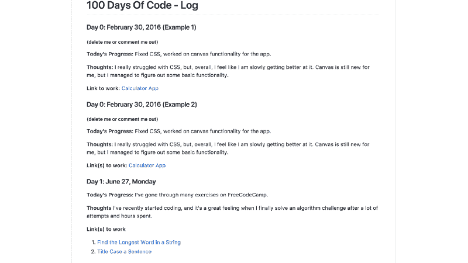
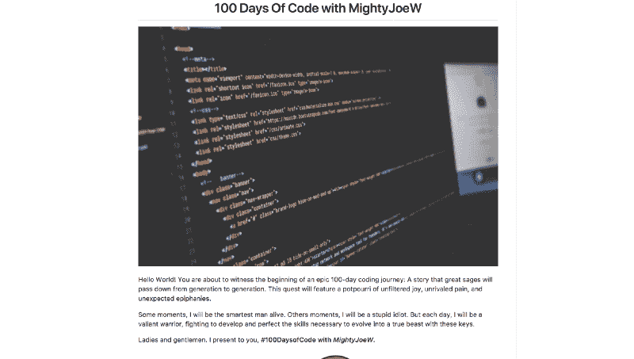
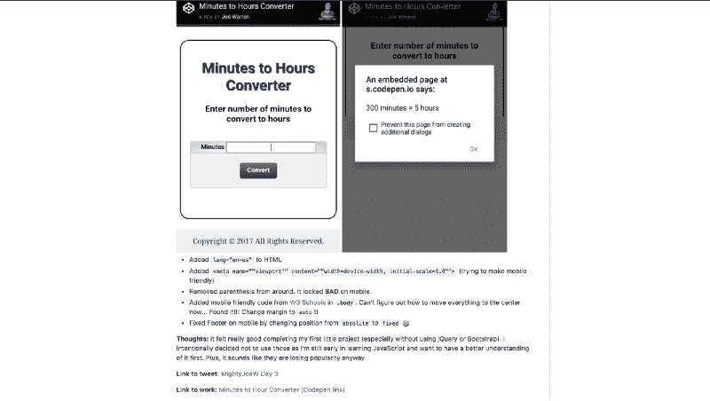
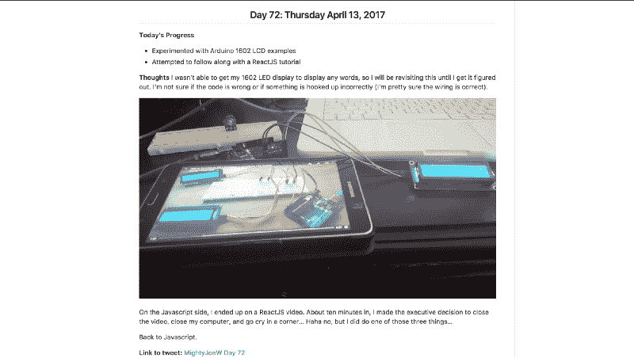

# 如何将你的#100DaysOfCode 日志转化为视觉体验

> 原文：<https://www.freecodecamp.org/news/how-to-transform-your-100daysofcode-log-into-a-visual-experience-d048334af8d9/>

作者乔·沃伦

# 如何将你的#100DaysOfCode 日志转化为视觉体验


Photographer: Lauren Mancke

学习如何编码是一种无与伦比的现代体验。作为一名有抱负的开发人员，无论你处于什么级别，你都有一个独特而迷人的故事可以根据你的个人经历和创作来讲述。

然而，**缺乏有效讲述你的故事或激发兴趣的能力会导致许多错失的机会**。Alexander Kallaway 的#100DaysOfCode 挑战鼓励你在 100 天内每天至少编码一个小时。该挑战提供了一个有用的[样本日志](https://github.com/Kallaway/100-days-of-code/blob/master/log.md)，用于记录和分享你的日常进展。

虽然我真的很欣赏这个日志样本，但我内心的故事讲述者不会允许我的日志看起来和其他人的日志一模一样。另外，我无法想象有人会通读我的 100 个基于文本的条目(除了我妈妈)。



Screenshot of #100DaysOfCode Log Template

作为一名创作者，我想在我的帖子中附上描述性的图片。

> 我不想简单地说我在做什么。我想用 ***向*** 展示我的项目在不同阶段的样子。

我坚信应该让潜在雇主和招聘人员尽可能容易地看到你的工作。人们很忙，可能在你的 100 个文本专属条目列表中排不上太远。即使你还没有试图吸引潜在的雇主，你仍然会有一个更有趣、更愉快的经历让你的朋友和其他开发者去体验。

### 提示和建议

创建一个介绍 -这可以是一个简短而甜蜜的介绍，介绍你是谁，你的日志是什么。这将从一开始就赋予你的日志生命，因为你的浏览者可以和你这个人类联系起来。我还在顶部放了一张图片，让它看起来更像一篇文章或一个故事。



Example of a #100DaysOfCode Log introduction

**添加照片、截图和 gif**——100 daysofcode 日志非常冗长。每个条目的图片将极大地有助于快速显示您所做的工作。



#100DaysOfCode post with images

添加一些东西的截图，比如你的实际代码，一个正在进行的工作，一个已经完成的网站，甚至是一些迷因来增加你的得分。为了超链接截图，我将我的截图上传到 Google 相册，并从那里复制链接。使用任何最适合你的方法。



#100DaysOfCode post featuring an Arduino setup

**包含实时项目的链接** -有你的 GitHub repos 的链接很好，但同样，让我们帮助你的观众。每个人都不会花时间浏览你的代码或者克隆你的 repos 来看你的项目。 [GitHub Pages](https://pages.github.com/) 为你的网站提供免费在线托管。如果你使用 Codepen，也包括那些链接。

**钉在 Twitter 上**——如果你每天都在发#100DaysOfCode 的推文，考虑创建一条关于你的日志的推文，并附上链接。这样，任何看到你的 Twitter 页面的人都会立即链接到你生动的编码之旅。要发布推文，请点击推文右上角的向下箭头，然后选择“发布到您的个人资料页面”

下面是我为我的帖子创建的代码格式。请随意复制并用于您的帖子。

```
<h2 align=”center”>Day 1: Day Month 01, 2018</h2>
```

```

```

```
**Today’s Progress**: Write progress here.
```

```
**Thoughts:** Write additional thoughts here.
```

```
**Link to tweet:** [yourName Day 1](insertLinkToTweet)
```

```
**Link to work:** [nameOfWork](insertLinkHere)
```

如果在 GitHub 中使用上面的格式，你可以用任何照片的链接替换中的#号。右键单击您想要使用的照片，然后选择“复制图像地址”即可使用您的照片。

**如果你想使用 gif，giphy.com 的**有一个快速简单的过程将视频转换成 gif。完成后，您将单击新创建的 gif 上的链接图标来复制链接。然后，在日志的 img 标签中，用 gif 链接替换 hashtag，如下面的代码片段所示。

```

```

在一天结束的时候，#100DaysOfCode 是关于如何在一致的基础上愉快地学习编码，所以如果你没有时间做更详细的日志，不必担心。这确实需要一些额外的时间，但是有一个独特的日志来捕捉和显示你在 100 天内的进展是值得的。

如果您有任何想法、意见或问题，欢迎在下面评论或在 [LinkedIn](https://www.linkedin.com/in/josephmwarren/) 上与我联系。最后，你可以在这里查看我的#100DaysOfCode 第一轮日志。

祝你好运，玩得开心！