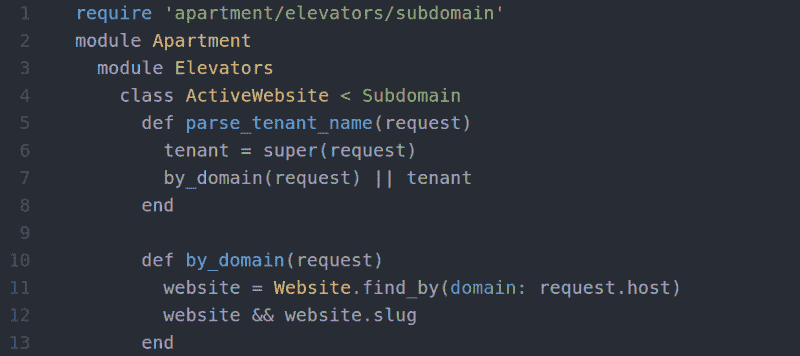
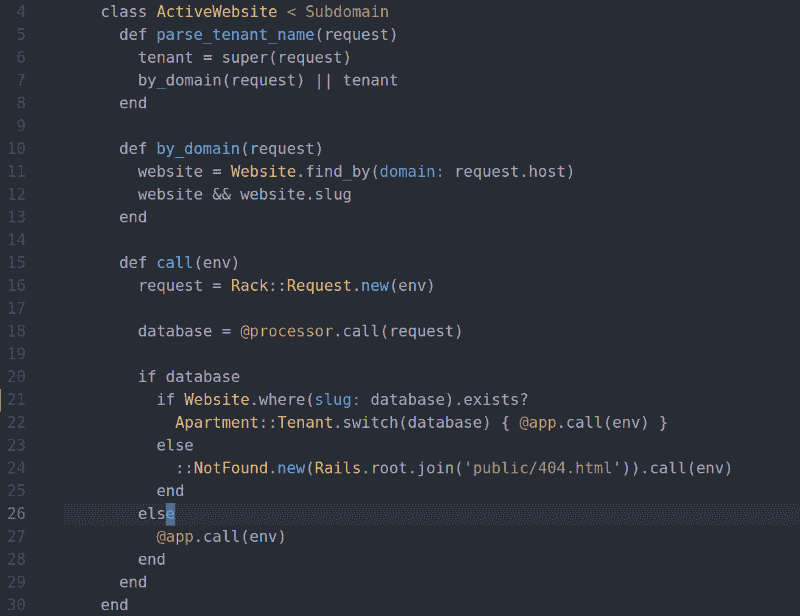
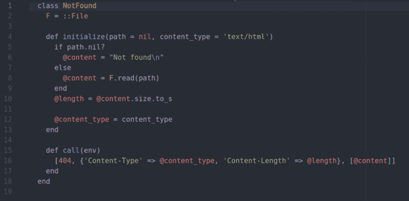
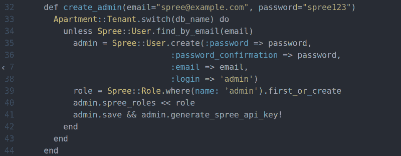
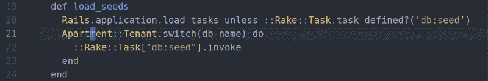
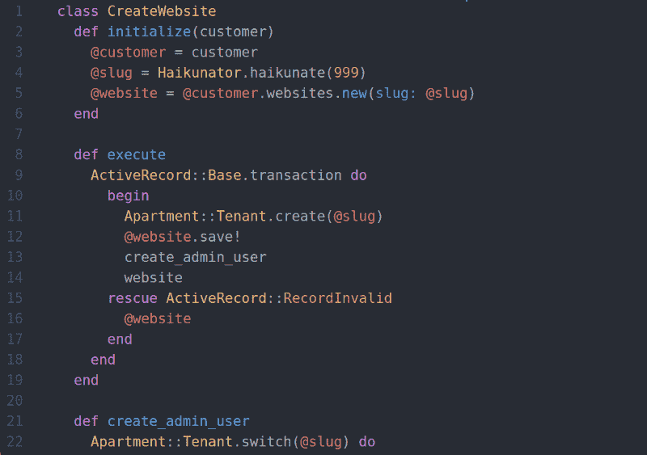

# 构建多租户应用程序很容易…如果你有一套公寓的话！

> 原文：<https://www.freecodecamp.org/news/building-a-multi-tenant-app-is-easy-if-you-have-an-apartment-3465f6eda85b/>

伊戈尔·彼得罗夫

# 构建多租户应用程序很容易…如果你有一套公寓的话！


如今，越来越多的初创公司出现在 SaaS 市场。对于他们的应用程序，他们有几种开发方法可供选择。而其中一个技术模型就是*多租户*或者*多租户* app。如果你打算与你的初创客户分享你的所有软件——要么拥有独立的数据/内容和网址(比如说， *SaaS* )，要么只是其中的一部分——你需要一个*多租户*应用。

这不是唯一的选择:我应该提到其他方法，但是让我们只提到它们——不同方法的比较可能是下一篇文章的好主题。

以下是我的列表(按实现复杂度排序):

*   基于 URL 路径的 *SaaS* 。最简单的。单域、单 DB 等。数据的应用程序级限制。
*   多租户 *SaaS* 。中等复杂程度。基于子域或基于域。多个数据库或模式。数据的数据库级限制。
*   基于虚拟化的 *SaaS* (感谢*码头工人*和朋友们！).高度复杂。基于子域/域。多个应用程序和数据库副本。数据的虚拟化级别限制。

### 多租户

那么什么是*多租户*？*多租户*是一种软件开发架构方法，其中每个客户端获得自己的应用配置和数据(与其他客户端严格或温和隔离)。每个“实例”被称为一个“T4”租户。

在过去的几年里，我开发了几个多租户应用程序(我主要是从零开始做*多租户*)。甚至现在，我还在开发两个*多租户*应用。

让我们从介绍和理论转到实践，看看在 *Ruby on Rails* 的世界里有什么可以用于*多租户*应用。

### 公寓

这是 *Ruby on Rails* 应用的第一名。让我们把它添加到 *Gemfile* :

```
gem ‘apartment’
```

在`bundle install`之后，您需要运行一个生成器，这样您将得到一些基本的配置模板:

```
bundle exec rails generate apartment:install
```

现在你有了`config/initializers/apartment.rb`，你可以调整如何使用*公寓*。应该配置的最重要的事情是:如何让"*公寓*知道如何识别您的租户来存储数据(我们假设它是一个 *PostgreSQL* 数据库，其中每个 *PostgreSQL* 模式是一个单独的租户)，以及如何根据 *HTTP* 请求显示数据。

好的，在我开发的一个应用程序中，我有一个带`slug`字段的`Website` *ActiveRecord* 模型。所以第一个设置是这样的，每个网站都是一个*租户*:

```
config.tenant_names = lambda { Website.pluck(:slug) }
```

比方说，我决定将任何子域视为网站的鼻涕虫。因此，如果我有一个带有`my-awesome-website` slug 的`Website`，那么`my-awesome-website.example.com`将提供来自`my-awesome-data` DB 模式的数据。为了实现这种行为，我们需要:

```
# require 'apartment/elevators/subdomain'
```

```
...Rails.application.config.middleware.use Apartment::Elevators::Subdomain
```

您可能需要的第三个设置是排除一些应该在所有*租户*之间共享的模型。就像我举的例子一样:

```
config.excluded_models = %w{ Customer Website Plan Feature PlanFeature }
```

### **高级提示**

#### 定制电梯等级

好了，我们已经构建了一个基于子域的多租户应用，但是如果我们需要为我们的客户定制域功能呢？但是也应该可以从子域名访问它。然后我们需要一个定制的电梯类，类似于我们上面使用的。

电梯类应该根据当前的请求决定应该使用哪个*租户*(数据库/模式)。如果我们在`Website`模型上有一个`domain`字段:



这里我们已经创建了一个定制的电梯类(在`lib/apartment/elevators/active_website.rb`中),它继承自`Subdomain`电梯并被`parse_tenant_name`覆盖，它应该根据请求返回租户名称。所以首先我们调用`super`并将结果保存在`tenant`变量中。如果我们有一个网站的域名被设置为被请求的域名，我们将返回这样一个 slug ( *tenant* )。否则，我们退回到子域。

#### 未找到不正确租户的页面

任务 2:如果请求了某个不存在的租户呢？有人向`no-such-tenant.example.com`发出请求，但是我们没有这样的数据库模式。我们能做的最好的事情就是用一些 404 页面来响应。这个任务和`apartment`没有直接关系，但是息息相关。

我们将像这样提升我们的电梯等级:



你可能会问什么？这是我为此使用的一个简单的中间件。放置在`app/middlewares`中，写如下:



任务解决—客户很高兴！

#### 排除的子域

如果您需要一个或几个子域作为公共*租户*(不是客户的)来处理，并且不打开对它的请求，您可以使用`excluded_subdomains`选项。该选项适用于`Subdomain`电梯及其子类:

```
Apartment::Elevators::ActiveWebsite.excluded_subdomains = ['app']
```

#### 播种数据

如果您的*租户*已经创建，您可以使用`db/seeds.rb`用数据初始化它们。通过`rails db:seed`，它将应用于每个租户。

但是，如果您需要通过编程用一些数据初始化刚刚创建的*租户*(通过`Apartment::Tenant.create`)该怎么办呢？嗯，您仍然可以通过切换到*租户*并创建一些模型(或者以编程方式执行 *Rake* 任务)来做到这一点。

看看`spree_shared` gem 是如何为流行的`spree` gem 做到这一点的(下面的代码是更新版本，因为`spree_shared`无法与当前的 *Spree* 版本兼容):



如果您需要将种子应用于每个*租户*，您可以这样写(同样，这是来自`spree_shared`的修改示例):



#### 将租户创建包装到事务中

下一步是将*租户*的创建封装到事务块中，因为我们知道每个*租户*都有一个对应的数据库模型(`Website`或`Customer`)，我们希望确保模型实例和*租户*都被创建。这将使我们的应用程序更具事务性，如果没有相应的模型实例，我们就不会有 DB *租户*，反之亦然。

*服务对象*前来救援！对于我们的托管网站应用程序，我们可以这样写:



我们需要处理可能的异常:如果由于某种原因没有创建记录或租户。

### 结论

嗯，正如你可能看到的，如果你有像`apartment` gem 这样的好工具，开发*多租户*应用程序是很容易的。请在评论中让我知道你的`apartment`设备案例。尤其是非标的。