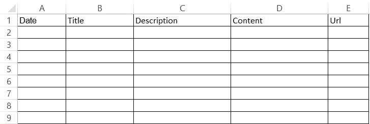
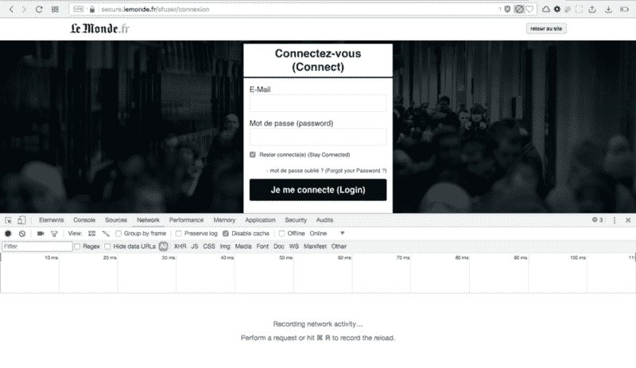
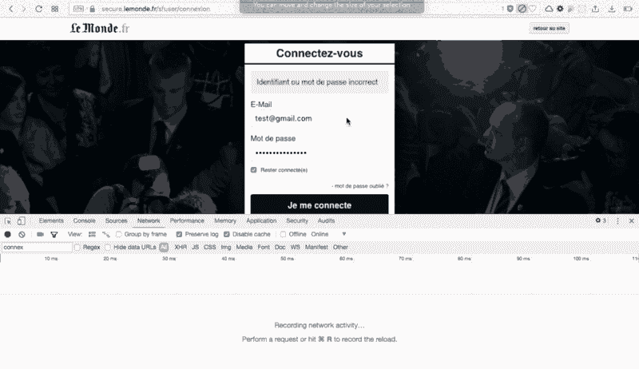
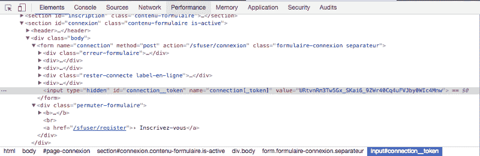

# 我是如何使用 Node 从一家报纸网站上搜集到 7000 篇文章的

> 原文：<https://www.freecodecamp.org/news/how-i-scraped-7000-articles-from-a-newspaper-website-using-node-1309133a5070/>

#### 我为什么要这么做？

我的女朋友正在写一篇关于法国嘻哈音乐随着时间推移的看法的论文。为此，她想从法国主流报纸 LeMonde.fr 上挖掘文章。

**问题**:从 80 年代开始，已经有超过**7000 篇文章**谈论嘻哈音乐。


My girlfriend’s reaction — Memegenerator.net

#### 我们来编码吧！

对于这个程序，我将使用:

*   本地节点脚本
*   fs:编写一个 JSON 文件
*   [请求](https://nodejs.org/dist/latest-v6.x/docs/api/http.html#http_event_request):发布和获取请求
*   Cheerio :加载 HTML 并能够与之交互

```
//To install cheerio :npm i --save cheerio
```

请确保您的 package.json 中包含了所有这些内容，一切都会好的:)

我想要什么？
最后，我想把一个 Excel 文件组织成这样:



My Goal

因此，我不得不使用这样构造的 JSON。我将在本文末尾向您展示如何将 JSON 转换成 Excel。

```
[
 {
 ‎ date:,
  title:,
  description:,
 ‎ text:,
 ‎ url:,
 ‎},
]
```

#### 第一步:获取所有文章的网址

第一步很容易。多亏了高级搜索功能，我只需获得结果页面的 URL 链接，并告诉我的代码如何:

*   寻找结果的数量
*   计算页数，知道每页有 30 篇文章
*   获取每页 30 篇文章的标题、描述、日期和 URL

下面是执行此操作的代码:

```
const fs = require("fs");
const request = require("request");
const cheerio = require("cheerio");

const jsonTab = []; // We create our table

function writeFile() {
  // Will write the json file
  fs.writeFile("output.json", JSON.stringify(jsonTab, null, 4), (err) => {
    console.log("File successfully written!");
  });
}

// The URL of the advanced search feature with our keywords
const url = 'http://www.lemonde.fr/recherche/?keywords="Rap+"+"hip-hop"+"hip%20hop"+"rappeur"+"rappeurs"+"raps"+"rappers"&page_num=1&operator=or&exclude_keywords=&qt=recherche_texte_title&author=&period=custom_date&start_day=01&start_month=01&start_year=1970&end_day=20&end_month=09&end_year=2017&sort=asc';

/* The first request call, our goal here is to get the number of results and then
to calculate the number of pages */
request(url, (error, response, html) => {
  const $ = cheerio.load(html);

  // All the variables we will use later
  let number;
  let description;
  let date;
  let title;
  let link;

  if (!error) {
    $(".bg_gris_clair").filter(() => {
      /* We want to select all the HTML
      elements with the class ".bg_gris_clair" (and we already know there is
      only one) */
      const data = $(this);
      const str = data.children("strong").text().trim();
      number = parseInt(str.substring(0, str.indexOf("e")).replace(/\s/g, ""), 10);
    });
  }

  let count = 1;

  for (let i = 1; i <= number / 10; i++) {
    const urlPerPage = 'http://www.lemonde.fr/recherche/?keywords="Rap+"+"hip-hop"+"hip%20hop"+"rappeur"+"rappeurs"+"raps"+"rappers"&page_num=' + i + "&operator=or&exclude_keywords=&qt=recherche_texte_title&author=&period=custom_date&start_day=01&start_month=01&start_year=1970&end_day=20&end_month=09&end_year=2017&sort=asc";

    request(urlPerPage, (err, response2, html2) => {
      if (!err) {
        const $ = cheerio.load(html2);

        $(".grid_11.omega.resultat").filter(() => {
          const json = {
            date: "",
            title: "",
            description: "",
            url: ""
          };
          const data = $(this);

          title = data.children("h3").children("a").text().trim();
          link = "http://lemonde.fr" + data.children("h3").children("a").attr("href").trim();
          description = data.children("p").text().trim();
          const dateStr = data.children("span").text();
          date = dateStr.replace(/.+?(?=\d)/, "");

          json.title = title;
          json.url = link;
          json.description = description;
          json.date = date;
          jsonTab.push(json);
        });
      } else if (err) {
        console.log(err);
      }

      count += 1;

      // Write the file once we iterated through all the pages.
      if (count === parseInt(number / 10, 10)) {
        writeFile();
      }
    });
  }
});
```

一旦我这样做了，我就有了一个超过 7000 个条目的 JSON 文件。对于他们每个人，我都有:

*   约会
*   一个标题
*   描述
*   一个网址

我只是缺少内容…

“好吧，我只需使用相同的代码，并运行它的 7000 个网址，我得到的内容！”


Image Credit : Gemma Correll

我已经积极地学习编码一年了…我学到的第一件事是:**在代码中没有什么是简单的**。永远不会。但是对于你**将要**纠结的每一个问题，有一个问题你可以谷歌一下；-).

我发现，如果没有付费账户，很大一部分文章都是不可用的。因此，我必须连接到查看内容和刮它。

幸运的是，我们设法得到一个高级帐户。我只需要找到一种方法来告诉我的代码如何:

*   认证到 [lemonde.fr](https://lemonde.fr)
*   刮擦时保持连接

#### 第二步:如何通过网站认证

为此，我需要了解当我点击“登录”时，网站是如何工作的好消息是:我们有开发工具。

我只需要找出网站如何发送密码和用户名到服务器，并复制模式。

这里是 LeMonde.fr 的认证页面(由于这是法语平台，我翻译了一些文字帮助大家理解):



Screenshot of lemonde.fr

现在，当我们尝试登录时会发生什么？



你看到了吗？我点击了“登录”, lemonde.fr 发送了一个 POST 请求，其中有一个简单的表单，包含五位信息:

*   连接[邮件] = '您的用户名'
*   连接[密码] = '您的密码'
*   connection[stay _ connected]= boolean:1 表示真，0 表示假(提示:您希望它是真的)
*   连接[保存] =此处不需要任何东西
*   连接[令牌] =这是棘手的部分

我们已经知道了五个信息中的四个。我们只需要找到“令牌”是从哪里来的。

幸运的是，lemonde.fr 对我们☺️:很好



第一次加载页面时，会在隐藏输入中自动生成连接令牌。你只需要知道它，并在尝试登录之前得到它。

好了，我们现在准备进入第 3 步！

#### 第三步:要抓住他们！


Credit : Giphy.com

下面是验证、检索和保存 cookies 并最终收集所有文章的完整代码。

```
const fs = require("fs");
const request = require("request");
const cheerio = require("cheerio");

// Prepare all the variables needed later
let count = 0;
let timeout = 0;
const id = "myusername";
const mdp = "mypassword";
let obj;

// The URLs we will scrape from
const connexionUrl = "https://secure.lemonde.fr/sfuser/connexion";

// Will write an "output.json" file
function writeFile() {
  fs.writeFile("output.json", JSON.stringify(obj, null, 4), (err) => {
    console.log(
      "File successfully written! - Check your project directory for the output.json file"
    );
  });
}

// creating a clean jar to store the cookies
const j = request.jar();

// First Get Request Call
request(
  {
    url: connexionUrl,
    jar: j
  },
  (err, httpResponse, html) => {
    const $ = cheerio.load(html);

    // We use Cheerio to load the HTML and be able to find the connection__token
    const token = $("#connection__token")[0].attribs.value; // here is the connection__token

    // Construction of the form required in the POST request to login
    const form = {
      "connection[mail]": id,
      "connection[password]": mdp,
      "connection[stay_connected]": 1,
      "connection[save]": "",
      "connection[_token]": token
    };

    // POST REQUEST to Log IN. Same url with "request headers" and the complete form.
    request.post(
      {
        url: connexionUrl,
        jar: j,
        headers: {
          Accept:
            "text/html,application/xhtml+xml,application/xml;q=0.9,image/webp,image/apng,*/*;q=0.8",
            "Accept-Encoding": "gzip, deflate, br",
            "Accept-Language": "fr-FR,fr;q=0.8,en-US;q=0.6,en;q=0.4",
            "Cache-Control": "no-cache",
            "Content-Type": "application/x-www-form-urlencoded",
            Origin: "http://secure.lemonde.fr/",
            Host: "secure.lemonde.fr",
            "Upgrade-Insecure-Requests": 1,
            "User-Agents":
            "Mozilla/5.0 (Macintosh; Intel Mac OS X x.y; rv:42.0) Gecko/20100101 Firefox/42.0",
          Connection: "keep-alive",
          Pragma: "no-cache",
          Referer: "https://secure.lemonde.fr/sfuser/connexion"
        },

        form: form
      },
      (error, response, body) => {
        // WE ARE CONNECTED :D

        /* Second GET request call : this time, we use the response of the POST
        request to request the right URL */
        request(
          {
            url: response.headers.location,
            jar: j
          },
          (err, httpResponse, html2) => {
            const json = fs.readFileSync("./firstStep.json"); // Load the JSON created in step one
            obj = JSON.parse(json); // We create our JSON in a usable javascript object

            // forEach loop to iterate through all the object and request each link
            obj.forEach((e) => {
              let articleUrl = e.url;

              /* We use a setTimeout to be sure that all the requests are performed
              one by one and not all at the same time */
              setTimeout(() => {
                request(
                  {
                    url: articleUrl,
                    jar: j
                  },
                  (error1, httpResponse, html3) => {
                    if (!error1) {
                      const $ = cheerio.load(html3); // load the HTML of the article page
                      $(".contenu_article.js_article_body").filter(() => {
                        const data = $(this);

                        // get the content, remove all the new lines (better for Excel)
                        let text = data
                          .text()
                          .trim()
                          .replace(/\n/g, "\t");

                        e.text = text; // push the content in the table
                      });

                      $(".txt3.description-article").filter(() => {
                        const data = $(this);

                        const description = data
                          .text()
                          .trim()
                          .replace(/\n/g, "\t");

                        e.description = description;
                      });
                    }
                  }
                );

                count += 1;

                // Write a new JSON file once we get the content of all the articles
                if (count === obj.length) {
                  writeFile();
                }
              }, timeout);

              timeout += 50; // increase the timeout length each time
            });
          }
        );
      }
    );
  }
); 
```

我现在有了一个 JSON 文件，其中包含所有文章及其内容。最后一步是将其转换成实际的 Excel 表格。

#### 红利第四步:从。JSON 到。战斗支援车

下面是将你的“output.json”文件转换为“output.csv”的简单代码(可以感谢我的朋友 [@jvdsande](https://github.com/jvdsande) ):

```
const fs = require('fs');

let jsonstring = fs.readFileSync('output.json') // load the output.json file
let json = JSON.parse(jsonstring)

function JSONtoCSV(JSON) {
  let CSV = ''

  Object.keys(JSON[0]).forEach((key) => {
    CSV += key + '§'
  })

  CSV += '\r\n'

  JSON.forEach((obj) => {
    Object.keys(obj).forEach((key) => {
      CSV += obj[key] + '§'
    })

    CSV += '\r\n'
  })

  return CSV
}

fs.writeFileSync('output.csv', JSONtoCSV(json))
```

就是这样。我可以将我的“output.csv”文件导入 Excel，我得到了我想要的东西:7，000 多行来自 LeMonde.fr 的文章


Mission accomplished

你想知道最精彩的部分吗？我很确定这个逻辑可以很容易地被世界上所有的报纸网站重复使用！

如果你想创建一个数据库或网站，不要犹豫，通过 Twitter 或 LinkedIN 联系我，我很乐意帮助你。

哦！我正在做一个兼职项目，重复使用我在 LinkedIN 中学到的一切，以提高招聘人员的招聘速度:)

感谢你的阅读，这是我第一个关于媒体的故事，我很高兴知道你对它的看法！