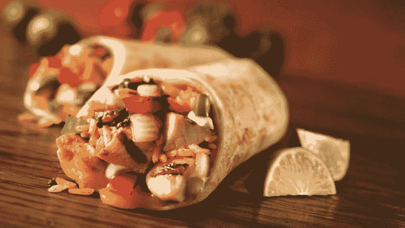
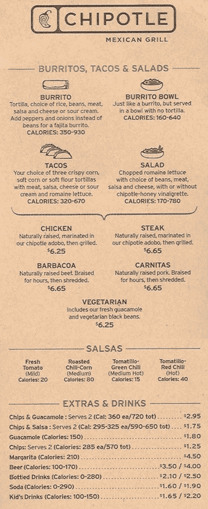

# 通过在 Chipotle 吃饭了解模板方法设计模式

> 原文：<https://www.freecodecamp.org/news/understanding-the-template-method-design-pattern-by-eating-at-chipotle-37f6e029f065/>

作者:黄思慧

# 通过在 Chipotle 吃饭了解模板方法设计模式

生活中的面向对象设计模式——通过将它们与现实生活中的例子联系起来，获得对 OO 设计模式的直观理解。

模板方法是编程和现实生活中常用的设计模式。

在我们深入研究这个模式的细节之前，让我们来学习一个重要的人生课程:

### Chipotle 101:如何在 Chipotle 点餐？

涉及四个步骤:

1.  选择一个“容器”:玉米煎饼对碗对玉米卷对沙拉
2.  添加肉类:鸡肉 vs 牛排 vs. Barbacoa vs. Carnitas vs 素食
3.  添加配料:番茄对玉米对绿辣椒对红辣椒
4.  添加额外的东西和饮料:薯片对鳄梨酱对沙拉对啤酒对苏打水

例如，我的外卖是碗+牛排+(番茄+玉米)+鳄梨酱，我的朋友 Amber 的外卖是玉米煎饼+鸡肉+(绿辣椒+红辣椒)+(薯条+苏打水)。

如果我们用 Ruby 编写我们的定位命令，它们看起来会像:

当我们点餐时，我们把所有想要的东西都放进容器里，然后把塞满东西的容器退回去。

不幸的是，我和 Amber 决定节食一段时间。我们决定，当我们从 Chipotle 订购时，我们只能得到西红柿作为配料，不要额外的。所以我们的选择仅限于:

1.  容器:玉米煎饼对碗对玉米卷对沙拉
2.  肉类:鸡肉、牛排、巴尔巴科、卡尼塔斯和素食
3.  配料:番茄
4.  没有额外的&饮料

在节食期间，我们的必点餐必须修改为:

*   四会:碗+牛排+西红柿+无额外&饮料
*   琥珀:玉米煎饼+鸡肉+西红柿+没有额外的&饮料

将我们的订单放在 Ruby 中，我们有以下内容:

因为我们的两个订单都有完全相同的*浇头*、*额外的*和*订单*方法，所以将它们作为父类 *DietOrder* ，并让*dietordeshui*和*dietorseamber*从中继承是有意义的。

现在，我们的朋友本想加入我们的 Chipotle 减肥俱乐部，他喜欢墨西哥玉米卷和肉馅卷饼。那么他的顺序将是:

哒哒，你刚刚学会了模板方法设计模式！？？？

不相信我？

看看模板方法的定义:

> 模板方法模式是一种行为设计模式，它

> -定义运算中算法的程序框架，

> -将一些步骤推迟到子类。

> 它允许人们在不改变算法结构的情况下重新定义算法的某些步骤。

这听起来是不是和我们刚刚用 *DietOrder* 和*SihuiDietOrder/AmberDietOrder/BenDietOrder*做的一模一样？

饮食订单定义了订单框架:一个人只能得到西红柿作为配料，没有额外的&饮料，一个人通过挑选一个容器并将所有东西放入所选的容器中来点菜。

SihuiDietOrder/AmberDietOrder/BenDietOrder 根据我们的个人喜好重新定义器皿和肉类。

假设一个月过去了，我和 Amber 严格遵循我们的饮食。我们决定用欺骗日来奖励自己！

在欺骗的一天，我们喝汽水。？？？我们每个人都可以决定一个月中的哪一天是我们的欺骗日。

由于本是俱乐部的新成员，他决定在一段时间内严格坚持这种饮食。

让我们看看它在 Ruby 中的样子:

在 *DietOrder* 中，我们问今天是不是作弊日。如果是这样，我们可以额外要苏打水。否则就没有群众演员了。默认情况下，今天不是作弊日。

Amber 和我开始定义我们自己的欺骗日:

由于本严格坚持节食，他一天也没有作弊。

他的阶级不需要改变。

*是 _ 作弊 _ 日？*方法是挂钩。

钩子为子类提供了实现算法可选部分的方法。

如果子类不关心这个部分，它可以跳过它，使用父类中的默认实现。

在我们这里，*是 _ 作弊 _ 日？*是可选的。SihuiDietOrder 和 AmberDietOrder 实现它是因为我们希望每个月都有一个作弊日。但是本不想有作弊的一天。所以 BenDietOrder 跳过实现*是 _ 作弊 _ 日？*并使用 DietOrder 中的缺省值，该值总是返回 false。

模板方法中使用了两个重要的面向对象设计原则:

1.封装变化的内容。

在我们这里，变化的部分是*船*、*肉*、*是 _ 诈 _ 日*？。我们将它们封装在子类中。对于没有变化的部分，*浇头*和*额外部分*，我们将它们留在父类中。

2.好莱坞原则:不要打电话给我们，我们会打电话给你。

是的，好莱坞原则是真实存在的。

在好莱坞，电影制片人会告诉演员:“不要给我们打电话，如果我们找到适合你的角色，我们会给你打电话的。”

在编程中，底层组件可以参与计算，像 *AmberDietOrder* 定义自己的 *is_cheat_day？*，但是高层组件控制何时以及如何，像*diet order*calls*is _ cheat _ day？*内*外*。

### takealways:

**One definition =&**gt；

> 模板方法模式是一种行为设计模式，它

> -定义运算中算法的程序框架，

> -将一些步骤推迟到子类。

> 它允许人们在不改变算法结构的情况下重新定义算法的某些步骤。

**两条设计原则=&**gt；

> 1.封装变化的内容。

> 2.好莱坞原则:不要打电话给我们，我们会打电话给你。

或者…

你可以拿走一份墨西哥薄饼订单？？？

下一次，我们将带着我们的设计和食物冒险去？？？

