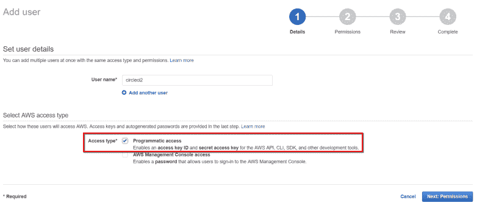
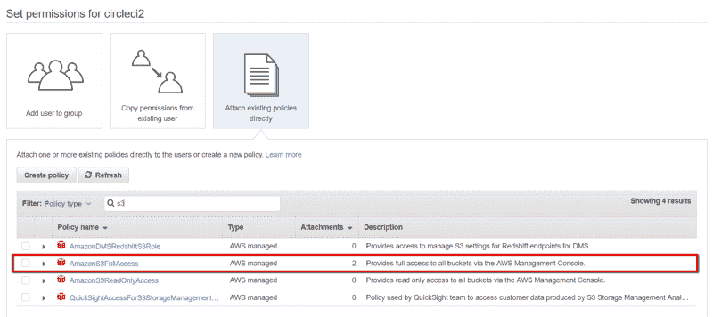
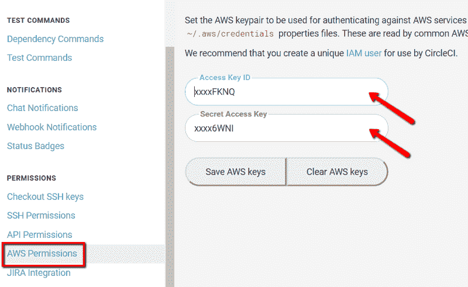

# 我们如何使用 CircleCI 2.0 构建 Angular 应用程序并将其部署到 S3 AWS

> 原文：<https://www.freecodecamp.org/news/our-journey-for-using-circleci-2-0-to-build-and-deploy-an-angular-app-to-aws-s3-8e7ea3f51503/>

马里乌斯·耶戈

# 我们如何使用 CircleCI 2.0 构建 Angular 应用程序并将其部署到 S3 AWS


Photo by [Drew Beamer](https://unsplash.com/photos/0wsnJWonXFs?utm_source=unsplash&utm_medium=referral&utm_content=creditCopyText) on [Unsplash](https://unsplash.com/?utm_source=unsplash&utm_medium=referral&utm_content=creditCopyText)

在当今世界，持续集成和部署(CI & CD)是一种非常常见的实践，也是任何应用程序生命周期中的一个重要部分。如果你想避免把宝贵的时间花在实际上可以自动化的任务上，那就继续阅读吧。

在本教程中，我将向您介绍我们使用 CircleCI 2.0 和 AWS S3 在我们的一个 Angular 应用程序的开发过程中集成 CI & CD 管道的步骤。

### 要求

在开始本教程之前，我假设您已经具备了以下条件:

*   CircleCI 账户
*   有权创建新用户的 AWS 帐户
*   AWS S3 桶
*   项目中的 Bitbucket 或 Github 存储库
*   一杯咖啡——你知道……让你保持温暖和专注:)

### 设置 CircleCI

我们开始工作吧。为了设置 CircleCI，您需要在项目根目录下创建一个名为`.circleci`的新文件夹(注意圆点)，并向其中添加一个`config.yml`文件。让它空一会儿。

进入 [CircleCI 界面](https://circleci.com/dashboard)，通过`Projects tab > Add Proj` ect 添加您的项目。CircleCI 应该已经找到你所有的公开回复了。选择您的项目并按下 t `he Setup proj` ect 按钮。

选择最适合您的选项(在我们的例子中是 Linux/Platform 2.0/Node)，将页面上生成的示例配置复制到您自己的配置文件中，并将更改推送到您的 repo 中。现在你可以按下`Start building` 按钮了。

你可以在这里找到最终配置[的要领。](https://gist.github.com/mariuslazar93/beefd809071015cff3689648185c8fa0)

### 了解 CircleCI 配置文件

本教程的主要内容是理解如何使用 CircleCI 配置文件。它有 3 个主要组件:版本、作业列表和工作流列表。

版本很明显。这是我们将要使用的 CircleCI 版本。

然后我们有了工作清单。你可以把一个工作想象成一个运行一系列命令或步骤的独立环境。你在一份工作中可以实现的常见目标包括:

*   安装运行/构建/测试项目所需的工具
*   执行 bash 命令
*   存储或恢复 CircleCI 缓存中的项目

然后我们有了工作流列表。工作流是管理作业的一种方式。假设您需要一个作业只在特定的分支或特定的时间运行，或者您希望一些作业并行运行，一些作业按顺序运行。这就是工作流的用途。

基本 CircleCI 配置结构:

在我们的例子中，我们有两个任务:**构建任务**和**部署任务**。我将在下面的部分中描述它们，但是现在，让我们看看我们将为每个作业使用什么属性:

*   **docker** 属性—指定用于创建环境容器的 docker 映像。CircleCI 附带了一个预建图像列表，你可以在这里找到
*   **working_directory** 属性——当前目录，所有步骤将在该目录下运行
*   **步骤**属性—您希望在当前作业中运行的步骤(命令)列表

我们将在配置中使用几种类型的步骤:

*   **签出**步骤——用于将代码从当前分支签出到工作目录中
*   **运行**步骤——用于执行 bash 命令。您可以指定一个将在 CircleCI 界面中看到的描述性名称
*   **save_cache** 步骤——用于在 CircleCI 存储器中存储文件或目录的缓存。一个常见的用例是只安装一次 npm 依赖项，然后使用 package.json 文件的散列作为缓存键来缓存 *node_modules* 文件夹
*   **restore_cache** 步骤—用于使用缓存键恢复缓存的项目

每个作业都可以访问一些预定义的环境变量。你可以点击查看完整列表[。您还可以从 CircleCI 界面设置环境变量，或者将其设置为作业属性，但是在本教程中，我们将只使用以下环境变量:](https://circleci.com/docs/2.0/env-vars/#circleci-environment-variable-descriptions)

*   CIRCLE _ BRANCH 表示当前分支
*   CIRCLE_SHA1 —表示当前提交的哈希

### 配置 CI 管道

CI 管道将负责构建、林挺和测试源代码。所有这三个过程将被聚合成一个名为**的任务，即构建任务**。

您可以快速浏览下面的最终构建工作，但我将分别执行每个步骤，以便我们可以了解更多关于那里发生的事情。

1.  我们从检查当前分支的代码开始

```
# Checkout the code from the branch into the working_directory- checkout
```

2.出于调试目的，我们记录当前分支

```
# Log the current branch- run:    name: Show current branch    command: echo ${CIRCLE_BRANCH}
```

3.如果存在的话，我们从缓存中恢复 *node_modules* 文件夹。你可以在*第 5 步*来一个巅峰，看看是怎么救的。

```
# Restore local dependencies from cache- restore_cache:    keys:        - v1-dependencies-{{ checksum "package.json" }}        - v1-dependencies-
```

您会注意到我们使用了两个缓存键。关键字是搜索缓存项目的模式。第一个特定于当前的 *package.json* 文件，第二个更通用，匹配所有之前缓存的 *node_modules* 文件夹。

如果特定的缓存不存在，我们将寻找任何以前缓存的 *node_modules* 文件夹并恢复它。当只有一些依赖项被更新时，这是很有用的，因为我们不需要下载和安装整个依赖项列表。我们只对更新的包这样做，并从缓存中恢复未更改的包。

4.我们安装项目依赖项。如果已经从缓存中恢复了这些依赖关系，这一步会非常快。否则可能需要几分钟时间。这就是为什么缓存很重要。为您节省时间和金钱。

```
# Install project dependencies- run:    name: Install local dependencies    command: npm install
```

5.我们缓存了 *node_modules* 文件夹，以防它不存在。请记住，缓存是不可变的，所以**它不会被覆盖**，如果它已经存在。

```
# Cache local dependencies if they don't exist- save_cache:    key: v1-dependencies-{{ checksum "package.json" }}    paths:        - node_modules
```

每当 package.json 文件中的某些内容发生变化时，将使用在**路径**属性中指定的文件夹/文件生成一个新的缓存。缓存的键是使用 checksum 函数生成的，它将输出 package.json 文件内容的 base64 编码散列。

一种常用的技术是在您的缓存键前面加上一个版本号，这样每当您想要重新生成缓存时，您只需更改版本号即可。

6.我们运行 lint 和 test 命令。可能值得注意的是，如果任何一步失败，整个构建都会失败。

```
# Lint the source code- run:    name: Linting    command: npm run lint
```

```
# Test the source code- run:    name: Testing    command: npm run test
```

7.我们运行 build 命令。请注意，我们将使用一个多行命令，每一行都在同一个 shell 中运行，因此我们以管道字符(|)开始该命令。

我们检查当前的分支名称，并运行相应的 npm 脚本来构建项目。我们这样做是因为我们根据环境有不同的配置。生成的文件将保存到 *dist* 文件夹中。

```
# Build project with different configuration based on# the current branch- run:    name: Building    command: |        if [ "${CIRCLE_BRANCH}" == "staging" ]; then            npm run build-qa        elif [ "${CIRCLE_BRANCH}" == "master" ]; then            npm run build-prod        else            npm run build-dev        fi
```

8.最后，我们将 *dist* 文件夹保存到缓存中，以便稍后在部署作业中恢复它。我们使用 **CIRCLE_BRANCH** 和 **CIRCLE_SHA1** 环境变量来生成一个惟一的缓存关键字，这个关键字在缓存中并不存在。

注意，我们不是在 shell 命令中，所以我们需要从`.Environment`变量中获取这些变量。

```
# Cache the dist folder for the deploy job- save_cache:    key: v1-dist-{{ .Environment.CIRCLE_BRANCH }}-{{ .Environment.CIRCLE_SHA1 }}    paths:        - dist 
```

顺便提一下，我们首先尝试全局安装 angular-cli，并缓存它以备后用，但即使缓存了，也需要 30 秒才能完成安装。所以我们决定创建一些 npm 脚本，使用本地 angular-cli 运行 ng 命令。

```
"scripts": {  "ng": "ng",  "start": "ng serve --env=local",  "build": "ng build",  "test": "ng test",  "lint": "ng lint",  "e2e": "ng e2e",  "build-dev": "ng build --target=development --environment=dev",  "build-qa": "ng build --target=production --environment=qa",  "build-prod": "ng build --prod"}
```

就是这样！我们现在有了一个有效的 CI 渠道。您应该能够将它保存到您自己的配置文件中，将其推送到您的 repo 中，并检查是否一切都如您所期望的那样工作。

如果您想知道，您不需要任何工作流来运行作业。默认情况下，当您推送更改时，每个作业都会触发。

### 配置 CD 管道

CD 管道将负责将构建作业产生的分发文件部署到 AWS S3 存储桶。你猜怎么着？我们将把这个**称为部署作业**。

在我们继续之前，我们必须授予 CircleCI 访问 AWS S3 存储桶的权限。

首先，我们将在 AWS 管理控制台中创建新的 IAM 用户。转到`Services > IAM > Users >`添加用户。给它起一个名字，然后选择访问类型的 Programmat ic 访问盒。



Setting programmatic access for a new user

去`Next`。我们现在必须给用户一些权限。在我们的例子中，我们只需要 *circleci* 用户能够读/写 AWS S3 存储桶。找到并选择 **AmazonS3FullAccess** 策略，然后按下`Create user`按钮。



Select user’s permissions

在下一页，您将为新用户拥有一个**访问密钥 ID** 和一个**秘密访问密钥**。保持此页面打开，转到 CircleCI 界面。进入项目设置，搜索 **AWS 权限**。您需要在这里使用之前生成的密钥。



Setting the AWS Permissions of a CircleCI project

完成后，我们可以继续部署工作。

和前面一样，下面是最终的部署作业。但是我将分别讨论每一步，尽管这次它们非常简单。

1.  出于调试目的，我们从记录分支名称开始。

```
# Log the current branch- run:    name: Show current branch    command: echo ${CIRCLE_BRANCH}
```

2.我们恢复构建作业中保存的缓存的 *dist* 文件夹。

```
# Restore cache from the build job which contains the# dist folder that needs to be deployed- restore_cache:    key: v1-dist-{{ .Environment.CIRCLE_BRANCH }}-{{ .Environment.CIRCLE_SHA1 }}
```

3.我们使用 *sudo* 权限安装 aws cli。

```
# Install AWS cli- run:    name: Install aws cli    command:        sudo apt-get -y -qq install awscli
```

4.我们运行 deploy 命令，该命令将把代码从 *dist* 文件夹部署到对应于当前环境的 AWS S3 存储桶。我们还有一个多行命令，所以我们需要以竖线(|)字符开始。

```
# Deploy to the S3 bucket corresponding to the current branch- run:    name: Deploy to S3    command: |        if [ "${CIRCLE_BRANCH}" == "develop" ]; then            aws s3 sync dist s3://project-dev/ --delete        elif [ "${CIRCLE_BRANCH}" == "staging" ]; then            aws s3 sync dist s3://project-qa/ --delete        elif [ "${CIRCLE_BRANCH}" == "master" ]; then            aws s3 sync dist s3://project/ --delete        fi
```

使用 aws cli 部署到 AWS S3 存储桶的签名如下:

```
aws s3 sync <% path-to-folder %> s3://<% bucket-name %>/ --delete
```

删除标志将在部署任何文件之前清除存储桶。

还有一件事。或者可能是两个……在配置好这个配置后，我们遇到了两个错误。也许它们对你的情况不适用，但我还是会给你一个简短的总结。

1.  未指定 S3 桶的区域。

> 调用 ListObjects 操作时出现客户端错误(PermanentRedirect ):您尝试访问的存储桶必须使用指定的终结点进行寻址。请将所有未来请求发送到此端点。

为了解决这个错误，我们必须将 bucket 区域添加到 deploy 命令中:

```
aws --region eu-west-2 s3 sync <% path %> s3://<% bucket-name %>/
```

2.对 S3 存储桶的授权使用的是旧协议，该协议不受当前存储桶的支持。

> 调用 ListObjects 操作时出现客户端错误(InvalidRequest):不支持您提供的授权机制。请使用 AWS4-HMAC-SHA256。

为了解决这个错误，我们必须在运行部署步骤之前设置授权机制来验证 AWS S3 请求，以使用签名版本 4:

```
# Set the signature version for the S3 auth- run:    name: Setting Signature Version 4 for S3 Request Authentication    command: aws configure set default.s3.signature_version s3v4
```

就是这样！我们现在有了一个可行的裁谈会渠道。只有一个小问题…它会在每次推送时运行。因此，让我们配置一个工作流来解决这个问题。

### 将 CI & CD 作业放入工作流程中

在我们的例子中，我们希望在每次提交时运行构建作业，只有当我们提交开发、登台或主分支时才运行部署作业。默认情况下，工作流通过推送到任何分支来触发。

我们实际上希望构建作业仅在我们发出拉请求(PR)时运行，这可以通过进入 CircleCI 项目的高级设置并打开`Only build pull requests` 选项来实现。

但是当您需要在 PR 上运行工作流时，问题就来了。我们找不到如何使这个工作。但是如果大家有什么建议，请给我留言评论！

回到我们的工作流配置。这是不言自明的:

您可以看到，我们已经定义了包含……构建和部署作业的`build_and_deploy`工作流。构建作业没有限制，因此只要工作流运行，它就会运行。

另一方面，部署作业有一个用于构建作业的`require`属性，这意味着它只有在构建作业成功时才会运行。它还有一个`filter`属性，用于选择它将运行的分支。

有了这个配置，我们已经将部署作业的执行限制到了开发、暂存和主分支，只有当构建作业成功时，这正是我们想要的。

差不多就是这样。整个配置的要点可以在[这里](https://gist.github.com/mariuslazar93/beefd809071015cff3689648185c8fa0)找到。

### 额外功能

如果你和我们一样，你想知道你项目发生了什么，你会很高兴听到有一个针对 Slack 的 CircleCI 应用程序，它可以被配置为在构建成功或失败时给你实时警告。很高兴有。

### 最后的想法

我知道这可能令人生畏，但是不要害怕将 CI & CD 管道集成到您的项目中。这将需要一点时间，直到你得到正确的配置，但这是值得的！

如果你认为这篇文章对你有帮助，请推荐和分享！

感谢阅读！如果您有任何意见或问题，请联系我！我总是很乐意帮忙:)