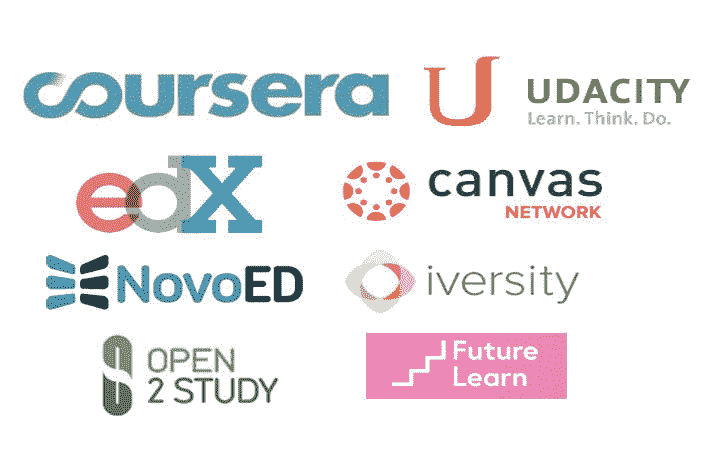
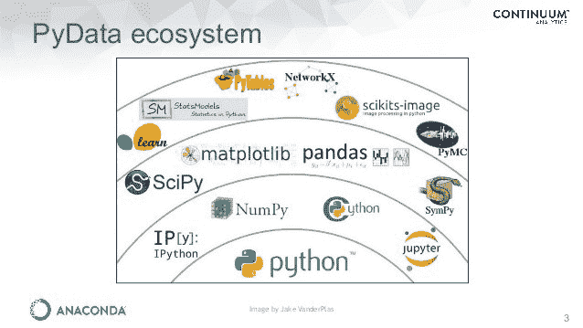
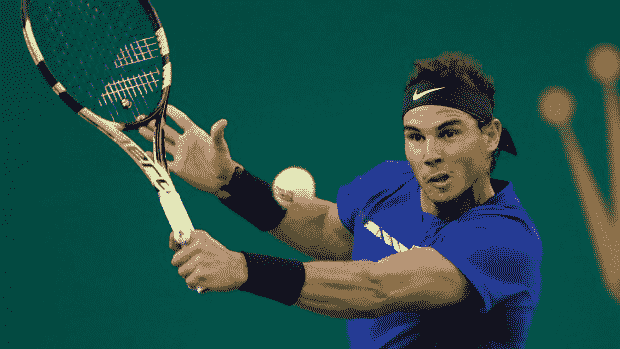

# 成为机器学习领域的拉斐尔·纳达尔

> 原文：<https://www.freecodecamp.org/news/baby-steps-to-learn-machine-learning-from-a-tennis-fan-d4171f51c23f/>

作者:Sudharsan Asaithambi

# 成为机器学习领域的拉斐尔·纳达尔

一年前，我还是机器学习领域的新手。我曾经被一些小的决定弄得不知所措，比如选择编码语言，选择正确的在线课程，或者选择正确的算法。

所以，我计划让人们更容易进入机器学习。

我假设我们中的许多人都是从零开始我们的机器学习之旅。让我们来看看当前该领域的专业人士是如何到达他们的目的地的，以及我们如何在我们的旅程中效仿他们。

我将通过在拉斐尔·纳达尔(Rafael Nadal)如何学习打网球和你如何学习机器学习之间进行对比，来说明你如何学习数据科学。

### 承诺自己—第一阶段

Rafael Nadal at age 3

纳达尔在他的家族中有着非凡的体育天赋。受他们的启发，他 3 岁就开始了网球之旅。

对于任何开始机器学习的人来说，让自己周围的人也学习、教授和实践机器学习是很重要的。

如果你一个人做的话，掌握诀窍是不容易的。因此，致力于学习机器学习，并找到数据科学社区来帮助你减少入门的痛苦。

### **了解生态系统—第二阶段**

Rafael Nadal practices tennis

拉斐尔·纳达尔不仅学会了网球规则，还学会了周围的“生态系统”。

他学习了不同类型的球拍、球和球场表面。他了解了网球比赛中的得分情况。他报名参加网球教练。

#### 发现机器学习生态系统

数据科学是一个已经接受并充分利用开源平台的领域。虽然数据分析可以用多种语言进行，但使用正确的工具可以成就或破坏项目。

数据科学图书馆在 **Python** 和 **R** 生态系统中蓬勃发展。请点击[查看 Python 与 R 在数据分析方面的信息图](https://www.datacamp.com/community/tutorials/r-or-python-for-data-analysis)。

无论你选择哪种语言， **Jupyter** **Notebook** 和 **RStudio** 让我们的生活变得更加轻松。它们允许我们在操作数据的同时将数据可视化。点击[此链接阅读更多关于 Jupyter 笔记本特性的](http://blog.kaggle.com/2015/12/07/three-things-i-love-about-jupyter-notebooks/)。

**Kaggle、Analytics Vidhya、MachineLearningMastery 和 KD Nuggets** 是一些活跃的社区，世界各地的数据科学家在这些社区中丰富彼此的学习。

机器学习已经被来自 Coursera、T2、EdX 和其他公司的在线课程或 MOOCs 民主化了，在那里我们可以向世界一流大学的优秀教授学习。这里有一份[列出的数据科学顶级 mooc](https://medium.freecodecamp.org/i-ranked-all-the-best-data-science-intro-courses-based-on-thousands-of-data-points-db5dc7e3eb8e)榜单。

### 夯实基础—第 3 阶段

Rafael Nadal during a match

#### 拉斐尔·纳达尔学会了基本击球

纳达尔的教练教他正手和反手击球。这是网球的主要基础。拉斐尔可以用这些基本的投篮胜任比赛。

#### 学会处理数据

> *根据采访和专家估计，数据科学家花 50%到 80%的时间在收集和准备难以驾驭的数字数据的平凡劳动中，然后才能探索有用的金块。—《纽约时报》的史蒂夫·洛尔*

“数据处理”是整个机器学习工作流程的灵魂。为了帮助这个过程，python 或 R 的 DataFrames 中的 [**Pandas**](https://pandas.pydata.org/pandas-docs/stable/) 库允许您操作和进行分析。它们为关系数据或标签数据提供数据结构。

数据科学不仅仅是建立机器学习模型。这也是关于解释模型并使用它们来推动数据驱动的决策。在从分析到数据驱动的结果的过程中，数据可视化在以强大而可信的方式呈现数据方面发挥着非常重要的作用。

Python 中的[**Matplotlib**](http://matplotlib.org)**库或 R 中的 [**ggplot**](http://ggplot2.org) 提供完整的 2D 图形支持，具有极高的灵活性，可创建高质量的数据可视化。**

**当进行分析时，这些是你将花费大部分时间的一些库。**

**

Python ecosystem from the fundamental blocks to higher level blocks** 

### **日复一日的练习——第四阶段**

**当被问及训练量时，拉斐尔·纳达尔说:**

> **“我一年 210 天，每天训练 4 小时。如果再加上这个，我每年大约打 80 场比赛，每场平均持续两个小时。这相当于每年打 1000 个小时的网球——这还不包括锦标赛期间的训练天数。”**

****

#### ****学习机器学习算法并实践它们****

**在基础建立之后，你可以实现机器学习算法来预测和做所有很酷的事情。**

**Python 中的 [**Scikit-learn**](http://scikit-learn.org/stable/) 库或者 R 中的 [**caret**](https://cran.r-project.org/package=caret) ， [**e1071**](https://cran.r-project.org/web/packages/e1071/index.html) 库通过一致的接口提供了一系列监督和非监督学习算法。**

**这些让你实现一个算法，而不用担心内部工作或本质细节。**

**将这些机器学习算法应用到你周围的用例中。这可能是在你的工作中，或者你可以在比赛中练习。在这些活动中，世界各地的数据科学家竞相建立模型来解决问题。**

**同时，理解一个又一个算法的内部工作原理。从“你好，世界！”开始机器学习中，**线性回归**然后转移到**逻辑回归**，**决策树**到**支持向量机**。这需要你复习统计学和线性代数。**

**Coursera 创始人吴恩达是人工智能的先驱，他开发了一门[机器学习课程](https://www.coursera.org/learn/machine-learning)，为你理解机器学习算法的内部运作提供了一个很好的起点。**

### ****学习进阶技能—第五阶段****

#### **拉斐尔·纳达尔学会了高级击球**

**纳达尔在专注于基本打法的同时，也被引入了高级击球。只有日复一日打网球的职业选手才能打出这样的球。**

****

#### **学习复杂的机器学习算法和深度学习架构**

**虽然机器学习作为一个领域已经建立了很长时间，但最近的炒作和媒体关注主要是因为机器学习在人工智能领域的应用，如计算机视觉，语音识别，语言处理。其中许多都是由谷歌、脸书、微软等科技巨头开创的。**

**这些最新进展可以归功于廉价计算的进步、大规模数据的可用性以及新型深度学习架构的发展。**

**要从事深度学习，你需要学习如何处理非结构化数据——无论是自由文本、图像还是声音。**

**你将学会使用像 **TensorFlow** 或 **Torch** 这样的平台，这让我们可以应用深度学习，而不用担心低水平的硬件要求。你将学习强化学习，这使得像 [**AlphaGo Zero**](https://deepmind.com/blog/alphago-zero-learning-scratch/) 这样的现代人工智能奇迹成为可能。**

### **现在就迈出学习机器学习的第一步吧！**

****

1.  **安装 Anaconda，用 Jupyter 写 Python**

**浏览一些 [Python 教程](https://www.youtube.com/watch?v=R-HLU9Fl5ug)，学习它的基本数据结构和语法。**

**2.用数据科学包围你自己。在以下位置创建帐户:**

**● [Kaggle](http://www.kaggle.com) 并检查由顶级数据科学家编写的内核。Kaggle 帮助您润滑和建立一个标准的工作流程，以遵守任何数据科学问题**

**● [Analytics Vidhya](http://www.analyticsvidhya.com) :这个网站是许多数据科学家的必去之地。这个网站拥有每月 400 万的独立访问者，并且有一个非常活跃的社区。**

**●结账 [YouTube pyData 频道](http://www.youtube.com/channel/UCOjD18EJYcsBog4IozkF_7w)。pyData 是由开源社区安排的一个会议，旨在向分析师介绍数据科学的最新发展。这给了你**

**●利用播客了解人工智能领域的最新工具和技术。播客是花时间做日常琐事的好方法，无论是慢跑、整理衣柜还是通勤。如果你是播客新手，下载[播客上瘾](https://play.google.com/store/apps/details?id=com.bambuna.podcastaddict&hl=en)应用到你的手机上。**

**机器学习—软件工程日报|每周 Jeff 都会采访来自数据科学核心的人。它给你一个非常难得的机会，让你先睹为快，了解硅谷正在发生的事情，帮助你掌握新的技巧和技术。它给了你很多新的想法，让你在工作中去实现。这个怎么推荐都不为过。**

**●中等**

**在 Medium 上跟随一些机器学习出版物:**

*   **[走向数据科学](https://towardsdatascience.com)**
*   **[人工智能](https://medium.com/topic/artificial-intelligence)。**

**●进入 [Coursera](http://coursera.org) 和 [Edx](http://edx.org) ，查看各种可用的机器学习课程。**

**我将引用罗宾·夏尔马的话来结束这篇文章:**

> **每个职业选手都曾是业余选手。**

> **每个专家都曾经是初学者。**

> **所以要有远大的梦想。**

> **现在就开始。**

**请在下面发表评论，告诉我们你为什么计划开始你的机器学习之旅，以及你打算如何这样做。**

**对于所有机器学习专家，请告诉我们什么可行，什么不可行的细微差别。请在下面评论你是如何开始你的机器学习之旅的，是什么加速和阻碍了你的学习过程。**