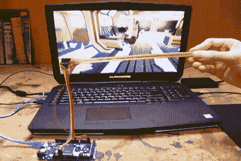
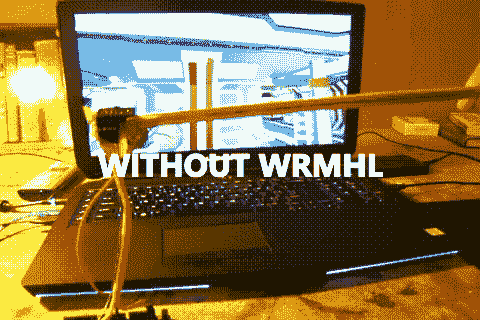

# 创建 Arduino 和 Unity3D 交互体验，无延迟！⏱

> 原文：<https://www.freecodecamp.org/news/you-can-now-create-an-arduino-and-unity3d-interactive-experience-without-latency-2d7388dcc0c/>

马克西考特

# **打造无延迟的 Arduino 和 Unity3D 交互体验！**⏱

With WRMHL

嗨，我 16 岁，在假期我喜欢做一些小项目。我在一个非常艺术的环境中长大——我的父亲是一名画家，我的兄弟姐妹画画、演奏音乐、作曲……我和我最好的朋友想用我们的新 Arduino 和 Unity3D 玩得开心，所以我们开始致力于互动艺术体验。但是我们被一件大事卡住了。如果你曾经想将数据从 Arduino 传输到 Unity3D，你知道主要问题是**疯狂的延迟**。

#### 不要担心延迟， [wrmhl](https://github.com/relativty/wrmhl) 在这里⚡️

Without wrmhl (using a simple ReadLine () )

我们没有找到任何免费的、优化的、可定制的解决方案来解决这个问题。于是我建了 [**wmrhl**](https://github.com/relativty/wrmhl) 。你现在可以将任何 Arduino 接口连接到 Unity3D，而且它完全是**开源的。**

*   只要写好你的 Arduino 代码，那么[一个无触摸 3D 追踪接口](https://www.youtube.com/watch?v=ikD_3Vemkf0)或者[脑机 Arduino 接口](http://openbci.com/)怎么样？
*   添加一个串行打印机，将数据从您的接口发送到 Unity3D ( [参见示例](https://github.com/relativty/wrmhl/blob/master/Arduino/Arduino.ino))
*   将 wrmhl 导入 Unity，瞧！

您可以使用默认的 wrmhl 协议，或者只需更改:[wrm HL/Assets/wrm HL/Scripts/Thread/wrmhlThread _ lines . cs](https://github.com/relativty/wrmhl/blob/master/Assets/WRMHL/Scripts/Thread/wrmhlThread_Lines.cs)，在一分钟内实现您自己的协议。

#### 如何入门？

按 [**点击**](https://github.com/relativty/wrmhl#getting-started-%EF%B8%8F) 就可以了。开始回购，如果你喜欢它⭐️

希望这有帮助！如果你正在使用它，我很想知道你在做什么。在**maxime@relativty.com**或[@ maxime coutte](https://twitter.com/maximecoutte)ping 我。