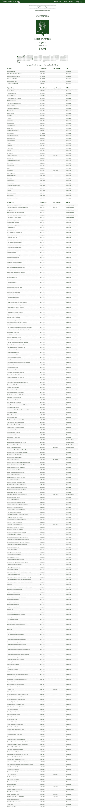

# 2017 年，我成为了一名程序员。事情是这样发生的

> 原文：<https://www.freecodecamp.org/news/in-2017-i-became-a-programmer-here-is-how-ff839e68acc1/>

斯蒂芬·阿奇

# 2017 年，我成为了一名程序员。事情是这样发生的

Photo by [Kevin](https://unsplash.com/photos/w7ZyuGYNpRQ?utm_source=unsplash&utm_medium=referral&utm_content=creditCopyText) on [Unsplash](https://unsplash.com/?utm_source=unsplash&utm_medium=referral&utm_content=creditCopyText)

我是非洲发展最快的支付公司之一 Paystack 的产品专员。在过去的一年里，我使用我们的 API 为几个电子商务平台创建了支付插件，并对现有插件进行了更新。我还和我的同事一起，为非洲最大的电信服务之一开发了一个本地应用，并推动了几个内部项目。

然而，在过去的几年里，我一直不确定自己是否真的是一名程序员。当一个人成为程序员的时候并没有明显的区别，我很长一段时间都不确定自己是否足够优秀。为了保险起见，我曾经避免把自己定义为程序员。

但是是什么让一个人成为程序员呢？我可以用 HTML 和 CSS 来构建静态网站，但它们甚至都不是编程语言。它们是标记语言，所以我觉得给自己贴上“程序员”的标签是不对的。

不过话说回来，我在攻读计算机工程学位的时候学过 C++，这不算吗？我想了想，我*知道*那是扯淡，也不算数。我们学了几个星期的 300 级 C++，几乎没有接触过。

我们知道如何做条件语句和其他基本功能，但仅此而已。对我来说，它不算也不应该算语言知识。如果你现在把我放在一个 C++代码文件中，我将无法调试我的方法。声称我是一名程序员，因为我上过 C++课，这是一个骗局。

在某个时候，我决定学习真正的编程，我在 Treehouse 和 Udacity 等网站上注册了一些课程。我跟着教程做项目，但感觉自己被填鸭式喂养，不认为自己能独立完成这些事情。我不喜欢这种学习方法，对我来说，我没学到多少东西。

是的，我现在可以理解语法并通过谷歌搜索解决小问题，但仍然觉得我还不能把自己定义为一名程序员。我继续用 Ruby、Python 和 Javascript 编写 Codecademy 曲目，并完成了其中的大部分。我也是 hacker rank 的忠实用户，在这三种语言和 Java 中尝试初学者挑战。在这一点上，我知道我知道一些事情，但仍然犹豫是否称自己为程序员。我甚至不确定我是否想成为一名移动应用程序开发人员，前端或后端开发人员。

去年在 MEST 呆了几个月后，与我的同事和助教交流，我对自己想要实现的目标以及如何定义它有了更清晰的认识。

当我有了这些，我决定称自己为程序员:

*   理解编程语言的语法。
*   能够应用语法解决理论练习(想想更复杂的 [Fizz buzz](https://en.wikipedia.org/wiki/Fizz_buzz) 类型练习)。
*   使用语言的普通版本构建一个迷你项目，也就是说，不需要库/框架的帮助。
*   理解由任何编程语言构建的主要库/框架。
*   使用上述框架构建一个真实的项目。

我没有把这些要求写出来，但它们在我的潜意识里，我相应地调整了我的行动。

### 我是如何做到这一点的

#### 理解语法

当我刚开始积极追求目标时，我经常使用代码学院。这真的很容易通过，它有助于理解我正在学习的第一语言的语法。

最终，我决定专注于 Javascript 和一个更具挑战性的资源。就在这个时候，我在去年年底发现了自由代码营。这些练习以一口大小的块来进行，它们在给你指明方向后让你做大部分的思考。

#### 应用语法

这就是我认为编程的意义——像程序员一样思考。我在 MEST 的技术伙伴，Yaw Boakye，在他开始给我们上*技术简介*的时候反复提到这个概念。他没有教我们语法，而是给了我们一些难题，这些难题需要我们思考，并运用我们目前所学的概念来解决。

为此，一开始我用了很多 HackerRank。在这个网站上，你会遇到自己选择的语言的挑战，然后想出解决办法。我喜欢解决这些挑战。在最初的几个问题之后，由于挑战的难度太大，我无法解决更多的问题。

我和另一位技术人员，我的朋友杨致远谈了这件事，他向我保证，如果我还不能解决这些问题，也没关系。黑客排名问题可能非常复杂，虽然能够解决这些问题很好，但作为初学者，你可以慢慢来，因为这些问题通常非常高级，你不会遇到它们。

在这一点上，freeCodeCamp 再次为我通过。他们的练习非常实用，给了我很多时间，但对我的水平来说是可行的，非常实用。我每天花几个小时来解决这些问题，我非常喜欢它们。

*注意:这里是我在开始*的头几个月里遇到的一些挑战

#### 用普通代码构建项目

我现在可能听起来像一张破唱片，但在这种情况下，freeCodeCamp 真的很有帮助。在 freeCodeCamp 的每一个关卡之后，营员都会被给予项目去执行。这些项目有一些规范，链接到您需要应用的概念和一个样本代码。

这些项目涉及以前练习中涉及的概念以及一些没有涉及的概念。这样，我自学了如何使用 XMLHttpRequests 发出 API 请求。使用函数来分离应用程序中的任务，以及许多现在看起来很平常，但我当时并不理解的事情。

#### 学习框架

到目前为止，很明显我的重点是 Javascript。因此，当我想选择一个框架来学习时，我不会比最流行的 Javascript 框架——React 看得更远。

我的理由是:

*   在我看来，它拥有 Javascript 社区中最活跃的社区。关于 freeCodeCamp 的文章、与我在 MEST 的朋友的讨论(谢谢你， [Oluwole Oyekanmi](https://www.freecodecamp.org/news/in-2017-i-became-a-programmer-here-is-how-ff839e68acc1/undefined) )以及围绕这个框架开发的大量工具极大地影响了我的决定。
*   反应自然。我一直想开发移动应用程序，但我发现 Java/Android 很难。然而，在征服了我的前端恶魔之后，我仍然在考虑开发 iOS。然而，有了 React Native，就有机会使用(大部分)Javascript 来构建真正的 *native* 移动应用程序，这是其他框架无法做到的。

不过，我觉得学习 React 不像学习普通 Javascript 那么容易。我仔细阅读了文档，并尝试了习惯性的待办事项列表应用程序项目，但仍然感觉有些力不从心。

不幸的是，freeCodeCamp 的 React 尚未推出，大多数看似不错的课程都是付费课程。然而，我继续努力，最终偶然发现了 freeCodeCamp 的 React track 的测试版，这对一些人有所帮助。过了一段时间，我理解了 React 中 React 组件、道具、状态的概念。

我的一个朋友托尼·哈里奥基是一个 React 迷，这也帮助了我。我们合作了我们的新公司项目(MEST 版本的最后一年项目，在毕业日提出后有资格获得资助)，名为 [Chowbase](http://www.getchowbase.com/) ，它是用 React 构建的。托尼足够耐心地握着我的手，并在整个项目中提供指导，虽然我专注于设计，但他处理了大部分工程工作。

#### 现实生活项目

如果让我用自己的设备，我会更愿意做一个兼职项目，在真实的用户中应用我的技能。不幸的是，或者说幸运的是，Paystack 发生了。

我被聘为产品专家，其工作是帮助开发人员将 Paystack 集成到他们的产品中。虽然我对自己的技术很有信心，但我有一些冒名顶替综合症。尽管如此，我还是努力工作，然后更多的努力去达到我应该达到的目标。

我第一次真正的测试是为一家整合了 Paystack 的电信公司开发的 Android 应用程序。我不想和 Java/Android 搅在一起，所以我转而钻研 React Native，虽然这令人沮丧，但却更有收获。在我的队友 Onyekachi(提供神圣的指导)和 IK(处理后端)的帮助下，我最终构建了一个我可以自豪地看着的应用程序。我迫不及待地想知道它什么时候发货，人们什么时候开始使用它(我也很害怕，但不管怎样)。

当我还在蹒跚学步的时候，我已经是一名程序员了。我为实现我的目标所采取的步骤对每个人来说都不一样。大部分人的学习路径或者方法都会不一样。然而，它可以为还不知道如何继续的人提供指导。即使是现在，我发现当我学习一门新语言时，我不必经历所有这些步骤——我有时会一头扎进去，做我想做的工作。

这是我成为程序员的故事。