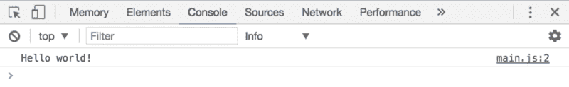
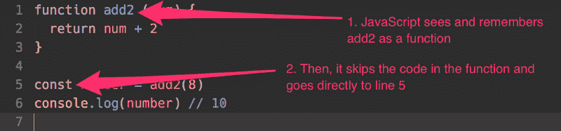
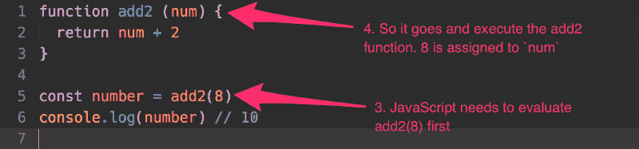
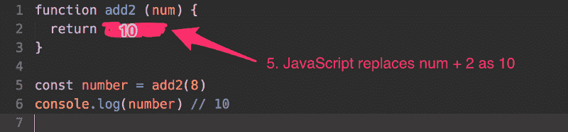
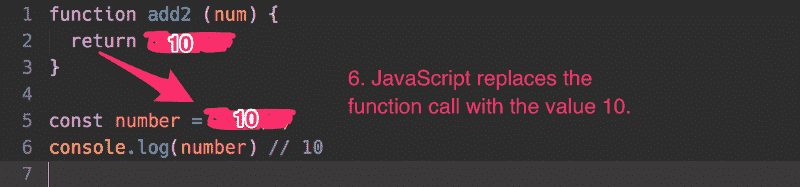

# JavaScript 要点:函数很有趣(也很重要)——如果你理解它们的话

> 原文：<https://www.freecodecamp.org/news/javascript-essentials-functions-are-fun-and-vip-if-you-understand-them-29da2d4c9641/>

作者 Zell Liew

# JavaScript 要点:函数很有趣(也很重要)——如果你理解它们的话


想象你住在一个没有自来水的村庄。要取水，你需要拿一个空桶，前往村子中间的水井，从井里打水，然后回家。

你需要一天多次从这口井里打水。每次你解释你在做什么的时候，说“我要拿一个空桶，去井边打水，然后带回家”是一件很麻烦的事情。

简而言之，你可以说你要去“打水”

我的朋友，你创造了一个函数。

### 声明函数

函数是以特定顺序执行任务的代码块，比如拿空桶、去水井、打水、回家。

可以用以下语法定义它:

```
function functionName (parameters) {   // Do stuff here }
```

`function`是一个关键字，告诉 JavaScript 你正在定义一个函数。

`functionName`是函数的名称。在上面给出的例子中，函数名可以是`drawWater`。

函数的名字可以是任何东西，只要它遵循与[声明变量](https://zellwk.com/blog/javascript-variables)相同的规则。换句话说，它需要遵循以下规则:

1.  必须是一个词
2.  它只能由字母、数字或下划线组成(0–9、a-z、A-Z、`_`)
3.  它不能以数字开头
4.  它不能是这些[保留关键字](https://developer.mozilla.org/en-US/docs/Web/JavaScript/Reference/Lexical_grammar#Keywords)中的任何一个

`parameters`是可选的。这是一个逗号分隔的变量列表，您希望为您的函数声明这些变量。使用函数时，可以为它们赋值。

### 使用函数

一旦你声明了你的函数，你就可以通过写下函数名，后跟括号`()`来使用它(或者**调用**，或者**调用**，或者**执行**)。

这里有一个声明和使用`sayHello`函数的例子。

```
// Declaring a function
```

```
function sayHello () {  console.log('Hello world!')}
```

```
// using a functionsayHello()
```



### 缩进

块中的代码(花括号`{}`中的任何内容)应该向右缩进。这是一个重要的实践，可以帮助您使代码更容易阅读。它让你一眼就能看出`console.log('Hello world')`是`sayHello`的一部分。

```
function sayHello () {     // This console.log statement is a part of sayHello       console.log('Hello world!') }
```

您可以选择用两个空格或 tab 键缩进。有些人喜欢空格，有些人喜欢制表符。两者都可以，只要你保持一致。

### 因素

大多数函数都有参数。这是一个用逗号分隔的变量列表，你希望为你的函数声明这些变量。

您可以有任意数量的参数。

```
function functionName(param1, param2, param3) {   // Do stuff here }
```

要为参数赋值，可以通过将值(称为参数)写为圆括号中的逗号分隔值来传递。

第一个参数被分配给第一个参数，第二个参数被分配给第二个参数，依此类推。

```
functionName('arg1', 'arg2')
```

让我们用一个例子来说明一下。

假设您希望编写一个名为`sayName`的函数来记录一个人的名字和姓氏。该函数如下所示:

```
function sayName(firstName, lastName) {   console.log('firstName is ' + firstName)   console.log('lastName is ' + lastName) }
```

泽尔是我的名，刘是我的姓。为了让函数正确工作，我将我的`Zell`作为第一个参数传递，将`Liew`作为第二个参数传递:

```
sayName('Zell', 'Liew') // firstName is Zell // lastName is Liew
```

如果你声明了一个参数，但是没有传递一个参数给它，那么你的参数就是`undefined`。

```
sayName() // firstName is undefined // lastName is undefined
```

### 退货单

函数可以有一个由 return 关键字和值组成的 return 语句:

```
function functionName () {   return 'some-value' }
```

当 JavaScript 看到这个 return 语句时，它会停止执行函数的其余部分并“返回”(将值传递回函数调用)。

```
function get2 () {   return 2   console.log('blah') // This is not executed } 
```

```
const results = get2() console.log(results) // 2 // Note: You would not see 'blah' in the console
```

如果返回值是一个表达式，JavaScript 会在返回值之前对表达式求值。

记住， **Javascript 只能传递原语**(如字符串、数字、布尔值)**和对象**(如函数、数组和对象)作为值。**还有什么需要评估的**。

### 函数流

函数对于初学者来说可能很难理解。为了确保您完全理解函数，让我们来看一下当您再次声明和使用函数时会发生什么。这一次，我们将一步一步来。

下面是我们正在剖析的代码:

```
function add2 (num) {   return num + 2 } 
```

```
const number = add2(8) console.log(number) // 10
```

首先，你需要声明一个函数，然后才能使用它。在第一行中，JavaScript 看到了关键字`function`，并知道该函数被称为`add2`。

此时它会跳过函数中的代码，因为函数还没有被使用。



接下来，JavaScript 看到您正在声明一个名为`number`的变量，并将其作为`add2(8)`的结果。

由于右侧(RHS)是一个函数调用(一个表达式)，JavaScript 需要评估`add2(8)`的值，然后才能将其赋给`number`变量。这里，它将参数`num`设置为`8`，因为您在调用`add2(8)`时将参数 8 作为参数传入。



在`add2`函数中，JavaScript 看到一个返回语句，上面写着`num + 2`。这是一个表达式，所以它需要在继续之前对其求值。既然`num`是 8，`num + 2`一定是 10。



一旦对`num + 2`求值，JavaScript 就将值返回给函数调用。它用返回值替换函数调用。于是，`add2(8)`就变成了 10。



最后，一旦 RHS 被求值，JavaScript 就创建变量`number`，并给它赋值 10。

这就是你理解函数流程的方式。

### 提升

当用函数声明来声明函数时(你在上面学到的)，它们被提升到你的[作用域](https://css-tricks.com/javascript-scope-closures/)的顶部。这意味着下面两组代码完全相同。

```
function sayHello () {   console.log('Hello world!') } sayHello() 
```

```
// This is automatically converted to the above code sayHello() function sayHello () {   console.log('Hello world!') }
```

函数提升变得令人困惑，因为 JavaScript 改变了代码的顺序。我强烈建议您在使用函数之前声明它们。**不要靠吊装。**

### 用函数表达式声明函数

声明函数的第二种方法是使用函数表达式。在这里，您声明一个变量，然后给它分配一个没有名字的函数(匿名函数)。

```
const sayHello = function () {   console.log('This is declared with a function expression!') }
```

注意，用函数表达式声明的函数不会自动提升到作用域的顶部。

```
sayHello () // Error, sayHello is not defined const sayHello = function () {   console.log('this is a function!') }
```

此时，你可能会想函数表达式是否重要。这是一个常见的问题。如果可以用函数声明语法声明函数，为什么还要使用函数表达式呢？

它们很重要。当您学习声明对象方法和[箭头函数](https://zellwk.com/blog/es6#/arrow-functions)时，您将了解为什么。

### 包扎

函数是以特定顺序执行任务的代码块，比如拿空桶、去水井、打水、回家。

通过在函数名的末尾添加一个`()`来调用函数。这样做时，可以向函数中添加额外的值作为参数。

每个函数都可以有一个 return 语句，向函数调用“返回”一个值。

尽可能的不要在写函数的时候依赖提升。在使用它们之前，一定要提前声明。

**本文是《学习 JavaScript** 》中的一个示例课程，这是一门帮助你从零开始学习 JavaScript 到真正实用的组件的课程。**如果你觉得这篇文章有帮助，你会爱上学习 JavaScript。如果你喜欢这篇文章，我邀请你去[了解更多关于学习 JavaScript 的信息](https://learnjavascript.today/)。**

(哦，对了，如果你喜欢这篇文章，如果你能[分享一下](http://twitter.com/share?text=A%20function%20executes%20tasks%20in%20a%20specific%20order%20(like%20take%20empty%20bucket%2C%20go%20to%20well%2C%20draw%20water%2C%20head%20back%20home)%20?%20&url=https://zellwk.com/blog/js-functions/&hashtags=)，我会很感激。？)

*最初发表于[zellwk.com](https://zellwk.com/blog/js-functions/)。*