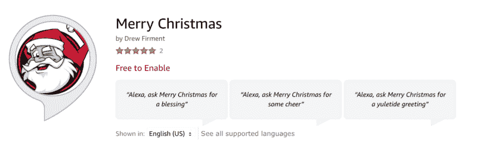
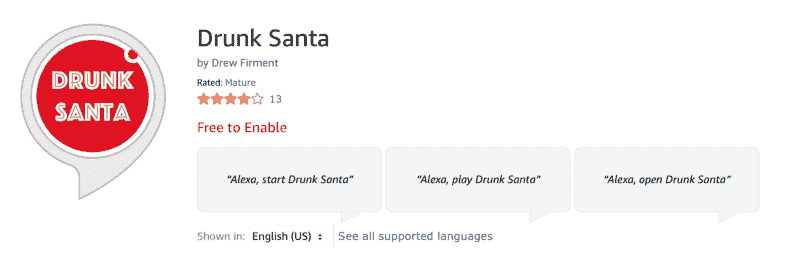

# 来自圣尼古拉斯的拜访——还有 Alexa

> 原文：<https://www.freecodecamp.org/news/a-visit-from-st-nicholas-and-alexa-8edf07b43795/>

#### 祝所有人圣诞快乐，祝所有人晚安！

受假日季节、新兴的语音优先技术和太多蛋奶酒的启发，我将克莱门特·克拉克·摩尔的经典诗歌改编成了现代的圣诞故事。

我的假期愿望是，少数开发人员受到启发，建立自己的 Alexa 技能，并在 2018 年用酷的定制技能填充我的亚马逊 Echo。我希望你觉得这很有趣，充满了节日的欢乐。

那是圣诞节的前一天晚上，
当所有的山
没有一个 Alexa 是活跃的，
甚至没有 5000 猫技能；

回声被小心翼翼地连接到 wi-fi 上，希望新的功能
很快就会出现；

dev 们舒适地躺在床上；当激励的愿景
在他们脑海中跳动时；

贝佐斯在他的火箭里，
和 AWS 在地图上，
刚刚用他们的重新发明说唱炸了我们的大脑
。

当我从 Alexa
出来时，就有这样的声音响起，
我从床上跳起来
去听她的喋喋不休。

远离设备
我像一道闪光一样飞起来，
被我的圆点
和可编程的破折号绊倒。

我的
全新 Echo Show，
的屏幕给下面的设备带来了正午
的光泽。

当我的
开发者眼中的东西出现时，
不过是一个微缩的斑点
和八个 Alexa 先驱。

有了 Alexa 福音传道者
如此活泼敏捷，
我立刻就知道
他一定是圣尼克。

比λ
他的技能更快，他们来了，
他吹口哨，喊，
和调用他们的名字:

“现在，宋竞猜！现在，下雨了！
现在是 Flash 简报和危险！
上，啤酒机器人！来吧，波特黑德测验！
对了，神秘的镜子，启发了我！

到搜索的顶端！
登上亚马逊领袖墙的顶端！
现在调用 away！召唤吧！
召唤走一切！"

就像之前
开发者飞起来的键盘，
遇到错误，
再试一次；

所以根据排名来看
他们驾驶的 Alexa skills
满载回声的雪橇，
和圣尼古拉斯也是如此——

然后，在一个话语中，
我从扬声器中听到，
每个新功能的槽和意图
。

当我在耳边画图时，
正转过身，
沿着开发门户
圣尼古拉斯蹦蹦跳跳地来了。

他打扮成 Alexa，
从头到脚，
他的低音扬声器覆盖着声音文件和辅助输入的
；

他把一堆设备
扔在背上，
他看起来像一个得到批准反馈的开发者
。

他的发光二极管——它们是如何闪烁的！他的轻响，多么快乐！
他的杜比清脆，
他的智能家居集成传奇！

他的七个麦克风
拾取了所有的音频，
和唤醒词
像雪一样清晰；

他紧紧抓住一根绳子的残根，
和通知，
它优雅地环绕着他的头；

他有免提通话功能
和一个小圆筒状的腹部，
当被调用时会回复，
就像一个熟食店的店员。

他反应迅速，
一个快乐的老精灵，
我说“Alexa！”当我看见他时，
不由自主；

他的灯眨了一下
和他的陀螺一扭，
很快让我知道
我没有什么可停下来的；

他说了这么多话，
让 SSML 工作，
挤满了所有的房间；
它给了我一个傻笑。

用他的 API 连接到云
，
点点头，
Alexa 说再见；

他跳到他的雪橇上，
对福音传道者吹了一声口哨，
然后他们就像蓝色起源导弹一样飞向
。

但我听到 Alexa 喊道，
在他驶出视线之前——
“祝大家圣诞快乐，
，祝大家晚安！”

圣诞快乐！

这里有一篇我写的文章，如果你想了解更多关于 Alexa 技能发展的知识，以及它是如何成为云计算的一个伟大门户的。然后一定要启用[圣诞老人技能](https://www.amazon.com/Drew-Firment-Santa-Claus/dp/B076Z13QSV/)，看看你是淘气还是乖！

[**为什么学习编码 Alexa 技能是通往云计算工作的大门**](https://medium.freecodecamp.org/why-learning-to-code-alexa-skills-is-the-gateway-to-a-cloud-computing-job-fa13c1c0c853)
[*经济正在发生根本性的转变。社会正从商品资本走向知识资本……*medium.freecodecamp.org](https://medium.freecodecamp.org/why-learning-to-code-alexa-skills-is-the-gateway-to-a-cloud-computing-job-fa13c1c0c853)[**淘气还是乖？**](https://devpost.com/software/naughty-or-nice)
[*调皮还是乖？—圣诞老人在列清单，核对两遍！你想知道你是淘气还是乖…*devpost.com](https://devpost.com/software/naughty-or-nice)

*AWS 社区英雄，Alexa 冠军，爸爸笑话的制造者。*
*在推特上关注我 [@drewfirment](https://twitter.com/drewfirment) 。 [#WePowerTech](https://info.acloud.guru/we-power-tech)*