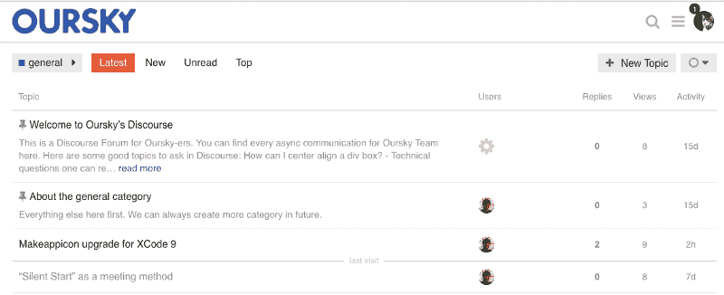

# 如何利用话语在半天内建立一个内部团队论坛

> 原文：<https://www.freecodecamp.org/news/how-to-set-up-an-internal-team-forum-in-half-a-day-using-discourse-b13588d907fe/>

作者:本成

# 如何利用话语在半天内建立一个内部团队论坛

*Oursky’s Discourse platform — deployed in our own Kubernetes (K8s) cloud.*

**TL；博士:**我已经在 [Kubernetes (K8s)](https://kubernetes.io/) 上为[我公司](http://oursky.com)的内部讨论平台部署了[话语](https://www.discourse.org/)。因为我找不到简单的教程，所以我记录了我的步骤来帮助其他开发人员也这样做。

### 我为什么要在 Kubernetes 上展开讨论？

1.  我们公司已经有一个 Kubernetes 集群，用于随机工具和分阶段部署，因此在现有集群上部署用于内部对话会更便宜。
2.  作为一个创始人，我没有太多机会编码了。我想学习如何使用 Kubernetes，因为我的团队最近一直在使用它。

### 本教程的快速概述

下面的教程和示例配置显示了如何部署一个单一的对话网络服务器。这个服务器需要连接到一个 **PostgreSQL** 和 **Redis 服务器**。我们使用 **Google Cloud Registry** 和`[gcePersistentDisk](https://kubernetes.io/docs/concepts/storage/persistent-volumes/)`进行存储。

那么我们开始吧:

#### 创建话语应用程序 Docker 图像

我们将“误用”由`discourse_docker`提供的启动器来为 Discourse web 服务器创建 docker 映像。我所说的“误用”是指我们过度使用启动程序脚本来创建 docker 映像以供生产使用。

1.从[https://github.com/discourse/discourse_docker](https://github.com/discourse/discourse_docker)克隆到您的本地环境。

2.在本地环境中设置一个临时的 [Redis 服务器](https://redis.io/topics/quickstart)和[PostgreSQL 数据库](https://www.postgresql.org/download/)。

3.创建一个`containers/web_only.yml`(如下所示)

*   环境变量与 K8s 无关。这只是为了建立本地形象，所以让我们填写一些适合您本地环境的内容。
*   在这里用你的对话设置决定你想要安装的插件。

4.**提示** *:* 本地 Redis 实例可能处于保护模式，不允许 Docker guest 托管连接。对于这种情况，您应该在关闭保护模式的情况下启动 Redis 服务器:`redis-server --protected-mode no`

5.创建 Docker 图像并将图像上传到您的 K8s Docker 注册表。在这种情况下，我们使用谷歌云注册表:

*   用话语的启动器创建 Docker 图像:`./launcher bootstrap web_only`
*   验证图像是否已创建:`docker images`。如果成功，您应该会在列表中看到话语图像。
*   使用以下命令将映像上传到注册表:

`web_only.yml`中的样本配置:

#### 现在我们准备部署到 K8s

**1。准备一个永久卷**

我们需要一个持久卷作为数据库来存储用户信息和讨论项。我们使用[gcepersistindisk](https://kubernetes.io/docs/concepts/storage/volumes/#gcepersistentdisk)作为 K8s 集群上的持久磁盘。现在，让我们分别为应用程序和数据库创建两个 10GB 磁盘。您可以考虑您的话语使用来调整磁盘大小配置。

**2。部署到 Kubernetes**

接下来，我们将配置 K8s 云的部署设置。定制示例 K8s 文件。这里有一些你可能想调整的变量:

`volumes.yaml`

*   对于两个持久性卷:
    -metadata . name
    -spec . capacity . storage
    -spec . gcepersistindisk . PD name(对于上面的持久性磁盘名称)
    - spec.claimRef.namespace(对于您在 K8s 中使用的名称空间)
*   这里的示例文件假设您正在使用`gcePersistentDisk`。根据您计划使用的持久磁盘的类型，volumes.yaml 需要做很大的改变。

`redis.yaml`

*   Redis 部署:
    -spec . template . spec . containers . resources . *(缓存服务器的 CPU 和内存资源)

`pgsql.yaml`

*   PersistentVolumeClaim(`pgsql-pv-claim`):
    -`spec.resources.requests.storage`(数据库服务器的存储)

`discourse.yaml`

*   PersistentVolumeClaim(`discourse-pv-claim`)
    -spec . resources . requests . storage(存储日志和备份的网络服务器磁盘)
*   部署(`web-server` )
    - `spec.template.spec.containers.image`(设置 URL 指向你的 Docker 图片)
    - `spec.template.spec.containers.env`

> `DISCOURSE_DEVELOPER_EMAILS`
> `DISCOURSE_HOSTNAME`
> `DISCOURSE_SMTP_ADDRESS`

-spec . template . spec . containers . resources . *(网络服务器的 CPU 和内存资源)

`ingress.yaml`

*   `spec.rules.host`
*   `spec.tls.hosts`

**推荐:**在这里，您可能想要为部署创建自己的名称空间。还假设您已经设置了正确的上下文来在名称空间中运行`kubectl`命令。(有关详细信息，请阅读 [Kubernetes 文档](https://kubernetes.io/docs/tasks/administer-cluster/namespaces-walkthrough/))。否则，您应该将上面配置文件中的大多数名称重命名为唯一的名称，并添加一些标签。

应用秘密。`dbUsername`和`dbPassword`可以是你想要的任何东西。请为您使用的邮件递送服务设置正确的`smtpUsername`和`smtpPassword`。

关于入口 HTTPS 的另一个注意事项:您应该阅读[本文档](https://kubernetes.io/docs/concepts/services-networking/ingress/#tls)和特定于您的集群的入口控制器，并相应地更新`ingress.yaml`。

应用所有配置文件:

在启动应用程序之前，在 PostgreSQL 实例上运行以下命令来正确初始化数据库。您可以通过运行`kubectl get pods`找到您的 pod 名称。

使用以下命令创建对话部署和入口:

从这里开始，您的话语实例应该已经启动并运行了。下面是一些有用的命令，以防出现问题并需要调试:

#### 设置 S3 备份和文件上传

Discourse 可以使用 AWS S3 进行备份和文件上传。以下是启用它的步骤:

1.创建两个 S3 存储桶:一个用于备份，一个用于文件上传。将它们设置为私有。

2.创建仅具有 API 访问权限的 IAM 用户，并在下面附加 AWS 内联策略:

3.在**对话设置**中填写访问密钥和密钥 ID。

然后话语可以上传文件到你指定的 S3 桶，所以你可以在每篇文章中附加图像和文件附件。

### 就是这样！

希望这篇作品对你搭建自己的话语平台有所帮助。在 K8s 上尝试部署一个 app，对我来说也是一次实践锻炼。

### 潜在的改进和扩大:

*   可以为 Discourse web 服务器运行多个副本以进行扩展。应该可以，但是我还没试过。
*   我们还可以部署主副本 PostgreSQL 进行纵向扩展。我们正在使用 [Bitnami](https://bitnami.com/) 的 PostgreSQL docker 镜像，你可以在这里阅读相关说明[。](https://github.com/bitnami/bitnami-docker-postgresql)

*打造 app？我们免费的[开发者工具](https://oursky.com/products/)和[开源后端](http://skygear.io)会让你的工作更轻松。*