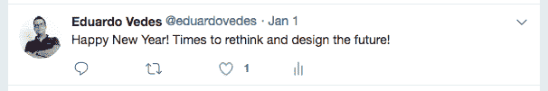

# 3,2,1...重启软件工程！

> 原文：<https://www.freecodecamp.org/news/3-2-1-reboot-to-software-engineering/>

> 不要在你的头脑中放入你太老了，或者你做不到因为它太难了...坚持你的决定，勇往直前！追求让自己快乐的东西！到达不归路！爱自己，永远茁壮成长，成为一个更好的人！

年底就要到了，我的神童清单上有一些事情需要完成。今天是星期天，我从完成 MongoDB 开发人员认证的努力中稍微放松了一下。我认为这是最好的时候，把一杯姜茶带到我的电脑桌前，与你分享我如何在 1800 小时内成为一名软件工程师。

* * *

我总是在 12 月份给自己留一些时间来思考去年的事情，做一些自省。去年 12 月(2016 年)，我决定是时候重启我的职业生涯了。我做了 12 年的土木工程师，在葡萄牙和国外，在撒哈拉以南的非洲(安哥拉)工作。市场已经变了，尽管我热爱我正在做的事情，但我觉得我只有一次生命去做我曾经梦想的一切。我需要改变，接受新的挑战，学习，致力于其他类型的“追求”，感到好奇，对其他事情感到好奇。

这不是一个容易的决定。生活三次将我推出舒适区，我想这是一份礼物(…但这是另一个很长的故事了…)。

从那时起，我就再也不想舒舒服服地坐在扶手椅上，看着生活流逝。我学会了克服困难，适应许多不同的文化和生活方式。

我很高兴今天看到我的 twitter 个人资料，想起了我花在学习如何编码上的所有夜晚。因为它们是纯粹的快乐。

我开始在“****C****[****odecademy****](https://www.codecademy.com/)”上学习，几天后我发现了[****freeCodeCamp****](https://www.freecodecamp.org/)。

嗯…我不想听起来重复…但 freeCodeCamp 对我理解我需要学习什么以及我如何成为一名软件工程师有很大的帮助，我不知道这个领域有谁可以帮助我找到学习什么语言或如何组织我的道路。

谢谢你[昆西·拉森](https://twitter.com/ossia?ref_src=twsrc%5Egoogle%7Ctwcamp%5Eserp%7Ctwgr%5Eauthor)(教师和程序员)创建了自由代码营，改变了我的生活！

我也很快认识到，要成为一名程序员，我需要每天编程。这是必须的，是你不能违反的规则！

感谢 [Alexander Kallaway](https://twitter.com/ka11away) (自学成才的程序员)在 Twitter 上发起了名为#100DaysOfCode 的挑战！

有了这两个工具，我开始了我的学习，克服了日常学习如何编码的所有困难。

HTML，CSS，jQuery，Bootstrap 很容易得到。当我开始 JavaScript 挑战时，我觉得需要有人来消除我的疑虑，并指导我战胜更复杂的挑战。

freeCodeCamp 为您提供论坛、 [Gitter](https://gitter.im/) 、Youtube、脸书群。它不允许你独自封闭在你的世界里，这就是 90%的魔力。作为一名程序员，为了提高和成长，你需要与更有经验的程序员交谈，并有一些“旅伴”在你身边为同样的挑战而奋斗——谢谢 joo Henri que，你从一开始就在那里！

当六月到来时，我已经完成了我的 freeCodeCamp 前端认证，并正在努力完成后端认证。那时我还没有工作。我 100%致力于成为一名软件工程师，并离开了非洲，定居在葡萄牙的家中。那是我的*不归路*。我不得不相信我是一名软件工程师，我需要找一份工作来支付账单！我也不得不重新安置我的家人，这是另一个大冒险，稍后与你分享！

我觉得有必要获得一些当地的支持，并与社区取得联系。我已经开始出现在 NodeSchool 和一些本地的“黑客马拉松”上。这让我可以做一些网络工作，更好地了解我几个月前就已经在网上交谈过的人。

那时候我已经上了 [****极客刘宇的****](https://www.facebook.com/GeekSessionsFaro/) ****懈怠**** 。我已经被一些优秀的“超级人类”指导了！谢谢大家！米格尔·科克托，安德烈·乔纳斯和纳尔逊·内维斯！你是最棒的！

八月到来时，我的一位导师米格尔·科凯特告诉我，是时候去找份工作了。我感到震惊，我简直不敢相信当时我能准备好承担这样的责任。我觉得自己太嫩了，对这个行业太陌生了，有太多东西要学……我简直不敢相信自己已经准备好了。

他建议我试试。发一些简历，做一些测试。让自己接触到这个行业，体会到面试的困难。

我已经开始发送一些简历，我得到了我的第一次面试。这是一个伟大的团队，有非常好的人，但工作不是我想要的！我真的很想做 React 或 Node。

和米格尔谈论这份工作的事情开始每天都在发生，几个星期后，他打开了他的门，告诉我他可以试着给我找些事情做，作为 React 的前端。

几天后，他走了后门，找到了一些工作。是时候在雨中跳舞，找份真正的工作了。我只花了几天时间就陷入了这种现实，并调整心态，相信我可以成为一名初级开发人员。

我立即回复了米格尔，告诉他能在他身边工作是我的荣幸。他已经是我的导师有一段时间了，一切都很棒！

谢谢你米格尔！今年你帮了我很多！没有你，一切都会变得困难三倍！

果然如此！自从我开始在 Miguel 身边工作以来，4 个月已经过去了，客户的反馈非常积极！我感觉完全融入了开发团队，他的指导每天都是一个很好的补充。

挑战结束了！对于那些问这个问题的人，我今年已经学习了大约 2500 个小时。

编程绝对是一门手艺，你需要每天都保持进步。你学得越多，你就越觉得你必须继续学习。

我一直认为程序员是在地下室独自工作的天才和摇滚明星！事实是，我认识了很多有趣的人，交了一些非常好的朋友！

所有这些都是为了向你解释，并与你分享我是如何完成成为一名软件工程师的追求的。我很开心，我真的很喜欢我的新工作！

请来香槟！！！

* * *

### 永远不要放弃你的梦想！快一点！生活不会等你！

* * *

****建议:****

不要认为你太老了，或者你做不了，因为太难了。坚持你的决定，勇往直前！追求让自己快乐的东西！爱自己，永远茁壮成长，成为一个更好的人！

****收条:决定重启+ FreeCodeCamp +学习+社交+找导师+毅力+每天的自我承诺！****

玩得开心，按下你大脑里的重启键！

干杯！