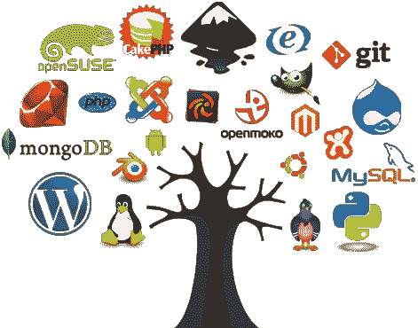

# 我成为了 Ruby on Rails 和 React 的贡献者，你也可以

> 原文：<https://www.freecodecamp.org/news/why-you-should-contribute-to-projects-like-ruby-on-rails-and-react-e6af32a43440/>

我真的很感激为一些开源项目做出了贡献，包括我目前经常使用的两个项目: [Ruby on Rails](http://contributors.rubyonrails.org/contributors/fatos-morina/commits) 和 [React](https://github.com/reactjs/reactjs.org/commits?author=fatosmorina) 。

我的贡献是非常小的修正和建议，可能不值得太多的赞扬，但我想用这篇文章来激励您也去做出自己的贡献。

我的核心价值观之一是贡献和帮助他人。这是我喜欢写文章的原因之一，也是我多年来受益的项目的回报。

尽管多年来广泛使用的主要框架已经经过了大量的审查和仔细的分析，但总是有改进或增加的空间。这意味着您不仅能够修复 bug，或者改进已经实现的东西，而且还可以实现新的特性。

### 为什么要为著名的开源项目做贡献？

在解释如何为著名的开源项目做贡献之前，最好先解释一下为什么我认为参与这样的努力是非常重要的。

#### 1.你将从最优秀的人那里学习

著名的开源项目如 Ruby on Rails、React JS、Spring 等。，已经被很多项目使用。他们让无数开发者的生活变得更加轻松。

因为它们是许多聪明头脑的产物，分析它们的代码并尝试改进是一个巨大的学习资源。

您不仅会更好地学习您使用的框架和库，还会学到一些使这些项目真正伟大的最佳实践和永恒原则。然后你也可以在自己的工作中运用这些经验。

与只使用框架的人相比，通过尝试做出贡献，你更有可能更好地学习框架。在 Linux 基金会 2016 年的一份报告中，86%的技术专家说开源在他们的职业生涯中帮助了他们。

#### 2.你可以产生重大影响

如果你一直在做一些没有太多关注的小项目，那么为著名的开源项目做贡献可以让你有机会产生更大的影响。

通过做出这样的贡献，你可能会对你所做的工作产生重大影响，这可能是一次非常充实的经历。不管你的贡献有多小，你也会有一种有意义的感觉，仅仅是因为你知道你的工作让你热爱的项目变得更好了。

#### 3.你可以提高你的声誉

如果你去看看你著名的开源项目的贡献者列表，你可能会发现一个共同的模式。顶级贡献者通常是为大公司或大型项目工作的开发人员。

结果，对这样的项目做出重要的贡献可能是困难的，仅仅是因为这些开发人员可能已经很好地实现了某个特定的特性。这意味着，对于正在寻找新开发人员的招聘人员来说，进入这份名单代表着你的技能得到了显著的展示。

这也意味着你也更有可能获得更好的工作机会，或者更高的咨询费用。公司总是希望雇佣在开源项目上有经验的聪明而熟练的开发人员，除了为项目实际编写一些代码，没有什么更好的方法来展示你对框架的了解。

### 你如何为著名的开源项目做贡献？

既然我们已经提到了为什么我相信为著名的开源项目做贡献是值得的三个主要原因，那么让我们来看看你如何做到这一点。

#### 1.了解事物如何运作

好奇心可能会害死猫，但它也帮助泰勒·威尔逊[成为](https://www.theguardian.com/science/2015/jun/20/taylor-wilson-nuclear-teen-genius-science-interview)人类历史上第 32 个实现核聚变的人……在他 14 岁的时候。

同样，如果你想为著名的开源项目做贡献，你必须了解事情在幕后是如何工作的。你需要从书本中学习。你必须有好奇心去理解一个特定函数的实现，或者路由如何调用一个特定的控制器。通过这种方式，你也可以发现一些你可以改进的奇怪的事情，或者为一个特定的任务实现一个更有效的方法。

你对一个框架理解得越多，你就越喜欢在你的项目中使用它，[因为我们通常会从未知和对我们不清楚的事物中摆脱出来](https://medium.freecodecamp.org/vim-isnt-that-scary-here-are-5-free-resources-you-can-use-to-learn-it-ab78f5726f8d)。

#### 2.检查报告的问题

问题可能代表其他人已经注意到的或者想要表达的关于项目的错误、关注或者简单的建议。他们也代表了一个伟大的贡献想法的来源，你可以用来作为灵感。

看看你能为项目做些什么，评估一下你是否能为它们做些什么。

尽管有些问题初看起来非常困难，但是您不应该害怕尝试修复一个 bug，或者在该框架中实现一个新特性。你也可以把它作为你学习新事物的一种方式，拓展你目前的极限，走出你的舒适区。

你也可以提问来更清楚地了解问题，并回答其他人的问题。

#### 3.不要忽视小事

你可能认为著名的开源项目已经没有多少机会可以贡献了，所以你可能会放弃贡献的想法。

尽管事实并非如此，但是对于开源项目，您可以承担一些经常被忽视的责任。除了代码之外，项目还需要作者帮助编写文档，需要翻译人员将语言环境文件转换成其他语言，还需要设计人员使界面更加直观和吸引人。

您不必编写整个文档，或者将所有内容翻译成另一种语言。您可以简单地开始一些您认为值得包含的内容，然后寻求改进的帮助，或者简单地推动您的小更改并向项目维护人员寻求反馈。

您也可以通过编写测试来做出贡献，或者修复已经失败的测试，或者创建关于 bug 的新问题，还可以回答人们就现有问题提出的问题。

还有另一种间接的方式可以为开源项目做出贡献。

那就是给维护人员发问候信，感谢他们的时间和他们正在做的工作。他们中的大多数人在志愿者的基础上为开源做出贡献，所以感谢他们可以让他们意识到他们贡献的重要性。这样，你让他们对自己的努力感觉更好，也激励他们继续做出贡献。

### 结论

为著名的开源项目做贡献是任何人都可以做的事情。

关键是要有耐心，因为这可能需要一段时间，直到你找到你想贡献的东西。你也应该乐在其中，享受这个过程。毕竟，这就是为什么 Linus Torvalds 将他的书命名为“只是为了好玩”，在书中他描述了他如何创建 Linux 的故事。

我是一名充满激情的软件工程师，目前是一群热衷于开发 web 和移动应用程序的开发人员的团队领导，他们大多使用 Ruby on Rails 和 React JS。

*我是[开源爱好者](https://github.com/fatosmorina)，也是[博主](http://fatosmorina.com)。*

我目前正在寻找一份远程工作。有新机会请[联系我](mailto:fatosi.morina@gmail.com)。